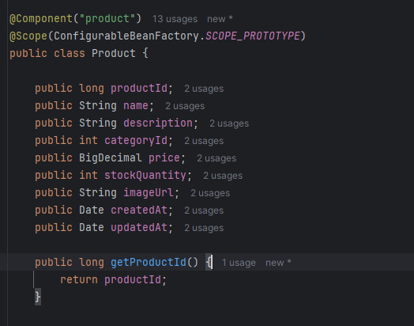
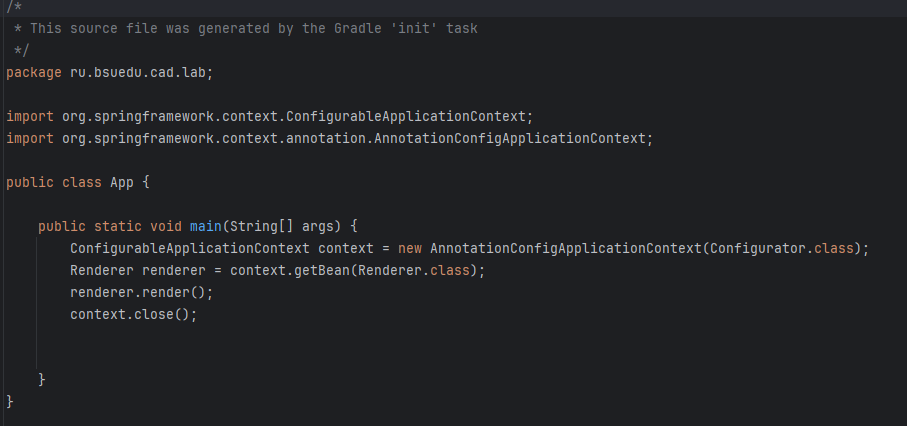

# Отчет о лабораторной работе номер 1 
Тема: Gradle. Базовое приложение Spring

## Цель работы
Реализовать приложение удовлетворяющее следующим требованиям:

Приложение должно представлять собой консольное приложение разработанное с помощью фреймворка Spring и конфигурируемое с помощью Java-конфигурации.  
Приложение должно читать данные о товарах для магазина из csv-файла и выводить его в консоль в виде таблицы.
## Выполнение работы
В ходе выполнения лабораторной работы были разработаны 11 классов и интерфейсов, где:  
Reader, ResourceFileReader - класс читающий данные из csv-файла;  
Parser, CSVParser - класс парсер CSV файла;  
ProductProvider, ConcreteProductProvider - класс предоставляющий список товаров;  
Renderer, ConsoleTableRenderer - класс выводящий список товаров в консоль в виде таблицы;  
Product - класс описывающий сущность "Товар".
Configurator - класс конфигуратор, имеющий аннотации @Configuration @ComponentScan("ru.bsuedu.cad.lab"), необходимые конфигурирования Spring-контейнера.  
App - класс, имеющий метод main - точку входа в приложение.

Все классы (кроме Configurator и App и естественно интерфейсов), разработаны как "бины" Spring-контейнера и имеют аннотацию @Component   

        Рисунок 1 - Пример использования аннотации @Component  
  

        Рисунок 2 - Код класса Configurator  

Кроме того, в классах, где в качестве поля должен использоваться экземпляр другого класса или интерфейса, конструктор был дополнен аннотацией @Autowired.

  

        Рисунок 3 - Код класса ConcreteProductProvider, с применением @Autowird в конструкторе

Использование этих аннотаций позволило в классе App использовать вызов ConfigurableApplicationContext, а также вызов бинов благодаря этому контексту
.  
  

        Рисунок 4 - Код класса App  

В итоге программа в результате работы выводит в консоль таблицу с данными, которые были считаны из product.csv, после запарсены и обработаны. 
Запуск программы осуществляется вводом в консоль команды gradle run.

   

        Рисунок 5 - Результат работы программы

## Выводы  
В ходе выполнения лабораторной работы было разработано консольное приложение с помощью фреймворка Spring и конфигурируемое с помощью Java-конфигурации.  
Приложение имеет возможность читать данные о товарах для магазина из csv-файла и выводить их в консоль в виде таблицы.
