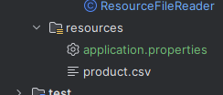
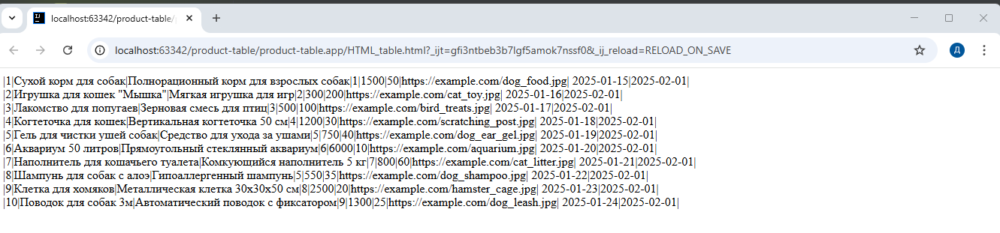
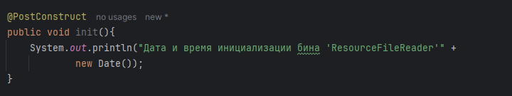
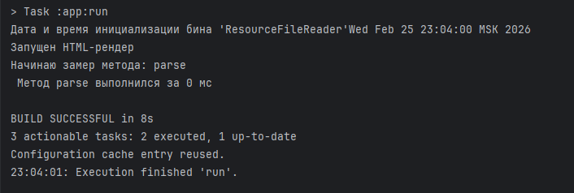
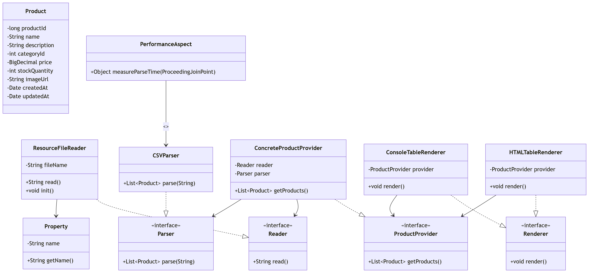

# Отчет по лабораторной работе номер 2
Тема: Конфигурирование приложение Spring c помощью аннотаций. Применение AOП для логирования

## Цель лабораторной работы
Перейти на новое, более простое конфигурирование приложения с помощью аннотаций, добавить функционал по представлению 
таблиц в виде HTML и измерить скорость выполнения  кода c помощью инструментов АОП.
## Выполнение работы
Использую аннотацию @Value и SpEL сделайте так, чтобы имя файла для загрузки продуктов, приложение получало из конфигурационного файла application.properties. Данный файл поместите в каталог ресурсов (src/main/resources)
Все классы (кроме Configurator и App и естественно интерфейсов), разработаны как "бины" Spring-контейнера и имеют аннотацию @Component   

## Задание 1
Использую аннотацию @Value и SpEL сделайте так, чтобы имя файла для загрузки продуктов, приложение получалоиз 
конфигурационного файла application.properties. Данный файл поместите в каталог ресурсов (src/main/resources)  
  
  

        Рисунок 1 - Пример выпонения задания 1

## Задание 2
Добавьте еще одну имплементацию интерфейса Renderer - HTMLTableRenderer которая выводит таблицу в HTML-файл. 
Сделайте так, чтобы при работе приложения вызывалась эта реализация, а не ConsoleTableRenderer.  

  
  
  

        Рисунок 2 - Пример выпонения задания 2

## Задание 3
С помощью событий жизненного цикла бина, выведите в консоль дату и время, когда бин ResourceFileReader был
полностью инициализирован.  

        Рисунок 3 - Пример выпонения задания 3

## Задание 4
С помощью инструментов AOП замерьте сколько времени тратиться на парсинг CSV файла.  

        Рисунок 4 - Пример выпонения задания 4

 

        Рисунок 5 - Обновлённая UML-диаграмма

## Выводы  
В ходе выполнения лабораторной работы приложение перешло на более "простое" конфигурирование с применением аннотаций,
были добавлены функционал по представлению таблиц в виде HTML, для измерения скорости выполнения кода с применением инструментов АОП.
