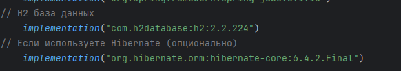
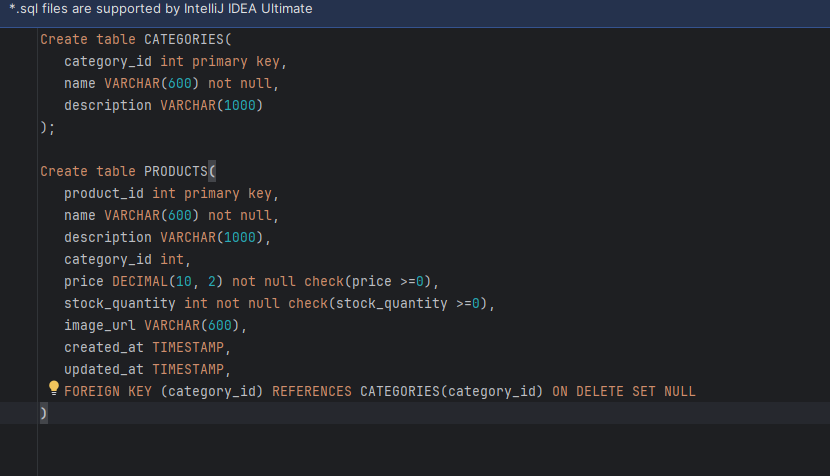
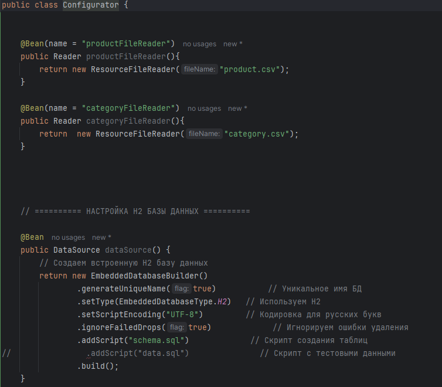
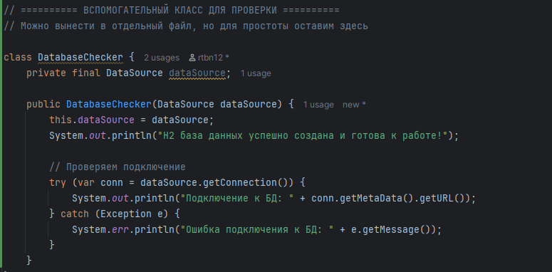
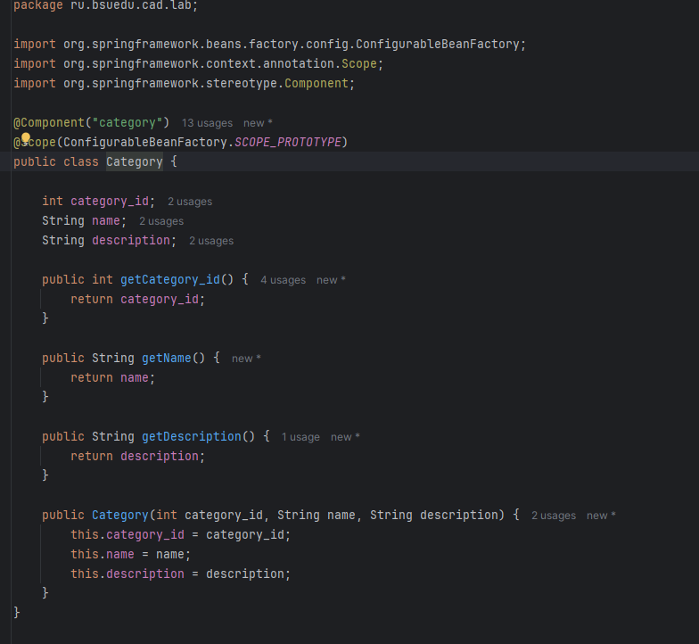
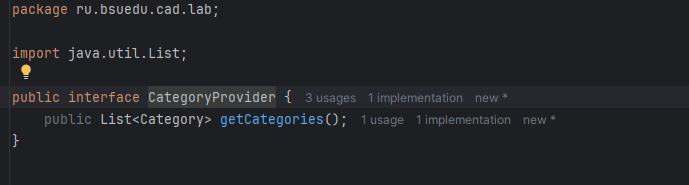
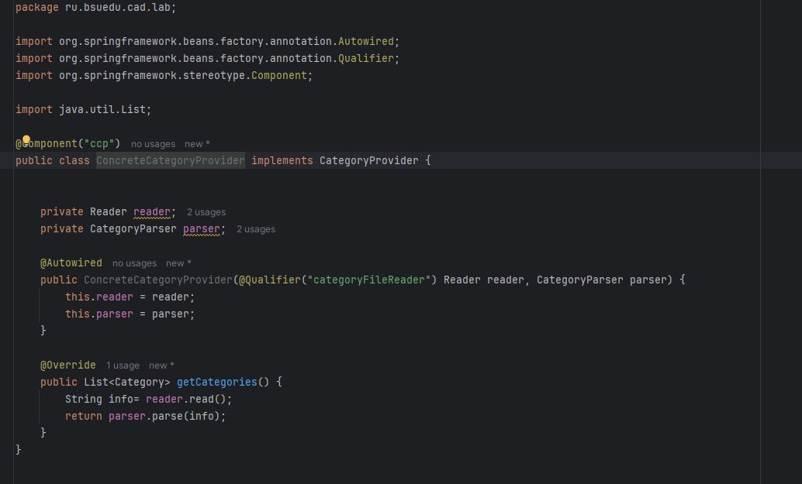
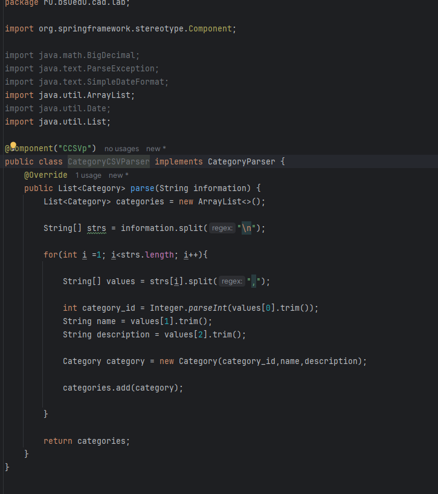
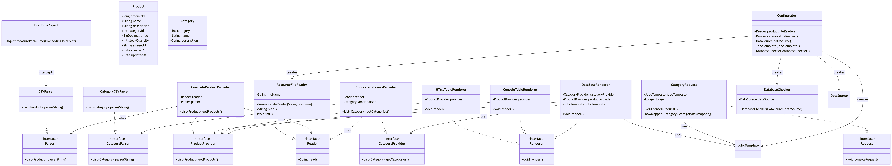

# Отчет по лабораторной работе номер 3
Тема: Технологии работы с базами данных.JDBC
## Цель лабораторной работы
Научить наше приложение сохранять данные в базе данных. 
А также научить наше приложение выполнять SQL запросы и 
выводить их результаты в логи. В этом нам поможет механизм 
JDBC (Java Database Connectivity), и такие инструменты Spring 
как DataSource, JDBCTemplate, RowMapper упрощающие работу с JDBC.
## Выполнение работы

## Задание 1
Подключите к приложению встраиваемую 
базу данных H2 используя EmbeddedDatabaseBuilder  

        Рисунок 1 - Пример выпонения задания 1

## Задание 2
Напишите SQL скрипт создающие две таблицы 
"Продукты" (PRODUCTS) и "Категории" 
(CATEGORIES) (не забудьте про внешние ключи).

  

        Рисунок 2 - Пример выпонения задания 2

## Задание 3
Настройте EmbeddedDatabaseBuilder так, 
чтобы он при старте приложения 
выполнял данный скрипт и создавал 
в базе данных таблицы CATEGORIES и PRODUCTS.

        Рисунок 3 - Пример выпонения задания 3

## Задание 4
Для таблицы "Категории" создайте Java класс Category
, для моделирования данной сущности (аналогичный классу Product). 
И класс ConcreteCategoryProvider, аналогичный ConcreteProductProvider,
данный класс должен предоставлять данные из CSV файла category.csv.
CSV-файл должен располагаться в директории src/main/resources вашего приложения

        Рисунок 4 - Пример выпонения задания 4  

## Задание 5 
Добавьте еще одну имплементацию интерфейса Renderer 
DataBaseRenderer которая сохраняет данные считанные 
из SCV файлов в таблицы базы данных. 
Реализация DataBaseRenderer должна использоваться пол умолчанию.  

package ru.bsuedu.cad.lab;
import org.springframework.stereotype.Component;
import java.util.List;

import org.springframework.beans.factory.annotation.Autowired;
import org.springframework.beans.factory.annotation.Qualifier;
import org.springframework.jdbc.core.JdbcTemplate;
import org.springframework.stereotype.Component;
import org.springframework.transaction.annotation.Transactional;

@Component("dbr")
public class DataBaseRenderer implements Renderer {

   " private CategoryProvider provider;
    private ProductProvider provider2;
    private JdbcTemplate jdbcTemplate;

    @Autowired
    public DataBaseRenderer(CategoryProvider provider, ProductProvider provider2, JdbcTemplate jdbcTemplate) {
        this.provider = provider;
        this.provider2 = provider2;
        this.jdbcTemplate = jdbcTemplate;
    }

    @Override
    public void render() {

        List<Category> categories = provider.getCategories();
        List<Product> products = provider2.getProducts();

        String categorySql = "INSERT INTO CATEGORIES (category_id, name, description) VALUES (?, ?, ?)";
        String productSql = "INSERT INTO PRODUCTS (product_id, name, description, category_id, price, stock_quantity, image_url, created_at, updated_at) VALUES (?, ?, ?, ?, ?, ?, ?, ?, ?)";

        System.out.println("Процесс сохранения данных из файла в бд запущен!");

        System.out.println("Заполняю таблицу 'Categories'!");
        for(Category category : categories){

            try{
                jdbcTemplate.update(categorySql,
                        category.getCategory_id(),
                        category.getName(),
                        category.getDescription()
                );

                System.out.println("Категория " + category.getCategory_id() + " спешно сохранена в бд!");

            }catch (Exception e){
                System.out.println("Ошибка в сохранении категории " + category.getCategory_id() + "  в бд !!!");
            }

        }

        System.out.println("Заполняю таблицу 'PRODUCTS'");
        for (Product product : products) {
            try {
                jdbcTemplate.update(productSql,
                        product.getProductId(),
                        product.getName(),
                        product.getDescription(),
                        product.getCategoryId(),
                        product.getPrice(),
                        product.getStockQuantity(),
                        product.getImageUrl(),
                        product.getCreatedAt(),
                        product.getUpdatedAt()
                );
                System.out.println("Продукт " + product.getProductId() + " спешно сохранен в бд!");
            } catch (Exception e) {
                System.out.println("Ошибка в сохранении продукта " + product.getProductId() + "  в бд !!!");
            }
        }

        System.out.println("Сохранено категорий: " + categories.size());
        System.out.println("Сохранено продуктов: " + products.size());
        

    }
}
         Рисунок 5 - Пример выпонения задания 5

## Задание 6  
Реализуйте класс CategoryRequest,
данный класс должен выполнять запрос 
к базе данных получающий следующую информацию - 
список категорий количество товаров в 
которых больше единицы.
Данная информация должна выводиться в 
консоль с помощью библиотеки для 
логирования logback, уровень лога INFO.  
package ru.bsuedu.cad.lab;

import org.springframework.beans.factory.annotation.Autowired;
import org.springframework.jdbc.core.JdbcTemplate;
import org.springframework.jdbc.core.RowMapper;
import org.springframework.stereotype.Component;

import org.slf4j.Logger;
import org.slf4j.LoggerFactory;

import java.util.List;
import java.util.Map;

@Component("creq")
public class CategoryRequest implements Request{

    private static final Logger logger = LoggerFactory.getLogger(CategoryRequest.class);

    @Autowired
    private JdbcTemplate jdbcTemplate;

    private RowMapper<Category> categoryRowMapper() {
        return (rs, rowNum) -> new Category(
                rs.getInt("category_id"),
                rs.getString("name"),
                rs.getString("description")
        );
    }

    @Override
    public void consoleRequest() {
        logger.info("=== КАТЕГОРИИ С ТОВАРАМИ > 1 ===");

        String sql = """
            SELECT 
                c.category_id,
                c.name,
                c.description,
                COUNT(p.product_id) as product_count
            FROM CATEGORIES c
            LEFT JOIN PRODUCTS p ON c.category_id = p.category_id
            GROUP BY c.category_id, c.name, c.description
            HAVING COUNT(p.product_id) > 1
            ORDER BY product_count DESC
        """;

        List<Category> categories = jdbcTemplate.query(sql, categoryRowMapper());

        if (categories.size()>0){
            logger.info("Найдено категорий: " + categories.size());
            for (Category cat : categories) {
                logger.info("Категория: "+
                        cat.getCategory_id()+
                        " " +
                        cat.getName());
            }
        }
        else{
            logger.info("Подходящих категорий не найдено!");
        }

    }

}  
                  Рисунок 6 - Пример выпонения задания 6

``` mermaid

classDiagram
    class Configurator {
        +Reader productFileReader()
        +Reader categoryFileReader()
        +DataSource dataSource()
        +JdbcTemplate jdbcTemplate()
        +DatabaseChecker databaseChecker()
    }
    
    class Reader {
        <<interface>>
        +String read()
    }
    
    class ResourceFileReader {
        -String fileName
        +ResourceFileReader(String fileName)
        +String read()
        +void init()
    }
    
    class Parser {
        <<interface>>
        +List~Product~ parse(String)
    }
    
    class CSVParser {
        +List~Product~ parse(String)
    }
    
    class CategoryParser {
        <<interface>>
        +List~Category~ parse(String)
    }
    
    class CategoryCSVParser {
        +List~Category~ parse(String)
    }
    
    class ProductProvider {
        <<interface>>
        +List~Product~ getProducts()
    }
    
    class ConcreteProductProvider {
        -Reader reader
        -Parser parser
        +List~Product~ getProducts()
    }
    
    class CategoryProvider {
        <<interface>>
        +List~Category~ getCategories()
    }
    
    class ConcreteCategoryProvider {
        -Reader reader
        -CategoryParser parser
        +List~Category~ getCategories()
    }
    
    class Renderer {
        <<interface>>
        +void render()
    }
    
    class HTMLTableRenderer {
        -ProductProvider provider
        +void render()
    }
    
    class ConsoleTableRenderer {
        -ProductProvider provider
        +void render()
    }
    
    class DataBaseRenderer {
        -CategoryProvider categoryProvider
        -ProductProvider productProvider
        -JdbcTemplate jdbcTemplate
        +void render()
    }
    
    class Request {
        <<interface>>
        +void consoleRequest()
    }
    
    class CategoryRequest {
        -JdbcTemplate jdbcTemplate
        -Logger logger
        +void consoleRequest()
        -RowMapper~Category~ categoryRowMapper()
    }
    
    class Product {
        +long productId
        +String name
        +String description
        +int categoryId
        +BigDecimal price
        +int stockQuantity
        +String imageUrl
        +Date createdAt
        +Date updatedAt
    }
    
    class Category {
        +int category_id
        +String name
        +String description
    }
    
    class FirstTimeAspect {
        +Object measureParseTime(ProceedingJoinPoint)
    }
    
    class DatabaseChecker {
        -DataSource dataSource
        +DatabaseChecker(DataSource dataSource)
    }
    
    ResourceFileReader ..|> Reader
    CSVParser ..|> Parser
    CategoryCSVParser ..|> CategoryParser
    ConcreteProductProvider ..|> ProductProvider
    ConcreteCategoryProvider ..|> CategoryProvider
    HTMLTableRenderer ..|> Renderer
    ConsoleTableRenderer ..|> Renderer
    DataBaseRenderer ..|> Renderer
    CategoryRequest ..|> Request
    
    ConcreteProductProvider --> Reader : uses
    ConcreteProductProvider --> Parser : uses
    ConcreteCategoryProvider --> Reader : uses
    ConcreteCategoryProvider --> CategoryParser : uses
    DataBaseRenderer --> CategoryProvider : uses
    DataBaseRenderer --> ProductProvider : uses
    DataBaseRenderer --> JdbcTemplate : uses
    CategoryRequest --> JdbcTemplate : uses
    HTMLTableRenderer --> ProductProvider : uses
    ConsoleTableRenderer --> ProductProvider : uses
    
    Configurator --> ResourceFileReader : creates
    Configurator --> DataSource : creates
    Configurator --> JdbcTemplate : creates
    Configurator --> DatabaseChecker : creates
    
    FirstTimeAspect --> CSVParser : intercepts


``` 

  

        Рисунок 7 - Обновлённая UML-диаграмма

## Выводы  
В ходе выполнения лабораторной работы в приложении был реализован функционал
для работы с базой данных.