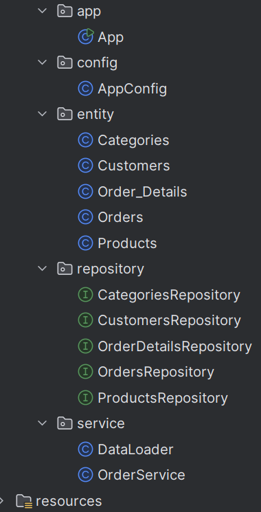
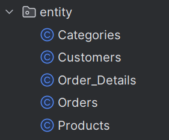
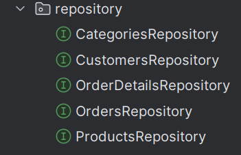
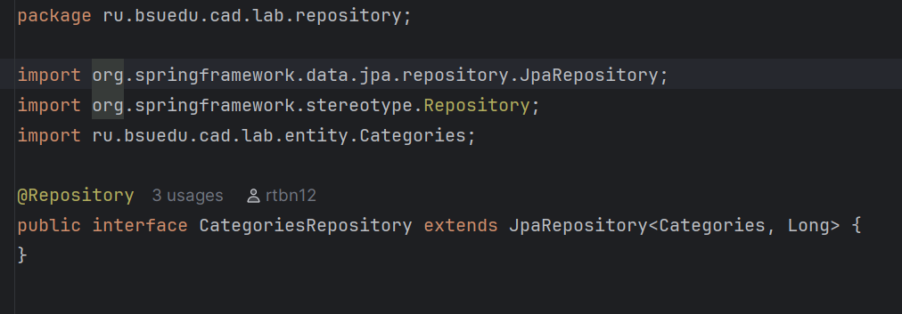
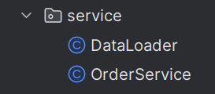
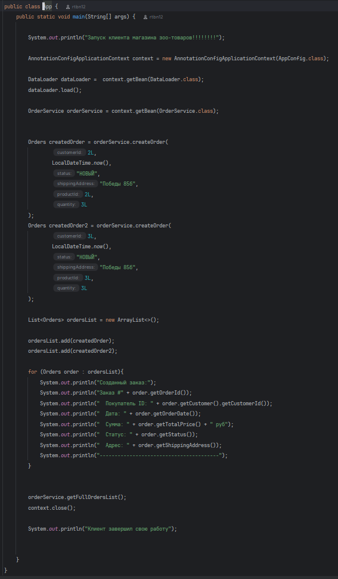

# Лабораторная работа №4 "Технологии работы с базами данных. JPA. Spring Data"

## Цель работы: Перейти с использования Spring JDBC на использование ORM Hibernate и Spring Data. Расширить приложение новыми сущностями и привести структуру приложения в соответствие со "слоистой архитектурой".  

## Задание 1  
Создайте DataSource соответствующий следующим требованиям

Должна использоваться база данных H2
Для реализации DataSource необходимо использовать библиотеку HikariCP, а именно HikariDataSource
Для работы с базой данных должна использоваться библиотека HIbernate, использующая технологию ORM
Схема схема данных должна создаваться автоматически на основании JPA сущностей.

package ru.bsuedu.cad.lab.config;

import com.zaxxer.hikari.HikariConfig;
import com.zaxxer.hikari.HikariDataSource;
import jakarta.persistence.EntityManagerFactory;
import org.springframework.context.annotation.Bean;
import org.springframework.context.annotation.ComponentScan;
import org.springframework.context.annotation.Configuration;
import org.springframework.data.jpa.repository.config.EnableJpaRepositories;
import org.springframework.orm.jpa.JpaTransactionManager;
import org.springframework.orm.jpa.LocalContainerEntityManagerFactoryBean;
import org.springframework.orm.jpa.vendor.HibernateJpaVendorAdapter;
import org.springframework.transaction.PlatformTransactionManager;
import org.springframework.transaction.annotation.EnableTransactionManagement;

import javax.sql.DataSource;
import java.util.Properties;

@Configuration
@ComponentScan("ru.bsuedu.cad.lab")
@EnableJpaRepositories("ru.bsuedu.cad.lab.repository")  // для Spring Data
@EnableTransactionManagement  // для @Transactional
public class AppConfig {

    @Bean
    public DataSource dataSource() {
        HikariConfig config = new HikariConfig();
        config.setJdbcUrl("jdbc:h2:~/lab4;DB_CLOSE_ON_EXIT=FALSE");
        config.setUsername("sa");
        config.setPassword("");
        config.setDriverClassName("org.h2.Driver");
        config.setMaximumPoolSize(10);
        config.setMinimumIdle(5);
        return new HikariDataSource(config);
    }

    @Bean
    public Properties hibernateProperties() {
        Properties hibernateProp = new Properties();
        hibernateProp.put("hibernate.hbm2ddl.auto", "create-drop");  // автосоздание схемы!
        hibernateProp.put("hibernate.dialect", "org.hibernate.dialect.H2Dialect");
//        hibernateProp.put("hibernate.format_sql", "true");
//        hibernateProp.put("hibernate.show_sql", "true");
hibernateProp.put("hibernate.max_fetch_depth", 3);
hibernateProp.put("hibernate.jdbc.batch_size", 10);
hibernateProp.put("hibernate.jdbc.fetch_size", 50);
return hibernateProp;
}

    @Bean
    public LocalContainerEntityManagerFactoryBean entityManagerFactory() {
        LocalContainerEntityManagerFactoryBean em = new LocalContainerEntityManagerFactoryBean();
        em.setDataSource(dataSource());  // используем наш DataSource
        em.setPackagesToScan("ru.bsuedu.cad.lab.entity");  // правильный пакет!

        // Используем Hibernate как JPA провайдер
        HibernateJpaVendorAdapter vendorAdapter = new HibernateJpaVendorAdapter();
        vendorAdapter.setShowSql(true);
        vendorAdapter.setGenerateDdl(true);  // разрешаем генерацию DDL
        em.setJpaVendorAdapter(vendorAdapter);

        em.setJpaProperties(hibernateProperties());
        return em;
    }

    // 4. Менеджер транзакций (обязательно для JPA)
    @Bean
    public PlatformTransactionManager transactionManager(EntityManagerFactory emf) {
        return new JpaTransactionManager(emf);
    }
}

                              Рисунок 1 - Выполнение задания 1

## Задание 2  
Структура пакетов проекта должна иметь следующий вид

ru.bsuedu.cad.lab - основной пакет
ru.bsuedu.cad.lab.entity - JPA сущности
ru.bsuedu.cad.lab.repository - репозитории
ru.bsuedu.cad.lab.service - сервисы
ru.bsuedu.cad.lab.app - приложение  

    

                                 Рисунок 2 - Выполнение задания 2 

## Задание 3 
В пакете ru.bsuedu.cad.lab.entity создайте JPA сущности для следующей схемы базы данных.  

erDiagram
CATEGORIES {
int category_id PK
string name
string description
}

PRODUCTS {
int product_id PK
string name
string description
int category_id FK
decimal price
int stock_quantity
string image_url
datetime created_at
datetime updated_at
}

CUSTOMERS {
int customer_id PK
string name
string email
string phone
string address
}

ORDERS {
int order_id PK
int customer_id FK
datetime order_date
decimal total_price
string status
string shipping_address
}

ORDER_DETAILS {
int order_detail_id PK
int order_id FK
int product_id FK
int quantity
decimal price
}

CATEGORIES ||--o{ PRODUCTS : "содержит"
CUSTOMERS ||--o{ ORDERS : "размещает"
ORDERS ||--o{ ORDER_DETAILS : "содержит"
PRODUCTS ||--o{ ORDER_DETAILS : "включен в"    

    

                          Рисунок 3 - Выполнение задания 3

## Задание 4  
В пакете ru.bsuedu.cad.lab.repository реализуйте репозитории для каждой сущности. Репозитории содержать методы по созданию, получение записи по идентификатору и получения всех записей для каждой сущности.  

  

  

                          Рисунок 4 - Выполнение задания 4

## Задание 5   
В пакете ru.bsuedu.cad.lab.service создайте сервисы для создания заказа и получению списка всех заказов.
  

package ru.bsuedu.cad.lab.service;

import jdk.jfr.Category;
import org.springframework.stereotype.Service;
import ru.bsuedu.cad.lab.entity.Categories;
import ru.bsuedu.cad.lab.entity.Customers;
import ru.bsuedu.cad.lab.entity.Products;
import ru.bsuedu.cad.lab.repository.CategoriesRepository;
import ru.bsuedu.cad.lab.repository.CustomersRepository;
import ru.bsuedu.cad.lab.repository.ProductsRepository;

import java.io.BufferedReader;
import java.io.FileNotFoundException;
import java.io.FileReader;
import java.io.IOException;
import java.math.BigDecimal;
import java.time.LocalDateTime;
import java.util.ArrayList;
import java.util.Date;
import java.util.List;
import java.util.Optional;

@Service
public class DataLoader {

    private final CustomersRepository customersRepository;
    private final CategoriesRepository categoriesRepository;
    private final ProductsRepository productsRepository;

    public DataLoader(
            CustomersRepository customersRepository,
            ProductsRepository productsRepository,
            CategoriesRepository categoriesRepository) {
        this.customersRepository = customersRepository;
        this.categoriesRepository = categoriesRepository;
        this.productsRepository = productsRepository;

    }

    public void load(){

        String line;

        System.out.println("НАЧИНАЮ ПРОЦЕСС ЗАГРУЗКИ КЛИЕНТОВ, ТОВАРОВ И КАТЕГОРИЙ ИЗ CSV ФАЙЛОВ В БД");

        try {
            BufferedReader CategoryReader = new BufferedReader(new FileReader("src/main/resources/category.csv"));

            CategoryReader.readLine();

            while((line = CategoryReader.readLine())!= null){
                Categories category = new Categories();

                String[] info = line.split(",");

                category.setCategoryId(Long.parseLong(info[0]));
                category.setName(info[1]);
                category.setDescription(info[2]);
                category.setProducts(new ArrayList<>());

                categoriesRepository.save(category);

            }

            CategoryReader.close();
        } catch (FileNotFoundException e) {
            System.out.println("Не удалось открыть файл с категориями!");
        } catch (IOException e) {
            System.out.println("Не удалось закрыть файл с категориями без создания ошибок!");
        }

        try {
            BufferedReader customerReader = new BufferedReader(new FileReader("src/main/resources/customer.csv"));

            customerReader.readLine();

            while((line = customerReader.readLine())!= null){
                Customers customer = new Customers();
                String[] info = line.split(",");
                customer.setCustomerId(Long.parseLong(info[0]));
                customer.setName(info[1]);
                customer.setEmail(info[2]);
                customer.setPhone(info[3]);
                customer.setAddress(info[4]);
                customer.setOrders(new ArrayList<>());
                customersRepository.save(customer);
            }

            customerReader.close();
        } catch (FileNotFoundException e) {
            System.out.println("Не удалось открыть файл с клиентами!");
        } catch (IOException e) {
            System.out.println("Не удалось закрыть файл с клиентами без создания ошибок!");
        }

        try {
            BufferedReader productReader = new BufferedReader(new FileReader("src/main/resources/product.csv"));

            productReader.readLine();

            while((line = productReader.readLine())!= null){
                Products product = new Products();
                String[] info = line.split(",");
                product.setProductId(Long.parseLong(info[0]));
                product.setName(info[1]);
                product.setDescription(info[2]);
                product.setCategory(categoriesRepository.findById(Long.parseLong(info[3])).get());
                product.setPrice(new BigDecimal(info[4]));
                product.setStockQuantity(Long.parseLong(info[5]));
                product.setImageUrl(info[6]);
                product.setCreatedAt(LocalDateTime.parse(info[7] + "T00:00:00"));
                product.setUpdatedAt(LocalDateTime.parse(info[8] + "T00:00:00"));
                product.setOrderDetails(new ArrayList<>());

                productsRepository.save(product);

            }

            productReader.close();
        } catch (FileNotFoundException e) {
            System.out.println("Не удалось открыть файл с продуктами!");
        } catch (IOException e) {
            System.out.println("Не удалось закрыть файл с продуктами без создания ошибок!");
        }

        System.out.println("Процесс окончен!");
        
        

    }

}

package ru.bsuedu.cad.lab.service;

import org.springframework.stereotype.Service;
import org.springframework.transaction.annotation.Transactional;
import ru.bsuedu.cad.lab.entity.Order_Details;
import ru.bsuedu.cad.lab.entity.Orders;
import ru.bsuedu.cad.lab.entity.Products;
import ru.bsuedu.cad.lab.repository.CustomersRepository;
import ru.bsuedu.cad.lab.repository.OrderDetailsRepository;
import ru.bsuedu.cad.lab.repository.OrdersRepository;
import ru.bsuedu.cad.lab.repository.ProductsRepository;

import java.math.BigDecimal;
import java.time.LocalDateTime;
import java.util.List;

@Service
public class OrderService {

    private final CustomersRepository customersRepository;
    private final ProductsRepository productsRepository;
    private final OrdersRepository ordersRepository;
    private final OrderDetailsRepository orderDetailsRepository;

    public OrderService(
            CustomersRepository customersRepository,
            ProductsRepository productsRepository,
            OrdersRepository ordersRepository,
            OrderDetailsRepository orderDetailsRepository) {
        this.customersRepository = customersRepository;
        this.productsRepository = productsRepository;
        this.ordersRepository = ordersRepository;
        this.orderDetailsRepository = orderDetailsRepository;
    }

    @Transactional
    public Orders createOrder(Long customerId, LocalDateTime orderDate,
                            String status, String shippingAddress,
                            Long productId, Long quantity)
    {
        System.out.println("Процесс создания нового заказа и добавления его в бд запущен!");
        Orders order = new Orders();
        Order_Details ordDetail = new Order_Details();

        Products currentProduct = productsRepository.findById(productId).get();

        BigDecimal totalPrice = BigDecimal.valueOf(quantity).multiply(currentProduct.getPrice());

        order.setCustomer(customersRepository.findById(customerId).get());
        order.setOrderDate(orderDate);
        order.setTotalPrice(totalPrice);
        order.setStatus(status);
        order.setShippingAddress(shippingAddress);

         Orders savedOrder = ordersRepository.save(order);

        ordDetail.setOrder(savedOrder);
        ordDetail.setProduct(currentProduct);
        ordDetail.setQuantity(quantity);
        ordDetail.setPrice(currentProduct.getPrice());

        orderDetailsRepository.save(ordDetail);

        System.out.println("Процесс создания нового заказа и добавления его в бд завершён!");

        return savedOrder;

    }

    @Transactional(readOnly = true)
    public List<Orders> getFullOrdersList() {
        List<Orders> all = ordersRepository.findAll();

        System.out.println("\nСПИСОК ВСЕХ ЗАКАЗОВ:");
        System.out.println("========================================");

        for (Orders order : all) {
            System.out.println("Заказ #" + order.getOrderId());
            System.out.println("  Покупатель ID: " + order.getCustomer().getCustomerId());
            System.out.println("  Дата: " + order.getOrderDate());
            System.out.println("  Сумма: " + order.getTotalPrice() + " руб");
            System.out.println("  Статус: " + order.getStatus());
            System.out.println("  Адрес: " + order.getShippingAddress());
            System.out.println("----------------------------------------");
        }

        return all;
    }
}   

                          Рисунок 5 - Выполнение задания 5

## Задание 6  
В пакете ru.bsuedu.cad.lab.app реализуйте клиент для сервиса создания заказа, который создает новый заказ. Создание заказа должно выполняться в рамках транзакции. Выведите информацию о создании заказа в лог. Докажите, что заказ сохранился в базе данных. (Для того, чтобы создать заказ, необходимо заполнить таблицы базы данных на основании CSV файлов (category.csv, customer.csv, product.csv). Сделайте это любым удобным для вас способом. )    

  

                            РИсунок 6 - Выполнение задания 6  
graph TB
subgraph "Клиентский слой (app)"
App[App.java\nmain метод]
end

    subgraph "Сервисный слой (service)"
        OS[OrderService\ncreateOrder()\ngetFullOrdersList()]
        DL[DataLoader\nload()\nloadCategories()\nloadCustomers()\nloadProducts()]
    end
    
    subgraph "Репозитории (repository)"
        CR[CategoriesRepository]
        CR2[CustomersRepository]
        PR[ProductsRepository]
        OR[OrdersRepository]
        ODR[OrderDetailsRepository]
    end
    
    subgraph "Сущности (entity)"
        C[Categories]
        C2[Customers]
        P[Products]
        O[Orders]
        OD[OrderDetails]
    end
    
    subgraph "Конфигурация (config)"
        AC[AppConfig\nDataSource\nEntityManagerFactory\nTransactionManager]
    end
    
    subgraph "База данных H2"
        DB[(H2 Database\n~/lab4)]
    end
    
    App --> OS
    App --> DL
    
    OS --> CR
    OS --> CR2
    OS --> PR
    OS --> OR
    OS --> ODR
    
    DL --> CR
    DL --> CR2
    DL --> PR
    
    CR --> C
    CR2 --> C2
    PR --> P
    OR --> O
    ODR --> OD
    
    C --> DB
    C2 --> DB
    P --> DB
    O --> DB
    OD --> DB
    
    AC --> DB  

                                    Рисунок 7 - Диаграмма-проекта

11:56:46: Executing 'run'…

Starting Gradle Daemon...
Gradle Daemon started in 2 s 49 ms
Reusing configuration cache.
> Task :app:processResources UP-TO-DATE
> Task :app:compileJava UP-TO-DATE
> Task :app:classes UP-TO-DATE

> Task :app:run
Запуск клиента магазина зоо-товаров!!!!!!!!
11:56:55.535 [main] DEBUG org.springframework.context.annotation.AnnotationConfigApplicationContext -- Refreshing org.springframework.context.annotation.AnnotationConfigApplicationContext@880ec60
11:56:55.562 [main] DEBUG org.springframework.beans.factory.support.DefaultListableBeanFactory -- Creating shared instance of singleton bean 'org.springframework.context.annotation.internalConfigurationAnnotationProcessor'
11:56:55.649 [main] DEBUG org.springframework.context.annotation.ClassPathBeanDefinitionScanner -- Ignored because not a concrete top-level class: file [C:\Users\solod\Desktop\KROSSPLATFORMI\cad-2025\les08\lab\app\build\classes\java\main\ru\bsuedu\cad\lab\repository\CategoriesRepository.class]
11:56:55.649 [main] DEBUG org.springframework.context.annotation.ClassPathBeanDefinitionScanner -- Ignored because not a concrete top-level class: file [C:\Users\solod\Desktop\KROSSPLATFORMI\cad-2025\les08\lab\app\build\classes\java\main\ru\bsuedu\cad\lab\repository\CustomersRepository.class]
11:56:55.651 [main] DEBUG org.springframework.context.annotation.ClassPathBeanDefinitionScanner -- Ignored because not a concrete top-level class: file [C:\Users\solod\Desktop\KROSSPLATFORMI\cad-2025\les08\lab\app\build\classes\java\main\ru\bsuedu\cad\lab\repository\OrderDetailsRepository.class]
11:56:55.651 [main] DEBUG org.springframework.context.annotation.ClassPathBeanDefinitionScanner -- Ignored because not a concrete top-level class: file [C:\Users\solod\Desktop\KROSSPLATFORMI\cad-2025\les08\lab\app\build\classes\java\main\ru\bsuedu\cad\lab\repository\OrdersRepository.class]
11:56:55.651 [main] DEBUG org.springframework.context.annotation.ClassPathBeanDefinitionScanner -- Ignored because not a concrete top-level class: file [C:\Users\solod\Desktop\KROSSPLATFORMI\cad-2025\les08\lab\app\build\classes\java\main\ru\bsuedu\cad\lab\repository\ProductsRepository.class]
11:56:55.655 [main] DEBUG org.springframework.context.annotation.ClassPathBeanDefinitionScanner -- Identified candidate component class: file [C:\Users\solod\Desktop\KROSSPLATFORMI\cad-2025\les08\lab\app\build\classes\java\main\ru\bsuedu\cad\lab\service\DataLoader.class]
11:56:55.668 [main] DEBUG org.springframework.context.annotation.ClassPathBeanDefinitionScanner -- Identified candidate component class: file [C:\Users\solod\Desktop\KROSSPLATFORMI\cad-2025\les08\lab\app\build\classes\java\main\ru\bsuedu\cad\lab\service\OrderService.class]
11:56:55.726 [main] INFO org.springframework.data.repository.config.RepositoryConfigurationDelegate -- Bootstrapping Spring Data JPA repositories in DEFAULT mode.
11:56:55.742 [main] DEBUG org.springframework.data.repository.config.RepositoryConfigurationDelegate -- Scanning for JPA repositories in packages ru.bsuedu.cad.lab.repository.
11:56:55.753 [main] DEBUG org.springframework.data.repository.config.RepositoryComponentProvider -- Identified candidate component class: file [C:\Users\solod\Desktop\KROSSPLATFORMI\cad-2025\les08\lab\app\build\classes\java\main\ru\bsuedu\cad\lab\repository\CategoriesRepository.class]
11:56:55.753 [main] DEBUG org.springframework.data.repository.config.RepositoryComponentProvider -- Identified candidate component class: file [C:\Users\solod\Desktop\KROSSPLATFORMI\cad-2025\les08\lab\app\build\classes\java\main\ru\bsuedu\cad\lab\repository\CustomersRepository.class]
11:56:55.753 [main] DEBUG org.springframework.data.repository.config.RepositoryComponentProvider -- Identified candidate component class: file [C:\Users\solod\Desktop\KROSSPLATFORMI\cad-2025\les08\lab\app\build\classes\java\main\ru\bsuedu\cad\lab\repository\OrderDetailsRepository.class]
11:56:55.753 [main] DEBUG org.springframework.data.repository.config.RepositoryComponentProvider -- Identified candidate component class: file [C:\Users\solod\Desktop\KROSSPLATFORMI\cad-2025\les08\lab\app\build\classes\java\main\ru\bsuedu\cad\lab\repository\OrdersRepository.class]
11:56:55.753 [main] DEBUG org.springframework.data.repository.config.RepositoryComponentProvider -- Identified candidate component class: file [C:\Users\solod\Desktop\KROSSPLATFORMI\cad-2025\les08\lab\app\build\classes\java\main\ru\bsuedu\cad\lab\repository\ProductsRepository.class]
11:56:55.825 [main] INFO org.springframework.data.repository.config.RepositoryConfigurationDelegate -- Finished Spring Data repository scanning in 82 ms. Found 5 JPA repository interfaces.
11:56:55.984 [main] DEBUG org.springframework.beans.factory.support.DefaultListableBeanFactory -- Creating shared instance of singleton bean 'emBeanDefinitionRegistrarPostProcessor'
11:56:55.990 [main] DEBUG org.springframework.beans.factory.support.DefaultListableBeanFactory -- Creating shared instance of singleton bean 'org.springframework.context.event.internalEventListenerProcessor'
11:56:55.992 [main] DEBUG org.springframework.beans.factory.support.DefaultListableBeanFactory -- Creating shared instance of singleton bean 'org.springframework.context.event.internalEventListenerFactory'
11:56:55.992 [main] DEBUG org.springframework.beans.factory.support.DefaultListableBeanFactory -- Creating shared instance of singleton bean 'org.springframework.transaction.config.internalTransactionalEventListenerFactory'
11:56:56.000 [main] DEBUG org.springframework.beans.factory.support.DefaultListableBeanFactory -- Creating shared instance of singleton bean 'org.springframework.context.annotation.internalAutowiredAnnotationProcessor'
11:56:56.004 [main] DEBUG org.springframework.beans.factory.support.DefaultListableBeanFactory -- Creating shared instance of singleton bean 'org.springframework.context.annotation.internalCommonAnnotationProcessor'
11:56:56.010 [main] DEBUG org.springframework.beans.factory.support.DefaultListableBeanFactory -- Creating shared instance of singleton bean 'org.springframework.context.annotation.internalPersistenceAnnotationProcessor'
11:56:56.010 [main] DEBUG org.springframework.beans.factory.support.DefaultListableBeanFactory -- Creating shared instance of singleton bean 'org.springframework.aop.config.internalAutoProxyCreator'
11:56:56.047 [main] DEBUG org.springframework.beans.factory.support.DefaultListableBeanFactory -- Creating shared instance of singleton bean 'entityManagerFactory'
11:56:56.050 [main] DEBUG org.springframework.beans.factory.support.DefaultListableBeanFactory -- Creating shared instance of singleton bean 'appConfig'
11:56:56.050 [main] DEBUG org.springframework.beans.factory.support.DefaultListableBeanFactory -- Creating shared instance of singleton bean 'org.springframework.transaction.config.internalTransactionAdvisor'
11:56:56.050 [main] DEBUG org.springframework.beans.factory.support.DefaultListableBeanFactory -- Creating shared instance of singleton bean 'org.springframework.transaction.annotation.ProxyTransactionManagementConfiguration'
11:56:56.076 [main] DEBUG org.springframework.beans.factory.support.DefaultListableBeanFactory -- Creating shared instance of singleton bean 'transactionAttributeSource'
11:56:56.082 [main] DEBUG org.springframework.beans.factory.support.DefaultListableBeanFactory -- Creating shared instance of singleton bean 'transactionInterceptor'
11:56:56.084 [main] DEBUG org.springframework.beans.factory.support.DefaultListableBeanFactory -- Autowiring by type from bean name 'transactionInterceptor' via factory method to bean named 'transactionAttributeSource'
11:56:56.092 [main] DEBUG org.springframework.beans.factory.support.DefaultListableBeanFactory -- Autowiring by type from bean name 'org.springframework.transaction.config.internalTransactionAdvisor' via factory method to bean named 'transactionAttributeSource'
11:56:56.092 [main] DEBUG org.springframework.beans.factory.support.DefaultListableBeanFactory -- Autowiring by type from bean name 'org.springframework.transaction.config.internalTransactionAdvisor' via factory method to bean named 'transactionInterceptor'
11:56:56.101 [main] DEBUG org.springframework.beans.factory.support.DefaultListableBeanFactory -- Creating shared instance of singleton bean 'dataSource'
11:56:56.104 [main] DEBUG com.zaxxer.hikari.HikariConfig -- Driver class org.h2.Driver found in Thread context class loader jdk.internal.loader.ClassLoaders$AppClassLoader@659e0bfd
11:56:56.110 [main] DEBUG com.zaxxer.hikari.HikariConfig -- HikariPool-1 - configuration:
11:56:56.114 [main] DEBUG com.zaxxer.hikari.HikariConfig -- allowPoolSuspension.............false
11:56:56.118 [main] DEBUG com.zaxxer.hikari.HikariConfig -- autoCommit......................true
11:56:56.118 [main] DEBUG com.zaxxer.hikari.HikariConfig -- catalog.........................none
11:56:56.118 [main] DEBUG com.zaxxer.hikari.HikariConfig -- connectionInitSql...............none
11:56:56.118 [main] DEBUG com.zaxxer.hikari.HikariConfig -- connectionTestQuery.............none
11:56:56.118 [main] DEBUG com.zaxxer.hikari.HikariConfig -- connectionTimeout...............30000
11:56:56.118 [main] DEBUG com.zaxxer.hikari.HikariConfig -- dataSource......................none
11:56:56.118 [main] DEBUG com.zaxxer.hikari.HikariConfig -- dataSourceClassName.............none
11:56:56.118 [main] DEBUG com.zaxxer.hikari.HikariConfig -- dataSourceJNDI..................none
11:56:56.118 [main] DEBUG com.zaxxer.hikari.HikariConfig -- dataSourceProperties............{password=<masked>}
11:56:56.118 [main] DEBUG com.zaxxer.hikari.HikariConfig -- driverClassName................."org.h2.Driver"
11:56:56.118 [main] DEBUG com.zaxxer.hikari.HikariConfig -- exceptionOverrideClassName......none
11:56:56.118 [main] DEBUG com.zaxxer.hikari.HikariConfig -- healthCheckProperties...........{}
11:56:56.118 [main] DEBUG com.zaxxer.hikari.HikariConfig -- healthCheckRegistry.............none
11:56:56.118 [main] DEBUG com.zaxxer.hikari.HikariConfig -- idleTimeout.....................600000
11:56:56.120 [main] DEBUG com.zaxxer.hikari.HikariConfig -- initializationFailTimeout.......1
11:56:56.120 [main] DEBUG com.zaxxer.hikari.HikariConfig -- isolateInternalQueries..........false
11:56:56.120 [main] DEBUG com.zaxxer.hikari.HikariConfig -- jdbcUrl.........................jdbc:h2:~/lab4;DB_CLOSE_ON_EXIT=FALSE
11:56:56.120 [main] DEBUG com.zaxxer.hikari.HikariConfig -- keepaliveTime...................0
11:56:56.120 [main] DEBUG com.zaxxer.hikari.HikariConfig -- leakDetectionThreshold..........0
11:56:56.120 [main] DEBUG com.zaxxer.hikari.HikariConfig -- maxLifetime.....................1800000
11:56:56.120 [main] DEBUG com.zaxxer.hikari.HikariConfig -- maximumPoolSize.................10
11:56:56.120 [main] DEBUG com.zaxxer.hikari.HikariConfig -- metricRegistry..................none
11:56:56.120 [main] DEBUG com.zaxxer.hikari.HikariConfig -- metricsTrackerFactory...........none
11:56:56.120 [main] DEBUG com.zaxxer.hikari.HikariConfig -- minimumIdle.....................5
11:56:56.120 [main] DEBUG com.zaxxer.hikari.HikariConfig -- password........................<masked>
11:56:56.120 [main] DEBUG com.zaxxer.hikari.HikariConfig -- poolName........................"HikariPool-1"
11:56:56.120 [main] DEBUG com.zaxxer.hikari.HikariConfig -- readOnly........................false
11:56:56.120 [main] DEBUG com.zaxxer.hikari.HikariConfig -- registerMbeans..................false
11:56:56.120 [main] DEBUG com.zaxxer.hikari.HikariConfig -- scheduledExecutor...............none
11:56:56.120 [main] DEBUG com.zaxxer.hikari.HikariConfig -- schema..........................none
11:56:56.122 [main] DEBUG com.zaxxer.hikari.HikariConfig -- threadFactory...................internal
11:56:56.122 [main] DEBUG com.zaxxer.hikari.HikariConfig -- transactionIsolation............default
11:56:56.122 [main] DEBUG com.zaxxer.hikari.HikariConfig -- username........................"sa"
11:56:56.122 [main] DEBUG com.zaxxer.hikari.HikariConfig -- validationTimeout...............5000
11:56:56.124 [main] INFO com.zaxxer.hikari.HikariDataSource -- HikariPool-1 - Starting...
11:56:56.425 [main] INFO com.zaxxer.hikari.pool.HikariPool -- HikariPool-1 - Added connection conn0: url=jdbc:h2:~/lab4 user=SA
11:56:56.425 [main] INFO com.zaxxer.hikari.HikariDataSource -- HikariPool-1 - Start completed.
11:56:56.459 [main] DEBUG org.jboss.logging -- Logging Provider: org.jboss.logging.Slf4jLoggerProvider
11:56:56.462 [main] DEBUG org.springframework.beans.factory.support.DefaultListableBeanFactory -- Creating shared instance of singleton bean 'hibernateProperties'
11:56:56.480 [main] DEBUG org.springframework.orm.jpa.LocalContainerEntityManagerFactoryBean -- Building JPA container EntityManagerFactory for persistence unit 'default'
11:56:56.499 [main] DEBUG org.hibernate.jpa.internal.util.LogHelper -- PersistenceUnitInfo [
name: default
persistence provider classname: null
classloader: jdk.internal.loader.ClassLoaders$AppClassLoader@659e0bfd
excludeUnlistedClasses: true
JTA datasource: null
Non JTA datasource: HikariDataSource (HikariPool-1)
Transaction type: RESOURCE_LOCAL
PU root URL: file:/C:/Users/solod/Desktop/KROSSPLATFORMI/cad-2025/les08/lab/app/build/classes/java/main/
Shared Cache Mode: UNSPECIFIED
Validation Mode: AUTO
Jar files URLs []
Managed classes names [
ru.bsuedu.cad.lab.entity.Categories
ru.bsuedu.cad.lab.entity.Customers
ru.bsuedu.cad.lab.entity.Orders
ru.bsuedu.cad.lab.entity.Order_Details
ru.bsuedu.cad.lab.entity.Products]
Mapping files names []
Properties []
11:56:56.517 [main] DEBUG org.hibernate.integrator.internal.IntegratorServiceImpl -- Adding Integrator [org.hibernate.boot.beanvalidation.BeanValidationIntegrator].
11:56:56.520 [main] DEBUG org.hibernate.integrator.internal.IntegratorServiceImpl -- Adding Integrator [org.hibernate.cache.internal.CollectionCacheInvalidator].
11:56:56.529 [HikariPool-1 housekeeper] DEBUG com.zaxxer.hikari.pool.HikariPool -- HikariPool-1 - Before cleanup stats (total=1, active=0, idle=1, waiting=0)
11:56:56.529 [HikariPool-1 housekeeper] DEBUG com.zaxxer.hikari.pool.HikariPool -- HikariPool-1 - After cleanup  stats (total=1, active=0, idle=1, waiting=0)
11:56:56.531 [HikariPool-1 connection adder] DEBUG com.zaxxer.hikari.pool.HikariPool -- HikariPool-1 - Added connection conn1: url=jdbc:h2:~/lab4 user=SA
11:56:56.562 [HikariPool-1 connection adder] DEBUG com.zaxxer.hikari.pool.HikariPool -- HikariPool-1 - After adding stats (total=2, active=0, idle=2, waiting=0)
11:56:56.562 [HikariPool-1 connection adder] DEBUG com.zaxxer.hikari.pool.HikariPool -- HikariPool-1 - Added connection conn2: url=jdbc:h2:~/lab4 user=SA
11:56:56.593 [main] INFO org.hibernate.Version -- HHH000412: Hibernate ORM core version 6.4.4.Final
11:56:56.594 [HikariPool-1 connection adder] DEBUG com.zaxxer.hikari.pool.HikariPool -- HikariPool-1 - After adding stats (total=3, active=0, idle=3, waiting=0)
11:56:56.594 [HikariPool-1 connection adder] DEBUG com.zaxxer.hikari.pool.HikariPool -- HikariPool-1 - Added connection conn3: url=jdbc:h2:~/lab4 user=SA
11:56:56.594 [main] DEBUG org.hibernate.cfg.Environment -- HHH000206: 'hibernate.properties' not found
11:56:56.622 [main] DEBUG org.hibernate.orm.idgen.factory -- Resolving IdentifierGenerator instances will not use CDI as it was not configured
11:56:56.627 [HikariPool-1 connection adder] DEBUG com.zaxxer.hikari.pool.HikariPool -- HikariPool-1 - After adding stats (total=4, active=0, idle=4, waiting=0)
11:56:56.627 [HikariPool-1 connection adder] DEBUG com.zaxxer.hikari.pool.HikariPool -- HikariPool-1 - Added connection conn4: url=jdbc:h2:~/lab4 user=SA
11:56:56.630 [main] DEBUG org.hibernate.orm.idgen.factory -- Registering IdentifierGenerator strategy [uuid2] -> [org.hibernate.id.UUIDGenerator]
11:56:56.630 [main] DEBUG org.hibernate.orm.idgen.factory -- Registering IdentifierGenerator strategy [guid] -> [org.hibernate.id.GUIDGenerator]
11:56:56.630 [main] DEBUG org.hibernate.orm.idgen.factory -- Registering IdentifierGenerator strategy [uuid] -> [org.hibernate.id.UUIDHexGenerator]
11:56:56.630 [main] DEBUG org.hibernate.orm.idgen.factory -- Registering IdentifierGenerator strategy [uuid.hex] -> [org.hibernate.id.UUIDHexGenerator]
11:56:56.630 [main] DEBUG org.hibernate.orm.idgen.factory -- Registering IdentifierGenerator strategy [assigned] -> [org.hibernate.id.Assigned]
11:56:56.630 [main] DEBUG org.hibernate.orm.idgen.factory -- Registering IdentifierGenerator strategy [identity] -> [org.hibernate.id.IdentityGenerator]
11:56:56.633 [main] DEBUG org.hibernate.orm.idgen.factory -- Registering IdentifierGenerator strategy [select] -> [org.hibernate.id.SelectGenerator]
11:56:56.634 [main] DEBUG org.hibernate.orm.idgen.factory -- Registering IdentifierGenerator strategy [sequence] -> [org.hibernate.id.enhanced.SequenceStyleGenerator]
11:56:56.634 [main] DEBUG org.hibernate.orm.idgen.factory -- Registering IdentifierGenerator strategy [increment] -> [org.hibernate.id.IncrementGenerator]
11:56:56.635 [main] DEBUG org.hibernate.orm.idgen.factory -- Registering IdentifierGenerator strategy [foreign] -> [org.hibernate.id.ForeignGenerator]
11:56:56.635 [main] DEBUG org.hibernate.orm.idgen.factory -- Registering IdentifierGenerator strategy [enhanced-sequence] -> [org.hibernate.id.enhanced.SequenceStyleGenerator]
11:56:56.635 [main] DEBUG org.hibernate.orm.idgen.factory -- Registering IdentifierGenerator strategy [enhanced-table] -> [org.hibernate.id.enhanced.TableGenerator]
11:56:56.645 [main] DEBUG org.hibernate.cache.internal.RegionFactoryInitiator -- Cannot default RegionFactory based on registered strategies as `[]` RegionFactory strategies were registered
11:56:56.647 [main] INFO org.hibernate.cache.internal.RegionFactoryInitiator -- HHH000026: Second-level cache disabled
11:56:56.660 [HikariPool-1 connection adder] DEBUG com.zaxxer.hikari.pool.HikariPool -- HikariPool-1 - After adding stats (total=5, active=0, idle=5, waiting=0)
11:56:56.794 [main] DEBUG org.hibernate.type.BasicTypeRegistry -- Adding type registration boolean -> org.hibernate.type.BasicTypeReference@659a2455
11:56:56.794 [main] DEBUG org.hibernate.type.BasicTypeRegistry -- Adding type registration boolean -> org.hibernate.type.BasicTypeReference@659a2455
11:56:56.794 [main] DEBUG org.hibernate.type.BasicTypeRegistry -- Adding type registration java.lang.Boolean -> org.hibernate.type.BasicTypeReference@659a2455
11:56:56.794 [main] DEBUG org.hibernate.type.BasicTypeRegistry -- Adding type registration numeric_boolean -> org.hibernate.type.BasicTypeReference@267517e4
11:56:56.794 [main] DEBUG org.hibernate.type.BasicTypeRegistry -- Adding type registration org.hibernate.type.NumericBooleanConverter -> org.hibernate.type.BasicTypeReference@267517e4
11:56:56.794 [main] DEBUG org.hibernate.type.BasicTypeRegistry -- Adding type registration true_false -> org.hibernate.type.BasicTypeReference@426e505c
11:56:56.794 [main] DEBUG org.hibernate.type.BasicTypeRegistry -- Adding type registration org.hibernate.type.TrueFalseConverter -> org.hibernate.type.BasicTypeReference@426e505c
11:56:56.794 [main] DEBUG org.hibernate.type.BasicTypeRegistry -- Adding type registration yes_no -> org.hibernate.type.BasicTypeReference@5b022357
11:56:56.794 [main] DEBUG org.hibernate.type.BasicTypeRegistry -- Adding type registration org.hibernate.type.YesNoConverter -> org.hibernate.type.BasicTypeReference@5b022357
11:56:56.794 [main] DEBUG org.hibernate.type.BasicTypeRegistry -- Adding type registration byte -> org.hibernate.type.BasicTypeReference@6f8e0cee
11:56:56.794 [main] DEBUG org.hibernate.type.BasicTypeRegistry -- Adding type registration byte -> org.hibernate.type.BasicTypeReference@6f8e0cee
11:56:56.794 [main] DEBUG org.hibernate.type.BasicTypeRegistry -- Adding type registration java.lang.Byte -> org.hibernate.type.BasicTypeReference@6f8e0cee
11:56:56.794 [main] DEBUG org.hibernate.type.BasicTypeRegistry -- Adding type registration binary -> org.hibernate.type.BasicTypeReference@614aeccc
11:56:56.794 [main] DEBUG org.hibernate.type.BasicTypeRegistry -- Adding type registration byte[] -> org.hibernate.type.BasicTypeReference@614aeccc
11:56:56.794 [main] DEBUG org.hibernate.type.BasicTypeRegistry -- Adding type registration [B -> org.hibernate.type.BasicTypeReference@614aeccc
11:56:56.794 [main] DEBUG org.hibernate.type.BasicTypeRegistry -- Adding type registration binary_wrapper -> org.hibernate.type.BasicTypeReference@5116ac09
11:56:56.794 [main] DEBUG org.hibernate.type.BasicTypeRegistry -- Adding type registration wrapper-binary -> org.hibernate.type.BasicTypeReference@5116ac09
11:56:56.794 [main] DEBUG org.hibernate.type.BasicTypeRegistry -- Adding type registration image -> org.hibernate.type.BasicTypeReference@1bc425e7
11:56:56.794 [main] DEBUG org.hibernate.type.BasicTypeRegistry -- Adding type registration blob -> org.hibernate.type.BasicTypeReference@4b2a30d
11:56:56.794 [main] DEBUG org.hibernate.type.BasicTypeRegistry -- Adding type registration java.sql.Blob -> org.hibernate.type.BasicTypeReference@4b2a30d
11:56:56.794 [main] DEBUG org.hibernate.type.BasicTypeRegistry -- Adding type registration materialized_blob -> org.hibernate.type.BasicTypeReference@322803db
11:56:56.797 [main] DEBUG org.hibernate.type.BasicTypeRegistry -- Adding type registration materialized_blob_wrapper -> org.hibernate.type.BasicTypeReference@56ba8773
11:56:56.797 [main] DEBUG org.hibernate.type.BasicTypeRegistry -- Adding type registration short -> org.hibernate.type.BasicTypeReference@6ceb7b5e
11:56:56.797 [main] DEBUG org.hibernate.type.BasicTypeRegistry -- Adding type registration short -> org.hibernate.type.BasicTypeReference@6ceb7b5e
11:56:56.797 [main] DEBUG org.hibernate.type.BasicTypeRegistry -- Adding type registration java.lang.Short -> org.hibernate.type.BasicTypeReference@6ceb7b5e
11:56:56.797 [main] DEBUG org.hibernate.type.BasicTypeRegistry -- Adding type registration integer -> org.hibernate.type.BasicTypeReference@7dd00705
11:56:56.797 [main] DEBUG org.hibernate.type.BasicTypeRegistry -- Adding type registration int -> org.hibernate.type.BasicTypeReference@7dd00705
11:56:56.797 [main] DEBUG org.hibernate.type.BasicTypeRegistry -- Adding type registration java.lang.Integer -> org.hibernate.type.BasicTypeReference@7dd00705
11:56:56.797 [main] DEBUG org.hibernate.type.BasicTypeRegistry -- Adding type registration long -> org.hibernate.type.BasicTypeReference@f14e5bf
11:56:56.797 [main] DEBUG org.hibernate.type.BasicTypeRegistry -- Adding type registration long -> org.hibernate.type.BasicTypeReference@f14e5bf
11:56:56.797 [main] DEBUG org.hibernate.type.BasicTypeRegistry -- Adding type registration java.lang.Long -> org.hibernate.type.BasicTypeReference@f14e5bf
11:56:56.797 [main] DEBUG org.hibernate.type.BasicTypeRegistry -- Adding type registration float -> org.hibernate.type.BasicTypeReference@d176a31
11:56:56.797 [main] DEBUG org.hibernate.type.BasicTypeRegistry -- Adding type registration float -> org.hibernate.type.BasicTypeReference@d176a31
11:56:56.797 [main] DEBUG org.hibernate.type.BasicTypeRegistry -- Adding type registration java.lang.Float -> org.hibernate.type.BasicTypeReference@d176a31
11:56:56.797 [main] DEBUG org.hibernate.type.BasicTypeRegistry -- Adding type registration double -> org.hibernate.type.BasicTypeReference@3a91d146
11:56:56.797 [main] DEBUG org.hibernate.type.BasicTypeRegistry -- Adding type registration double -> org.hibernate.type.BasicTypeReference@3a91d146
11:56:56.797 [main] DEBUG org.hibernate.type.BasicTypeRegistry -- Adding type registration java.lang.Double -> org.hibernate.type.BasicTypeReference@3a91d146
11:56:56.797 [main] DEBUG org.hibernate.type.BasicTypeRegistry -- Adding type registration big_integer -> org.hibernate.type.BasicTypeReference@4784013e
11:56:56.797 [main] DEBUG org.hibernate.type.BasicTypeRegistry -- Adding type registration java.math.BigInteger -> org.hibernate.type.BasicTypeReference@4784013e
11:56:56.797 [main] DEBUG org.hibernate.type.BasicTypeRegistry -- Adding type registration big_decimal -> org.hibernate.type.BasicTypeReference@6f952d6c
11:56:56.797 [main] DEBUG org.hibernate.type.BasicTypeRegistry -- Adding type registration java.math.BigDecimal -> org.hibernate.type.BasicTypeReference@6f952d6c
11:56:56.797 [main] DEBUG org.hibernate.type.BasicTypeRegistry -- Adding type registration character -> org.hibernate.type.BasicTypeReference@5965844d
11:56:56.797 [main] DEBUG org.hibernate.type.BasicTypeRegistry -- Adding type registration char -> org.hibernate.type.BasicTypeReference@5965844d
11:56:56.797 [main] DEBUG org.hibernate.type.BasicTypeRegistry -- Adding type registration java.lang.Character -> org.hibernate.type.BasicTypeReference@5965844d
11:56:56.797 [main] DEBUG org.hibernate.type.BasicTypeRegistry -- Adding type registration character_nchar -> org.hibernate.type.BasicTypeReference@6d4a65c6
11:56:56.797 [main] DEBUG org.hibernate.type.BasicTypeRegistry -- Adding type registration string -> org.hibernate.type.BasicTypeReference@aa004a0
11:56:56.797 [main] DEBUG org.hibernate.type.BasicTypeRegistry -- Adding type registration java.lang.String -> org.hibernate.type.BasicTypeReference@aa004a0
11:56:56.797 [main] DEBUG org.hibernate.type.BasicTypeRegistry -- Adding type registration nstring -> org.hibernate.type.BasicTypeReference@4c98a6d5
11:56:56.797 [main] DEBUG org.hibernate.type.BasicTypeRegistry -- Adding type registration characters -> org.hibernate.type.BasicTypeReference@392a04e7
11:56:56.797 [main] DEBUG org.hibernate.type.BasicTypeRegistry -- Adding type registration char[] -> org.hibernate.type.BasicTypeReference@392a04e7
11:56:56.797 [main] DEBUG org.hibernate.type.BasicTypeRegistry -- Adding type registration [C -> org.hibernate.type.BasicTypeReference@392a04e7
11:56:56.797 [main] DEBUG org.hibernate.type.BasicTypeRegistry -- Adding type registration wrapper-characters -> org.hibernate.type.BasicTypeReference@7f02251
11:56:56.797 [main] DEBUG org.hibernate.type.BasicTypeRegistry -- Adding type registration text -> org.hibernate.type.BasicTypeReference@dffa30b
11:56:56.797 [main] DEBUG org.hibernate.type.BasicTypeRegistry -- Adding type registration ntext -> org.hibernate.type.BasicTypeReference@4d8126f
11:56:56.797 [main] DEBUG org.hibernate.type.BasicTypeRegistry -- Adding type registration clob -> org.hibernate.type.BasicTypeReference@6d3c232f
11:56:56.797 [main] DEBUG org.hibernate.type.BasicTypeRegistry -- Adding type registration java.sql.Clob -> org.hibernate.type.BasicTypeReference@6d3c232f
11:56:56.797 [main] DEBUG org.hibernate.type.BasicTypeRegistry -- Adding type registration nclob -> org.hibernate.type.BasicTypeReference@6b587673
11:56:56.797 [main] DEBUG org.hibernate.type.BasicTypeRegistry -- Adding type registration java.sql.NClob -> org.hibernate.type.BasicTypeReference@6b587673
11:56:56.797 [main] DEBUG org.hibernate.type.BasicTypeRegistry -- Adding type registration materialized_clob -> org.hibernate.type.BasicTypeReference@1bcf67e8
11:56:56.797 [main] DEBUG org.hibernate.type.BasicTypeRegistry -- Adding type registration materialized_clob_char_array -> org.hibernate.type.BasicTypeReference@5f404594
11:56:56.797 [main] DEBUG org.hibernate.type.BasicTypeRegistry -- Adding type registration materialized_clob_character_array -> org.hibernate.type.BasicTypeReference@53692008
11:56:56.797 [main] DEBUG org.hibernate.type.BasicTypeRegistry -- Adding type registration materialized_nclob -> org.hibernate.type.BasicTypeReference@7b2a3ff8
11:56:56.797 [main] DEBUG org.hibernate.type.BasicTypeRegistry -- Adding type registration materialized_nclob_character_array -> org.hibernate.type.BasicTypeReference@1bbae752
11:56:56.797 [main] DEBUG org.hibernate.type.BasicTypeRegistry -- Adding type registration materialized_nclob_char_array -> org.hibernate.type.BasicTypeReference@460b6d54
11:56:56.799 [main] DEBUG org.hibernate.type.BasicTypeRegistry -- Adding type registration Duration -> org.hibernate.type.BasicTypeReference@5cf87cfd
11:56:56.799 [main] DEBUG org.hibernate.type.BasicTypeRegistry -- Adding type registration java.time.Duration -> org.hibernate.type.BasicTypeReference@5cf87cfd
11:56:56.799 [main] DEBUG org.hibernate.type.BasicTypeRegistry -- Adding type registration LocalDateTime -> org.hibernate.type.BasicTypeReference@76075d65
11:56:56.799 [main] DEBUG org.hibernate.type.BasicTypeRegistry -- Adding type registration java.time.LocalDateTime -> org.hibernate.type.BasicTypeReference@76075d65
11:56:56.799 [main] DEBUG org.hibernate.type.BasicTypeRegistry -- Adding type registration LocalDate -> org.hibernate.type.BasicTypeReference@3a4ba480
11:56:56.799 [main] DEBUG org.hibernate.type.BasicTypeRegistry -- Adding type registration java.time.LocalDate -> org.hibernate.type.BasicTypeReference@3a4ba480
11:56:56.799 [main] DEBUG org.hibernate.type.BasicTypeRegistry -- Adding type registration LocalTime -> org.hibernate.type.BasicTypeReference@27b71f50
11:56:56.799 [main] DEBUG org.hibernate.type.BasicTypeRegistry -- Adding type registration java.time.LocalTime -> org.hibernate.type.BasicTypeReference@27b71f50
11:56:56.799 [main] DEBUG org.hibernate.type.BasicTypeRegistry -- Adding type registration OffsetDateTime -> org.hibernate.type.BasicTypeReference@383790cf
11:56:56.799 [main] DEBUG org.hibernate.type.BasicTypeRegistry -- Adding type registration java.time.OffsetDateTime -> org.hibernate.type.BasicTypeReference@383790cf
11:56:56.799 [main] DEBUG org.hibernate.type.BasicTypeRegistry -- Adding type registration OffsetDateTimeWithTimezone -> org.hibernate.type.BasicTypeReference@74971ed9
11:56:56.799 [main] DEBUG org.hibernate.type.BasicTypeRegistry -- Adding type registration OffsetDateTimeWithoutTimezone -> org.hibernate.type.BasicTypeReference@131fcb6f
11:56:56.799 [main] DEBUG org.hibernate.type.BasicTypeRegistry -- Adding type registration OffsetTime -> org.hibernate.type.BasicTypeReference@ccd1bc3
11:56:56.799 [main] DEBUG org.hibernate.type.BasicTypeRegistry -- Adding type registration java.time.OffsetTime -> org.hibernate.type.BasicTypeReference@ccd1bc3
11:56:56.799 [main] DEBUG org.hibernate.type.BasicTypeRegistry -- Adding type registration OffsetTimeUtc -> org.hibernate.type.BasicTypeReference@878537d
11:56:56.799 [main] DEBUG org.hibernate.type.BasicTypeRegistry -- Adding type registration OffsetTimeWithTimezone -> org.hibernate.type.BasicTypeReference@4455f57d
11:56:56.799 [main] DEBUG org.hibernate.type.BasicTypeRegistry -- Adding type registration OffsetTimeWithoutTimezone -> org.hibernate.type.BasicTypeReference@29fc1a2b
11:56:56.799 [main] DEBUG org.hibernate.type.BasicTypeRegistry -- Adding type registration ZonedDateTime -> org.hibernate.type.BasicTypeReference@4d0b0fd4
11:56:56.799 [main] DEBUG org.hibernate.type.BasicTypeRegistry -- Adding type registration java.time.ZonedDateTime -> org.hibernate.type.BasicTypeReference@4d0b0fd4
11:56:56.799 [main] DEBUG org.hibernate.type.BasicTypeRegistry -- Adding type registration ZonedDateTimeWithTimezone -> org.hibernate.type.BasicTypeReference@7a24eb3
11:56:56.799 [main] DEBUG org.hibernate.type.BasicTypeRegistry -- Adding type registration ZonedDateTimeWithoutTimezone -> org.hibernate.type.BasicTypeReference@6c37bd27
11:56:56.799 [main] DEBUG org.hibernate.type.BasicTypeRegistry -- Adding type registration date -> org.hibernate.type.BasicTypeReference@25d3cfc8
11:56:56.799 [main] DEBUG org.hibernate.type.BasicTypeRegistry -- Adding type registration java.sql.Date -> org.hibernate.type.BasicTypeReference@25d3cfc8
11:56:56.799 [main] DEBUG org.hibernate.type.BasicTypeRegistry -- Adding type registration time -> org.hibernate.type.BasicTypeReference@30331109
11:56:56.799 [main] DEBUG org.hibernate.type.BasicTypeRegistry -- Adding type registration java.sql.Time -> org.hibernate.type.BasicTypeReference@30331109
11:56:56.799 [main] DEBUG org.hibernate.type.BasicTypeRegistry -- Adding type registration timestamp -> org.hibernate.type.BasicTypeReference@2571066a
11:56:56.799 [main] DEBUG org.hibernate.type.BasicTypeRegistry -- Adding type registration java.sql.Timestamp -> org.hibernate.type.BasicTypeReference@2571066a
11:56:56.799 [main] DEBUG org.hibernate.type.BasicTypeRegistry -- Adding type registration java.util.Date -> org.hibernate.type.BasicTypeReference@2571066a
11:56:56.801 [main] DEBUG org.hibernate.type.BasicTypeRegistry -- Adding type registration calendar -> org.hibernate.type.BasicTypeReference@74fe5966
11:56:56.801 [main] DEBUG org.hibernate.type.BasicTypeRegistry -- Adding type registration java.util.Calendar -> org.hibernate.type.BasicTypeReference@74fe5966
11:56:56.801 [main] DEBUG org.hibernate.type.BasicTypeRegistry -- Adding type registration java.util.GregorianCalendar -> org.hibernate.type.BasicTypeReference@74fe5966
11:56:56.801 [main] DEBUG org.hibernate.type.BasicTypeRegistry -- Adding type registration calendar_date -> org.hibernate.type.BasicTypeReference@4fe875be
11:56:56.801 [main] DEBUG org.hibernate.type.BasicTypeRegistry -- Adding type registration calendar_time -> org.hibernate.type.BasicTypeReference@677b8e13
11:56:56.801 [main] DEBUG org.hibernate.type.BasicTypeRegistry -- Adding type registration instant -> org.hibernate.type.BasicTypeReference@4a9486c0
11:56:56.801 [main] DEBUG org.hibernate.type.BasicTypeRegistry -- Adding type registration java.time.Instant -> org.hibernate.type.BasicTypeReference@4a9486c0
11:56:56.801 [main] DEBUG org.hibernate.type.BasicTypeRegistry -- Adding type registration uuid -> org.hibernate.type.BasicTypeReference@4c27d39d
11:56:56.801 [main] DEBUG org.hibernate.type.BasicTypeRegistry -- Adding type registration java.util.UUID -> org.hibernate.type.BasicTypeReference@4c27d39d
11:56:56.801 [main] DEBUG org.hibernate.type.BasicTypeRegistry -- Adding type registration pg-uuid -> org.hibernate.type.BasicTypeReference@4c27d39d
11:56:56.801 [main] DEBUG org.hibernate.type.BasicTypeRegistry -- Adding type registration uuid-binary -> org.hibernate.type.BasicTypeReference@40ee0a22
11:56:56.801 [main] DEBUG org.hibernate.type.BasicTypeRegistry -- Adding type registration uuid-char -> org.hibernate.type.BasicTypeReference@7bde1f3a
11:56:56.801 [main] DEBUG org.hibernate.type.BasicTypeRegistry -- Adding type registration class -> org.hibernate.type.BasicTypeReference@15923407
11:56:56.801 [main] DEBUG org.hibernate.type.BasicTypeRegistry -- Adding type registration java.lang.Class -> org.hibernate.type.BasicTypeReference@15923407
11:56:56.801 [main] DEBUG org.hibernate.type.BasicTypeRegistry -- Adding type registration currency -> org.hibernate.type.BasicTypeReference@67dba613
11:56:56.801 [main] DEBUG org.hibernate.type.BasicTypeRegistry -- Adding type registration Currency -> org.hibernate.type.BasicTypeReference@67dba613
11:56:56.801 [main] DEBUG org.hibernate.type.BasicTypeRegistry -- Adding type registration java.util.Currency -> org.hibernate.type.BasicTypeReference@67dba613
11:56:56.801 [main] DEBUG org.hibernate.type.BasicTypeRegistry -- Adding type registration locale -> org.hibernate.type.BasicTypeReference@57540fd0
11:56:56.801 [main] DEBUG org.hibernate.type.BasicTypeRegistry -- Adding type registration java.util.Locale -> org.hibernate.type.BasicTypeReference@57540fd0
11:56:56.801 [main] DEBUG org.hibernate.type.BasicTypeRegistry -- Adding type registration serializable -> org.hibernate.type.BasicTypeReference@5cf8edcf
11:56:56.801 [main] DEBUG org.hibernate.type.BasicTypeRegistry -- Adding type registration java.io.Serializable -> org.hibernate.type.BasicTypeReference@5cf8edcf
11:56:56.801 [main] DEBUG org.hibernate.type.BasicTypeRegistry -- Adding type registration timezone -> org.hibernate.type.BasicTypeReference@58cec85b
11:56:56.801 [main] DEBUG org.hibernate.type.BasicTypeRegistry -- Adding type registration java.util.TimeZone -> org.hibernate.type.BasicTypeReference@58cec85b
11:56:56.801 [main] DEBUG org.hibernate.type.BasicTypeRegistry -- Adding type registration ZoneOffset -> org.hibernate.type.BasicTypeReference@629f066f
11:56:56.801 [main] DEBUG org.hibernate.type.BasicTypeRegistry -- Adding type registration java.time.ZoneOffset -> org.hibernate.type.BasicTypeReference@629f066f
11:56:56.801 [main] DEBUG org.hibernate.type.BasicTypeRegistry -- Adding type registration url -> org.hibernate.type.BasicTypeReference@1542af63
11:56:56.801 [main] DEBUG org.hibernate.type.BasicTypeRegistry -- Adding type registration java.net.URL -> org.hibernate.type.BasicTypeReference@1542af63
11:56:56.801 [main] DEBUG org.hibernate.type.BasicTypeRegistry -- Adding type registration vector -> org.hibernate.type.BasicTypeReference@ecfbe91
11:56:56.801 [main] DEBUG org.hibernate.type.BasicTypeRegistry -- Adding type registration row_version -> org.hibernate.type.BasicTypeReference@20ed3303
11:56:56.811 [main] DEBUG org.hibernate.type.BasicTypeRegistry -- Adding type registration object -> org.hibernate.type.JavaObjectType@77a281fc
11:56:56.811 [main] DEBUG org.hibernate.type.BasicTypeRegistry -- Adding type registration java.lang.Object -> org.hibernate.type.JavaObjectType@77a281fc
11:56:56.811 [main] DEBUG org.hibernate.type.BasicTypeRegistry -- Adding type registration null -> org.hibernate.type.NullType@4abf3f0
11:56:56.811 [main] DEBUG org.hibernate.type.BasicTypeRegistry -- Adding type registration imm_date -> org.hibernate.type.BasicTypeReference@4e4c3a38
11:56:56.813 [main] DEBUG org.hibernate.type.BasicTypeRegistry -- Adding type registration imm_time -> org.hibernate.type.BasicTypeReference@293cde83
11:56:56.813 [main] DEBUG org.hibernate.type.BasicTypeRegistry -- Adding type registration imm_timestamp -> org.hibernate.type.BasicTypeReference@c27d163
11:56:56.813 [main] DEBUG org.hibernate.type.BasicTypeRegistry -- Adding type registration imm_calendar -> org.hibernate.type.BasicTypeReference@57c88764
11:56:56.813 [main] DEBUG org.hibernate.type.BasicTypeRegistry -- Adding type registration imm_calendar_date -> org.hibernate.type.BasicTypeReference@78faea5f
11:56:56.813 [main] DEBUG org.hibernate.type.BasicTypeRegistry -- Adding type registration imm_calendar_time -> org.hibernate.type.BasicTypeReference@37fdfb05
11:56:56.813 [main] DEBUG org.hibernate.type.BasicTypeRegistry -- Adding type registration imm_binary -> org.hibernate.type.BasicTypeReference@5e39850
11:56:56.813 [main] DEBUG org.hibernate.type.BasicTypeRegistry -- Adding type registration imm_serializable -> org.hibernate.type.BasicTypeReference@1603dc2f
11:56:56.823 [main] DEBUG org.hibernate.boot.internal.BootstrapContextImpl -- Injecting JPA temp ClassLoader [org.springframework.instrument.classloading.SimpleThrowawayClassLoader@79ab34c1] into BootstrapContext; was [null]
11:56:56.824 [main] DEBUG org.hibernate.boot.internal.ClassLoaderAccessImpl -- ClassLoaderAccessImpl#injectTempClassLoader(org.springframework.instrument.classloading.SimpleThrowawayClassLoader@79ab34c1) [was null]
11:56:56.824 [main] DEBUG org.hibernate.boot.internal.BootstrapContextImpl -- Injecting ScanEnvironment [org.hibernate.jpa.boot.internal.StandardJpaScanEnvironmentImpl@782168b7] into BootstrapContext; was [null]
11:56:56.824 [main] DEBUG org.hibernate.boot.internal.BootstrapContextImpl -- Injecting ScanOptions [org.hibernate.boot.archive.scan.internal.StandardScanOptions@29f0c4f2] into BootstrapContext; was [org.hibernate.boot.archive.scan.internal.StandardScanOptions@7435a578]
11:56:57.122 [main] INFO org.springframework.orm.jpa.persistenceunit.SpringPersistenceUnitInfo -- No LoadTimeWeaver setup: ignoring JPA class transformer
11:56:57.122 [main] DEBUG org.hibernate.boot.internal.BootstrapContextImpl -- Injecting JPA temp ClassLoader [null] into BootstrapContext; was [org.springframework.instrument.classloading.SimpleThrowawayClassLoader@79ab34c1]
11:56:57.122 [main] DEBUG org.hibernate.boot.internal.ClassLoaderAccessImpl -- ClassLoaderAccessImpl#injectTempClassLoader(null) [was org.springframework.instrument.classloading.SimpleThrowawayClassLoader@79ab34c1]
11:56:57.172 [main] DEBUG org.hibernate.engine.jdbc.env.internal.JdbcEnvironmentInitiator -- Database ->
name : H2
version : 2.2.224 (2023-09-17)
major : 2
minor : 2
11:56:57.172 [main] DEBUG org.hibernate.engine.jdbc.env.internal.JdbcEnvironmentInitiator -- Driver ->
name : H2 JDBC Driver
version : 2.2.224 (2023-09-17)
major : 2
minor : 2
11:56:57.172 [main] DEBUG org.hibernate.engine.jdbc.env.internal.JdbcEnvironmentInitiator -- JDBC version : 4.2
11:56:57.203 [main] WARN org.hibernate.orm.deprecation -- HHH90000025: H2Dialect does not need to be specified explicitly using 'hibernate.dialect' (remove the property setting and it will be selected by default)
11:56:57.206 [main] DEBUG org.hibernate.orm.dialect -- HHH035001: Using dialect: org.hibernate.dialect.H2Dialect, version: 2.2.224
11:56:57.212 [main] DEBUG org.hibernate.engine.jdbc.env.spi.IdentifierHelperBuilder -- JDBC driver metadata reported database stores quoted identifiers in neither upper, lower nor mixed case
11:56:57.238 [main] DEBUG org.hibernate.type.descriptor.jdbc.spi.JdbcTypeRegistry -- addDescriptor(NCharTypeDescriptor) replaced previous registration(CharTypeDescriptor)
11:56:57.240 [main] DEBUG org.hibernate.type.descriptor.jdbc.spi.JdbcTypeRegistry -- addDescriptor(NVarcharTypeDescriptor) replaced previous registration(VarcharTypeDescriptor)
11:56:57.240 [main] DEBUG org.hibernate.type.descriptor.jdbc.spi.JdbcTypeRegistry -- addDescriptor(LongNVarcharTypeDescriptor) replaced previous registration(LongVarcharTypeDescriptor)
11:56:57.242 [main] DEBUG org.hibernate.type.descriptor.jdbc.spi.JdbcTypeRegistry -- addDescriptor(NClobTypeDescriptor(DEFAULT)) replaced previous registration(ClobTypeDescriptor(DEFAULT))
11:56:57.247 [main] DEBUG org.hibernate.type.descriptor.jdbc.spi.JdbcTypeRegistry -- addDescriptor(2005, ClobTypeDescriptor(STREAM_BINDING)) replaced previous registration(ClobTypeDescriptor(DEFAULT))
11:56:57.267 [main] DEBUG org.hibernate.type.descriptor.jdbc.spi.JdbcTypeRegistry -- addDescriptor(TimestampUtcDescriptor) replaced previous registration(TimestampUtcDescriptor)
11:56:57.267 [main] DEBUG org.hibernate.type.BasicTypeRegistry -- Adding type registration org.hibernate.type.DurationType -> basicType@1(java.time.Duration,3015)
11:56:57.275 [main] DEBUG org.hibernate.type.BasicTypeRegistry -- Adding type registration Duration -> basicType@1(java.time.Duration,3015)
11:56:57.275 [main] DEBUG org.hibernate.type.BasicTypeRegistry -- Adding type registration java.time.Duration -> basicType@1(java.time.Duration,3015)
11:56:57.278 [main] DEBUG org.hibernate.type.spi.TypeConfiguration$Scope -- Scoping TypeConfiguration [org.hibernate.type.spi.TypeConfiguration@4228bf58] to MetadataBuildingContext [org.hibernate.boot.internal.MetadataBuildingContextRootImpl@68b9834c]
11:56:57.318 [main] DEBUG org.hibernate.boot.model.relational.Namespace -- Created database namespace [logicalName=Name{catalog=null, schema=null}, physicalName=Name{catalog=null, schema=null}]
11:56:57.354 [main] DEBUG org.hibernate.boot.model.internal.EntityBinder -- Binding entity from annotated class: ru.bsuedu.cad.lab.entity.Order_Details
11:56:57.362 [main] DEBUG org.hibernate.boot.model.internal.EntityBinder -- Import with entity name Order_Details
11:56:57.372 [main] DEBUG org.hibernate.boot.model.internal.EntityBinder -- Bind entity ru.bsuedu.cad.lab.entity.Order_Details on table order_details
11:56:57.384 [main] DEBUG org.hibernate.boot.model.internal.AnnotatedColumn -- Binding column: AnnotatedDiscriminatorColumn(column='DTYPE')
11:56:57.416 [main] DEBUG org.hibernate.boot.model.internal.AnnotatedColumn -- Binding column: AnnotatedColumn(column='order_detail_id')
11:56:57.419 [main] DEBUG org.hibernate.boot.internal.ClassLoaderAccessImpl -- Not known whether passed class name [ru.bsuedu.cad.lab.entity.Order_Details] is safe
11:56:57.419 [main] DEBUG org.hibernate.boot.internal.ClassLoaderAccessImpl -- No temp ClassLoader provided; using live ClassLoader for loading potentially unsafe class : ru.bsuedu.cad.lab.entity.Order_Details
11:56:57.422 [main] DEBUG org.hibernate.boot.model.internal.PropertyBinder -- MetadataSourceProcessor property orderDetailId with lazy=false
11:56:57.427 [main] DEBUG org.hibernate.boot.model.internal.AbstractPropertyHolder -- Attempting to locate auto-apply AttributeConverter for property [ru.bsuedu.cad.lab.entity.Order_Details:orderDetailId]
11:56:57.432 [main] DEBUG org.hibernate.boot.model.internal.BasicValueBinder -- building BasicValue for orderDetailId
11:56:57.437 [main] DEBUG org.hibernate.mapping.BasicValue -- Skipping column re-registration: order_details.order_detail_id
11:56:57.437 [main] DEBUG org.hibernate.boot.model.internal.PropertyBinder -- Building property orderDetailId
11:56:57.443 [main] DEBUG org.hibernate.boot.model.internal.BinderHelper -- #makeIdGenerator(BasicValue([Column(order_detail_id)]), orderDetailId, identity, , ...)
11:56:57.447 [main] DEBUG org.hibernate.boot.model.internal.AnnotatedColumn -- Binding column: AnnotatedJoinColumn(column='order_id')
11:56:57.448 [main] DEBUG org.hibernate.boot.model.internal.AnnotatedColumn -- Binding column: AnnotatedColumn()
11:56:57.452 [main] DEBUG org.hibernate.boot.model.internal.PropertyBinder -- Building property order
11:56:57.452 [main] DEBUG org.hibernate.boot.model.internal.AnnotatedColumn -- Binding column: AnnotatedColumn(column='price')
11:56:57.452 [main] DEBUG org.hibernate.boot.model.internal.PropertyBinder -- MetadataSourceProcessor property price with lazy=false
11:56:57.452 [main] DEBUG org.hibernate.boot.model.internal.AbstractPropertyHolder -- Attempting to locate auto-apply AttributeConverter for property [ru.bsuedu.cad.lab.entity.Order_Details:price]
11:56:57.455 [main] DEBUG org.hibernate.boot.model.internal.BasicValueBinder -- building BasicValue for price
11:56:57.455 [main] DEBUG org.hibernate.mapping.BasicValue -- Skipping column re-registration: order_details.price
11:56:57.455 [main] DEBUG org.hibernate.boot.model.internal.PropertyBinder -- Building property price
11:56:57.455 [main] DEBUG org.hibernate.boot.model.internal.AnnotatedColumn -- Binding column: AnnotatedJoinColumn(column='product_id')
11:56:57.455 [main] DEBUG org.hibernate.boot.model.internal.AnnotatedColumn -- Binding column: AnnotatedColumn()
11:56:57.455 [main] DEBUG org.hibernate.boot.model.internal.PropertyBinder -- Building property product
11:56:57.455 [main] DEBUG org.hibernate.boot.model.internal.AnnotatedColumn -- Binding column: AnnotatedColumn(column='quantity')
11:56:57.455 [main] DEBUG org.hibernate.boot.model.internal.PropertyBinder -- MetadataSourceProcessor property quantity with lazy=false
11:56:57.455 [main] DEBUG org.hibernate.boot.model.internal.AbstractPropertyHolder -- Attempting to locate auto-apply AttributeConverter for property [ru.bsuedu.cad.lab.entity.Order_Details:quantity]
11:56:57.455 [main] DEBUG org.hibernate.boot.model.internal.BasicValueBinder -- building BasicValue for quantity
11:56:57.455 [main] DEBUG org.hibernate.mapping.BasicValue -- Skipping column re-registration: order_details.quantity
11:56:57.455 [main] DEBUG org.hibernate.boot.model.internal.PropertyBinder -- Building property quantity
11:56:57.457 [main] DEBUG org.hibernate.boot.registry.classloading.internal.ClassLoaderServiceImpl -- HHH000194: Package not found or wo package-info.java: ru.bsuedu.cad.lab.entity
11:56:57.465 [main] DEBUG org.hibernate.boot.model.internal.EntityBinder -- Binding entity from annotated class: ru.bsuedu.cad.lab.entity.Categories
11:56:57.465 [main] DEBUG org.hibernate.boot.model.internal.EntityBinder -- Import with entity name Categories
11:56:57.465 [main] DEBUG org.hibernate.boot.model.internal.EntityBinder -- Bind entity ru.bsuedu.cad.lab.entity.Categories on table categories
11:56:57.465 [main] DEBUG org.hibernate.boot.model.internal.AnnotatedColumn -- Binding column: AnnotatedDiscriminatorColumn(column='DTYPE')
11:56:57.469 [main] DEBUG org.hibernate.boot.model.internal.AnnotatedColumn -- Binding column: AnnotatedColumn(column='category_id')
11:56:57.469 [main] DEBUG org.hibernate.boot.internal.ClassLoaderAccessImpl -- Not known whether passed class name [ru.bsuedu.cad.lab.entity.Categories] is safe
11:56:57.469 [main] DEBUG org.hibernate.boot.internal.ClassLoaderAccessImpl -- No temp ClassLoader provided; using live ClassLoader for loading potentially unsafe class : ru.bsuedu.cad.lab.entity.Categories
11:56:57.469 [main] DEBUG org.hibernate.boot.model.internal.PropertyBinder -- MetadataSourceProcessor property categoryId with lazy=false
11:56:57.469 [main] DEBUG org.hibernate.boot.model.internal.AbstractPropertyHolder -- Attempting to locate auto-apply AttributeConverter for property [ru.bsuedu.cad.lab.entity.Categories:categoryId]
11:56:57.469 [main] DEBUG org.hibernate.boot.model.internal.BasicValueBinder -- building BasicValue for categoryId
11:56:57.469 [main] DEBUG org.hibernate.mapping.BasicValue -- Skipping column re-registration: categories.category_id
11:56:57.469 [main] DEBUG org.hibernate.boot.model.internal.PropertyBinder -- Building property categoryId
11:56:57.469 [main] DEBUG org.hibernate.boot.model.internal.BinderHelper -- #makeIdGenerator(BasicValue([Column(category_id)]), categoryId, identity, , ...)
11:56:57.469 [main] DEBUG org.hibernate.boot.model.internal.AnnotatedColumn -- Binding column: AnnotatedColumn(column='description')
11:56:57.469 [main] DEBUG org.hibernate.boot.model.internal.PropertyBinder -- MetadataSourceProcessor property description with lazy=false
11:56:57.469 [main] DEBUG org.hibernate.boot.model.internal.AbstractPropertyHolder -- Attempting to locate auto-apply AttributeConverter for property [ru.bsuedu.cad.lab.entity.Categories:description]
11:56:57.469 [main] DEBUG org.hibernate.boot.model.internal.BasicValueBinder -- building BasicValue for description
11:56:57.469 [main] DEBUG org.hibernate.mapping.BasicValue -- Skipping column re-registration: categories.description
11:56:57.469 [main] DEBUG org.hibernate.boot.model.internal.PropertyBinder -- Building property description
11:56:57.469 [main] DEBUG org.hibernate.boot.model.internal.AnnotatedColumn -- Binding column: AnnotatedColumn(column='name')
11:56:57.469 [main] DEBUG org.hibernate.boot.model.internal.PropertyBinder -- MetadataSourceProcessor property name with lazy=false
11:56:57.469 [main] DEBUG org.hibernate.boot.model.internal.AbstractPropertyHolder -- Attempting to locate auto-apply AttributeConverter for property [ru.bsuedu.cad.lab.entity.Categories:name]
11:56:57.469 [main] DEBUG org.hibernate.boot.model.internal.BasicValueBinder -- building BasicValue for name
11:56:57.469 [main] DEBUG org.hibernate.mapping.BasicValue -- Skipping column re-registration: categories.name
11:56:57.471 [main] DEBUG org.hibernate.boot.model.internal.PropertyBinder -- Building property name
11:56:57.471 [main] DEBUG org.hibernate.boot.model.internal.AnnotatedColumn -- Binding column: AnnotatedJoinColumn()
11:56:57.471 [main] DEBUG org.hibernate.boot.model.internal.AnnotatedColumn -- Binding column: AnnotatedColumn()
11:56:57.483 [main] DEBUG org.hibernate.boot.model.internal.AnnotatedColumn -- Binding column: IndexColumn(column='products_ORDER')
11:56:57.486 [main] DEBUG org.hibernate.boot.model.internal.AnnotatedColumn -- Binding column: AnnotatedColumn()
11:56:57.486 [main] DEBUG org.hibernate.boot.model.internal.AnnotatedColumn -- Binding column: AnnotatedColumn(column='products_KEY')
11:56:57.486 [main] DEBUG org.hibernate.boot.model.internal.AnnotatedColumn -- Binding column: AnnotatedJoinColumn(column='products_KEY')
11:56:57.486 [main] DEBUG org.hibernate.boot.model.internal.AnnotatedColumn -- Binding column: AnnotatedJoinColumn()
11:56:57.486 [main] DEBUG org.hibernate.boot.model.internal.AnnotatedColumn -- Binding column: AnnotatedJoinColumn()
11:56:57.490 [main] DEBUG org.hibernate.boot.model.internal.CollectionBinder -- Collection role: ru.bsuedu.cad.lab.entity.Categories.products
11:56:57.492 [main] DEBUG org.hibernate.boot.model.internal.PropertyBinder -- Building property products
11:56:57.492 [main] DEBUG org.hibernate.boot.registry.classloading.internal.ClassLoaderServiceImpl -- HHH000194: Package not found or wo package-info.java: ru.bsuedu.cad.lab.entity
11:56:57.493 [main] DEBUG org.hibernate.boot.model.internal.EntityBinder -- Binding entity from annotated class: ru.bsuedu.cad.lab.entity.Customers
11:56:57.493 [main] DEBUG org.hibernate.boot.model.internal.EntityBinder -- Import with entity name Customers
11:56:57.493 [main] DEBUG org.hibernate.boot.model.internal.EntityBinder -- Bind entity ru.bsuedu.cad.lab.entity.Customers on table customers
11:56:57.493 [main] DEBUG org.hibernate.boot.model.internal.AnnotatedColumn -- Binding column: AnnotatedDiscriminatorColumn(column='DTYPE')
11:56:57.495 [main] DEBUG org.hibernate.boot.model.internal.AnnotatedColumn -- Binding column: AnnotatedColumn(column='customer_id')
11:56:57.495 [main] DEBUG org.hibernate.boot.internal.ClassLoaderAccessImpl -- Not known whether passed class name [ru.bsuedu.cad.lab.entity.Customers] is safe
11:56:57.495 [main] DEBUG org.hibernate.boot.internal.ClassLoaderAccessImpl -- No temp ClassLoader provided; using live ClassLoader for loading potentially unsafe class : ru.bsuedu.cad.lab.entity.Customers
11:56:57.495 [main] DEBUG org.hibernate.boot.model.internal.PropertyBinder -- MetadataSourceProcessor property customerId with lazy=false
11:56:57.495 [main] DEBUG org.hibernate.boot.model.internal.AbstractPropertyHolder -- Attempting to locate auto-apply AttributeConverter for property [ru.bsuedu.cad.lab.entity.Customers:customerId]
11:56:57.495 [main] DEBUG org.hibernate.boot.model.internal.BasicValueBinder -- building BasicValue for customerId
11:56:57.495 [main] DEBUG org.hibernate.mapping.BasicValue -- Skipping column re-registration: customers.customer_id
11:56:57.495 [main] DEBUG org.hibernate.boot.model.internal.PropertyBinder -- Building property customerId
11:56:57.495 [main] DEBUG org.hibernate.boot.model.internal.BinderHelper -- #makeIdGenerator(BasicValue([Column(customer_id)]), customerId, identity, , ...)
11:56:57.496 [main] DEBUG org.hibernate.boot.model.internal.AnnotatedColumn -- Binding column: AnnotatedColumn(column='customer_address')
11:56:57.496 [main] DEBUG org.hibernate.boot.model.internal.PropertyBinder -- MetadataSourceProcessor property address with lazy=false
11:56:57.496 [main] DEBUG org.hibernate.boot.model.internal.AbstractPropertyHolder -- Attempting to locate auto-apply AttributeConverter for property [ru.bsuedu.cad.lab.entity.Customers:address]
11:56:57.496 [main] DEBUG org.hibernate.boot.model.internal.BasicValueBinder -- building BasicValue for address
11:56:57.496 [main] DEBUG org.hibernate.mapping.BasicValue -- Skipping column re-registration: customers.customer_address
11:56:57.496 [main] DEBUG org.hibernate.boot.model.internal.PropertyBinder -- Building property address
11:56:57.496 [main] DEBUG org.hibernate.boot.model.internal.AnnotatedColumn -- Binding column: AnnotatedColumn(column='customer_email')
11:56:57.496 [main] DEBUG org.hibernate.boot.model.internal.PropertyBinder -- MetadataSourceProcessor property email with lazy=false
11:56:57.496 [main] DEBUG org.hibernate.boot.model.internal.AbstractPropertyHolder -- Attempting to locate auto-apply AttributeConverter for property [ru.bsuedu.cad.lab.entity.Customers:email]
11:56:57.496 [main] DEBUG org.hibernate.boot.model.internal.BasicValueBinder -- building BasicValue for email
11:56:57.496 [main] DEBUG org.hibernate.mapping.BasicValue -- Skipping column re-registration: customers.customer_email
11:56:57.496 [main] DEBUG org.hibernate.boot.model.internal.PropertyBinder -- Building property email
11:56:57.496 [main] DEBUG org.hibernate.boot.model.internal.AnnotatedColumn -- Binding column: AnnotatedColumn(column='customer_name')
11:56:57.496 [main] DEBUG org.hibernate.boot.model.internal.PropertyBinder -- MetadataSourceProcessor property name with lazy=false
11:56:57.496 [main] DEBUG org.hibernate.boot.model.internal.AbstractPropertyHolder -- Attempting to locate auto-apply AttributeConverter for property [ru.bsuedu.cad.lab.entity.Customers:name]
11:56:57.496 [main] DEBUG org.hibernate.boot.model.internal.BasicValueBinder -- building BasicValue for name
11:56:57.497 [main] DEBUG org.hibernate.mapping.BasicValue -- Skipping column re-registration: customers.customer_name
11:56:57.497 [main] DEBUG org.hibernate.boot.model.internal.PropertyBinder -- Building property name
11:56:57.497 [main] DEBUG org.hibernate.boot.model.internal.AnnotatedColumn -- Binding column: AnnotatedJoinColumn()
11:56:57.497 [main] DEBUG org.hibernate.boot.model.internal.AnnotatedColumn -- Binding column: AnnotatedColumn()
11:56:57.497 [main] DEBUG org.hibernate.boot.model.internal.AnnotatedColumn -- Binding column: IndexColumn(column='orders_ORDER')
11:56:57.497 [main] DEBUG org.hibernate.boot.model.internal.AnnotatedColumn -- Binding column: AnnotatedColumn()
11:56:57.499 [main] DEBUG org.hibernate.boot.model.internal.AnnotatedColumn -- Binding column: AnnotatedColumn(column='orders_KEY')
11:56:57.499 [main] DEBUG org.hibernate.boot.model.internal.AnnotatedColumn -- Binding column: AnnotatedJoinColumn(column='orders_KEY')
11:56:57.499 [main] DEBUG org.hibernate.boot.model.internal.AnnotatedColumn -- Binding column: AnnotatedJoinColumn()
11:56:57.499 [main] DEBUG org.hibernate.boot.model.internal.AnnotatedColumn -- Binding column: AnnotatedJoinColumn()
11:56:57.499 [main] DEBUG org.hibernate.boot.model.internal.CollectionBinder -- Collection role: ru.bsuedu.cad.lab.entity.Customers.orders
11:56:57.499 [main] DEBUG org.hibernate.boot.model.internal.PropertyBinder -- Building property orders
11:56:57.499 [main] DEBUG org.hibernate.boot.model.internal.AnnotatedColumn -- Binding column: AnnotatedColumn(column='customer_phone')
11:56:57.499 [main] DEBUG org.hibernate.boot.model.internal.PropertyBinder -- MetadataSourceProcessor property phone with lazy=false
11:56:57.499 [main] DEBUG org.hibernate.boot.model.internal.AbstractPropertyHolder -- Attempting to locate auto-apply AttributeConverter for property [ru.bsuedu.cad.lab.entity.Customers:phone]
11:56:57.499 [main] DEBUG org.hibernate.boot.model.internal.BasicValueBinder -- building BasicValue for phone
11:56:57.499 [main] DEBUG org.hibernate.mapping.BasicValue -- Skipping column re-registration: customers.customer_phone
11:56:57.499 [main] DEBUG org.hibernate.boot.model.internal.PropertyBinder -- Building property phone
11:56:57.499 [main] DEBUG org.hibernate.boot.registry.classloading.internal.ClassLoaderServiceImpl -- HHH000194: Package not found or wo package-info.java: ru.bsuedu.cad.lab.entity
11:56:57.499 [main] DEBUG org.hibernate.boot.model.internal.EntityBinder -- Binding entity from annotated class: ru.bsuedu.cad.lab.entity.Orders
11:56:57.501 [main] DEBUG org.hibernate.boot.model.internal.EntityBinder -- Import with entity name Orders
11:56:57.501 [main] DEBUG org.hibernate.boot.model.internal.EntityBinder -- Bind entity ru.bsuedu.cad.lab.entity.Orders on table orders
11:56:57.501 [main] DEBUG org.hibernate.boot.model.internal.AnnotatedColumn -- Binding column: AnnotatedDiscriminatorColumn(column='DTYPE')
11:56:57.503 [main] DEBUG org.hibernate.boot.model.internal.AnnotatedColumn -- Binding column: AnnotatedColumn(column='order_id')
11:56:57.503 [main] DEBUG org.hibernate.boot.internal.ClassLoaderAccessImpl -- Not known whether passed class name [ru.bsuedu.cad.lab.entity.Orders] is safe
11:56:57.503 [main] DEBUG org.hibernate.boot.internal.ClassLoaderAccessImpl -- No temp ClassLoader provided; using live ClassLoader for loading potentially unsafe class : ru.bsuedu.cad.lab.entity.Orders
11:56:57.503 [main] DEBUG org.hibernate.boot.model.internal.PropertyBinder -- MetadataSourceProcessor property orderId with lazy=false
11:56:57.503 [main] DEBUG org.hibernate.boot.model.internal.AbstractPropertyHolder -- Attempting to locate auto-apply AttributeConverter for property [ru.bsuedu.cad.lab.entity.Orders:orderId]
11:56:57.503 [main] DEBUG org.hibernate.boot.model.internal.BasicValueBinder -- building BasicValue for orderId
11:56:57.503 [main] DEBUG org.hibernate.mapping.BasicValue -- Skipping column re-registration: orders.order_id
11:56:57.503 [main] DEBUG org.hibernate.boot.model.internal.PropertyBinder -- Building property orderId
11:56:57.503 [main] DEBUG org.hibernate.boot.model.internal.BinderHelper -- #makeIdGenerator(BasicValue([Column(order_id)]), orderId, identity, , ...)
11:56:57.503 [main] DEBUG org.hibernate.boot.model.internal.AnnotatedColumn -- Binding column: AnnotatedJoinColumn(column='customer_id')
11:56:57.503 [main] DEBUG org.hibernate.boot.model.internal.AnnotatedColumn -- Binding column: AnnotatedColumn()
11:56:57.503 [main] DEBUG org.hibernate.boot.model.internal.PropertyBinder -- Building property customer
11:56:57.503 [main] DEBUG org.hibernate.boot.model.internal.AnnotatedColumn -- Binding column: AnnotatedColumn(column='order_date')
11:56:57.503 [main] DEBUG org.hibernate.boot.model.internal.PropertyBinder -- MetadataSourceProcessor property orderDate with lazy=false
11:56:57.503 [main] DEBUG org.hibernate.boot.model.internal.AbstractPropertyHolder -- Attempting to locate auto-apply AttributeConverter for property [ru.bsuedu.cad.lab.entity.Orders:orderDate]
11:56:57.503 [main] DEBUG org.hibernate.boot.model.internal.BasicValueBinder -- building BasicValue for orderDate
11:56:57.503 [main] DEBUG org.hibernate.mapping.BasicValue -- Skipping column re-registration: orders.order_date
11:56:57.503 [main] DEBUG org.hibernate.boot.model.internal.PropertyBinder -- Building property orderDate
11:56:57.503 [main] DEBUG org.hibernate.boot.model.internal.AnnotatedColumn -- Binding column: AnnotatedJoinColumn()
11:56:57.503 [main] DEBUG org.hibernate.boot.model.internal.AnnotatedColumn -- Binding column: AnnotatedColumn()
11:56:57.503 [main] DEBUG org.hibernate.boot.model.internal.AnnotatedColumn -- Binding column: IndexColumn(column='orderDetails_ORDER')
11:56:57.503 [main] DEBUG org.hibernate.boot.model.internal.AnnotatedColumn -- Binding column: AnnotatedColumn()
11:56:57.503 [main] DEBUG org.hibernate.boot.model.internal.AnnotatedColumn -- Binding column: AnnotatedColumn(column='orderDetails_KEY')
11:56:57.507 [main] DEBUG org.hibernate.boot.model.internal.AnnotatedColumn -- Binding column: AnnotatedJoinColumn(column='orderDetails_KEY')
11:56:57.507 [main] DEBUG org.hibernate.boot.model.internal.AnnotatedColumn -- Binding column: AnnotatedJoinColumn()
11:56:57.507 [main] DEBUG org.hibernate.boot.model.internal.AnnotatedColumn -- Binding column: AnnotatedJoinColumn()
11:56:57.507 [main] DEBUG org.hibernate.boot.model.internal.CollectionBinder -- Collection role: ru.bsuedu.cad.lab.entity.Orders.orderDetails
11:56:57.507 [main] DEBUG org.hibernate.boot.model.internal.PropertyBinder -- Building property orderDetails
11:56:57.507 [main] DEBUG org.hibernate.boot.model.internal.AnnotatedColumn -- Binding column: AnnotatedColumn(column='shipping_address')
11:56:57.507 [main] DEBUG org.hibernate.boot.model.internal.PropertyBinder -- MetadataSourceProcessor property shippingAddress with lazy=false
11:56:57.507 [main] DEBUG org.hibernate.boot.model.internal.AbstractPropertyHolder -- Attempting to locate auto-apply AttributeConverter for property [ru.bsuedu.cad.lab.entity.Orders:shippingAddress]
11:56:57.507 [main] DEBUG org.hibernate.boot.model.internal.BasicValueBinder -- building BasicValue for shippingAddress
11:56:57.507 [main] DEBUG org.hibernate.mapping.BasicValue -- Skipping column re-registration: orders.shipping_address
11:56:57.508 [main] DEBUG org.hibernate.boot.model.internal.PropertyBinder -- Building property shippingAddress
11:56:57.508 [main] DEBUG org.hibernate.boot.model.internal.AnnotatedColumn -- Binding column: AnnotatedColumn(column='status')
11:56:57.508 [main] DEBUG org.hibernate.boot.model.internal.PropertyBinder -- MetadataSourceProcessor property status with lazy=false
11:56:57.508 [main] DEBUG org.hibernate.boot.model.internal.AbstractPropertyHolder -- Attempting to locate auto-apply AttributeConverter for property [ru.bsuedu.cad.lab.entity.Orders:status]
11:56:57.508 [main] DEBUG org.hibernate.boot.model.internal.BasicValueBinder -- building BasicValue for status
11:56:57.508 [main] DEBUG org.hibernate.mapping.BasicValue -- Skipping column re-registration: orders.status
11:56:57.508 [main] DEBUG org.hibernate.boot.model.internal.PropertyBinder -- Building property status
11:56:57.508 [main] DEBUG org.hibernate.boot.model.internal.AnnotatedColumn -- Binding column: AnnotatedColumn(column='total_price')
11:56:57.508 [main] DEBUG org.hibernate.boot.model.internal.PropertyBinder -- MetadataSourceProcessor property totalPrice with lazy=false
11:56:57.508 [main] DEBUG org.hibernate.boot.model.internal.AbstractPropertyHolder -- Attempting to locate auto-apply AttributeConverter for property [ru.bsuedu.cad.lab.entity.Orders:totalPrice]
11:56:57.508 [main] DEBUG org.hibernate.boot.model.internal.BasicValueBinder -- building BasicValue for totalPrice
11:56:57.508 [main] DEBUG org.hibernate.mapping.BasicValue -- Skipping column re-registration: orders.total_price
11:56:57.508 [main] DEBUG org.hibernate.boot.model.internal.PropertyBinder -- Building property totalPrice
11:56:57.508 [main] DEBUG org.hibernate.boot.registry.classloading.internal.ClassLoaderServiceImpl -- HHH000194: Package not found or wo package-info.java: ru.bsuedu.cad.lab.entity
11:56:57.508 [main] DEBUG org.hibernate.boot.model.internal.EntityBinder -- Binding entity from annotated class: ru.bsuedu.cad.lab.entity.Products
11:56:57.508 [main] DEBUG org.hibernate.boot.model.internal.EntityBinder -- Import with entity name Products
11:56:57.508 [main] DEBUG org.hibernate.boot.model.internal.EntityBinder -- Bind entity ru.bsuedu.cad.lab.entity.Products on table products
11:56:57.508 [main] DEBUG org.hibernate.boot.model.internal.AnnotatedColumn -- Binding column: AnnotatedDiscriminatorColumn(column='DTYPE')
11:56:57.510 [main] DEBUG org.hibernate.boot.model.internal.AnnotatedColumn -- Binding column: AnnotatedColumn(column='product_id')
11:56:57.510 [main] DEBUG org.hibernate.boot.internal.ClassLoaderAccessImpl -- Not known whether passed class name [ru.bsuedu.cad.lab.entity.Products] is safe
11:56:57.510 [main] DEBUG org.hibernate.boot.internal.ClassLoaderAccessImpl -- No temp ClassLoader provided; using live ClassLoader for loading potentially unsafe class : ru.bsuedu.cad.lab.entity.Products
11:56:57.510 [main] DEBUG org.hibernate.boot.model.internal.PropertyBinder -- MetadataSourceProcessor property productId with lazy=false
11:56:57.510 [main] DEBUG org.hibernate.boot.model.internal.AbstractPropertyHolder -- Attempting to locate auto-apply AttributeConverter for property [ru.bsuedu.cad.lab.entity.Products:productId]
11:56:57.510 [main] DEBUG org.hibernate.boot.model.internal.BasicValueBinder -- building BasicValue for productId
11:56:57.510 [main] DEBUG org.hibernate.mapping.BasicValue -- Skipping column re-registration: products.product_id
11:56:57.510 [main] DEBUG org.hibernate.boot.model.internal.PropertyBinder -- Building property productId
11:56:57.510 [main] DEBUG org.hibernate.boot.model.internal.BinderHelper -- #makeIdGenerator(BasicValue([Column(product_id)]), productId, identity, , ...)
11:56:57.510 [main] DEBUG org.hibernate.boot.model.internal.AnnotatedColumn -- Binding column: AnnotatedJoinColumn(column='category_id')
11:56:57.512 [main] DEBUG org.hibernate.boot.model.internal.AnnotatedColumn -- Binding column: AnnotatedColumn()
11:56:57.512 [main] DEBUG org.hibernate.boot.model.internal.PropertyBinder -- Building property category
11:56:57.512 [main] DEBUG org.hibernate.boot.model.internal.AnnotatedColumn -- Binding column: AnnotatedColumn(column='created_at')
11:56:57.512 [main] DEBUG org.hibernate.boot.model.internal.PropertyBinder -- MetadataSourceProcessor property createdAt with lazy=false
11:56:57.512 [main] DEBUG org.hibernate.boot.model.internal.AbstractPropertyHolder -- Attempting to locate auto-apply AttributeConverter for property [ru.bsuedu.cad.lab.entity.Products:createdAt]
11:56:57.512 [main] DEBUG org.hibernate.boot.model.internal.BasicValueBinder -- building BasicValue for createdAt
11:56:57.512 [main] DEBUG org.hibernate.mapping.BasicValue -- Skipping column re-registration: products.created_at
11:56:57.512 [main] DEBUG org.hibernate.boot.model.internal.PropertyBinder -- Building property createdAt
11:56:57.512 [main] DEBUG org.hibernate.boot.model.internal.AnnotatedColumn -- Binding column: AnnotatedColumn(column='description')
11:56:57.512 [main] DEBUG org.hibernate.boot.model.internal.PropertyBinder -- MetadataSourceProcessor property description with lazy=false
11:56:57.512 [main] DEBUG org.hibernate.boot.model.internal.AbstractPropertyHolder -- Attempting to locate auto-apply AttributeConverter for property [ru.bsuedu.cad.lab.entity.Products:description]
11:56:57.512 [main] DEBUG org.hibernate.boot.model.internal.BasicValueBinder -- building BasicValue for description
11:56:57.512 [main] DEBUG org.hibernate.mapping.BasicValue -- Skipping column re-registration: products.description
11:56:57.512 [main] DEBUG org.hibernate.boot.model.internal.PropertyBinder -- Building property description
11:56:57.512 [main] DEBUG org.hibernate.boot.model.internal.AnnotatedColumn -- Binding column: AnnotatedColumn(column='image_url')
11:56:57.512 [main] DEBUG org.hibernate.boot.model.internal.PropertyBinder -- MetadataSourceProcessor property imageUrl with lazy=false
11:56:57.512 [main] DEBUG org.hibernate.boot.model.internal.AbstractPropertyHolder -- Attempting to locate auto-apply AttributeConverter for property [ru.bsuedu.cad.lab.entity.Products:imageUrl]
11:56:57.512 [main] DEBUG org.hibernate.boot.model.internal.BasicValueBinder -- building BasicValue for imageUrl
11:56:57.512 [main] DEBUG org.hibernate.mapping.BasicValue -- Skipping column re-registration: products.image_url
11:56:57.512 [main] DEBUG org.hibernate.boot.model.internal.PropertyBinder -- Building property imageUrl
11:56:57.512 [main] DEBUG org.hibernate.boot.model.internal.AnnotatedColumn -- Binding column: AnnotatedColumn(column='name')
11:56:57.512 [main] DEBUG org.hibernate.boot.model.internal.PropertyBinder -- MetadataSourceProcessor property name with lazy=false
11:56:57.512 [main] DEBUG org.hibernate.boot.model.internal.AbstractPropertyHolder -- Attempting to locate auto-apply AttributeConverter for property [ru.bsuedu.cad.lab.entity.Products:name]
11:56:57.513 [main] DEBUG org.hibernate.boot.model.internal.BasicValueBinder -- building BasicValue for name
11:56:57.513 [main] DEBUG org.hibernate.mapping.BasicValue -- Skipping column re-registration: products.name
11:56:57.513 [main] DEBUG org.hibernate.boot.model.internal.PropertyBinder -- Building property name
11:56:57.513 [main] DEBUG org.hibernate.boot.model.internal.AnnotatedColumn -- Binding column: AnnotatedJoinColumn()
11:56:57.513 [main] DEBUG org.hibernate.boot.model.internal.AnnotatedColumn -- Binding column: AnnotatedColumn()
11:56:57.513 [main] DEBUG org.hibernate.boot.model.internal.AnnotatedColumn -- Binding column: IndexColumn(column='orderDetails_ORDER')
11:56:57.513 [main] DEBUG org.hibernate.boot.model.internal.AnnotatedColumn -- Binding column: AnnotatedColumn()
11:56:57.513 [main] DEBUG org.hibernate.boot.model.internal.AnnotatedColumn -- Binding column: AnnotatedColumn(column='orderDetails_KEY')
11:56:57.513 [main] DEBUG org.hibernate.boot.model.internal.AnnotatedColumn -- Binding column: AnnotatedJoinColumn(column='orderDetails_KEY')
11:56:57.513 [main] DEBUG org.hibernate.boot.model.internal.AnnotatedColumn -- Binding column: AnnotatedJoinColumn()
11:56:57.513 [main] DEBUG org.hibernate.boot.model.internal.AnnotatedColumn -- Binding column: AnnotatedJoinColumn()
11:56:57.513 [main] DEBUG org.hibernate.boot.model.internal.CollectionBinder -- Collection role: ru.bsuedu.cad.lab.entity.Products.orderDetails
11:56:57.513 [main] DEBUG org.hibernate.boot.model.internal.PropertyBinder -- Building property orderDetails
11:56:57.513 [main] DEBUG org.hibernate.boot.model.internal.AnnotatedColumn -- Binding column: AnnotatedColumn(column='price')
11:56:57.515 [main] DEBUG org.hibernate.boot.model.internal.PropertyBinder -- MetadataSourceProcessor property price with lazy=false
11:56:57.515 [main] DEBUG org.hibernate.boot.model.internal.AbstractPropertyHolder -- Attempting to locate auto-apply AttributeConverter for property [ru.bsuedu.cad.lab.entity.Products:price]
11:56:57.515 [main] DEBUG org.hibernate.boot.model.internal.BasicValueBinder -- building BasicValue for price
11:56:57.515 [main] DEBUG org.hibernate.mapping.BasicValue -- Skipping column re-registration: products.price
11:56:57.515 [main] DEBUG org.hibernate.boot.model.internal.PropertyBinder -- Building property price
11:56:57.515 [main] DEBUG org.hibernate.boot.model.internal.AnnotatedColumn -- Binding column: AnnotatedColumn(column='stock_quantity')
11:56:57.515 [main] DEBUG org.hibernate.boot.model.internal.PropertyBinder -- MetadataSourceProcessor property stockQuantity with lazy=false
11:56:57.515 [main] DEBUG org.hibernate.boot.model.internal.AbstractPropertyHolder -- Attempting to locate auto-apply AttributeConverter for property [ru.bsuedu.cad.lab.entity.Products:stockQuantity]
11:56:57.515 [main] DEBUG org.hibernate.boot.model.internal.BasicValueBinder -- building BasicValue for stockQuantity
11:56:57.515 [main] DEBUG org.hibernate.mapping.BasicValue -- Skipping column re-registration: products.stock_quantity
11:56:57.515 [main] DEBUG org.hibernate.boot.model.internal.PropertyBinder -- Building property stockQuantity
11:56:57.515 [main] DEBUG org.hibernate.boot.model.internal.AnnotatedColumn -- Binding column: AnnotatedColumn(column='updated_at')
11:56:57.515 [main] DEBUG org.hibernate.boot.model.internal.PropertyBinder -- MetadataSourceProcessor property updatedAt with lazy=false
11:56:57.515 [main] DEBUG org.hibernate.boot.model.internal.AbstractPropertyHolder -- Attempting to locate auto-apply AttributeConverter for property [ru.bsuedu.cad.lab.entity.Products:updatedAt]
11:56:57.515 [main] DEBUG org.hibernate.boot.model.internal.BasicValueBinder -- building BasicValue for updatedAt
11:56:57.515 [main] DEBUG org.hibernate.mapping.BasicValue -- Skipping column re-registration: products.updated_at
11:56:57.515 [main] DEBUG org.hibernate.boot.model.internal.PropertyBinder -- Building property updatedAt
11:56:57.515 [main] DEBUG org.hibernate.boot.registry.classloading.internal.ClassLoaderServiceImpl -- HHH000194: Package not found or wo package-info.java: ru.bsuedu.cad.lab.entity
11:56:57.516 [main] DEBUG org.hibernate.boot.model.internal.BasicValueBinder -- Starting `BasicValueBinder#fillSimpleValue` for orderDetailId
11:56:57.518 [main] DEBUG org.hibernate.boot.model.internal.BasicValueBinder -- Starting `BasicValueBinder#fillSimpleValue` for price
11:56:57.518 [main] DEBUG org.hibernate.boot.model.internal.BasicValueBinder -- Starting `BasicValueBinder#fillSimpleValue` for quantity
11:56:57.518 [main] DEBUG org.hibernate.boot.model.internal.BasicValueBinder -- Starting `BasicValueBinder#fillSimpleValue` for categoryId
11:56:57.518 [main] DEBUG org.hibernate.boot.model.internal.BasicValueBinder -- Starting `BasicValueBinder#fillSimpleValue` for description
11:56:57.518 [main] DEBUG org.hibernate.boot.model.internal.BasicValueBinder -- Starting `BasicValueBinder#fillSimpleValue` for name
11:56:57.518 [main] DEBUG org.hibernate.boot.model.internal.BasicValueBinder -- Starting `BasicValueBinder#fillSimpleValue` for customerId
11:56:57.518 [main] DEBUG org.hibernate.boot.model.internal.BasicValueBinder -- Starting `BasicValueBinder#fillSimpleValue` for address
11:56:57.518 [main] DEBUG org.hibernate.boot.model.internal.BasicValueBinder -- Starting `BasicValueBinder#fillSimpleValue` for email
11:56:57.518 [main] DEBUG org.hibernate.boot.model.internal.BasicValueBinder -- Starting `BasicValueBinder#fillSimpleValue` for name
11:56:57.518 [main] DEBUG org.hibernate.boot.model.internal.BasicValueBinder -- Starting `BasicValueBinder#fillSimpleValue` for phone
11:56:57.518 [main] DEBUG org.hibernate.boot.model.internal.BasicValueBinder -- Starting `BasicValueBinder#fillSimpleValue` for orderId
11:56:57.518 [main] DEBUG org.hibernate.boot.model.internal.BasicValueBinder -- Starting `BasicValueBinder#fillSimpleValue` for orderDate
11:56:57.518 [main] DEBUG org.hibernate.boot.model.internal.BasicValueBinder -- Starting `BasicValueBinder#fillSimpleValue` for shippingAddress
11:56:57.518 [main] DEBUG org.hibernate.boot.model.internal.BasicValueBinder -- Starting `BasicValueBinder#fillSimpleValue` for status
11:56:57.518 [main] DEBUG org.hibernate.boot.model.internal.BasicValueBinder -- Starting `BasicValueBinder#fillSimpleValue` for totalPrice
11:56:57.518 [main] DEBUG org.hibernate.boot.model.internal.BasicValueBinder -- Starting `BasicValueBinder#fillSimpleValue` for productId
11:56:57.518 [main] DEBUG org.hibernate.boot.model.internal.BasicValueBinder -- Starting `BasicValueBinder#fillSimpleValue` for createdAt
11:56:57.518 [main] DEBUG org.hibernate.boot.model.internal.BasicValueBinder -- Starting `BasicValueBinder#fillSimpleValue` for description
11:56:57.518 [main] DEBUG org.hibernate.boot.model.internal.BasicValueBinder -- Starting `BasicValueBinder#fillSimpleValue` for imageUrl
11:56:57.518 [main] DEBUG org.hibernate.boot.model.internal.BasicValueBinder -- Starting `BasicValueBinder#fillSimpleValue` for name
11:56:57.518 [main] DEBUG org.hibernate.boot.model.internal.BasicValueBinder -- Starting `BasicValueBinder#fillSimpleValue` for price
11:56:57.518 [main] DEBUG org.hibernate.boot.model.internal.BasicValueBinder -- Starting `BasicValueBinder#fillSimpleValue` for stockQuantity
11:56:57.518 [main] DEBUG org.hibernate.boot.model.internal.BasicValueBinder -- Starting `BasicValueBinder#fillSimpleValue` for updatedAt
11:56:57.527 [main] DEBUG org.hibernate.mapping.PrimaryKey -- Forcing column [order_detail_id] to be non-null as it is part of the primary key for table [order_details]
11:56:57.527 [main] DEBUG org.hibernate.mapping.PrimaryKey -- Forcing column [category_id] to be non-null as it is part of the primary key for table [categories]
11:56:57.527 [main] DEBUG org.hibernate.mapping.PrimaryKey -- Forcing column [customer_id] to be non-null as it is part of the primary key for table [customers]
11:56:57.527 [main] DEBUG org.hibernate.mapping.PrimaryKey -- Forcing column [order_id] to be non-null as it is part of the primary key for table [orders]
11:56:57.527 [main] DEBUG org.hibernate.mapping.PrimaryKey -- Forcing column [product_id] to be non-null as it is part of the primary key for table [products]
11:56:57.530 [main] DEBUG org.hibernate.boot.model.internal.CollectionSecondPass -- Second pass for collection: ru.bsuedu.cad.lab.entity.Categories.products
11:56:57.532 [main] DEBUG org.hibernate.boot.model.internal.CollectionBinder -- Binding a OneToMany: ru.bsuedu.cad.lab.entity.Categories.products through a foreign key
11:56:57.532 [main] DEBUG org.hibernate.boot.model.internal.CollectionBinder -- Mapping collection: ru.bsuedu.cad.lab.entity.Categories.products -> products
11:56:57.535 [main] DEBUG org.hibernate.boot.model.internal.TableBinder -- Retrieving property ru.bsuedu.cad.lab.entity.Products.category
11:56:57.535 [main] DEBUG org.hibernate.boot.model.internal.CollectionSecondPass -- Mapped collection key: category_id, one-to-many: ru.bsuedu.cad.lab.entity.Products
11:56:57.535 [main] DEBUG org.hibernate.boot.model.internal.CollectionSecondPass -- Second pass for collection: ru.bsuedu.cad.lab.entity.Customers.orders
11:56:57.535 [main] DEBUG org.hibernate.boot.model.internal.CollectionBinder -- Binding a OneToMany: ru.bsuedu.cad.lab.entity.Customers.orders through a foreign key
11:56:57.535 [main] DEBUG org.hibernate.boot.model.internal.CollectionBinder -- Mapping collection: ru.bsuedu.cad.lab.entity.Customers.orders -> orders
11:56:57.535 [main] DEBUG org.hibernate.boot.model.internal.TableBinder -- Retrieving property ru.bsuedu.cad.lab.entity.Orders.customer
11:56:57.535 [main] DEBUG org.hibernate.boot.model.internal.CollectionSecondPass -- Mapped collection key: customer_id, one-to-many: ru.bsuedu.cad.lab.entity.Orders
11:56:57.535 [main] DEBUG org.hibernate.boot.model.internal.CollectionSecondPass -- Second pass for collection: ru.bsuedu.cad.lab.entity.Orders.orderDetails
11:56:57.535 [main] DEBUG org.hibernate.boot.model.internal.CollectionBinder -- Binding a OneToMany: ru.bsuedu.cad.lab.entity.Orders.orderDetails through a foreign key
11:56:57.536 [main] DEBUG org.hibernate.boot.model.internal.CollectionBinder -- Mapping collection: ru.bsuedu.cad.lab.entity.Orders.orderDetails -> order_details
11:56:57.536 [main] DEBUG org.hibernate.boot.model.internal.TableBinder -- Retrieving property ru.bsuedu.cad.lab.entity.Order_Details.order
11:56:57.536 [main] DEBUG org.hibernate.boot.model.internal.CollectionSecondPass -- Mapped collection key: order_id, one-to-many: ru.bsuedu.cad.lab.entity.Order_Details
11:56:57.536 [main] DEBUG org.hibernate.boot.model.internal.CollectionSecondPass -- Second pass for collection: ru.bsuedu.cad.lab.entity.Products.orderDetails
11:56:57.536 [main] DEBUG org.hibernate.boot.model.internal.CollectionBinder -- Binding a OneToMany: ru.bsuedu.cad.lab.entity.Products.orderDetails through a foreign key
11:56:57.536 [main] DEBUG org.hibernate.boot.model.internal.CollectionBinder -- Mapping collection: ru.bsuedu.cad.lab.entity.Products.orderDetails -> order_details
11:56:57.536 [main] DEBUG org.hibernate.boot.model.internal.TableBinder -- Retrieving property ru.bsuedu.cad.lab.entity.Order_Details.product
11:56:57.536 [main] DEBUG org.hibernate.boot.model.internal.CollectionSecondPass -- Mapped collection key: product_id, one-to-many: ru.bsuedu.cad.lab.entity.Order_Details
11:56:57.537 [main] DEBUG org.hibernate.boot.internal.InFlightMetadataCollectorImpl -- Resolving reference to class: ru.bsuedu.cad.lab.entity.Orders
11:56:57.540 [main] DEBUG org.hibernate.boot.internal.InFlightMetadataCollectorImpl -- Resolving reference to class: ru.bsuedu.cad.lab.entity.Products
11:56:57.540 [main] DEBUG org.hibernate.boot.internal.InFlightMetadataCollectorImpl -- Resolving reference to class: ru.bsuedu.cad.lab.entity.Customers
11:56:57.540 [main] DEBUG org.hibernate.boot.internal.InFlightMetadataCollectorImpl -- Resolving reference to class: ru.bsuedu.cad.lab.entity.Categories
11:56:57.562 [main] DEBUG org.hibernate.boot.internal.InFlightMetadataCollectorImpl -- Resolving reference to class: ru.bsuedu.cad.lab.entity.Orders
11:56:57.562 [main] DEBUG org.hibernate.boot.internal.InFlightMetadataCollectorImpl -- Resolving reference to class: ru.bsuedu.cad.lab.entity.Products
11:56:57.562 [main] DEBUG org.hibernate.boot.internal.InFlightMetadataCollectorImpl -- Resolving reference to class: ru.bsuedu.cad.lab.entity.Customers
11:56:57.562 [main] DEBUG org.hibernate.boot.internal.InFlightMetadataCollectorImpl -- Resolving reference to class: ru.bsuedu.cad.lab.entity.Categories
11:56:57.609 [main] DEBUG org.hibernate.internal.SessionFactoryImpl -- Building session factory
11:56:57.657 [main] DEBUG org.hibernate.service.internal.SessionFactoryServiceRegistryImpl -- EventListenerRegistry access via ServiceRegistry is deprecated.  Use `sessionFactory.getEventEngine().getListenerRegistry()` instead
11:56:57.657 [main] DEBUG org.hibernate.internal.SessionFactoryImpl -- Instantiating SessionFactory with settings: {java.specification.version=17, sun.cpu.isalist=amd64, hibernate.connection.handling_mode=DELAYED_ACQUISITION_AND_HOLD, sun.jnu.encoding=Cp1251, hibernate.dialect=org.hibernate.dialect.H2Dialect, java.class.path=C:\Users\solod\Desktop\KROSSPLATFORMI\cad-2025\les08\lab\app\build\classes\java\main;C:\Users\solod\Desktop\KROSSPLATFORMI\cad-2025\les08\lab\app\build\resources\main;C:\Users\solod\.gradle\caches\modules-2\files-2.1\com.google.guava\guava\33.3.1-jre\852f8b363da0111e819460021ca693cacca3e8db\guava-33.3.1-jre.jar;C:\Users\solod\.gradle\caches\modules-2\files-2.1\org.springframework.data\spring-data-jpa\3.2.5\f5c674caedc0132c7865b9a2edaa04b8f5351262\spring-data-jpa-3.2.5.jar;C:\Users\solod\.gradle\caches\modules-2\files-2.1\org.springframework\spring-context\6.1.6\2be30298638975efaf7fff22f1570d79b2679814\spring-context-6.1.6.jar;C:\Users\solod\.gradle\caches\modules-2\files-2.1\org.springframework\spring-orm\6.1.6\c8687b15d3ae95769cef73626e62ffc7fff7e0bf\spring-orm-6.1.6.jar;C:\Users\solod\.gradle\caches\modules-2\files-2.1\org.springframework\spring-jdbc\6.1.6\3f8a440a49c15264ff438598b715bd00c5a88109\spring-jdbc-6.1.6.jar;C:\Users\solod\.gradle\caches\modules-2\files-2.1\org.springframework\spring-tx\6.1.6\4e18554fb6669f266108cc838a4619bbc8f7db8d\spring-tx-6.1.6.jar;C:\Users\solod\.gradle\caches\modules-2\files-2.1\org.hibernate.orm\hibernate-core\6.4.4.Final\5c9decb3c5a70bf7801d41fc32633416c26be069\hibernate-core-6.4.4.Final.jar;C:\Users\solod\.gradle\caches\modules-2\files-2.1\com.zaxxer\HikariCP\5.1.0\8c96e36c14461fc436bb02b264b96ef3ca5dca8c\HikariCP-5.1.0.jar;C:\Users\solod\.gradle\caches\modules-2\files-2.1\com.h2database\h2\2.2.224\7bdade27d8cd197d9b5ce9dc251f41d2edc5f7ad\h2-2.2.224.jar;C:\Users\solod\.gradle\caches\modules-2\files-2.1\jakarta.persistence\jakarta.persistence-api\3.1.0\66901fa1c373c6aff65c13791cc11da72060a8d6\jakarta.persistence-api-3.1.0.jar;C:\Users\solod\.gradle\caches\modules-2\files-2.1\ch.qos.logback\logback-classic\1.5.6\afc75d260d838a3bddfb8f207c2805ed7d1b34f9\logback-classic-1.5.6.jar;C:\Users\solod\.gradle\caches\modules-2\files-2.1\org.springframework.data\spring-data-commons\3.2.5\d4bb5a08fad512b345ae4077bdf0f50c95eed07\spring-data-commons-3.2.5.jar;C:\Users\solod\.gradle\caches\modules-2\files-2.1\org.slf4j\slf4j-api\2.0.13\80229737f704b121a318bba5d5deacbcf395bc77\slf4j-api-2.0.13.jar;C:\Users\solod\.gradle\caches\modules-2\files-2.1\com.google.guava\failureaccess\1.0.2\c4a06a64e650562f30b7bf9aaec1bfed43aca12b\failureaccess-1.0.2.jar;C:\Users\solod\.gradle\caches\modules-2\files-2.1\com.google.guava\listenablefuture\9999.0-empty-to-avoid-conflict-with-guava\b421526c5f297295adef1c886e5246c39d4ac629\listenablefuture-9999.0-empty-to-avoid-conflict-with-guava.jar;C:\Users\solod\.gradle\caches\modules-2\files-2.1\com.google.code.findbugs\jsr305\3.0.2\25ea2e8b0c338a877313bd4672d3fe056ea78f0d\jsr305-3.0.2.jar;C:\Users\solod\.gradle\caches\modules-2\files-2.1\org.checkerframework\checker-qual\3.43.0\9425eee39e56b116d2b998b7c2cebcbd11a3c98b\checker-qual-3.43.0.jar;C:\Users\solod\.gradle\caches\modules-2\files-2.1\com.google.errorprone\error_prone_annotations\2.28.0\59fc00087ce372de42e394d2c789295dff2d19f0\error_prone_annotations-2.28.0.jar;C:\Users\solod\.gradle\caches\modules-2\files-2.1\com.google.j2objc\j2objc-annotations\3.0.0\7399e65dd7e9ff3404f4535b2f017093bdb134c7\j2objc-annotations-3.0.0.jar;C:\Users\solod\.gradle\caches\modules-2\files-2.1\org.springframework\spring-aop\6.1.6\4958f52cb9fcb3adf7e836304550de5431a9347e\spring-aop-6.1.6.jar;C:\Users\solod\.gradle\caches\modules-2\files-2.1\org.springframework\spring-beans\6.1.6\332d80ff134420db4ebf7614758e6a02a9bd3c41\spring-beans-6.1.6.jar;C:\Users\solod\.gradle\caches\modules-2\files-2.1\org.springframework\spring-expression\6.1.6\9c3d7f0e17a919a4ea9f087e4e2140ad39776bc8\spring-expression-6.1.6.jar;C:\Users\solod\.gradle\caches\modules-2\files-2.1\org.springframework\spring-core\6.1.6\dea4b8e110b7b54a02a4907e32dbb0adee8a7168\spring-core-6.1.6.jar;C:\Users\solod\.gradle\caches\modules-2\files-2.1\io.micrometer\micrometer-observation\1.12.5\ee23704259a1aad5c8f503db4d37cdfe5352e766\micrometer-observation-1.12.5.jar;C:\Users\solod\.gradle\caches\modules-2\files-2.1\jakarta.transaction\jakarta.transaction-api\2.0.1\51a520e3fae406abb84e2e1148e6746ce3f80a1a\jakarta.transaction-api-2.0.1.jar;C:\Users\solod\.gradle\caches\modules-2\files-2.1\org.jboss.logging\jboss-logging\3.5.0.Final\c19307cc11f28f5e2679347e633a3294d865334d\jboss-logging-3.5.0.Final.jar;C:\Users\solod\.gradle\caches\modules-2\files-2.1\org.hibernate.common\hibernate-commons-annotations\6.0.6.Final\77a5f94b56d49508e0ee334751db5b78e5ccd50c\hibernate-commons-annotations-6.0.6.Final.jar;C:\Users\solod\.gradle\caches\modules-2\files-2.1\io.smallrye\jandex\3.1.2\a6c1c89925c7df06242b03dddb353116ceb9584c\jandex-3.1.2.jar;C:\Users\solod\.gradle\caches\modules-2\files-2.1\com.fasterxml\classmate\1.5.1\3fe0bed568c62df5e89f4f174c101eab25345b6c\classmate-1.5.1.jar;C:\Users\solod\.gradle\caches\modules-2\files-2.1\net.bytebuddy\byte-buddy\1.14.11\725602eb7c8c56b51b9c21f273f9df5c909d9e7d\byte-buddy-1.14.11.jar;C:\Users\solod\.gradle\caches\modules-2\files-2.1\org.glassfish.jaxb\jaxb-runtime\4.0.2\e4e4e0c5b0d42054d00dc4023901572a60d368c7\jaxb-runtime-4.0.2.jar;C:\Users\solod\.gradle\caches\modules-2\files-2.1\org.glassfish.jaxb\jaxb-core\4.0.2\8c29249f6c10f4ee08967783831580b0f5c5360\jaxb-core-4.0.2.jar;C:\Users\solod\.gradle\caches\modules-2\files-2.1\jakarta.xml.bind\jakarta.xml.bind-api\4.0.0\bbb399208d288b15ec101fa4fcfc4bd77cedc97a\jakarta.xml.bind-api-4.0.0.jar;C:\Users\solod\.gradle\caches\modules-2\files-2.1\jakarta.inject\jakarta.inject-api\2.0.1\4c28afe1991a941d7702fe1362c365f0a8641d1e\jakarta.inject-api-2.0.1.jar;C:\Users\solod\.gradle\caches\modules-2\files-2.1\org.antlr\antlr4-runtime\4.13.0\5a02e48521624faaf5ff4d99afc88b01686af655\antlr4-runtime-4.13.0.jar;C:\Users\solod\.gradle\caches\modules-2\files-2.1\jakarta.annotation\jakarta.annotation-api\2.0.0\f3cd84cc45f583a0fdc42a8156d6c5b98d625c1a\jakarta.annotation-api-2.0.0.jar;C:\Users\solod\.gradle\caches\modules-2\files-2.1\ch.qos.logback\logback-core\1.5.6\41cbe874701200c5624c19e0ab50d1b88dfcc77d\logback-core-1.5.6.jar;C:\Users\solod\.gradle\caches\modules-2\files-2.1\org.eclipse.angus\angus-activation\2.0.0\72369f4e2314d38de2dcbb277141ef0226f73151\angus-activation-2.0.0.jar;C:\Users\solod\.gradle\caches\modules-2\files-2.1\jakarta.activation\jakarta.activation-api\2.1.1\88c774ab863a21fb2fc4219af95379fafe499a31\jakarta.activation-api-2.1.1.jar;C:\Users\solod\.gradle\caches\modules-2\files-2.1\org.springframework\spring-jcl\6.1.6\84cb19b30b22feca73c2ac005ca849c5890935a3\spring-jcl-6.1.6.jar;C:\Users\solod\.gradle\caches\modules-2\files-2.1\org.glassfish.jaxb\txw2\4.0.2\24e167be69c29ebb7ee0a3b1f9b546f1dfd111fc\txw2-4.0.2.jar;C:\Users\solod\.gradle\caches\modules-2\files-2.1\com.sun.istack\istack-commons-runtime\4.1.1\9b3769c76235bc283b060da4fae2318c6d53f07e\istack-commons-runtime-4.1.1.jar;C:\Users\solod\.gradle\caches\modules-2\files-2.1\io.micrometer\micrometer-commons\1.12.5\da45afd81a6a05267df5ddfe10438ea857e0f7d9\micrometer-commons-1.12.5.jar, java.vm.vendor=Axiom JSC, sun.arch.data.model=64, user.variant=, java.vendor.url=https://axiomjdk.ru/, user.timezone=Europe/Moscow, jakarta.persistence.sharedCache.mode=UNSPECIFIED, java.vm.specification.version=17, os.name=Windows 11, jakarta.persistence.nonJtaDataSource=HikariDataSource (HikariPool-1), hibernate.jdbc.batch_size=10, user.country=RU, sun.java.launcher=SUN_STANDARD, sun.boot.library.path=C:\Program Files\Axiom\AxiomJDK-17\bin, sun.java.command=ru.bsuedu.cad.lab.app.App, javax.persistence.nonJtaDataSource=HikariDataSource (HikariPool-1), jdk.debug=release, sun.cpu.endian=little, hibernate.cdi.extensions=true, user.home=C:\Users\solod, user.language=ru, hibernate.jdbc.fetch_size=50, java.specification.vendor=Oracle Corporation, java.version.date=2026-01-20, java.home=C:\Program Files\Axiom\AxiomJDK-17, file.separator=\, java.vm.compressedOopsMode=Zero based, line.separator=
, hibernate.persistenceUnitName=default, java.vm.specification.vendor=Oracle Corporation, java.specification.name=Java Platform API Specification, hibernate.transaction.coordinator_class=class org.hibernate.resource.transaction.backend.jdbc.internal.JdbcResourceLocalTransactionCoordinatorBuilderImpl, jakarta.persistence.validation.mode=AUTO, hibernate.hbm2ddl.auto=create-drop, user.script=, sun.management.compiler=HotSpot 64-Bit Tiered Compilers, java.runtime.version=17.0.18+10-LTS, user.name=solod, path.separator=;, os.version=10.0, java.runtime.name=OpenJDK Runtime Environment, file.encoding=UTF-8, hibernate.max_fetch_depth=3, java.vm.name=OpenJDK 64-Bit Server VM, hibernate.show_sql=true, java.vendor.url.bug=https://axiomjdk.ru/support, java.io.tmpdir=C:\Users\solod\AppData\Local\Temp\, com.zaxxer.hikari.pool_number=1, java.version=17.0.18, user.dir=C:\Users\solod\Desktop\KROSSPLATFORMI\cad-2025\les08\lab\app, os.arch=amd64, java.vm.specification.name=Java Virtual Machine Specification, sun.os.patch.level=, hibernate.boot.CfgXmlAccessService.key=org.hibernate.boot.registry.StandardServiceRegistryBuilder$1@427a12b6, native.encoding=Cp1251, java.library.path=C:\Program Files\Axiom\AxiomJDK-17\bin;C:\WINDOWS\Sun\Java\bin;C:\WINDOWS\system32;C:\WINDOWS;C:\Users\solod\Desktop\KROSSPLATFORMI\jvc\bin\;C:\Program Files\Common Files\Oracle\Java\javapath;C:\Program Files (x86)\Common Files\Oracle\Java\javapath;C:\WINDOWS\system32;C:\WINDOWS;C:\WINDOWS\System32\Wbem;C:\WINDOWS\System32\WindowsPowerShell\v1.0\;C:\WINDOWS\System32\OpenSSH\;C:\Program Files\Microsoft SQL Server\150\Tools\Binn\;C:\Program Files\Microsoft SQL Server\Client SDK\ODBC\170\Tools\Binn\;C:\Program Files (x86)\Windows Kits\10\Windows Performance Toolkit\;C:\Program Files\Git\cmd;C:\Program Files\dotnet\;C:\Gradle\gradle-8.12-all\gradle-8.12\bin;C:\Users\solod\AppData\Local\Microsoft\WindowsApps;C:\Users\solod\AppData\Local\GitHubDesktop\bin;C:\Users\solod\.dotnet\tools;C:\Program Files\JetBrains\IntelliJ IDEA Community Edition 2025.2.1\bin;., java.vendor=Axiom JSC, java.vm.info=mixed mode, sharing, java.vm.version=17.0.18+10-LTS, java.specification.maintenance.version=1, sun.io.unicode.encoding=UnicodeLittle, hibernate.connection.datasource=HikariDataSource (HikariPool-1), java.class.version=61.0}
11:56:57.660 [main] DEBUG org.hibernate.internal.SessionFactoryImpl -- Session factory constructed with filter configurations : {}
11:56:57.722 [main] DEBUG org.hibernate.query.sqm.function.SqmFunctionRegistry -- Registered SqmFunctionTemplate [NamedSqmFunctionTemplate(max)] under max; prior registration was null
11:56:57.722 [main] DEBUG org.hibernate.query.sqm.function.SqmFunctionRegistry -- Registered SqmFunctionTemplate [NamedSqmFunctionTemplate(min)] under min; prior registration was null
11:56:57.723 [main] DEBUG org.hibernate.query.sqm.function.SqmFunctionRegistry -- Registered SqmFunctionTemplate [NamedSqmFunctionTemplate(sum)] under sum; prior registration was null
11:56:57.723 [main] DEBUG org.hibernate.query.sqm.function.SqmFunctionRegistry -- Registered SqmFunctionTemplate [NamedSqmFunctionTemplate(avg)] under avg; prior registration was null
11:56:57.725 [main] DEBUG org.hibernate.query.sqm.function.SqmFunctionRegistry -- Registered SqmFunctionTemplate [org.hibernate.dialect.function.CountFunction@4f169009] under count; prior registration was null
11:56:57.725 [main] DEBUG org.hibernate.query.sqm.function.SqmFunctionRegistry -- Registered SqmFunctionTemplate [org.hibernate.dialect.function.EveryAnyEmulation@67cffead] under every; prior registration was null
11:56:57.725 [main] DEBUG org.hibernate.query.sqm.function.SqmFunctionRegistry -- Registered SqmFunctionTemplate [org.hibernate.dialect.function.EveryAnyEmulation@214beff9] under any; prior registration was null
11:56:57.727 [main] DEBUG org.hibernate.query.sqm.function.SqmFunctionRegistry -- Registered SqmFunctionTemplate [NamedSqmFunctionTemplate(floor)] under floor; prior registration was null
11:56:57.727 [main] DEBUG org.hibernate.query.sqm.function.SqmFunctionRegistry -- Registered SqmFunctionTemplate [NamedSqmFunctionTemplate(ceiling)] under ceiling; prior registration was null
11:56:57.727 [main] DEBUG org.hibernate.query.sqm.function.SqmFunctionRegistry -- Registered SqmFunctionTemplate [NamedSqmFunctionTemplate(mod)] under mod; prior registration was null
11:56:57.727 [main] DEBUG org.hibernate.query.sqm.function.SqmFunctionRegistry -- Registered SqmFunctionTemplate [NamedSqmFunctionTemplate(abs)] under abs; prior registration was null
11:56:57.727 [main] DEBUG org.hibernate.query.sqm.function.SqmFunctionRegistry -- Registered SqmFunctionTemplate [NamedSqmFunctionTemplate(sign)] under sign; prior registration was null
11:56:57.727 [main] DEBUG org.hibernate.query.sqm.function.SqmFunctionRegistry -- Registered SqmFunctionTemplate [NamedSqmFunctionTemplate(sqrt)] under sqrt; prior registration was null
11:56:57.727 [main] DEBUG org.hibernate.query.sqm.function.SqmFunctionRegistry -- Registered SqmFunctionTemplate [NamedSqmFunctionTemplate(ln)] under ln; prior registration was null
11:56:57.727 [main] DEBUG org.hibernate.query.sqm.function.SqmFunctionRegistry -- Registered SqmFunctionTemplate [NamedSqmFunctionTemplate(exp)] under exp; prior registration was null
11:56:57.727 [main] DEBUG org.hibernate.query.sqm.function.SqmFunctionRegistry -- Registered SqmFunctionTemplate [NamedSqmFunctionTemplate(power)] under power; prior registration was null
11:56:57.729 [main] DEBUG org.hibernate.query.sqm.function.SqmFunctionRegistry -- Registered SqmFunctionTemplate [NamedSqmFunctionTemplate(round)] under round; prior registration was null
11:56:57.729 [main] DEBUG org.hibernate.query.sqm.function.SqmFunctionRegistry -- Registered SqmFunctionTemplate [NamedSqmFunctionTemplate(sin)] under sin; prior registration was null
11:56:57.729 [main] DEBUG org.hibernate.query.sqm.function.SqmFunctionRegistry -- Registered SqmFunctionTemplate [NamedSqmFunctionTemplate(cos)] under cos; prior registration was null
11:56:57.729 [main] DEBUG org.hibernate.query.sqm.function.SqmFunctionRegistry -- Registered SqmFunctionTemplate [NamedSqmFunctionTemplate(tan)] under tan; prior registration was null
11:56:57.729 [main] DEBUG org.hibernate.query.sqm.function.SqmFunctionRegistry -- Registered SqmFunctionTemplate [NamedSqmFunctionTemplate(asin)] under asin; prior registration was null
11:56:57.729 [main] DEBUG org.hibernate.query.sqm.function.SqmFunctionRegistry -- Registered SqmFunctionTemplate [NamedSqmFunctionTemplate(acos)] under acos; prior registration was null
11:56:57.729 [main] DEBUG org.hibernate.query.sqm.function.SqmFunctionRegistry -- Registered SqmFunctionTemplate [NamedSqmFunctionTemplate(atan)] under atan; prior registration was null
11:56:57.729 [main] DEBUG org.hibernate.query.sqm.function.SqmFunctionRegistry -- Registered SqmFunctionTemplate [NamedSqmFunctionTemplate(atan2)] under atan2; prior registration was null
11:56:57.729 [main] DEBUG org.hibernate.query.sqm.function.SqmFunctionRegistry -- Registered SqmFunctionTemplate [org.hibernate.query.sqm.function.PatternBasedSqmFunctionDescriptor@6cbe68e9] under sinh; prior registration was null
11:56:57.729 [main] DEBUG org.hibernate.query.sqm.function.SqmFunctionRegistry -- Registered SqmFunctionTemplate [org.hibernate.query.sqm.function.PatternBasedSqmFunctionDescriptor@6f5e16cf] under cosh; prior registration was null
11:56:57.729 [main] DEBUG org.hibernate.query.sqm.function.SqmFunctionRegistry -- Registered SqmFunctionTemplate [org.hibernate.query.sqm.function.PatternBasedSqmFunctionDescriptor@750a04ec] under tanh; prior registration was null
11:56:57.729 [main] DEBUG org.hibernate.query.sqm.function.SqmFunctionRegistry -- Registered SqmFunctionTemplate [org.hibernate.query.sqm.function.PatternBasedSqmFunctionDescriptor@49e2b3c5] under pi; prior registration was null
11:56:57.729 [main] DEBUG org.hibernate.query.sqm.function.SqmFunctionRegistry -- Registered SqmFunctionTemplate [org.hibernate.query.sqm.function.PatternBasedSqmFunctionDescriptor@56846330] under log; prior registration was null
11:56:57.731 [main] DEBUG org.hibernate.query.sqm.function.SqmFunctionRegistry -- Registered SqmFunctionTemplate [NamedSqmFunctionTemplate(coalesce)] under coalesce; prior registration was null
11:56:57.731 [main] DEBUG org.hibernate.query.sqm.function.SqmFunctionRegistry -- Registered SqmFunctionTemplate [NamedSqmFunctionTemplate(nullif)] under nullif; prior registration was null
11:56:57.731 [main] DEBUG org.hibernate.query.sqm.function.SqmFunctionRegistry -- Registered SqmFunctionTemplate [NamedSqmFunctionTemplate(left)] under left; prior registration was null
11:56:57.731 [main] DEBUG org.hibernate.query.sqm.function.SqmFunctionRegistry -- Registered SqmFunctionTemplate [NamedSqmFunctionTemplate(right)] under right; prior registration was null
11:56:57.731 [main] DEBUG org.hibernate.query.sqm.function.SqmFunctionRegistry -- Registered SqmFunctionTemplate [NamedSqmFunctionTemplate(replace)] under replace; prior registration was null
11:56:57.731 [main] DEBUG org.hibernate.query.sqm.function.SqmFunctionRegistry -- Registered SqmFunctionTemplate [NamedSqmFunctionTemplate(concat)] under concat; prior registration was null
11:56:57.731 [main] DEBUG org.hibernate.query.sqm.function.SqmFunctionRegistry -- Registered SqmFunctionTemplate [NamedSqmFunctionTemplate(lower)] under lower; prior registration was null
11:56:57.731 [main] DEBUG org.hibernate.query.sqm.function.SqmFunctionRegistry -- Registered SqmFunctionTemplate [NamedSqmFunctionTemplate(upper)] under upper; prior registration was null
11:56:57.731 [main] DEBUG org.hibernate.query.sqm.function.SqmFunctionRegistry -- Registered SqmFunctionTemplate [NamedSqmFunctionTemplate(substring)] under substring; prior registration was null
11:56:57.731 [main] DEBUG org.hibernate.query.sqm.function.SqmFunctionRegistry -- Registered SqmFunctionTemplate [NamedSqmFunctionTemplate(locate)] under locate; prior registration was null
11:56:57.731 [main] DEBUG org.hibernate.query.sqm.function.SqmFunctionRegistry -- Registered SqmFunctionTemplate [NamedSqmFunctionTemplate(character_length)] under character_length; prior registration was null
11:56:57.731 [main] DEBUG org.hibernate.query.sqm.function.SqmFunctionRegistry -- Registering alternate key : length -> character_length
11:56:57.731 [main] DEBUG org.hibernate.query.sqm.function.SqmFunctionRegistry -- Registered SqmFunctionTemplate [org.hibernate.dialect.function.LocatePositionEmulation@d611f1c] under position; prior registration was null
11:56:57.734 [main] DEBUG org.hibernate.query.sqm.function.SqmFunctionRegistry -- Registered SqmFunctionTemplate [org.hibernate.dialect.function.InsertSubstringOverlayEmulation@f25f48a] under overlay; prior registration was null
11:56:57.734 [main] DEBUG org.hibernate.query.sqm.function.SqmFunctionRegistry -- Registered SqmFunctionTemplate [org.hibernate.dialect.function.TrimFunction@5438c17a] under trim; prior registration was null
11:56:57.735 [main] DEBUG org.hibernate.query.sqm.function.SqmFunctionRegistry -- Registered SqmFunctionTemplate [org.hibernate.dialect.function.CastFunction@1378eea2] under cast; prior registration was null
11:56:57.735 [main] DEBUG org.hibernate.query.sqm.function.SqmFunctionRegistry -- Registered SqmFunctionTemplate [org.hibernate.query.sqm.function.PatternBasedSqmFunctionDescriptor@634ff56] under collate; prior registration was null
11:56:57.735 [main] DEBUG org.hibernate.query.sqm.function.SqmFunctionRegistry -- Registered SqmFunctionTemplate [org.hibernate.dialect.function.ExtractFunction@2ffe243f] under extract; prior registration was null
11:56:57.735 [main] DEBUG org.hibernate.query.sqm.function.SqmFunctionRegistry -- Registered SqmFunctionTemplate [NamedSqmFunctionTemplate(least)] under least; prior registration was null
11:56:57.735 [main] DEBUG org.hibernate.query.sqm.function.SqmFunctionRegistry -- Registered SqmFunctionTemplate [NamedSqmFunctionTemplate(greatest)] under greatest; prior registration was null
11:56:57.735 [main] DEBUG org.hibernate.query.sqm.function.SqmFunctionRegistry -- Registered SqmFunctionTemplate [org.hibernate.dialect.function.CoalesceIfnullEmulation@1dad01fe] under ifnull; prior registration was null
11:56:57.735 [main] DEBUG org.hibernate.query.sqm.function.SqmFunctionRegistry -- Registered SqmFunctionTemplate [NamedSqmFunctionTemplate(lpad)] under lpad; prior registration was null
11:56:57.735 [main] DEBUG org.hibernate.query.sqm.function.SqmFunctionRegistry -- Registered SqmFunctionTemplate [NamedSqmFunctionTemplate(rpad)] under rpad; prior registration was null
11:56:57.735 [main] DEBUG org.hibernate.query.sqm.function.SqmFunctionRegistry -- Registered SqmFunctionTemplate [org.hibernate.dialect.function.LpadRpadPadEmulation@68b734a8] under pad; prior registration was null
11:56:57.735 [main] DEBUG org.hibernate.query.sqm.function.SqmFunctionRegistry -- Registered SqmFunctionTemplate [org.hibernate.dialect.function.CastStrEmulation@d88f893] under str; prior registration was null
11:56:57.735 [main] DEBUG org.hibernate.query.sqm.function.SqmFunctionRegistry -- Registered SqmFunctionTemplate [org.hibernate.dialect.function.FormatFunction@6411504a] under format; prior registration was null
11:56:57.735 [main] DEBUG org.hibernate.query.sqm.function.SqmFunctionRegistry -- Registered SqmFunctionTemplate [org.hibernate.dialect.function.TimestampaddFunction@2668c286] under timestampadd; prior registration was null
11:56:57.741 [main] DEBUG org.hibernate.query.sqm.function.SqmFunctionRegistry -- Registered SqmFunctionTemplate [org.hibernate.dialect.function.TimestampdiffFunction@474179fa] under timestampdiff; prior registration was null
11:56:57.741 [main] DEBUG org.hibernate.query.sqm.function.SqmFunctionRegistry -- Registering alternate key : dateadd -> timestampadd
11:56:57.741 [main] DEBUG org.hibernate.query.sqm.function.SqmFunctionRegistry -- Registering alternate key : datediff -> timestampdiff
11:56:57.741 [main] DEBUG org.hibernate.query.sqm.function.SqmFunctionRegistry -- Registered SqmFunctionTemplate [org.hibernate.dialect.function.CurrentFunction@5e230fc6] under current_date; prior registration was null
11:56:57.741 [main] DEBUG org.hibernate.query.sqm.function.SqmFunctionRegistry -- Registered SqmFunctionTemplate [org.hibernate.dialect.function.CurrentFunction@7a8341c1] under current_time; prior registration was null
11:56:57.741 [main] DEBUG org.hibernate.query.sqm.function.SqmFunctionRegistry -- Registered SqmFunctionTemplate [org.hibernate.dialect.function.CurrentFunction@ca8ef3a] under current_timestamp; prior registration was null
11:56:57.741 [main] DEBUG org.hibernate.query.sqm.function.SqmFunctionRegistry -- Registering alternate key : current date -> current_date
11:56:57.741 [main] DEBUG org.hibernate.query.sqm.function.SqmFunctionRegistry -- Registering alternate key : current time -> current_time
11:56:57.741 [main] DEBUG org.hibernate.query.sqm.function.SqmFunctionRegistry -- Registering alternate key : current timestamp -> current_timestamp
11:56:57.741 [main] DEBUG org.hibernate.query.sqm.function.SqmFunctionRegistry -- Registered SqmFunctionTemplate [org.hibernate.dialect.function.CurrentFunction@17043b04] under local_date; prior registration was null
11:56:57.741 [main] DEBUG org.hibernate.query.sqm.function.SqmFunctionRegistry -- Registered SqmFunctionTemplate [org.hibernate.dialect.function.CurrentFunction@511f5b1d] under local_time; prior registration was null
11:56:57.741 [main] DEBUG org.hibernate.query.sqm.function.SqmFunctionRegistry -- Registered SqmFunctionTemplate [org.hibernate.dialect.function.CurrentFunction@31f295b6] under local_datetime; prior registration was null
11:56:57.741 [main] DEBUG org.hibernate.query.sqm.function.SqmFunctionRegistry -- Registered SqmFunctionTemplate [org.hibernate.dialect.function.CurrentFunction@7a687d8d] under offset_datetime; prior registration was null
11:56:57.741 [main] DEBUG org.hibernate.query.sqm.function.SqmFunctionRegistry -- Registering alternate key : local date -> local_date
11:56:57.741 [main] DEBUG org.hibernate.query.sqm.function.SqmFunctionRegistry -- Registering alternate key : local time -> local_time
11:56:57.741 [main] DEBUG org.hibernate.query.sqm.function.SqmFunctionRegistry -- Registering alternate key : local datetime -> local_datetime
11:56:57.741 [main] DEBUG org.hibernate.query.sqm.function.SqmFunctionRegistry -- Registering alternate key : offset datetime -> offset_datetime
11:56:57.741 [main] DEBUG org.hibernate.query.sqm.function.SqmFunctionRegistry -- Registered SqmFunctionTemplate [org.hibernate.dialect.function.CurrentFunction@4c82b5df] under instant; prior registration was null
11:56:57.741 [main] DEBUG org.hibernate.query.sqm.function.SqmFunctionRegistry -- Registering alternate key : current_instant -> instant
11:56:57.741 [main] DEBUG org.hibernate.query.sqm.function.SqmFunctionRegistry -- Registered SqmFunctionTemplate [org.hibernate.dialect.function.SqlFunction@22dc59b2] under sql; prior registration was null
11:56:57.741 [main] DEBUG org.hibernate.query.sqm.function.SqmFunctionRegistry -- Registered SqmFunctionTemplate [NamedSqmFunctionTemplate(max)] under max; prior registration was NamedSqmFunctionTemplate(max)
11:56:57.741 [main] DEBUG org.hibernate.query.sqm.function.SqmFunctionRegistry -- Registered SqmFunctionTemplate [NamedSqmFunctionTemplate(min)] under min; prior registration was NamedSqmFunctionTemplate(min)
11:56:57.741 [main] DEBUG org.hibernate.query.sqm.function.SqmFunctionRegistry -- Registered SqmFunctionTemplate [NamedSqmFunctionTemplate(sum)] under sum; prior registration was NamedSqmFunctionTemplate(sum)
11:56:57.741 [main] DEBUG org.hibernate.query.sqm.function.SqmFunctionRegistry -- Registered SqmFunctionTemplate [NamedSqmFunctionTemplate(avg)] under avg; prior registration was NamedSqmFunctionTemplate(avg)
11:56:57.741 [main] DEBUG org.hibernate.query.sqm.function.SqmFunctionRegistry -- Registered SqmFunctionTemplate [org.hibernate.dialect.function.CountFunction@33e434c8] under count; prior registration was org.hibernate.dialect.function.CountFunction@4f169009
11:56:57.741 [main] DEBUG org.hibernate.query.sqm.function.SqmFunctionRegistry -- Registered SqmFunctionTemplate [org.hibernate.dialect.function.AvgFunction@3443e476] under avg; prior registration was NamedSqmFunctionTemplate(avg)
11:56:57.741 [main] DEBUG org.hibernate.query.sqm.function.SqmFunctionRegistry -- Registered SqmFunctionTemplate [NamedSqmFunctionTemplate(pi)] under pi; prior registration was org.hibernate.query.sqm.function.PatternBasedSqmFunctionDescriptor@49e2b3c5
11:56:57.741 [main] DEBUG org.hibernate.query.sqm.function.SqmFunctionRegistry -- Registered SqmFunctionTemplate [NamedSqmFunctionTemplate(cot)] under cot; prior registration was null
11:56:57.741 [main] DEBUG org.hibernate.query.sqm.function.SqmFunctionRegistry -- Registered SqmFunctionTemplate [NamedSqmFunctionTemplate(radians)] under radians; prior registration was null
11:56:57.741 [main] DEBUG org.hibernate.query.sqm.function.SqmFunctionRegistry -- Registered SqmFunctionTemplate [NamedSqmFunctionTemplate(degrees)] under degrees; prior registration was null
11:56:57.741 [main] DEBUG org.hibernate.query.sqm.function.SqmFunctionRegistry -- Registered SqmFunctionTemplate [NamedSqmFunctionTemplate(log10)] under log10; prior registration was null
11:56:57.741 [main] DEBUG org.hibernate.query.sqm.function.SqmFunctionRegistry -- Registered SqmFunctionTemplate [org.hibernate.query.sqm.function.PatternBasedSqmFunctionDescriptor@7ccfdaef] under mod; prior registration was NamedSqmFunctionTemplate(mod)
11:56:57.741 [main] DEBUG org.hibernate.query.sqm.function.SqmFunctionRegistry -- Registered SqmFunctionTemplate [NamedSqmFunctionTemplate(rand)] under rand; prior registration was null
11:56:57.741 [main] DEBUG org.hibernate.query.sqm.function.SqmFunctionRegistry -- Registered SqmFunctionTemplate [NamedSqmFunctionTemplate(soundex)] under soundex; prior registration was null
11:56:57.743 [main] DEBUG org.hibernate.query.sqm.function.SqmFunctionRegistry -- Registered SqmFunctionTemplate [NamedSqmFunctionTemplate(translate)] under translate; prior registration was null
11:56:57.743 [main] DEBUG org.hibernate.query.sqm.function.SqmFunctionRegistry -- Registered SqmFunctionTemplate [NamedSqmFunctionTemplate(bitand)] under bitand; prior registration was null
11:56:57.743 [main] DEBUG org.hibernate.query.sqm.function.SqmFunctionRegistry -- Registered SqmFunctionTemplate [NamedSqmFunctionTemplate(bitor)] under bitor; prior registration was null
11:56:57.743 [main] DEBUG org.hibernate.query.sqm.function.SqmFunctionRegistry -- Registered SqmFunctionTemplate [NamedSqmFunctionTemplate(bitxor)] under bitxor; prior registration was null
11:56:57.743 [main] DEBUG org.hibernate.query.sqm.function.SqmFunctionRegistry -- Registered SqmFunctionTemplate [NamedSqmFunctionTemplate(bit_and)] under bit_and; prior registration was null
11:56:57.743 [main] DEBUG org.hibernate.query.sqm.function.SqmFunctionRegistry -- Registered SqmFunctionTemplate [NamedSqmFunctionTemplate(bit_or)] under bit_or; prior registration was null
11:56:57.743 [main] DEBUG org.hibernate.query.sqm.function.SqmFunctionRegistry -- Registered SqmFunctionTemplate [NamedSqmFunctionTemplate(day)] under day; prior registration was null
11:56:57.743 [main] DEBUG org.hibernate.query.sqm.function.SqmFunctionRegistry -- Registered SqmFunctionTemplate [NamedSqmFunctionTemplate(month)] under month; prior registration was null
11:56:57.743 [main] DEBUG org.hibernate.query.sqm.function.SqmFunctionRegistry -- Registered SqmFunctionTemplate [NamedSqmFunctionTemplate(year)] under year; prior registration was null
11:56:57.743 [main] DEBUG org.hibernate.query.sqm.function.SqmFunctionRegistry -- Registered SqmFunctionTemplate [NamedSqmFunctionTemplate(hour)] under hour; prior registration was null
11:56:57.743 [main] DEBUG org.hibernate.query.sqm.function.SqmFunctionRegistry -- Registered SqmFunctionTemplate [NamedSqmFunctionTemplate(minute)] under minute; prior registration was null
11:56:57.743 [main] DEBUG org.hibernate.query.sqm.function.SqmFunctionRegistry -- Registered SqmFunctionTemplate [NamedSqmFunctionTemplate(second)] under second; prior registration was null
11:56:57.743 [main] DEBUG org.hibernate.query.sqm.function.SqmFunctionRegistry -- Registered SqmFunctionTemplate [NamedSqmFunctionTemplate(microsecond)] under microsecond; prior registration was null
11:56:57.743 [main] DEBUG org.hibernate.query.sqm.function.SqmFunctionRegistry -- Registered SqmFunctionTemplate [NamedSqmFunctionTemplate(day_of_week)] under day_of_week; prior registration was null
11:56:57.743 [main] DEBUG org.hibernate.query.sqm.function.SqmFunctionRegistry -- Registered SqmFunctionTemplate [NamedSqmFunctionTemplate(day_of_month)] under day_of_month; prior registration was null
11:56:57.743 [main] DEBUG org.hibernate.query.sqm.function.SqmFunctionRegistry -- Registering alternate key : day -> day_of_month
11:56:57.743 [main] DEBUG org.hibernate.query.sqm.function.SqmFunctionRegistry -- Registered SqmFunctionTemplate [NamedSqmFunctionTemplate(day_of_year)] under day_of_year; prior registration was null
11:56:57.743 [main] DEBUG org.hibernate.query.sqm.function.SqmFunctionRegistry -- Registered SqmFunctionTemplate [NamedSqmFunctionTemplate(week)] under week; prior registration was null
11:56:57.743 [main] DEBUG org.hibernate.query.sqm.function.SqmFunctionRegistry -- Registered SqmFunctionTemplate [NamedSqmFunctionTemplate(quarter)] under quarter; prior registration was null
11:56:57.743 [main] DEBUG org.hibernate.query.sqm.function.SqmFunctionRegistry -- Registered SqmFunctionTemplate [NamedSqmFunctionTemplate(monthname)] under monthname; prior registration was null
11:56:57.743 [main] DEBUG org.hibernate.query.sqm.function.SqmFunctionRegistry -- Registered SqmFunctionTemplate [NamedSqmFunctionTemplate(dayname)] under dayname; prior registration was null
11:56:57.743 [main] DEBUG org.hibernate.query.sqm.function.SqmFunctionRegistry -- Registered SqmFunctionTemplate [NamedSqmFunctionTemplate(localtime)] under localtime; prior registration was null
11:56:57.743 [main] DEBUG org.hibernate.query.sqm.function.SqmFunctionRegistry -- Registered SqmFunctionTemplate [NamedSqmFunctionTemplate(localtimestamp)] under localtimestamp; prior registration was null
11:56:57.743 [main] DEBUG org.hibernate.query.sqm.function.SqmFunctionRegistry -- Registered SqmFunctionTemplate [NamedSqmFunctionTemplate(localtime)] under local_time; prior registration was org.hibernate.dialect.function.CurrentFunction@511f5b1d
11:56:57.743 [main] DEBUG org.hibernate.query.sqm.function.SqmFunctionRegistry -- Registered SqmFunctionTemplate [NamedSqmFunctionTemplate(localtimestamp)] under local_datetime; prior registration was org.hibernate.dialect.function.CurrentFunction@31f295b6
11:56:57.745 [main] DEBUG org.hibernate.query.sqm.function.SqmFunctionRegistry -- Registered SqmFunctionTemplate [org.hibernate.dialect.function.TruncFunction@1084ac45] under trunc; prior registration was null
11:56:57.745 [main] DEBUG org.hibernate.query.sqm.function.SqmFunctionRegistry -- Registering alternate key : truncate -> trunc
11:56:57.745 [main] DEBUG org.hibernate.query.sqm.function.SqmFunctionRegistry -- Registered SqmFunctionTemplate [org.hibernate.query.sqm.function.PatternBasedSqmFunctionDescriptor@566f1852] under date_trunc; prior registration was null
11:56:57.745 [main] DEBUG org.hibernate.query.sqm.function.SqmFunctionRegistry -- Registered SqmFunctionTemplate [NamedSqmFunctionTemplate(bit_length)] under bit_length; prior registration was null
11:56:57.745 [main] DEBUG org.hibernate.query.sqm.function.SqmFunctionRegistry -- Registered SqmFunctionTemplate [NamedSqmFunctionTemplate(octet_length)] under octet_length; prior registration was null
11:56:57.745 [main] DEBUG org.hibernate.query.sqm.function.SqmFunctionRegistry -- Registered SqmFunctionTemplate [NamedSqmFunctionTemplate(ascii)] under ascii; prior registration was null
11:56:57.745 [main] DEBUG org.hibernate.query.sqm.function.SqmFunctionRegistry -- Registered SqmFunctionTemplate [NamedSqmFunctionTemplate(octet_length)] under octet_length; prior registration was NamedSqmFunctionTemplate(octet_length)
11:56:57.745 [main] DEBUG org.hibernate.query.sqm.function.SqmFunctionRegistry -- Registered SqmFunctionTemplate [NamedSqmFunctionTemplate(space)] under space; prior registration was null
11:56:57.745 [main] DEBUG org.hibernate.query.sqm.function.SqmFunctionRegistry -- Registered SqmFunctionTemplate [NamedSqmFunctionTemplate(repeat)] under repeat; prior registration was null
11:56:57.745 [main] DEBUG org.hibernate.query.sqm.function.SqmFunctionRegistry -- Registered SqmFunctionTemplate [NamedSqmFunctionTemplate(char)] under char; prior registration was null
11:56:57.745 [main] DEBUG org.hibernate.query.sqm.function.SqmFunctionRegistry -- Registering alternate key : chr -> char
11:56:57.745 [main] DEBUG org.hibernate.query.sqm.function.SqmFunctionRegistry -- Registered SqmFunctionTemplate [NamedSqmFunctionTemplate(instr)] under instr; prior registration was null
11:56:57.745 [main] DEBUG org.hibernate.query.sqm.function.SqmFunctionRegistry -- Registered SqmFunctionTemplate [NamedSqmFunctionTemplate(substr)] under substr; prior registration was null
11:56:57.745 [main] DEBUG org.hibernate.query.sqm.function.SqmFunctionRegistry -- Registered SqmFunctionTemplate [org.hibernate.query.sqm.function.PatternBasedSqmFunctionDescriptor@6ea246af] under position; prior registration was org.hibernate.dialect.function.LocatePositionEmulation@d611f1c
11:56:57.745 [main] DEBUG org.hibernate.query.sqm.function.SqmFunctionRegistry -- Registered SqmFunctionTemplate [NamedSqmFunctionTemplate(ltrim)] under ltrim; prior registration was null
11:56:57.745 [main] DEBUG org.hibernate.query.sqm.function.SqmFunctionRegistry -- Registered SqmFunctionTemplate [NamedSqmFunctionTemplate(rtrim)] under rtrim; prior registration was null
11:56:57.745 [main] DEBUG org.hibernate.query.sqm.function.SqmFunctionRegistry -- Registered SqmFunctionTemplate [org.hibernate.query.sqm.function.PatternBasedSqmFunctionDescriptor@2e4389ed] under concat; prior registration was NamedSqmFunctionTemplate(concat)
11:56:57.745 [main] DEBUG org.hibernate.query.sqm.function.SqmFunctionRegistry -- Registered SqmFunctionTemplate [NamedSqmFunctionTemplate(curtime)] under curtime; prior registration was null
11:56:57.745 [main] DEBUG org.hibernate.query.sqm.function.SqmFunctionRegistry -- Registered SqmFunctionTemplate [NamedSqmFunctionTemplate(curdate)] under curdate; prior registration was null
11:56:57.745 [main] DEBUG org.hibernate.query.sqm.function.SqmFunctionRegistry -- Registered SqmFunctionTemplate [NamedSqmFunctionTemplate(now)] under now; prior registration was null
11:56:57.745 [main] DEBUG org.hibernate.query.sqm.function.SqmFunctionRegistry -- Registered SqmFunctionTemplate [NamedSqmFunctionTemplate(sysdate)] under sysdate; prior registration was null
11:56:57.745 [main] DEBUG org.hibernate.query.sqm.function.SqmFunctionRegistry -- Registered SqmFunctionTemplate [NamedSqmFunctionTemplate(insert)] under insert; prior registration was null
11:56:57.745 [main] DEBUG org.hibernate.query.sqm.function.SqmFunctionRegistry -- Registered SqmFunctionTemplate [NamedSqmFunctionTemplate(bool_and)] under bool_and; prior registration was null
11:56:57.745 [main] DEBUG org.hibernate.query.sqm.function.SqmFunctionRegistry -- Registering alternate key : every -> bool_and
11:56:57.745 [main] DEBUG org.hibernate.query.sqm.function.SqmFunctionRegistry -- Registered SqmFunctionTemplate [NamedSqmFunctionTemplate(bool_or)] under bool_or; prior registration was null
11:56:57.745 [main] DEBUG org.hibernate.query.sqm.function.SqmFunctionRegistry -- Registering alternate key : any -> bool_or
11:56:57.745 [main] DEBUG org.hibernate.query.sqm.function.SqmFunctionRegistry -- Registered SqmFunctionTemplate [NamedSqmFunctionTemplate(median)] under median; prior registration was null
11:56:57.745 [main] DEBUG org.hibernate.query.sqm.function.SqmFunctionRegistry -- Registered SqmFunctionTemplate [NamedSqmFunctionTemplate(stddev_pop)] under stddev_pop; prior registration was null
11:56:57.745 [main] DEBUG org.hibernate.query.sqm.function.SqmFunctionRegistry -- Registered SqmFunctionTemplate [NamedSqmFunctionTemplate(stddev_samp)] under stddev_samp; prior registration was null
11:56:57.745 [main] DEBUG org.hibernate.query.sqm.function.SqmFunctionRegistry -- Registered SqmFunctionTemplate [NamedSqmFunctionTemplate(var_pop)] under var_pop; prior registration was null
11:56:57.745 [main] DEBUG org.hibernate.query.sqm.function.SqmFunctionRegistry -- Registered SqmFunctionTemplate [NamedSqmFunctionTemplate(var_samp)] under var_samp; prior registration was null
11:56:57.745 [main] DEBUG org.hibernate.query.sqm.function.SqmFunctionRegistry -- Registered SqmFunctionTemplate [org.hibernate.dialect.function.FormatFunction@1b90fee4] under format; prior registration was org.hibernate.dialect.function.FormatFunction@6411504a
11:56:57.745 [main] DEBUG org.hibernate.query.sqm.function.SqmFunctionRegistry -- Registered SqmFunctionTemplate [NamedSqmFunctionTemplate(rownum)] under rownum; prior registration was null
11:56:57.745 [main] DEBUG org.hibernate.query.sqm.function.SqmFunctionRegistry -- Registered SqmFunctionTemplate [NamedSqmFunctionTemplate(row_number)] under row_number; prior registration was null
11:56:57.745 [main] DEBUG org.hibernate.query.sqm.function.SqmFunctionRegistry -- Registered SqmFunctionTemplate [NamedSqmFunctionTemplate(lag)] under lag; prior registration was null
11:56:57.745 [main] DEBUG org.hibernate.query.sqm.function.SqmFunctionRegistry -- Registered SqmFunctionTemplate [NamedSqmFunctionTemplate(lead)] under lead; prior registration was null
11:56:57.745 [main] DEBUG org.hibernate.query.sqm.function.SqmFunctionRegistry -- Registered SqmFunctionTemplate [NamedSqmFunctionTemplate(first_value)] under first_value; prior registration was null
11:56:57.745 [main] DEBUG org.hibernate.query.sqm.function.SqmFunctionRegistry -- Registered SqmFunctionTemplate [NamedSqmFunctionTemplate(last_value)] under last_value; prior registration was null
11:56:57.745 [main] DEBUG org.hibernate.query.sqm.function.SqmFunctionRegistry -- Registered SqmFunctionTemplate [NamedSqmFunctionTemplate(nth_value)] under nth_value; prior registration was null
11:56:57.748 [main] DEBUG org.hibernate.query.sqm.function.SqmFunctionRegistry -- Registered SqmFunctionTemplate [org.hibernate.dialect.function.ListaggFunction@4cc7d00d] under listagg; prior registration was null
11:56:57.748 [main] DEBUG org.hibernate.query.sqm.function.SqmFunctionRegistry -- Registered SqmFunctionTemplate [org.hibernate.dialect.function.InverseDistributionFunction@2349f14d] under mode; prior registration was null
11:56:57.748 [main] DEBUG org.hibernate.query.sqm.function.SqmFunctionRegistry -- Registered SqmFunctionTemplate [org.hibernate.dialect.function.InverseDistributionFunction@17e0933c] under percentile_cont; prior registration was null
11:56:57.748 [main] DEBUG org.hibernate.query.sqm.function.SqmFunctionRegistry -- Registered SqmFunctionTemplate [org.hibernate.dialect.function.InverseDistributionFunction@7edb6fca] under percentile_disc; prior registration was null
11:56:57.750 [main] DEBUG org.hibernate.query.sqm.function.SqmFunctionRegistry -- Registered SqmFunctionTemplate [org.hibernate.dialect.function.HypotheticalSetFunction@478b0739] under rank; prior registration was null
11:56:57.750 [main] DEBUG org.hibernate.query.sqm.function.SqmFunctionRegistry -- Registered SqmFunctionTemplate [org.hibernate.dialect.function.HypotheticalSetFunction@2cca611f] under dense_rank; prior registration was null
11:56:57.750 [main] DEBUG org.hibernate.query.sqm.function.SqmFunctionRegistry -- Registered SqmFunctionTemplate [org.hibernate.dialect.function.HypotheticalSetFunction@51f95f0d] under percent_rank; prior registration was null
11:56:57.750 [main] DEBUG org.hibernate.query.sqm.function.SqmFunctionRegistry -- Registered SqmFunctionTemplate [org.hibernate.dialect.function.HypotheticalSetFunction@6fc0bbc6] under cume_dist; prior registration was null
11:56:57.752 [main] DEBUG org.hibernate.query.sqm.function.SqmFunctionRegistry -- Registered SqmFunctionTemplate [org.hibernate.dialect.function.array.ArrayConstructorFunction@6397248c] under array; prior registration was null
11:56:57.752 [main] DEBUG org.hibernate.query.sqm.function.SqmFunctionRegistry -- Registered SqmFunctionTemplate [org.hibernate.dialect.function.array.ArrayConstructorFunction@25f61c2c] under array_list; prior registration was null
11:56:57.752 [main] DEBUG org.hibernate.query.sqm.function.SqmFunctionRegistry -- Registered SqmFunctionTemplate [org.hibernate.dialect.function.array.ArrayAggFunction@38291795] under array_agg; prior registration was null
11:56:57.754 [main] DEBUG org.hibernate.query.sqm.function.SqmFunctionRegistry -- Registered SqmFunctionTemplate [org.hibernate.dialect.function.array.H2ArrayPositionFunction@47acd13b] under array_position; prior registration was null
11:56:57.762 [main] DEBUG org.hibernate.query.sqm.function.SqmFunctionRegistry -- Registered SqmFunctionTemplate [org.hibernate.dialect.function.array.H2ArrayPositionsFunction@746c411c] under array_positions; prior registration was null
11:56:57.764 [main] DEBUG org.hibernate.query.sqm.function.SqmFunctionRegistry -- Registered SqmFunctionTemplate [org.hibernate.dialect.function.array.H2ArrayPositionsFunction@4751e8b9] under array_positions_list; prior registration was null
11:56:57.764 [main] DEBUG org.hibernate.query.sqm.function.SqmFunctionRegistry -- Registered SqmFunctionTemplate [org.hibernate.query.sqm.function.PatternBasedSqmFunctionDescriptor@7af443a3] under array_length; prior registration was null
11:56:57.764 [main] DEBUG org.hibernate.query.sqm.function.SqmFunctionRegistry -- Registered SqmFunctionTemplate [org.hibernate.dialect.function.array.ArrayConcatFunction@4f379769] under array_concat; prior registration was null
11:56:57.766 [main] DEBUG org.hibernate.query.sqm.function.SqmFunctionRegistry -- Registered SqmFunctionTemplate [org.hibernate.dialect.function.array.ArrayConcatElementFunction@5cd96b41] under array_prepend; prior registration was null
11:56:57.767 [main] DEBUG org.hibernate.query.sqm.function.SqmFunctionRegistry -- Registered SqmFunctionTemplate [org.hibernate.dialect.function.array.ArrayConcatElementFunction@7e1ffe70] under array_append; prior registration was null
11:56:57.767 [main] DEBUG org.hibernate.query.sqm.function.SqmFunctionRegistry -- Registered SqmFunctionTemplate [org.hibernate.dialect.function.array.H2ArrayContainsFunction@5099c59b] under array_contains; prior registration was null
11:56:57.767 [main] DEBUG org.hibernate.query.sqm.function.SqmFunctionRegistry -- Registered SqmFunctionTemplate [org.hibernate.dialect.function.array.H2ArrayContainsFunction@73c31181] under array_contains_nullable; prior registration was null
11:56:57.767 [main] DEBUG org.hibernate.query.sqm.function.SqmFunctionRegistry -- Registered SqmFunctionTemplate [org.hibernate.dialect.function.array.H2ArrayOverlapsFunction@4bc59b27] under array_overlaps; prior registration was null
11:56:57.767 [main] DEBUG org.hibernate.query.sqm.function.SqmFunctionRegistry -- Registered SqmFunctionTemplate [org.hibernate.dialect.function.array.H2ArrayOverlapsFunction@4d7a64ca] under array_overlaps_nullable; prior registration was null
11:56:57.769 [main] DEBUG org.hibernate.query.sqm.function.SqmFunctionRegistry -- Registered SqmFunctionTemplate [org.hibernate.query.sqm.function.PatternBasedSqmFunctionDescriptor@1da1380b] under array_get; prior registration was null
11:56:57.774 [main] DEBUG org.hibernate.query.sqm.function.SqmFunctionRegistry -- Registered SqmFunctionTemplate [org.hibernate.dialect.function.array.H2ArraySetFunction@19c1820d] under array_set; prior registration was null
11:56:57.774 [main] DEBUG org.hibernate.query.sqm.function.SqmFunctionRegistry -- Registered SqmFunctionTemplate [org.hibernate.dialect.function.array.H2ArrayRemoveFunction@7d42542] under array_remove; prior registration was null
11:56:57.774 [main] DEBUG org.hibernate.query.sqm.function.SqmFunctionRegistry -- Registered SqmFunctionTemplate [org.hibernate.dialect.function.array.H2ArrayRemoveIndexFunction@307e4c44] under array_remove_index; prior registration was null
11:56:57.774 [main] DEBUG org.hibernate.query.sqm.function.SqmFunctionRegistry -- Registered SqmFunctionTemplate [org.hibernate.query.sqm.function.PatternBasedSqmFunctionDescriptor@2a8a3ada] under array_slice; prior registration was null
11:56:57.774 [main] DEBUG org.hibernate.query.sqm.function.SqmFunctionRegistry -- Registered SqmFunctionTemplate [org.hibernate.dialect.function.array.H2ArrayReplaceFunction@5482bcac] under array_replace; prior registration was null
11:56:57.774 [main] DEBUG org.hibernate.query.sqm.function.SqmFunctionRegistry -- Registered SqmFunctionTemplate [org.hibernate.query.sqm.function.PatternBasedSqmFunctionDescriptor@10244722] under array_trim; prior registration was null
11:56:57.774 [main] DEBUG org.hibernate.query.sqm.function.SqmFunctionRegistry -- Registered SqmFunctionTemplate [org.hibernate.dialect.function.array.H2ArrayFillFunction@1150d471] under array_fill; prior registration was null
11:56:57.774 [main] DEBUG org.hibernate.query.sqm.function.SqmFunctionRegistry -- Registered SqmFunctionTemplate [org.hibernate.dialect.function.array.H2ArrayFillFunction@709f0202] under array_fill_list; prior registration was null
11:56:57.774 [main] DEBUG org.hibernate.query.sqm.function.SqmFunctionRegistry -- Registered SqmFunctionTemplate [org.hibernate.dialect.function.array.H2ArrayToStringFunction@3a00b15d] under array_to_string; prior registration was null
11:56:57.782 [main] DEBUG org.hibernate.HQL_FUNCTIONS -- abs(NUMERIC arg)
11:56:57.782 [main] DEBUG org.hibernate.HQL_FUNCTIONS -- Double acos(NUMERIC arg)
11:56:57.782 [main] DEBUG org.hibernate.HQL_FUNCTIONS -- Boolean any(BOOLEAN predicate)
11:56:57.782 [main] DEBUG org.hibernate.HQL_FUNCTIONS -- array( ... )
11:56:57.782 [main] DEBUG org.hibernate.HQL_FUNCTIONS -- array_agg(arg)
11:56:57.782 [main] DEBUG org.hibernate.HQL_FUNCTIONS -- array_append( ... )
11:56:57.782 [main] DEBUG org.hibernate.HQL_FUNCTIONS -- array_concat( ... )
11:56:57.782 [main] DEBUG org.hibernate.HQL_FUNCTIONS -- Boolean array_contains(ARRAY haystackArray, OBJECT needleElementOrArray)
11:56:57.782 [main] DEBUG org.hibernate.HQL_FUNCTIONS -- Boolean array_contains_nullable(ARRAY haystackArray, OBJECT needleElementOrArray)
11:56:57.782 [main] DEBUG org.hibernate.HQL_FUNCTIONS -- array_fill(OBJECT element, INTEGER elementCount)
11:56:57.782 [main] DEBUG org.hibernate.HQL_FUNCTIONS -- array_fill_list(OBJECT element, INTEGER elementCount)
11:56:57.782 [main] DEBUG org.hibernate.HQL_FUNCTIONS -- array_get(ARRAY array, INTEGER index)
11:56:57.782 [main] DEBUG org.hibernate.HQL_FUNCTIONS -- Integer array_length(ARRAY array)
11:56:57.782 [main] DEBUG org.hibernate.HQL_FUNCTIONS -- array_list( ... )
11:56:57.782 [main] DEBUG org.hibernate.HQL_FUNCTIONS -- Boolean array_overlaps(ARRAY array0, OBJECT array1)
11:56:57.782 [main] DEBUG org.hibernate.HQL_FUNCTIONS -- Boolean array_overlaps_nullable(ARRAY array0, OBJECT array1)
11:56:57.782 [main] DEBUG org.hibernate.HQL_FUNCTIONS -- Integer array_position(ARRAY array, OBJECT element[, INTEGER startPosition])
11:56:57.782 [main] DEBUG org.hibernate.HQL_FUNCTIONS -- int[] array_positions(ARRAY array, OBJECT element)
11:56:57.782 [main] DEBUG org.hibernate.HQL_FUNCTIONS -- List array_positions_list(ARRAY array, OBJECT element)
11:56:57.782 [main] DEBUG org.hibernate.HQL_FUNCTIONS -- array_prepend( ... )
11:56:57.782 [main] DEBUG org.hibernate.HQL_FUNCTIONS -- array_remove( ... )
11:56:57.782 [main] DEBUG org.hibernate.HQL_FUNCTIONS -- array_remove_index( ... )
11:56:57.782 [main] DEBUG org.hibernate.HQL_FUNCTIONS -- array_replace( ... )
11:56:57.782 [main] DEBUG org.hibernate.HQL_FUNCTIONS -- array_set( ... )
11:56:57.782 [main] DEBUG org.hibernate.HQL_FUNCTIONS -- array_slice(ARRAY array, INTEGER start, INTEGER end)
11:56:57.782 [main] DEBUG org.hibernate.HQL_FUNCTIONS -- String array_to_string( ... )
11:56:57.782 [main] DEBUG org.hibernate.HQL_FUNCTIONS -- array_trim(ARRAY array, INTEGER elementsToRemove)
11:56:57.782 [main] DEBUG org.hibernate.HQL_FUNCTIONS -- Integer ascii(STRING arg)
11:56:57.782 [main] DEBUG org.hibernate.HQL_FUNCTIONS -- Double asin(NUMERIC arg)
11:56:57.782 [main] DEBUG org.hibernate.HQL_FUNCTIONS -- Double atan(NUMERIC arg)
11:56:57.782 [main] DEBUG org.hibernate.HQL_FUNCTIONS -- Double atan2(NUMERIC arg0, NUMERIC arg1)
11:56:57.782 [main] DEBUG org.hibernate.HQL_FUNCTIONS -- avg(NUMERIC arg)
11:56:57.782 [main] DEBUG org.hibernate.HQL_FUNCTIONS -- bit_and(arg)
11:56:57.782 [main] DEBUG org.hibernate.HQL_FUNCTIONS -- Integer bit_length(STRING_OR_CLOB arg)
11:56:57.782 [main] DEBUG org.hibernate.HQL_FUNCTIONS -- bit_or(arg)
11:56:57.782 [main] DEBUG org.hibernate.HQL_FUNCTIONS -- bitand(arg0, arg1)
11:56:57.782 [main] DEBUG org.hibernate.HQL_FUNCTIONS -- bitor(arg0, arg1)
11:56:57.782 [main] DEBUG org.hibernate.HQL_FUNCTIONS -- bitxor(arg0, arg1)
11:56:57.782 [main] DEBUG org.hibernate.HQL_FUNCTIONS -- Boolean bool_and(BOOLEAN predicate)
11:56:57.782 [main] DEBUG org.hibernate.HQL_FUNCTIONS -- Boolean bool_or(BOOLEAN predicate)
11:56:57.782 [main] DEBUG org.hibernate.HQL_FUNCTIONS -- cast(arg as Type)
11:56:57.785 [main] DEBUG org.hibernate.HQL_FUNCTIONS -- ceiling(NUMERIC arg)
11:56:57.785 [main] DEBUG org.hibernate.HQL_FUNCTIONS -- Character char(INTEGER arg)
11:56:57.785 [main] DEBUG org.hibernate.HQL_FUNCTIONS -- Integer character_length(STRING_OR_CLOB arg)
11:56:57.785 [main] DEBUG org.hibernate.HQL_FUNCTIONS -- Character chr(INTEGER arg)
11:56:57.785 [main] DEBUG org.hibernate.HQL_FUNCTIONS -- coalesce(arg0[, arg1[, ...]])
11:56:57.785 [main] DEBUG org.hibernate.HQL_FUNCTIONS -- String collate(STRING string as COLLATION collation)
11:56:57.785 [main] DEBUG org.hibernate.HQL_FUNCTIONS -- String concat(STRING string0[, STRING string1[, ...]])
11:56:57.785 [main] DEBUG org.hibernate.HQL_FUNCTIONS -- Double cos(NUMERIC arg)
11:56:57.785 [main] DEBUG org.hibernate.HQL_FUNCTIONS -- Double cosh(NUMERIC arg)
11:56:57.785 [main] DEBUG org.hibernate.HQL_FUNCTIONS -- Double cot(NUMERIC arg)
11:56:57.785 [main] DEBUG org.hibernate.HQL_FUNCTIONS -- Long count([distinct ]{arg|*})
11:56:57.785 [main] DEBUG org.hibernate.HQL_FUNCTIONS -- Double cume_dist([arg0[, ...]])
11:56:57.785 [main] DEBUG org.hibernate.HQL_FUNCTIONS -- Date curdate()
11:56:57.785 [main] DEBUG org.hibernate.HQL_FUNCTIONS -- Date current date
11:56:57.785 [main] DEBUG org.hibernate.HQL_FUNCTIONS -- Time current time
11:56:57.785 [main] DEBUG org.hibernate.HQL_FUNCTIONS -- Timestamp current timestamp
11:56:57.785 [main] DEBUG org.hibernate.HQL_FUNCTIONS -- Date current_date
11:56:57.785 [main] DEBUG org.hibernate.HQL_FUNCTIONS -- Instant current_instant
11:56:57.785 [main] DEBUG org.hibernate.HQL_FUNCTIONS -- Time current_time
11:56:57.785 [main] DEBUG org.hibernate.HQL_FUNCTIONS -- Timestamp current_timestamp
11:56:57.785 [main] DEBUG org.hibernate.HQL_FUNCTIONS -- Time curtime()
11:56:57.785 [main] DEBUG org.hibernate.HQL_FUNCTIONS -- date_trunc(STRING field, TEMPORAL datetime)
11:56:57.785 [main] DEBUG org.hibernate.HQL_FUNCTIONS -- dateadd(TEMPORAL_UNIT field, INTEGER magnitude, TEMPORAL datetime)
11:56:57.785 [main] DEBUG org.hibernate.HQL_FUNCTIONS -- basicType@2(java.lang.Long,-5)|basicType@16(java.lang.Double,8) datediff(TEMPORAL_UNIT field, TEMPORAL start, TEMPORAL end)
11:56:57.785 [main] DEBUG org.hibernate.HQL_FUNCTIONS -- Integer day(DATE arg)
11:56:57.785 [main] DEBUG org.hibernate.HQL_FUNCTIONS -- Integer day_of_month(DATE arg)
11:56:57.785 [main] DEBUG org.hibernate.HQL_FUNCTIONS -- Integer day_of_week(DATE arg)
11:56:57.785 [main] DEBUG org.hibernate.HQL_FUNCTIONS -- Integer day_of_year(DATE arg)
11:56:57.785 [main] DEBUG org.hibernate.HQL_FUNCTIONS -- String dayname(DATE arg)
11:56:57.785 [main] DEBUG org.hibernate.HQL_FUNCTIONS -- Double degrees(NUMERIC arg)
11:56:57.785 [main] DEBUG org.hibernate.HQL_FUNCTIONS -- Long dense_rank([arg0[, ...]])
11:56:57.785 [main] DEBUG org.hibernate.HQL_FUNCTIONS -- Boolean every(BOOLEAN predicate)
11:56:57.785 [main] DEBUG org.hibernate.HQL_FUNCTIONS -- Double exp(NUMERIC arg)
11:56:57.785 [main] DEBUG org.hibernate.HQL_FUNCTIONS -- extract(TEMPORAL_UNIT field from TEMPORAL arg)
11:56:57.785 [main] DEBUG org.hibernate.HQL_FUNCTIONS -- first_valueANY value
11:56:57.785 [main] DEBUG org.hibernate.HQL_FUNCTIONS -- floor(NUMERIC arg)
11:56:57.785 [main] DEBUG org.hibernate.HQL_FUNCTIONS -- String format(TEMPORAL datetime as STRING pattern)
11:56:57.786 [main] DEBUG org.hibernate.HQL_FUNCTIONS -- greatest(COMPARABLE arg0, COMPARABLE arg1[, arg2[, ...]])
11:56:57.786 [main] DEBUG org.hibernate.HQL_FUNCTIONS -- Integer hour(TIME arg)
11:56:57.786 [main] DEBUG org.hibernate.HQL_FUNCTIONS -- ifnull(arg0, arg1)
11:56:57.786 [main] DEBUG org.hibernate.HQL_FUNCTIONS -- String insert(STRING string, INTEGER start, INTEGER length, STRING replacement)
11:56:57.786 [main] DEBUG org.hibernate.HQL_FUNCTIONS -- Instant instant
11:56:57.786 [main] DEBUG org.hibernate.HQL_FUNCTIONS -- Integer instr(STRING string, STRING pattern[, INTEGER start[, INTEGER occurrence]])
11:56:57.786 [main] DEBUG org.hibernate.HQL_FUNCTIONS -- lagANY value[, INTEGER offset[, ANY default]]
11:56:57.786 [main] DEBUG org.hibernate.HQL_FUNCTIONS -- last_valueANY value
11:56:57.786 [main] DEBUG org.hibernate.HQL_FUNCTIONS -- leadANY value[, INTEGER offset[, ANY default]]
11:56:57.786 [main] DEBUG org.hibernate.HQL_FUNCTIONS -- least(COMPARABLE arg0, COMPARABLE arg1[, arg2[, ...]])
11:56:57.786 [main] DEBUG org.hibernate.HQL_FUNCTIONS -- String left(STRING string, INTEGER length)
11:56:57.786 [main] DEBUG org.hibernate.HQL_FUNCTIONS -- Integer length(STRING_OR_CLOB arg)
11:56:57.786 [main] DEBUG org.hibernate.HQL_FUNCTIONS -- String listagg(STRING arg0, STRING arg1)
11:56:57.786 [main] DEBUG org.hibernate.HQL_FUNCTIONS -- Double ln(NUMERIC arg)
11:56:57.786 [main] DEBUG org.hibernate.HQL_FUNCTIONS -- LocalDate local date
11:56:57.786 [main] DEBUG org.hibernate.HQL_FUNCTIONS -- LocalDateTime local datetime
11:56:57.786 [main] DEBUG org.hibernate.HQL_FUNCTIONS -- LocalTime local time
11:56:57.786 [main] DEBUG org.hibernate.HQL_FUNCTIONS -- LocalDate local_date
11:56:57.786 [main] DEBUG org.hibernate.HQL_FUNCTIONS -- LocalDateTime local_datetime
11:56:57.786 [main] DEBUG org.hibernate.HQL_FUNCTIONS -- LocalTime local_time
11:56:57.786 [main] DEBUG org.hibernate.HQL_FUNCTIONS -- Time localtime
11:56:57.786 [main] DEBUG org.hibernate.HQL_FUNCTIONS -- Timestamp localtimestamp
11:56:57.786 [main] DEBUG org.hibernate.HQL_FUNCTIONS -- Integer locate(STRING pattern, STRING string[, INTEGER start])
11:56:57.786 [main] DEBUG org.hibernate.HQL_FUNCTIONS -- Double log(NUMERIC base, NUMERIC arg)
11:56:57.786 [main] DEBUG org.hibernate.HQL_FUNCTIONS -- Double log10(NUMERIC arg)
11:56:57.786 [main] DEBUG org.hibernate.HQL_FUNCTIONS -- String lower(STRING string)
11:56:57.786 [main] DEBUG org.hibernate.HQL_FUNCTIONS -- String lpad(STRING string, INTEGER length[, STRING padding])
11:56:57.786 [main] DEBUG org.hibernate.HQL_FUNCTIONS -- String ltrim(STRING string)
11:56:57.786 [main] DEBUG org.hibernate.HQL_FUNCTIONS -- max(COMPARABLE arg)
11:56:57.786 [main] DEBUG org.hibernate.HQL_FUNCTIONS -- Double median(NUMERIC arg)
11:56:57.786 [main] DEBUG org.hibernate.HQL_FUNCTIONS -- Integer microsecond(TIME arg)
11:56:57.786 [main] DEBUG org.hibernate.HQL_FUNCTIONS -- min(COMPARABLE arg)
11:56:57.786 [main] DEBUG org.hibernate.HQL_FUNCTIONS -- Integer minute(TIME arg)
11:56:57.786 [main] DEBUG org.hibernate.HQL_FUNCTIONS -- Integer mod(INTEGER arg0, INTEGER arg1)
11:56:57.786 [main] DEBUG org.hibernate.HQL_FUNCTIONS -- mode()
11:56:57.786 [main] DEBUG org.hibernate.HQL_FUNCTIONS -- Integer month(DATE arg)
11:56:57.786 [main] DEBUG org.hibernate.HQL_FUNCTIONS -- String monthname(DATE arg)
11:56:57.786 [main] DEBUG org.hibernate.HQL_FUNCTIONS -- Timestamp now()
11:56:57.786 [main] DEBUG org.hibernate.HQL_FUNCTIONS -- nth_valueANY value, INTEGER nth
11:56:57.786 [main] DEBUG org.hibernate.HQL_FUNCTIONS -- nullif(arg0, arg1)
11:56:57.786 [main] DEBUG org.hibernate.HQL_FUNCTIONS -- Integer octet_length(STRING_OR_CLOB arg)
11:56:57.786 [main] DEBUG org.hibernate.HQL_FUNCTIONS -- OffsetDateTime offset datetime
11:56:57.786 [main] DEBUG org.hibernate.HQL_FUNCTIONS -- OffsetDateTime offset_datetime
11:56:57.786 [main] DEBUG org.hibernate.HQL_FUNCTIONS -- String overlay(STRING string placing STRING replacement from INTEGER start[ for INTEGER length])
11:56:57.786 [main] DEBUG org.hibernate.HQL_FUNCTIONS -- String pad(STRING string with INTEGER length {leading|trailing}[ STRING character])
11:56:57.786 [main] DEBUG org.hibernate.HQL_FUNCTIONS -- Double percent_rank([arg0[, ...]])
11:56:57.786 [main] DEBUG org.hibernate.HQL_FUNCTIONS -- percentile_cont(NUMERIC arg)
11:56:57.786 [main] DEBUG org.hibernate.HQL_FUNCTIONS -- percentile_disc(NUMERIC arg)
11:56:57.786 [main] DEBUG org.hibernate.HQL_FUNCTIONS -- Double pi
11:56:57.786 [main] DEBUG org.hibernate.HQL_FUNCTIONS -- Integer position(STRING pattern in STRING string)
11:56:57.786 [main] DEBUG org.hibernate.HQL_FUNCTIONS -- Double power(NUMERIC arg0, NUMERIC arg1)
11:56:57.786 [main] DEBUG org.hibernate.HQL_FUNCTIONS -- Integer quarter(DATE arg)
11:56:57.786 [main] DEBUG org.hibernate.HQL_FUNCTIONS -- Double radians(NUMERIC arg)
11:56:57.786 [main] DEBUG org.hibernate.HQL_FUNCTIONS -- Double rand([INTEGER seed])
11:56:57.786 [main] DEBUG org.hibernate.HQL_FUNCTIONS -- Long rank([arg0[, ...]])
11:56:57.786 [main] DEBUG org.hibernate.HQL_FUNCTIONS -- String repeat(STRING string, INTEGER times)
11:56:57.786 [main] DEBUG org.hibernate.HQL_FUNCTIONS -- String replace(STRING string, STRING pattern, STRING replacement)
11:56:57.786 [main] DEBUG org.hibernate.HQL_FUNCTIONS -- String right(STRING string, INTEGER length)
11:56:57.786 [main] DEBUG org.hibernate.HQL_FUNCTIONS -- round(NUMERIC number[, INTEGER places])
11:56:57.786 [main] DEBUG org.hibernate.HQL_FUNCTIONS -- Long row_number()
11:56:57.786 [main] DEBUG org.hibernate.HQL_FUNCTIONS -- Long rownum()
11:56:57.786 [main] DEBUG org.hibernate.HQL_FUNCTIONS -- String rpad(STRING string, INTEGER length[, STRING padding])
11:56:57.786 [main] DEBUG org.hibernate.HQL_FUNCTIONS -- String rtrim(STRING string)
11:56:57.786 [main] DEBUG org.hibernate.HQL_FUNCTIONS -- Integer second(TIME arg)
11:56:57.786 [main] DEBUG org.hibernate.HQL_FUNCTIONS -- Integer sign(NUMERIC arg)
11:56:57.786 [main] DEBUG org.hibernate.HQL_FUNCTIONS -- Double sin(NUMERIC arg)
11:56:57.786 [main] DEBUG org.hibernate.HQL_FUNCTIONS -- Double sinh(NUMERIC arg)
11:56:57.786 [main] DEBUG org.hibernate.HQL_FUNCTIONS -- String soundex(arg)
11:56:57.786 [main] DEBUG org.hibernate.HQL_FUNCTIONS -- String space(INTEGER arg)
11:56:57.786 [main] DEBUG org.hibernate.HQL_FUNCTIONS -- Object sql
11:56:57.786 [main] DEBUG org.hibernate.HQL_FUNCTIONS -- Double sqrt(NUMERIC arg)
11:56:57.786 [main] DEBUG org.hibernate.HQL_FUNCTIONS -- Double stddev_pop(NUMERIC arg)
11:56:57.786 [main] DEBUG org.hibernate.HQL_FUNCTIONS -- Double stddev_samp(NUMERIC arg)
11:56:57.786 [main] DEBUG org.hibernate.HQL_FUNCTIONS -- String str(arg)
11:56:57.786 [main] DEBUG org.hibernate.HQL_FUNCTIONS -- String substr(STRING string, INTEGER start[, INTEGER length])
11:56:57.786 [main] DEBUG org.hibernate.HQL_FUNCTIONS -- String substring(STRING string{ from|,} INTEGER start[{ for|,} INTEGER length])
11:56:57.786 [main] DEBUG org.hibernate.HQL_FUNCTIONS -- sum(arg)
11:56:57.786 [main] DEBUG org.hibernate.HQL_FUNCTIONS -- Timestamp sysdate
11:56:57.786 [main] DEBUG org.hibernate.HQL_FUNCTIONS -- Double tan(NUMERIC arg)
11:56:57.786 [main] DEBUG org.hibernate.HQL_FUNCTIONS -- Double tanh(NUMERIC arg)
11:56:57.786 [main] DEBUG org.hibernate.HQL_FUNCTIONS -- timestampadd(TEMPORAL_UNIT field, INTEGER magnitude, TEMPORAL datetime)
11:56:57.786 [main] DEBUG org.hibernate.HQL_FUNCTIONS -- basicType@2(java.lang.Long,-5)|basicType@16(java.lang.Double,8) timestampdiff(TEMPORAL_UNIT field, TEMPORAL start, TEMPORAL end)
11:56:57.786 [main] DEBUG org.hibernate.HQL_FUNCTIONS -- String translate(STRING arg0, STRING arg1, STRING arg2)
11:56:57.786 [main] DEBUG org.hibernate.HQL_FUNCTIONS -- String trim([[{leading|trailing|both} ][STRING arg0 ]from] STRING arg1)
11:56:57.786 [main] DEBUG org.hibernate.HQL_FUNCTIONS -- trunc( ... )
11:56:57.786 [main] DEBUG org.hibernate.HQL_FUNCTIONS -- truncate( ... )
11:56:57.786 [main] DEBUG org.hibernate.HQL_FUNCTIONS -- String upper(STRING string)
11:56:57.786 [main] DEBUG org.hibernate.HQL_FUNCTIONS -- Double var_pop(NUMERIC arg)
11:56:57.786 [main] DEBUG org.hibernate.HQL_FUNCTIONS -- Double var_samp(NUMERIC arg)
11:56:57.786 [main] DEBUG org.hibernate.HQL_FUNCTIONS -- Integer week(DATE arg)
11:56:57.786 [main] DEBUG org.hibernate.HQL_FUNCTIONS -- Integer year(DATE arg)
11:56:57.792 [main] DEBUG org.hibernate.orm.query.plan.cache -- Starting QueryInterpretationCache(2048)
11:56:57.875 [main] DEBUG org.hibernate.service.internal.SessionFactoryServiceRegistryImpl -- EventListenerRegistry access via ServiceRegistry is deprecated.  Use `sessionFactory.getEventEngine().getListenerRegistry()` instead
11:56:57.877 [main] DEBUG org.hibernate.event.internal.EntityCopyObserverFactoryInitiator -- Configured EntityCopyObserver strategy: disallow
11:56:57.963 [main] DEBUG org.hibernate.ormbytecode.interceptor -- To-one property `ru.bsuedu.cad.lab.entity.Order_Details#order` was mapped with LAZY + NO_PROXY but the class was not enhanced
11:56:57.969 [main] DEBUG org.hibernate.ormbytecode.interceptor -- To-one property `ru.bsuedu.cad.lab.entity.Order_Details#order` was mapped with LAZY + NO_PROXY but the class was not enhanced
11:56:57.973 [main] DEBUG org.hibernate.ormbytecode.interceptor -- To-one property `ru.bsuedu.cad.lab.entity.Order_Details#product` was mapped with LAZY + NO_PROXY but the class was not enhanced
11:56:57.973 [main] DEBUG org.hibernate.ormbytecode.interceptor -- To-one property `ru.bsuedu.cad.lab.entity.Order_Details#product` was mapped with LAZY + NO_PROXY but the class was not enhanced
11:56:57.973 [main] DEBUG org.hibernate.boot.internal.ClassLoaderAccessImpl -- Not known whether passed class name [ru.bsuedu.cad.lab.entity.Order_Details] is safe
11:56:57.973 [main] DEBUG org.hibernate.boot.internal.ClassLoaderAccessImpl -- No temp ClassLoader provided; using live ClassLoader for loading potentially unsafe class : ru.bsuedu.cad.lab.entity.Order_Details
11:56:58.196 [main] DEBUG org.hibernate.bytecode.internal.bytebuddy.BytecodeProviderImpl -- HHH000513: Unable to create the ReflectionOptimizer for [ru.bsuedu.cad.lab.entity.Order_Details]: private accessor [order]
11:56:58.205 [main] DEBUG org.hibernate.ormbytecode.interceptor -- To-one property `ru.bsuedu.cad.lab.entity.Order_Details#order` was mapped with LAZY + NO_PROXY but the class was not enhanced
11:56:58.205 [main] DEBUG org.hibernate.ormbytecode.interceptor -- To-one property `ru.bsuedu.cad.lab.entity.Order_Details#product` was mapped with LAZY + NO_PROXY but the class was not enhanced
11:56:58.228 [main] DEBUG org.hibernate.boot.internal.ClassLoaderAccessImpl -- Not known whether passed class name [ru.bsuedu.cad.lab.entity.Categories] is safe
11:56:58.228 [main] DEBUG org.hibernate.boot.internal.ClassLoaderAccessImpl -- No temp ClassLoader provided; using live ClassLoader for loading potentially unsafe class : ru.bsuedu.cad.lab.entity.Categories
11:56:58.251 [main] DEBUG org.hibernate.bytecode.internal.bytebuddy.BytecodeProviderImpl -- HHH000513: Unable to create the ReflectionOptimizer for [ru.bsuedu.cad.lab.entity.Categories]: private accessor [description]
11:56:58.251 [main] DEBUG org.hibernate.boot.internal.ClassLoaderAccessImpl -- Not known whether passed class name [ru.bsuedu.cad.lab.entity.Customers] is safe
11:56:58.251 [main] DEBUG org.hibernate.boot.internal.ClassLoaderAccessImpl -- No temp ClassLoader provided; using live ClassLoader for loading potentially unsafe class : ru.bsuedu.cad.lab.entity.Customers
11:56:58.260 [main] DEBUG org.hibernate.bytecode.internal.bytebuddy.BytecodeProviderImpl -- HHH000513: Unable to create the ReflectionOptimizer for [ru.bsuedu.cad.lab.entity.Customers]: private accessor [address]
11:56:58.260 [main] DEBUG org.hibernate.ormbytecode.interceptor -- To-one property `ru.bsuedu.cad.lab.entity.Orders#customer` was mapped with LAZY + NO_PROXY but the class was not enhanced
11:56:58.260 [main] DEBUG org.hibernate.ormbytecode.interceptor -- To-one property `ru.bsuedu.cad.lab.entity.Orders#customer` was mapped with LAZY + NO_PROXY but the class was not enhanced
11:56:58.260 [main] DEBUG org.hibernate.boot.internal.ClassLoaderAccessImpl -- Not known whether passed class name [ru.bsuedu.cad.lab.entity.Orders] is safe
11:56:58.260 [main] DEBUG org.hibernate.boot.internal.ClassLoaderAccessImpl -- No temp ClassLoader provided; using live ClassLoader for loading potentially unsafe class : ru.bsuedu.cad.lab.entity.Orders
11:56:58.274 [main] DEBUG org.hibernate.bytecode.internal.bytebuddy.BytecodeProviderImpl -- HHH000513: Unable to create the ReflectionOptimizer for [ru.bsuedu.cad.lab.entity.Orders]: private accessor [customer]
11:56:58.274 [main] DEBUG org.hibernate.ormbytecode.interceptor -- To-one property `ru.bsuedu.cad.lab.entity.Orders#customer` was mapped with LAZY + NO_PROXY but the class was not enhanced
11:56:58.276 [main] DEBUG org.hibernate.ormbytecode.interceptor -- To-one property `ru.bsuedu.cad.lab.entity.Products#category` was mapped with LAZY + NO_PROXY but the class was not enhanced
11:56:58.276 [main] DEBUG org.hibernate.ormbytecode.interceptor -- To-one property `ru.bsuedu.cad.lab.entity.Products#category` was mapped with LAZY + NO_PROXY but the class was not enhanced
11:56:58.276 [main] DEBUG org.hibernate.boot.internal.ClassLoaderAccessImpl -- Not known whether passed class name [ru.bsuedu.cad.lab.entity.Products] is safe
11:56:58.276 [main] DEBUG org.hibernate.boot.internal.ClassLoaderAccessImpl -- No temp ClassLoader provided; using live ClassLoader for loading potentially unsafe class : ru.bsuedu.cad.lab.entity.Products
11:56:58.288 [main] DEBUG org.hibernate.bytecode.internal.bytebuddy.BytecodeProviderImpl -- HHH000513: Unable to create the ReflectionOptimizer for [ru.bsuedu.cad.lab.entity.Products]: private accessor [category]
11:56:58.288 [main] DEBUG org.hibernate.ormbytecode.interceptor -- To-one property `ru.bsuedu.cad.lab.entity.Products#category` was mapped with LAZY + NO_PROXY but the class was not enhanced
11:56:58.304 [main] DEBUG org.hibernate.orm.jdbc.mutation -- Skipping collection (re)creation - ru.bsuedu.cad.lab.entity.Products.orderDetails
11:56:58.304 [main] DEBUG org.hibernate.orm.jdbc.mutation -- Skipping collection row deletions - ru.bsuedu.cad.lab.entity.Products.orderDetails
11:56:58.304 [main] DEBUG org.hibernate.orm.jdbc.mutation -- Skipping collection removals - ru.bsuedu.cad.lab.entity.Products.orderDetails
11:56:58.304 [main] DEBUG org.hibernate.orm.jdbc.mutation -- Skipping collection (re)creation - ru.bsuedu.cad.lab.entity.Customers.orders
11:56:58.304 [main] DEBUG org.hibernate.orm.jdbc.mutation -- Skipping collection row deletions - ru.bsuedu.cad.lab.entity.Customers.orders
11:56:58.304 [main] DEBUG org.hibernate.orm.jdbc.mutation -- Skipping collection removals - ru.bsuedu.cad.lab.entity.Customers.orders
11:56:58.304 [main] DEBUG org.hibernate.orm.jdbc.mutation -- Skipping collection (re)creation - ru.bsuedu.cad.lab.entity.Orders.orderDetails
11:56:58.304 [main] DEBUG org.hibernate.orm.jdbc.mutation -- Skipping collection row deletions - ru.bsuedu.cad.lab.entity.Orders.orderDetails
11:56:58.304 [main] DEBUG org.hibernate.orm.jdbc.mutation -- Skipping collection removals - ru.bsuedu.cad.lab.entity.Orders.orderDetails
11:56:58.304 [main] DEBUG org.hibernate.orm.jdbc.mutation -- Skipping collection (re)creation - ru.bsuedu.cad.lab.entity.Categories.products
11:56:58.304 [main] DEBUG org.hibernate.orm.jdbc.mutation -- Skipping collection row deletions - ru.bsuedu.cad.lab.entity.Categories.products
11:56:58.304 [main] DEBUG org.hibernate.orm.jdbc.mutation -- Skipping collection removals - ru.bsuedu.cad.lab.entity.Categories.products
11:56:58.350 [main] DEBUG org.hibernate.orm.model.mapping.creation -- Starting post-init callbacks
11:56:58.350 [main] DEBUG org.hibernate.orm.model.mapping.creation -- Starting PostInitCallbackEntry : To-one key - NavigableRole[ru.bsuedu.cad.lab.entity.Order_Details.order]
11:56:58.355 [main] DEBUG org.hibernate.orm.model.mapping.creation -- Starting PostInitCallbackEntry : To-one key - NavigableRole[ru.bsuedu.cad.lab.entity.Order_Details.product]
11:56:58.355 [main] DEBUG org.hibernate.orm.model.mapping.creation -- Starting PostInitCallbackEntry : Entity(ru.bsuedu.cad.lab.entity.Order_Details) `staticFetchableList` generator
11:56:58.355 [main] DEBUG org.hibernate.orm.model.mapping.creation -- Starting PostInitCallbackEntry : PluralAttributeMapping( NavigableRole[ru.bsuedu.cad.lab.entity.Categories.products#{element}]) - element descriptor
11:56:58.355 [main] DEBUG org.hibernate.orm.model.mapping.creation -- Starting PostInitCallbackEntry : PluralAttributeMapping(ru.bsuedu.cad.lab.entity.Categories.products)#finishInitialization
11:56:58.355 [main] DEBUG org.hibernate.orm.model.mapping.creation -- Starting PostInitCallbackEntry : PluralAttributeMapping(ru.bsuedu.cad.lab.entity.Categories.products) - key descriptor
11:56:58.355 [main] DEBUG org.hibernate.orm.model.mapping.creation -- Starting PostInitCallbackEntry : Entity(ru.bsuedu.cad.lab.entity.Categories) `staticFetchableList` generator
11:56:58.355 [main] DEBUG org.hibernate.orm.model.mapping.creation -- Starting PostInitCallbackEntry : PluralAttributeMapping( NavigableRole[ru.bsuedu.cad.lab.entity.Customers.orders#{element}]) - element descriptor
11:56:58.355 [main] DEBUG org.hibernate.orm.model.mapping.creation -- Starting PostInitCallbackEntry : PluralAttributeMapping(ru.bsuedu.cad.lab.entity.Customers.orders)#finishInitialization
11:56:58.355 [main] DEBUG org.hibernate.orm.model.mapping.creation -- Starting PostInitCallbackEntry : PluralAttributeMapping(ru.bsuedu.cad.lab.entity.Customers.orders) - key descriptor
11:56:58.355 [main] DEBUG org.hibernate.orm.model.mapping.creation -- Starting PostInitCallbackEntry : Entity(ru.bsuedu.cad.lab.entity.Customers) `staticFetchableList` generator
11:56:58.355 [main] DEBUG org.hibernate.orm.model.mapping.creation -- Starting PostInitCallbackEntry : To-one key - NavigableRole[ru.bsuedu.cad.lab.entity.Orders.customer]
11:56:58.355 [main] DEBUG org.hibernate.orm.model.mapping.creation -- Starting PostInitCallbackEntry : PluralAttributeMapping( NavigableRole[ru.bsuedu.cad.lab.entity.Orders.orderDetails#{element}]) - element descriptor
11:56:58.355 [main] DEBUG org.hibernate.orm.model.mapping.creation -- Starting PostInitCallbackEntry : PluralAttributeMapping(ru.bsuedu.cad.lab.entity.Orders.orderDetails)#finishInitialization
11:56:58.355 [main] DEBUG org.hibernate.orm.model.mapping.creation -- Starting PostInitCallbackEntry : PluralAttributeMapping(ru.bsuedu.cad.lab.entity.Orders.orderDetails) - key descriptor
11:56:58.355 [main] DEBUG org.hibernate.orm.model.mapping.creation -- Starting PostInitCallbackEntry : Entity(ru.bsuedu.cad.lab.entity.Orders) `staticFetchableList` generator
11:56:58.355 [main] DEBUG org.hibernate.orm.model.mapping.creation -- Starting PostInitCallbackEntry : To-one key - NavigableRole[ru.bsuedu.cad.lab.entity.Products.category]
11:56:58.355 [main] DEBUG org.hibernate.orm.model.mapping.creation -- Starting PostInitCallbackEntry : PluralAttributeMapping( NavigableRole[ru.bsuedu.cad.lab.entity.Products.orderDetails#{element}]) - element descriptor
11:56:58.355 [main] DEBUG org.hibernate.orm.model.mapping.creation -- Starting PostInitCallbackEntry : PluralAttributeMapping(ru.bsuedu.cad.lab.entity.Products.orderDetails)#finishInitialization
11:56:58.355 [main] DEBUG org.hibernate.orm.model.mapping.creation -- Starting PostInitCallbackEntry : PluralAttributeMapping(ru.bsuedu.cad.lab.entity.Products.orderDetails) - key descriptor
11:56:58.355 [main] DEBUG org.hibernate.orm.model.mapping.creation -- Starting PostInitCallbackEntry : Entity(ru.bsuedu.cad.lab.entity.Products) `staticFetchableList` generator
11:56:58.355 [main] DEBUG org.hibernate.orm.model.mapping.creation -- Starting PostInitCallbackEntry : PluralAttributeMapping( NavigableRole[ru.bsuedu.cad.lab.entity.Categories.products#{element}]) - element descriptor
11:56:58.355 [main] DEBUG org.hibernate.orm.model.mapping.creation -- Starting PostInitCallbackEntry : PluralAttributeMapping( NavigableRole[ru.bsuedu.cad.lab.entity.Customers.orders#{element}]) - element descriptor
11:56:58.355 [main] DEBUG org.hibernate.orm.model.mapping.creation -- Starting PostInitCallbackEntry : PluralAttributeMapping( NavigableRole[ru.bsuedu.cad.lab.entity.Orders.orderDetails#{element}]) - element descriptor
11:56:58.355 [main] DEBUG org.hibernate.orm.model.mapping.creation -- Starting PostInitCallbackEntry : PluralAttributeMapping( NavigableRole[ru.bsuedu.cad.lab.entity.Products.orderDetails#{element}]) - element descriptor
11:56:58.438 [main] DEBUG org.hibernate.orm.sql.ast.create -- Created new SQL alias : od1_0
11:56:58.438 [main] DEBUG org.hibernate.orm.sql.ast.create -- Registration of TableGroup [StandardTableGroup(ru.bsuedu.cad.lab.entity.Order_Details)] with identifierForTableGroup [ru.bsuedu.cad.lab.entity.Order_Details] for NavigablePath [ru.bsuedu.cad.lab.entity.Order_Details]
11:56:58.452 [main] DEBUG org.hibernate.orm.sql.ast.create -- Registration of TableGroup [org.hibernate.sql.ast.tree.from.LazyTableGroup@5f883d90] with identifierForTableGroup [ru.bsuedu.cad.lab.entity.Order_Details.order] for NavigablePath [ru.bsuedu.cad.lab.entity.Order_Details.order]
11:56:58.457 [main] DEBUG org.hibernate.orm.sql.ast.create -- Created new SQL alias : o1_0
11:56:58.460 [main] DEBUG org.hibernate.orm.sql.ast.create -- Registration of TableGroup [org.hibernate.sql.ast.tree.from.LazyTableGroup@738a815c] with identifierForTableGroup [ru.bsuedu.cad.lab.entity.Order_Details.order.customer] for NavigablePath [ru.bsuedu.cad.lab.entity.Order_Details.order.customer]
11:56:58.460 [main] DEBUG org.hibernate.orm.sql.ast.create -- Created new SQL alias : c1_0
11:56:58.464 [main] DEBUG org.hibernate.orm.sql.ast.create -- Registration of TableGroup [org.hibernate.sql.ast.tree.from.LazyTableGroup@29b5533] with identifierForTableGroup [ru.bsuedu.cad.lab.entity.Order_Details.product] for NavigablePath [ru.bsuedu.cad.lab.entity.Order_Details.product]
11:56:58.464 [main] DEBUG org.hibernate.orm.sql.ast.create -- Created new SQL alias : p1_0
11:56:58.464 [main] DEBUG org.hibernate.orm.sql.ast.create -- Registration of TableGroup [org.hibernate.sql.ast.tree.from.LazyTableGroup@7608a838] with identifierForTableGroup [ru.bsuedu.cad.lab.entity.Order_Details.product.category] for NavigablePath [ru.bsuedu.cad.lab.entity.Order_Details.product.category]
11:56:58.464 [main] DEBUG org.hibernate.orm.sql.ast.create -- Created new SQL alias : c2_0
11:56:58.472 [main] DEBUG org.hibernate.orm.results.graph.AST -- DomainResult Graph:
\-EntityResultImpl [ru.bsuedu.cad.lab.entity.Order_Details]
|  +-EntityFetchJoinedImpl [ru.bsuedu.cad.lab.entity.Order_Details.order]
|  +-BasicFetch [ru.bsuedu.cad.lab.entity.Order_Details.price]
|  +-EntityFetchJoinedImpl [ru.bsuedu.cad.lab.entity.Order_Details.product]
|  \-BasicFetch [ru.bsuedu.cad.lab.entity.Order_Details.quantity]

11:56:58.478 [main] DEBUG org.hibernate.orm.sql.ast.tree -- SQL AST Tree:
SelectStatement {
FromClause {
StandardTableGroup (od1 : ru.bsuedu.cad.lab.entity.Order_Details) {
primaryTableReference : order_details as od1_0
TableGroupJoins {
join LazyTableGroup (o1 : ru.bsuedu.cad.lab.entity.Order_Details.order) {
primaryTableReference : orders as o1_0
TableGroupJoins {
left  join LazyTableGroup (c1 : ru.bsuedu.cad.lab.entity.Order_Details.order.customer) {
primaryTableReference : customers as c1_0
}
}
}
join LazyTableGroup (p1 : ru.bsuedu.cad.lab.entity.Order_Details.product) {
primaryTableReference : products as p1_0
TableGroupJoins {
left  join LazyTableGroup (c2 : ru.bsuedu.cad.lab.entity.Order_Details.product.category) {
primaryTableReference : categories as c2_0
}
}
}
}
}
}
}

11:56:58.489 [main] DEBUG org.hibernate.persister.entity.AbstractEntityPersister -- Static SQL for entity: ru.bsuedu.cad.lab.entity.Order_Details
11:56:58.491 [main] DEBUG org.hibernate.persister.entity.AbstractEntityPersister --  Version select: select order_detail_id from order_details where order_detail_id=?
11:56:58.491 [main] DEBUG org.hibernate.persister.entity.AbstractEntityPersister --  Insert (0): insert into order_details (order_id,price,product_id,quantity,order_detail_id) values (?,?,?,?,default)
11:56:58.491 [main] DEBUG org.hibernate.persister.entity.AbstractEntityPersister --  Update (0): update order_details set order_id=?,price=?,product_id=?,quantity=? where order_detail_id=?
11:56:58.491 [main] DEBUG org.hibernate.persister.entity.AbstractEntityPersister --  Delete (0): delete from order_details where order_detail_id=?
11:56:58.491 [main] DEBUG org.hibernate.orm.sql.ast.create -- Created new SQL alias : c1_0
11:56:58.491 [main] DEBUG org.hibernate.orm.sql.ast.create -- Registration of TableGroup [StandardTableGroup(ru.bsuedu.cad.lab.entity.Categories)] with identifierForTableGroup [ru.bsuedu.cad.lab.entity.Categories] for NavigablePath [ru.bsuedu.cad.lab.entity.Categories]
11:56:58.491 [main] DEBUG org.hibernate.orm.results.graph.AST -- DomainResult Graph:
\-EntityResultImpl [ru.bsuedu.cad.lab.entity.Categories]
|  +-BasicFetch [ru.bsuedu.cad.lab.entity.Categories.description]
|  +-BasicFetch [ru.bsuedu.cad.lab.entity.Categories.name]
|  \-DelayedCollectionFetch [ru.bsuedu.cad.lab.entity.Categories.products]

11:56:58.491 [main] DEBUG org.hibernate.orm.sql.ast.tree -- SQL AST Tree:
SelectStatement {
FromClause {
StandardTableGroup (c1 : ru.bsuedu.cad.lab.entity.Categories) {
primaryTableReference : categories as c1_0
}
}
}

11:56:58.491 [main] DEBUG org.hibernate.persister.entity.AbstractEntityPersister -- Static SQL for entity: ru.bsuedu.cad.lab.entity.Categories
11:56:58.491 [main] DEBUG org.hibernate.persister.entity.AbstractEntityPersister --  Version select: select category_id from categories where category_id=?
11:56:58.491 [main] DEBUG org.hibernate.persister.entity.AbstractEntityPersister --  Insert (0): insert into categories (description,name,category_id) values (?,?,default)
11:56:58.491 [main] DEBUG org.hibernate.persister.entity.AbstractEntityPersister --  Update (0): update categories set description=?,name=? where category_id=?
11:56:58.491 [main] DEBUG org.hibernate.persister.entity.AbstractEntityPersister --  Delete (0): delete from categories where category_id=?
11:56:58.491 [main] DEBUG org.hibernate.orm.sql.ast.create -- Created new SQL alias : c1_0
11:56:58.491 [main] DEBUG org.hibernate.orm.sql.ast.create -- Registration of TableGroup [StandardTableGroup(ru.bsuedu.cad.lab.entity.Customers)] with identifierForTableGroup [ru.bsuedu.cad.lab.entity.Customers] for NavigablePath [ru.bsuedu.cad.lab.entity.Customers]
11:56:58.491 [main] DEBUG org.hibernate.orm.results.graph.AST -- DomainResult Graph:
\-EntityResultImpl [ru.bsuedu.cad.lab.entity.Customers]
|  +-BasicFetch [ru.bsuedu.cad.lab.entity.Customers.address]
|  +-BasicFetch [ru.bsuedu.cad.lab.entity.Customers.email]
|  +-BasicFetch [ru.bsuedu.cad.lab.entity.Customers.name]
|  +-DelayedCollectionFetch [ru.bsuedu.cad.lab.entity.Customers.orders]
|  \-BasicFetch [ru.bsuedu.cad.lab.entity.Customers.phone]

11:56:58.491 [main] DEBUG org.hibernate.orm.sql.ast.tree -- SQL AST Tree:
SelectStatement {
FromClause {
StandardTableGroup (c1 : ru.bsuedu.cad.lab.entity.Customers) {
primaryTableReference : customers as c1_0
}
}
}

11:56:58.491 [main] DEBUG org.hibernate.persister.entity.AbstractEntityPersister -- Static SQL for entity: ru.bsuedu.cad.lab.entity.Customers
11:56:58.491 [main] DEBUG org.hibernate.persister.entity.AbstractEntityPersister --  Version select: select customer_id from customers where customer_id=?
11:56:58.491 [main] DEBUG org.hibernate.persister.entity.AbstractEntityPersister --  Insert (0): insert into customers (customer_address,customer_email,customer_name,customer_phone,customer_id) values (?,?,?,?,default)
11:56:58.491 [main] DEBUG org.hibernate.persister.entity.AbstractEntityPersister --  Update (0): update customers set customer_address=?,customer_email=?,customer_name=?,customer_phone=? where customer_id=?
11:56:58.491 [main] DEBUG org.hibernate.persister.entity.AbstractEntityPersister --  Delete (0): delete from customers where customer_id=?
11:56:58.491 [main] DEBUG org.hibernate.orm.sql.ast.create -- Created new SQL alias : o1_0
11:56:58.491 [main] DEBUG org.hibernate.orm.sql.ast.create -- Registration of TableGroup [StandardTableGroup(ru.bsuedu.cad.lab.entity.Orders)] with identifierForTableGroup [ru.bsuedu.cad.lab.entity.Orders] for NavigablePath [ru.bsuedu.cad.lab.entity.Orders]
11:56:58.491 [main] DEBUG org.hibernate.orm.sql.ast.create -- Registration of TableGroup [org.hibernate.sql.ast.tree.from.LazyTableGroup@67eeb310] with identifierForTableGroup [ru.bsuedu.cad.lab.entity.Orders.customer] for NavigablePath [ru.bsuedu.cad.lab.entity.Orders.customer]
11:56:58.491 [main] DEBUG org.hibernate.orm.sql.ast.create -- Created new SQL alias : c1_0
11:56:58.492 [main] DEBUG org.hibernate.orm.results.graph.AST -- DomainResult Graph:
\-EntityResultImpl [ru.bsuedu.cad.lab.entity.Orders]
|  +-EntityFetchJoinedImpl [ru.bsuedu.cad.lab.entity.Orders.customer]
|  +-BasicFetch [ru.bsuedu.cad.lab.entity.Orders.orderDate]
|  +-DelayedCollectionFetch [ru.bsuedu.cad.lab.entity.Orders.orderDetails]
|  +-BasicFetch [ru.bsuedu.cad.lab.entity.Orders.shippingAddress]
|  +-BasicFetch [ru.bsuedu.cad.lab.entity.Orders.status]
|  \-BasicFetch [ru.bsuedu.cad.lab.entity.Orders.totalPrice]

11:56:58.493 [main] DEBUG org.hibernate.orm.sql.ast.tree -- SQL AST Tree:
SelectStatement {
FromClause {
StandardTableGroup (o1 : ru.bsuedu.cad.lab.entity.Orders) {
primaryTableReference : orders as o1_0
TableGroupJoins {
join LazyTableGroup (c1 : ru.bsuedu.cad.lab.entity.Orders.customer) {
primaryTableReference : customers as c1_0
}
}
}
}
}

11:56:58.493 [main] DEBUG org.hibernate.persister.entity.AbstractEntityPersister -- Static SQL for entity: ru.bsuedu.cad.lab.entity.Orders
11:56:58.493 [main] DEBUG org.hibernate.persister.entity.AbstractEntityPersister --  Version select: select order_id from orders where order_id=?
11:56:58.493 [main] DEBUG org.hibernate.persister.entity.AbstractEntityPersister --  Insert (0): insert into orders (customer_id,order_date,shipping_address,status,total_price,order_id) values (?,?,?,?,?,default)
11:56:58.493 [main] DEBUG org.hibernate.persister.entity.AbstractEntityPersister --  Update (0): update orders set customer_id=?,order_date=?,shipping_address=?,status=?,total_price=? where order_id=?
11:56:58.493 [main] DEBUG org.hibernate.persister.entity.AbstractEntityPersister --  Delete (0): delete from orders where order_id=?
11:56:58.493 [main] DEBUG org.hibernate.orm.sql.ast.create -- Created new SQL alias : p1_0
11:56:58.493 [main] DEBUG org.hibernate.orm.sql.ast.create -- Registration of TableGroup [StandardTableGroup(ru.bsuedu.cad.lab.entity.Products)] with identifierForTableGroup [ru.bsuedu.cad.lab.entity.Products] for NavigablePath [ru.bsuedu.cad.lab.entity.Products]
11:56:58.493 [main] DEBUG org.hibernate.orm.sql.ast.create -- Registration of TableGroup [org.hibernate.sql.ast.tree.from.LazyTableGroup@39ace1a7] with identifierForTableGroup [ru.bsuedu.cad.lab.entity.Products.category] for NavigablePath [ru.bsuedu.cad.lab.entity.Products.category]
11:56:58.493 [main] DEBUG org.hibernate.orm.sql.ast.create -- Created new SQL alias : c1_0
11:56:58.494 [main] DEBUG org.hibernate.orm.results.graph.AST -- DomainResult Graph:
\-EntityResultImpl [ru.bsuedu.cad.lab.entity.Products]
|  +-EntityFetchJoinedImpl [ru.bsuedu.cad.lab.entity.Products.category]
|  +-BasicFetch [ru.bsuedu.cad.lab.entity.Products.createdAt]
|  +-BasicFetch [ru.bsuedu.cad.lab.entity.Products.description]
|  +-BasicFetch [ru.bsuedu.cad.lab.entity.Products.imageUrl]
|  +-BasicFetch [ru.bsuedu.cad.lab.entity.Products.name]
|  +-DelayedCollectionFetch [ru.bsuedu.cad.lab.entity.Products.orderDetails]
|  +-BasicFetch [ru.bsuedu.cad.lab.entity.Products.price]
|  +-BasicFetch [ru.bsuedu.cad.lab.entity.Products.stockQuantity]
|  \-BasicFetch [ru.bsuedu.cad.lab.entity.Products.updatedAt]

11:56:58.494 [main] DEBUG org.hibernate.orm.sql.ast.tree -- SQL AST Tree:
SelectStatement {
FromClause {
StandardTableGroup (p1 : ru.bsuedu.cad.lab.entity.Products) {
primaryTableReference : products as p1_0
TableGroupJoins {
join LazyTableGroup (c1 : ru.bsuedu.cad.lab.entity.Products.category) {
primaryTableReference : categories as c1_0
}
}
}
}
}

11:56:58.494 [main] DEBUG org.hibernate.persister.entity.AbstractEntityPersister -- Static SQL for entity: ru.bsuedu.cad.lab.entity.Products
11:56:58.494 [main] DEBUG org.hibernate.persister.entity.AbstractEntityPersister --  Version select: select product_id from products where product_id=?
11:56:58.494 [main] DEBUG org.hibernate.persister.entity.AbstractEntityPersister --  Insert (0): insert into products (category_id,created_at,description,image_url,name,price,stock_quantity,updated_at,product_id) values (?,?,?,?,?,?,?,?,default)
11:56:58.494 [main] DEBUG org.hibernate.persister.entity.AbstractEntityPersister --  Update (0): update products set category_id=?,created_at=?,description=?,image_url=?,name=?,price=?,stock_quantity=?,updated_at=? where product_id=?
11:56:58.494 [main] DEBUG org.hibernate.persister.entity.AbstractEntityPersister --  Delete (0): delete from products where product_id=?
11:56:58.496 [main] DEBUG org.hibernate.orm.sql.ast.create -- Created new SQL alias : od1_0
11:56:58.498 [main] DEBUG org.hibernate.orm.sql.ast.create -- Registration of TableGroup [org.hibernate.sql.ast.tree.from.OneToManyTableGroup@13fe5bb7] with identifierForTableGroup [ru.bsuedu.cad.lab.entity.Products.orderDetails] for NavigablePath [ru.bsuedu.cad.lab.entity.Products.orderDetails]
11:56:58.498 [main] DEBUG org.hibernate.orm.sql.ast.create -- Registration of TableGroup [StandardTableGroup(ru.bsuedu.cad.lab.entity.Products.orderDetails.{element})] with identifierForTableGroup [ru.bsuedu.cad.lab.entity.Products.orderDetails.{element}] for NavigablePath [ru.bsuedu.cad.lab.entity.Products.orderDetails.{element}]
11:56:58.501 [main] DEBUG org.hibernate.orm.sql.ast.create -- Registration of TableGroup [org.hibernate.sql.ast.tree.from.LazyTableGroup@21090c88] with identifierForTableGroup [ru.bsuedu.cad.lab.entity.Products.orderDetails.{element}.order] for NavigablePath [ru.bsuedu.cad.lab.entity.Products.orderDetails.{element}.order]
11:56:58.501 [main] DEBUG org.hibernate.orm.sql.ast.create -- Created new SQL alias : o1_0
11:56:58.501 [main] DEBUG org.hibernate.orm.sql.ast.create -- Registration of TableGroup [org.hibernate.sql.ast.tree.from.LazyTableGroup@d62472f] with identifierForTableGroup [ru.bsuedu.cad.lab.entity.Products.orderDetails.{element}.order.customer] for NavigablePath [ru.bsuedu.cad.lab.entity.Products.orderDetails.{element}.order.customer]
11:56:58.501 [main] DEBUG org.hibernate.orm.sql.ast.create -- Created new SQL alias : c1_0
11:56:58.511 [main] DEBUG org.hibernate.orm.sql.ast.create -- Registration of TableGroup [org.hibernate.sql.ast.tree.from.LazyTableGroup@59b447a4] with identifierForTableGroup [ru.bsuedu.cad.lab.entity.Products.orderDetails.{element}.product] for NavigablePath [ru.bsuedu.cad.lab.entity.Products.orderDetails.{element}.product]
11:56:58.513 [main] DEBUG org.hibernate.orm.results.graph.AST -- DomainResult Graph:
\-CollectionDomainResult [ru.bsuedu.cad.lab.entity.Products.orderDetails]

11:56:58.513 [main] DEBUG org.hibernate.orm.sql.ast.tree -- SQL AST Tree:
SelectStatement {
FromClause {
OneToManyTableGroup (od1 : ru.bsuedu.cad.lab.entity.Products.orderDetails) {
primaryTableReference : order_details as od1_0
TableGroupJoins {
left  join LazyTableGroup (o1 : ru.bsuedu.cad.lab.entity.Products.orderDetails.{element}.order) {
primaryTableReference : orders as o1_0
TableGroupJoins {
left  join LazyTableGroup (c1 : ru.bsuedu.cad.lab.entity.Products.orderDetails.{element}.order.customer) {
primaryTableReference : customers as c1_0
}
}
}
left  join LazyTableGroup (p1 : ru.bsuedu.cad.lab.entity.Products.orderDetails.{element}.product) {
}
}
}
}
}

11:56:58.513 [main] DEBUG org.hibernate.orm.jdbc.mutation -- Static SQL for collection: ru.bsuedu.cad.lab.entity.Products.orderDetails
11:56:58.515 [main] DEBUG org.hibernate.orm.sql.ast.create -- Created new SQL alias : o1_0
11:56:58.515 [main] DEBUG org.hibernate.orm.sql.ast.create -- Registration of TableGroup [org.hibernate.sql.ast.tree.from.OneToManyTableGroup@300bb303] with identifierForTableGroup [ru.bsuedu.cad.lab.entity.Customers.orders] for NavigablePath [ru.bsuedu.cad.lab.entity.Customers.orders]
11:56:58.515 [main] DEBUG org.hibernate.orm.sql.ast.create -- Registration of TableGroup [StandardTableGroup(ru.bsuedu.cad.lab.entity.Customers.orders.{element})] with identifierForTableGroup [ru.bsuedu.cad.lab.entity.Customers.orders.{element}] for NavigablePath [ru.bsuedu.cad.lab.entity.Customers.orders.{element}]
11:56:58.515 [main] DEBUG org.hibernate.orm.sql.ast.create -- Registration of TableGroup [org.hibernate.sql.ast.tree.from.LazyTableGroup@4243341e] with identifierForTableGroup [ru.bsuedu.cad.lab.entity.Customers.orders.{element}.customer] for NavigablePath [ru.bsuedu.cad.lab.entity.Customers.orders.{element}.customer]
11:56:58.515 [main] DEBUG org.hibernate.orm.results.graph.AST -- DomainResult Graph:
\-CollectionDomainResult [ru.bsuedu.cad.lab.entity.Customers.orders]

11:56:58.515 [main] DEBUG org.hibernate.orm.sql.ast.tree -- SQL AST Tree:
SelectStatement {
FromClause {
OneToManyTableGroup (o1 : ru.bsuedu.cad.lab.entity.Customers.orders) {
primaryTableReference : orders as o1_0
TableGroupJoins {
left  join LazyTableGroup (c1 : ru.bsuedu.cad.lab.entity.Customers.orders.{element}.customer) {
}
}
}
}
}

11:56:58.515 [main] DEBUG org.hibernate.orm.jdbc.mutation -- Static SQL for collection: ru.bsuedu.cad.lab.entity.Customers.orders
11:56:58.515 [main] DEBUG org.hibernate.orm.sql.ast.create -- Created new SQL alias : od1_0
11:56:58.515 [main] DEBUG org.hibernate.orm.sql.ast.create -- Registration of TableGroup [org.hibernate.sql.ast.tree.from.OneToManyTableGroup@7e0986c9] with identifierForTableGroup [ru.bsuedu.cad.lab.entity.Orders.orderDetails] for NavigablePath [ru.bsuedu.cad.lab.entity.Orders.orderDetails]
11:56:58.515 [main] DEBUG org.hibernate.orm.sql.ast.create -- Registration of TableGroup [StandardTableGroup(ru.bsuedu.cad.lab.entity.Orders.orderDetails.{element})] with identifierForTableGroup [ru.bsuedu.cad.lab.entity.Orders.orderDetails.{element}] for NavigablePath [ru.bsuedu.cad.lab.entity.Orders.orderDetails.{element}]
11:56:58.515 [main] DEBUG org.hibernate.orm.sql.ast.create -- Registration of TableGroup [org.hibernate.sql.ast.tree.from.LazyTableGroup@1377b1a0] with identifierForTableGroup [ru.bsuedu.cad.lab.entity.Orders.orderDetails.{element}.order] for NavigablePath [ru.bsuedu.cad.lab.entity.Orders.orderDetails.{element}.order]
11:56:58.515 [main] DEBUG org.hibernate.orm.sql.ast.create -- Registration of TableGroup [org.hibernate.sql.ast.tree.from.LazyTableGroup@48cf8414] with identifierForTableGroup [ru.bsuedu.cad.lab.entity.Orders.orderDetails.{element}.product] for NavigablePath [ru.bsuedu.cad.lab.entity.Orders.orderDetails.{element}.product]
11:56:58.515 [main] DEBUG org.hibernate.orm.sql.ast.create -- Created new SQL alias : p1_0
11:56:58.515 [main] DEBUG org.hibernate.orm.sql.ast.create -- Registration of TableGroup [org.hibernate.sql.ast.tree.from.LazyTableGroup@27dbaa33] with identifierForTableGroup [ru.bsuedu.cad.lab.entity.Orders.orderDetails.{element}.product.category] for NavigablePath [ru.bsuedu.cad.lab.entity.Orders.orderDetails.{element}.product.category]
11:56:58.515 [main] DEBUG org.hibernate.orm.sql.ast.create -- Created new SQL alias : c1_0
11:56:58.515 [main] DEBUG org.hibernate.orm.results.graph.AST -- DomainResult Graph:
\-CollectionDomainResult [ru.bsuedu.cad.lab.entity.Orders.orderDetails]

11:56:58.515 [main] DEBUG org.hibernate.orm.sql.ast.tree -- SQL AST Tree:
SelectStatement {
FromClause {
OneToManyTableGroup (od1 : ru.bsuedu.cad.lab.entity.Orders.orderDetails) {
primaryTableReference : order_details as od1_0
TableGroupJoins {
left  join LazyTableGroup (o1 : ru.bsuedu.cad.lab.entity.Orders.orderDetails.{element}.order) {
}
left  join LazyTableGroup (p1 : ru.bsuedu.cad.lab.entity.Orders.orderDetails.{element}.product) {
primaryTableReference : products as p1_0
TableGroupJoins {
left  join LazyTableGroup (c1 : ru.bsuedu.cad.lab.entity.Orders.orderDetails.{element}.product.category) {
primaryTableReference : categories as c1_0
}
}
}
}
}
}
}

11:56:58.518 [main] DEBUG org.hibernate.orm.jdbc.mutation -- Static SQL for collection: ru.bsuedu.cad.lab.entity.Orders.orderDetails
11:56:58.518 [main] DEBUG org.hibernate.orm.sql.ast.create -- Created new SQL alias : p1_0
11:56:58.518 [main] DEBUG org.hibernate.orm.sql.ast.create -- Registration of TableGroup [org.hibernate.sql.ast.tree.from.OneToManyTableGroup@3b021664] with identifierForTableGroup [ru.bsuedu.cad.lab.entity.Categories.products] for NavigablePath [ru.bsuedu.cad.lab.entity.Categories.products]
11:56:58.518 [main] DEBUG org.hibernate.orm.sql.ast.create -- Registration of TableGroup [StandardTableGroup(ru.bsuedu.cad.lab.entity.Categories.products.{element})] with identifierForTableGroup [ru.bsuedu.cad.lab.entity.Categories.products.{element}] for NavigablePath [ru.bsuedu.cad.lab.entity.Categories.products.{element}]
11:56:58.518 [main] DEBUG org.hibernate.orm.sql.ast.create -- Registration of TableGroup [org.hibernate.sql.ast.tree.from.LazyTableGroup@f59da34] with identifierForTableGroup [ru.bsuedu.cad.lab.entity.Categories.products.{element}.category] for NavigablePath [ru.bsuedu.cad.lab.entity.Categories.products.{element}.category]
11:56:58.518 [main] DEBUG org.hibernate.orm.results.graph.AST -- DomainResult Graph:
\-CollectionDomainResult [ru.bsuedu.cad.lab.entity.Categories.products]

11:56:58.518 [main] DEBUG org.hibernate.orm.sql.ast.tree -- SQL AST Tree:
SelectStatement {
FromClause {
OneToManyTableGroup (p1 : ru.bsuedu.cad.lab.entity.Categories.products) {
primaryTableReference : products as p1_0
TableGroupJoins {
left  join LazyTableGroup (c1 : ru.bsuedu.cad.lab.entity.Categories.products.{element}.category) {
}
}
}
}
}

11:56:58.518 [main] DEBUG org.hibernate.orm.jdbc.mutation -- Static SQL for collection: ru.bsuedu.cad.lab.entity.Categories.products
11:56:58.563 [main] DEBUG org.hibernate.engine.transaction.jta.platform.internal.JtaPlatformInitiator -- No JtaPlatform was specified, checking resolver
11:56:58.563 [main] DEBUG org.hibernate.engine.transaction.jta.platform.internal.JtaPlatformResolverInitiator -- No JtaPlatformResolver was specified, using default [org.hibernate.engine.transaction.jta.platform.internal.StandardJtaPlatformResolver]
11:56:58.567 [main] DEBUG org.hibernate.engine.transaction.jta.platform.internal.StandardJtaPlatformResolver -- Could not resolve JtaPlatform, using default [org.hibernate.engine.transaction.jta.platform.internal.NoJtaPlatform]
11:56:58.567 [main] INFO org.hibernate.engine.transaction.jta.platform.internal.JtaPlatformInitiator -- HHH000489: No JTA platform available (set 'hibernate.transaction.jta.platform' to enable JTA platform integration)
11:56:58.567 [main] DEBUG org.hibernate.type.spi.TypeConfiguration$Scope -- Scoping TypeConfiguration [org.hibernate.type.spi.TypeConfiguration@4228bf58] to SessionFactoryImplementor [org.hibernate.internal.SessionFactoryImpl@cdbe995]
11:56:58.567 [main] DEBUG org.hibernate.query.named.NamedObjectRepository -- Checking 0 named HQL queries
11:56:58.567 [main] DEBUG org.hibernate.query.named.NamedObjectRepository -- Checking 0 named SQL queries
11:56:58.590 [main] DEBUG org.hibernate.SQL -- drop table if exists categories cascade
Hibernate: drop table if exists categories cascade
11:56:58.590 [main] DEBUG org.hibernate.SQL -- drop table if exists customers cascade
Hibernate: drop table if exists customers cascade
11:56:58.590 [main] DEBUG org.hibernate.SQL -- drop table if exists order_details cascade
Hibernate: drop table if exists order_details cascade
11:56:58.590 [main] DEBUG org.hibernate.SQL -- drop table if exists orders cascade
Hibernate: drop table if exists orders cascade
11:56:58.590 [main] DEBUG org.hibernate.SQL -- drop table if exists products cascade
Hibernate: drop table if exists products cascade
11:56:58.602 [main] DEBUG org.hibernate.SQL -- create table categories (category_id bigint generated by default as identity, name varchar(250) not null unique, description varchar(500), primary key (category_id))
Hibernate: create table categories (category_id bigint generated by default as identity, name varchar(250) not null unique, description varchar(500), primary key (category_id))
11:56:58.614 [main] DEBUG org.hibernate.SQL -- create table customers (customer_id bigint generated by default as identity, customer_phone varchar(50) not null unique, customer_name varchar(100) not null, customer_email varchar(250) not null unique, customer_address varchar(300), primary key (customer_id))
Hibernate: create table customers (customer_id bigint generated by default as identity, customer_phone varchar(50) not null unique, customer_name varchar(100) not null, customer_email varchar(250) not null unique, customer_address varchar(300), primary key (customer_id))
11:56:58.620 [main] DEBUG org.hibernate.SQL -- create table order_details (price numeric(38,2) not null, order_detail_id bigint generated by default as identity, order_id bigint not null, product_id bigint not null, quantity bigint not null, primary key (order_detail_id))
Hibernate: create table order_details (price numeric(38,2) not null, order_detail_id bigint generated by default as identity, order_id bigint not null, product_id bigint not null, quantity bigint not null, primary key (order_detail_id))
11:56:58.621 [main] DEBUG org.hibernate.SQL -- create table orders (total_price numeric(38,2) not null, customer_id bigint not null, order_date timestamp(6) not null, order_id bigint generated by default as identity, status varchar(100) not null, shipping_address varchar(250) not null, primary key (order_id))
Hibernate: create table orders (total_price numeric(38,2) not null, customer_id bigint not null, order_date timestamp(6) not null, order_id bigint generated by default as identity, status varchar(100) not null, shipping_address varchar(250) not null, primary key (order_id))
11:56:58.622 [main] DEBUG org.hibernate.SQL -- create table products (price numeric(38,2) not null, category_id bigint not null, created_at timestamp(6) not null, product_id bigint generated by default as identity, stock_quantity bigint not null, updated_at timestamp(6) not null, name varchar(150) not null unique, description varchar(250), image_url varchar(250), primary key (product_id))
Hibernate: create table products (price numeric(38,2) not null, category_id bigint not null, created_at timestamp(6) not null, product_id bigint generated by default as identity, stock_quantity bigint not null, updated_at timestamp(6) not null, name varchar(150) not null unique, description varchar(250), image_url varchar(250), primary key (product_id))
11:56:58.624 [main] DEBUG org.hibernate.SQL -- alter table if exists order_details add constraint FKjyu2qbqt8gnvno9oe9j2s2ldk foreign key (order_id) references orders
Hibernate: alter table if exists order_details add constraint FKjyu2qbqt8gnvno9oe9j2s2ldk foreign key (order_id) references orders
11:56:58.634 [main] DEBUG org.hibernate.SQL -- alter table if exists order_details add constraint FK4q98utpd73imf4yhttm3w0eax foreign key (product_id) references products
Hibernate: alter table if exists order_details add constraint FK4q98utpd73imf4yhttm3w0eax foreign key (product_id) references products
11:56:58.634 [main] DEBUG org.hibernate.SQL -- alter table if exists orders add constraint FKpxtb8awmi0dk6smoh2vp1litg foreign key (customer_id) references customers
Hibernate: alter table if exists orders add constraint FKpxtb8awmi0dk6smoh2vp1litg foreign key (customer_id) references customers
11:56:58.634 [main] DEBUG org.hibernate.SQL -- alter table if exists products add constraint FKog2rp4qthbtt2lfyhfo32lsw9 foreign key (category_id) references categories
Hibernate: alter table if exists products add constraint FKog2rp4qthbtt2lfyhfo32lsw9 foreign key (category_id) references categories
11:56:58.647 [main] DEBUG org.hibernate.internal.SessionFactoryRegistry -- Initializing SessionFactoryRegistry : org.hibernate.internal.SessionFactoryRegistry@1e471884
11:56:58.651 [main] DEBUG org.hibernate.internal.SessionFactoryRegistry -- Registering SessionFactory: 8421ccc2-e526-4b15-83a9-2d49fba4c2c1 (<unnamed>)
11:56:58.651 [main] DEBUG org.hibernate.internal.SessionFactoryRegistry -- Not binding SessionFactory to JNDI, no JNDI name configured
11:56:58.651 [main] DEBUG org.hibernate.internal.SessionFactoryImpl -- Instantiated SessionFactory
11:56:58.651 [main] INFO org.springframework.orm.jpa.LocalContainerEntityManagerFactoryBean -- Initialized JPA EntityManagerFactory for persistence unit 'default'
11:56:58.660 [main] DEBUG org.springframework.beans.factory.support.DefaultListableBeanFactory -- Creating shared instance of singleton bean 'dataLoader'
11:56:58.662 [main] DEBUG org.springframework.beans.factory.support.DefaultListableBeanFactory -- Creating shared instance of singleton bean 'customersRepository'
11:56:58.672 [main] DEBUG org.springframework.beans.factory.support.DefaultListableBeanFactory -- Creating shared instance of singleton bean 'jpa.named-queries#3'
11:56:58.677 [main] DEBUG org.springframework.beans.factory.support.DefaultListableBeanFactory -- Creating shared instance of singleton bean 'jpa.CustomersRepository.fragments#0'
11:56:58.687 [main] DEBUG org.springframework.beans.factory.support.DefaultListableBeanFactory -- Creating shared instance of singleton bean 'jpaSharedEM_entityManagerFactory'
11:56:58.720 [main] DEBUG org.springframework.beans.factory.support.DefaultListableBeanFactory -- Creating shared instance of singleton bean 'jpaMappingContext'
11:56:58.720 [main] DEBUG org.springframework.data.jpa.repository.config.JpaMetamodelMappingContextFactoryBean -- Initializing JpaMetamodelMappingContext…
11:56:58.740 [main] DEBUG org.springframework.data.jpa.repository.config.JpaMetamodelMappingContextFactoryBean -- Finished initializing JpaMetamodelMappingContext
11:56:58.805 [main] DEBUG org.springframework.orm.jpa.SharedEntityManagerCreator$SharedEntityManagerInvocationHandler -- Creating new EntityManager for shared EntityManager invocation
11:56:58.852 [main] DEBUG org.hibernate.stat.internal.StatisticsInitiator -- Statistics initialized [enabled=false]
11:56:58.855 [main] DEBUG org.springframework.orm.jpa.SharedEntityManagerCreator$SharedEntityManagerInvocationHandler -- Creating new EntityManager for shared EntityManager invocation
11:56:58.936 [main] DEBUG org.springframework.data.repository.core.support.RepositoryFactorySupport -- Initializing repository instance for ru.bsuedu.cad.lab.repository.CustomersRepository…
11:56:58.958 [main] DEBUG org.springframework.orm.jpa.SharedEntityManagerCreator$SharedEntityManagerInvocationHandler -- Creating new EntityManager for shared EntityManager invocation
11:56:59.007 [main] DEBUG org.springframework.data.repository.core.support.RepositoryFactorySupport -- Finished creation of repository instance for ru.bsuedu.cad.lab.repository.CustomersRepository.
11:56:59.011 [main] DEBUG org.springframework.beans.factory.support.DefaultListableBeanFactory -- Creating shared instance of singleton bean 'productsRepository'
11:56:59.014 [main] DEBUG org.springframework.beans.factory.support.DefaultListableBeanFactory -- Creating shared instance of singleton bean 'jpa.named-queries#0'
11:56:59.014 [main] DEBUG org.springframework.beans.factory.support.DefaultListableBeanFactory -- Creating shared instance of singleton bean 'jpa.ProductsRepository.fragments#0'
11:56:59.014 [main] DEBUG org.springframework.orm.jpa.SharedEntityManagerCreator$SharedEntityManagerInvocationHandler -- Creating new EntityManager for shared EntityManager invocation
11:56:59.016 [main] DEBUG org.springframework.data.repository.core.support.RepositoryFactorySupport -- Initializing repository instance for ru.bsuedu.cad.lab.repository.ProductsRepository…
11:56:59.016 [main] DEBUG org.springframework.orm.jpa.SharedEntityManagerCreator$SharedEntityManagerInvocationHandler -- Creating new EntityManager for shared EntityManager invocation
11:56:59.030 [main] DEBUG org.springframework.data.repository.core.support.RepositoryFactorySupport -- Finished creation of repository instance for ru.bsuedu.cad.lab.repository.ProductsRepository.
11:56:59.033 [main] DEBUG org.springframework.beans.factory.support.DefaultListableBeanFactory -- Creating shared instance of singleton bean 'categoriesRepository'
11:56:59.034 [main] DEBUG org.springframework.beans.factory.support.DefaultListableBeanFactory -- Creating shared instance of singleton bean 'jpa.named-queries#2'
11:56:59.034 [main] DEBUG org.springframework.beans.factory.support.DefaultListableBeanFactory -- Creating shared instance of singleton bean 'jpa.CategoriesRepository.fragments#0'
11:56:59.034 [main] DEBUG org.springframework.orm.jpa.SharedEntityManagerCreator$SharedEntityManagerInvocationHandler -- Creating new EntityManager for shared EntityManager invocation
11:56:59.034 [main] DEBUG org.springframework.data.repository.core.support.RepositoryFactorySupport -- Initializing repository instance for ru.bsuedu.cad.lab.repository.CategoriesRepository…
11:56:59.038 [main] DEBUG org.springframework.orm.jpa.SharedEntityManagerCreator$SharedEntityManagerInvocationHandler -- Creating new EntityManager for shared EntityManager invocation
11:56:59.043 [main] DEBUG org.springframework.data.repository.core.support.RepositoryFactorySupport -- Finished creation of repository instance for ru.bsuedu.cad.lab.repository.CategoriesRepository.
11:56:59.045 [main] DEBUG org.springframework.beans.factory.support.DefaultListableBeanFactory -- Autowiring by type from bean name 'dataLoader' via constructor to bean named 'customersRepository'
11:56:59.045 [main] DEBUG org.springframework.beans.factory.support.DefaultListableBeanFactory -- Autowiring by type from bean name 'dataLoader' via constructor to bean named 'productsRepository'
11:56:59.045 [main] DEBUG org.springframework.beans.factory.support.DefaultListableBeanFactory -- Autowiring by type from bean name 'dataLoader' via constructor to bean named 'categoriesRepository'
11:56:59.045 [main] DEBUG org.springframework.beans.factory.support.DefaultListableBeanFactory -- Creating shared instance of singleton bean 'orderService'
11:56:59.049 [main] DEBUG org.springframework.beans.factory.support.DefaultListableBeanFactory -- Creating shared instance of singleton bean 'ordersRepository'
11:56:59.049 [main] DEBUG org.springframework.beans.factory.support.DefaultListableBeanFactory -- Creating shared instance of singleton bean 'jpa.named-queries#4'
11:56:59.054 [main] DEBUG org.springframework.beans.factory.support.DefaultListableBeanFactory -- Creating shared instance of singleton bean 'jpa.OrdersRepository.fragments#0'
11:56:59.054 [main] DEBUG org.springframework.orm.jpa.SharedEntityManagerCreator$SharedEntityManagerInvocationHandler -- Creating new EntityManager for shared EntityManager invocation
11:56:59.056 [main] DEBUG org.springframework.data.repository.core.support.RepositoryFactorySupport -- Initializing repository instance for ru.bsuedu.cad.lab.repository.OrdersRepository…
11:56:59.056 [main] DEBUG org.springframework.orm.jpa.SharedEntityManagerCreator$SharedEntityManagerInvocationHandler -- Creating new EntityManager for shared EntityManager invocation
11:56:59.061 [main] DEBUG org.springframework.data.repository.core.support.RepositoryFactorySupport -- Finished creation of repository instance for ru.bsuedu.cad.lab.repository.OrdersRepository.
11:56:59.061 [main] DEBUG org.springframework.beans.factory.support.DefaultListableBeanFactory -- Creating shared instance of singleton bean 'orderDetailsRepository'
11:56:59.063 [main] DEBUG org.springframework.beans.factory.support.DefaultListableBeanFactory -- Creating shared instance of singleton bean 'jpa.named-queries#1'
11:56:59.065 [main] DEBUG org.springframework.beans.factory.support.DefaultListableBeanFactory -- Creating shared instance of singleton bean 'jpa.OrderDetailsRepository.fragments#0'
11:56:59.065 [main] DEBUG org.springframework.orm.jpa.SharedEntityManagerCreator$SharedEntityManagerInvocationHandler -- Creating new EntityManager for shared EntityManager invocation
11:56:59.065 [main] DEBUG org.springframework.data.repository.core.support.RepositoryFactorySupport -- Initializing repository instance for ru.bsuedu.cad.lab.repository.OrderDetailsRepository…
11:56:59.067 [main] DEBUG org.springframework.orm.jpa.SharedEntityManagerCreator$SharedEntityManagerInvocationHandler -- Creating new EntityManager for shared EntityManager invocation
11:56:59.073 [main] DEBUG org.springframework.data.repository.core.support.RepositoryFactorySupport -- Finished creation of repository instance for ru.bsuedu.cad.lab.repository.OrderDetailsRepository.
11:56:59.073 [main] DEBUG org.springframework.beans.factory.support.DefaultListableBeanFactory -- Autowiring by type from bean name 'orderService' via constructor to bean named 'customersRepository'
11:56:59.073 [main] DEBUG org.springframework.beans.factory.support.DefaultListableBeanFactory -- Autowiring by type from bean name 'orderService' via constructor to bean named 'productsRepository'
11:56:59.073 [main] DEBUG org.springframework.beans.factory.support.DefaultListableBeanFactory -- Autowiring by type from bean name 'orderService' via constructor to bean named 'ordersRepository'
11:56:59.073 [main] DEBUG org.springframework.beans.factory.support.DefaultListableBeanFactory -- Autowiring by type from bean name 'orderService' via constructor to bean named 'orderDetailsRepository'
11:56:59.088 [main] DEBUG org.springframework.beans.factory.support.DefaultListableBeanFactory -- Creating shared instance of singleton bean 'transactionManager'
11:56:59.088 [main] DEBUG org.springframework.beans.factory.support.DefaultListableBeanFactory -- Autowiring by type from bean name 'transactionManager' via factory method to bean named 'entityManagerFactory'
11:56:59.098 [main] DEBUG org.springframework.beans.factory.support.DefaultListableBeanFactory -- Creating shared instance of singleton bean 'org.springframework.data.jpa.util.JpaMetamodelCacheCleanup'
11:56:59.098 [main] DEBUG org.springframework.beans.factory.support.DefaultListableBeanFactory -- Creating shared instance of singleton bean 'org.springframework.data.jpa.repository.support.JpaEvaluationContextExtension'
11:56:59.098 [main] DEBUG org.springframework.beans.factory.support.DefaultListableBeanFactory -- Creating shared instance of singleton bean 'data-jpa.repository-aot-processor#0'
НАЧИНАЮ ПРОЦЕСС ЗАГРУЗКИ КЛИЕНТОВ, ТОВАРОВ И КАТЕГОРИЙ ИЗ CSV ФАЙЛОВ В БД
11:56:59.126 [main] DEBUG org.springframework.orm.jpa.JpaTransactionManager -- Creating new transaction with name [org.springframework.data.jpa.repository.support.SimpleJpaRepository.save]: PROPAGATION_REQUIRED,ISOLATION_DEFAULT
11:56:59.127 [main] DEBUG org.springframework.orm.jpa.JpaTransactionManager -- Opened new EntityManager [SessionImpl(608486367<open>)] for JPA transaction
11:56:59.129 [main] DEBUG org.hibernate.engine.transaction.internal.TransactionImpl -- On TransactionImpl creation, JpaCompliance#isJpaTransactionComplianceEnabled == false
11:56:59.129 [main] DEBUG org.hibernate.engine.transaction.internal.TransactionImpl -- begin
11:56:59.131 [main] DEBUG org.springframework.orm.jpa.JpaTransactionManager -- Exposing JPA transaction as JDBC [org.springframework.orm.jpa.vendor.HibernateJpaDialect$HibernateConnectionHandle@44a14de0]
11:56:59.133 [main] DEBUG org.hibernate.jpa.internal.PersistenceUnitUtilImpl -- jakarta.persistence.PersistenceUnitUtil.getIdentifier is only intended to work with enhanced entities (although Hibernate also adapts this support to its proxies); however the passed entity was not enhanced (nor a proxy).. may not be able to read identifier
11:56:59.139 [main] DEBUG org.hibernate.orm.sql.ast.create -- Created new SQL alias : c1_0
11:56:59.139 [main] DEBUG org.hibernate.orm.sql.ast.create -- Registration of TableGroup [StandardTableGroup(ru.bsuedu.cad.lab.entity.Categories)] with identifierForTableGroup [ru.bsuedu.cad.lab.entity.Categories] for NavigablePath [ru.bsuedu.cad.lab.entity.Categories]
11:56:59.139 [main] DEBUG org.hibernate.orm.sql.ast.create -- Created new SQL alias : p1_0
11:56:59.139 [main] DEBUG org.hibernate.orm.sql.ast.create -- Registration of TableGroup [org.hibernate.sql.ast.tree.from.OneToManyTableGroup@5b5b9521] with identifierForTableGroup [ru.bsuedu.cad.lab.entity.Categories.products] for NavigablePath [ru.bsuedu.cad.lab.entity.Categories.products]
11:56:59.150 [main] DEBUG org.hibernate.orm.sql.ast.create -- Registration of TableGroup [StandardTableGroup(ru.bsuedu.cad.lab.entity.Categories.products.{element})] with identifierForTableGroup [ru.bsuedu.cad.lab.entity.Categories.products.{element}] for NavigablePath [ru.bsuedu.cad.lab.entity.Categories.products.{element}]
11:56:59.150 [main] DEBUG org.hibernate.orm.sql.ast.create -- Registration of TableGroup [org.hibernate.sql.ast.tree.from.LazyTableGroup@6cc90398] with identifierForTableGroup [ru.bsuedu.cad.lab.entity.Categories.products.{element}.category] for NavigablePath [ru.bsuedu.cad.lab.entity.Categories.products.{element}.category]
11:56:59.152 [main] DEBUG org.hibernate.orm.results.graph.AST -- DomainResult Graph:
\-EntityResultImpl [ru.bsuedu.cad.lab.entity.Categories]
|  +-BasicFetch [ru.bsuedu.cad.lab.entity.Categories.description]
|  +-BasicFetch [ru.bsuedu.cad.lab.entity.Categories.name]
|  \-EagerCollectionFetch [ru.bsuedu.cad.lab.entity.Categories.products]
|  |  \-EntityFetchJoinedImpl [ru.bsuedu.cad.lab.entity.Categories.products.{element}]

11:56:59.154 [main] DEBUG org.hibernate.orm.sql.ast.tree -- SQL AST Tree:
SelectStatement {
FromClause {
StandardTableGroup (c1 : ru.bsuedu.cad.lab.entity.Categories) {
primaryTableReference : categories as c1_0
TableGroupJoins {
left  join OneToManyTableGroup (p1 : ru.bsuedu.cad.lab.entity.Categories.products) {
primaryTableReference : products as p1_0
TableGroupJoins {
left  join LazyTableGroup (c2 : ru.bsuedu.cad.lab.entity.Categories.products.{element}.category) {
}
}
}
}
}
}
}

11:56:59.162 [main] DEBUG org.hibernate.orm.sql.exec -- Skipping reading Query result cache data: cache-enabled = false, cache-mode = IGNORE
11:56:59.187 [main] DEBUG org.hibernate.orm.results -- Initializer list:
ru.bsuedu.cad.lab.entity.Categories.products.{element} -> EntityJoinedFetchInitializer(ru.bsuedu.cad.lab.entity.Categories.products.{element})@725291300 (EntityCollectionPart(ru.bsuedu.cad.lab.entity.Categories.products#{element})@340017397)
ru.bsuedu.cad.lab.entity.Categories.products -> BagInitializer(ru.bsuedu.cad.lab.entity.Categories.products)@65194223 (PluralAttribute(ru.bsuedu.cad.lab.entity.Categories.products))
ru.bsuedu.cad.lab.entity.Categories -> EntityResultInitializer(ru.bsuedu.cad.lab.entity.Categories)@688392165 (SingleTableEntityPersister(ru.bsuedu.cad.lab.entity.Categories))
ru.bsuedu.cad.lab.entity.Categories.products.{element}.orderDetails -> SelectEagerCollectionInitializer(ru.bsuedu.cad.lab.entity.Categories.products.{element}.orderDetails)@1622945931 (PluralAttribute(ru.bsuedu.cad.lab.entity.Products.orderDetails))

11:56:59.190 [main] DEBUG org.hibernate.SQL -- select c1_0.category_id,c1_0.description,c1_0.name,p1_0.category_id,p1_0.product_id,p1_0.created_at,p1_0.description,p1_0.image_url,p1_0.name,p1_0.price,p1_0.stock_quantity,p1_0.updated_at from categories c1_0 left join products p1_0 on c1_0.category_id=p1_0.category_id where c1_0.category_id=?
Hibernate: select c1_0.category_id,c1_0.description,c1_0.name,p1_0.category_id,p1_0.product_id,p1_0.created_at,p1_0.description,p1_0.image_url,p1_0.name,p1_0.price,p1_0.stock_quantity,p1_0.updated_at from categories c1_0 left join products p1_0 on c1_0.category_id=p1_0.category_id where c1_0.category_id=?
11:56:59.226 [main] DEBUG org.hibernate.engine.spi.ActionQueue -- Executing identity-insert immediately
11:56:59.236 [main] DEBUG org.hibernate.SQL -- insert into categories (description,name,category_id) values (?,?,default)
Hibernate: insert into categories (description,name,category_id) values (?,?,default)
11:56:59.237 [main] DEBUG org.hibernate.id.IdentifierGeneratorHelper -- Natively generated identity (ru.bsuedu.cad.lab.entity.Categories) : 1
11:56:59.247 [main] DEBUG org.springframework.orm.jpa.JpaTransactionManager -- Initiating transaction commit
11:56:59.248 [main] DEBUG org.springframework.orm.jpa.JpaTransactionManager -- Committing JPA transaction on EntityManager [SessionImpl(608486367<open>)]
11:56:59.248 [main] DEBUG org.hibernate.engine.transaction.internal.TransactionImpl -- committing
11:56:59.249 [main] DEBUG org.hibernate.event.internal.AbstractFlushingEventListener -- Processing flush-time cascades
11:56:59.251 [main] DEBUG org.hibernate.event.internal.AbstractFlushingEventListener -- Dirty checking collections
11:56:59.254 [main] DEBUG org.hibernate.engine.internal.Collections -- Collection found: [ru.bsuedu.cad.lab.entity.Categories.products#1], was: [<unreferenced>] (initialized)
11:56:59.260 [main] DEBUG org.hibernate.event.internal.AbstractFlushingEventListener -- Flushed: 0 insertions, 0 updates, 0 deletions to 1 objects
11:56:59.260 [main] DEBUG org.hibernate.event.internal.AbstractFlushingEventListener -- Flushed: 1 (re)creations, 0 updates, 0 removals to 1 collections
11:56:59.260 [main] DEBUG org.hibernate.internal.util.EntityPrinter -- Listing entities:
11:56:59.260 [main] DEBUG org.hibernate.internal.util.EntityPrinter -- ru.bsuedu.cad.lab.entity.Categories{name=Корма, description=Сухие и влажные корма для домашних животных, categoryId=1, products=[]}
11:56:59.263 [main] DEBUG org.springframework.orm.jpa.JpaTransactionManager -- Closing JPA EntityManager [SessionImpl(608486367<open>)] after transaction
11:56:59.263 [main] DEBUG org.springframework.orm.jpa.JpaTransactionManager -- Creating new transaction with name [org.springframework.data.jpa.repository.support.SimpleJpaRepository.save]: PROPAGATION_REQUIRED,ISOLATION_DEFAULT
11:56:59.263 [main] DEBUG org.springframework.orm.jpa.JpaTransactionManager -- Opened new EntityManager [SessionImpl(1085622114<open>)] for JPA transaction
11:56:59.263 [main] DEBUG org.hibernate.engine.transaction.internal.TransactionImpl -- On TransactionImpl creation, JpaCompliance#isJpaTransactionComplianceEnabled == false
11:56:59.263 [main] DEBUG org.hibernate.engine.transaction.internal.TransactionImpl -- begin
11:56:59.263 [main] DEBUG org.springframework.orm.jpa.JpaTransactionManager -- Exposing JPA transaction as JDBC [org.springframework.orm.jpa.vendor.HibernateJpaDialect$HibernateConnectionHandle@362cf66]
11:56:59.268 [main] DEBUG org.hibernate.jpa.internal.PersistenceUnitUtilImpl -- jakarta.persistence.PersistenceUnitUtil.getIdentifier is only intended to work with enhanced entities (although Hibernate also adapts this support to its proxies); however the passed entity was not enhanced (nor a proxy).. may not be able to read identifier
11:56:59.268 [main] DEBUG org.hibernate.orm.sql.exec -- Skipping reading Query result cache data: cache-enabled = false, cache-mode = IGNORE
11:56:59.268 [main] DEBUG org.hibernate.orm.results -- Initializer list:
ru.bsuedu.cad.lab.entity.Categories.products.{element} -> EntityJoinedFetchInitializer(ru.bsuedu.cad.lab.entity.Categories.products.{element})@1708804701 (EntityCollectionPart(ru.bsuedu.cad.lab.entity.Categories.products#{element})@340017397)
ru.bsuedu.cad.lab.entity.Categories.products -> BagInitializer(ru.bsuedu.cad.lab.entity.Categories.products)@264146899 (PluralAttribute(ru.bsuedu.cad.lab.entity.Categories.products))
ru.bsuedu.cad.lab.entity.Categories -> EntityResultInitializer(ru.bsuedu.cad.lab.entity.Categories)@447899837 (SingleTableEntityPersister(ru.bsuedu.cad.lab.entity.Categories))
ru.bsuedu.cad.lab.entity.Categories.products.{element}.orderDetails -> SelectEagerCollectionInitializer(ru.bsuedu.cad.lab.entity.Categories.products.{element}.orderDetails)@800040885 (PluralAttribute(ru.bsuedu.cad.lab.entity.Products.orderDetails))

11:56:59.268 [main] DEBUG org.hibernate.SQL -- select c1_0.category_id,c1_0.description,c1_0.name,p1_0.category_id,p1_0.product_id,p1_0.created_at,p1_0.description,p1_0.image_url,p1_0.name,p1_0.price,p1_0.stock_quantity,p1_0.updated_at from categories c1_0 left join products p1_0 on c1_0.category_id=p1_0.category_id where c1_0.category_id=?
Hibernate: select c1_0.category_id,c1_0.description,c1_0.name,p1_0.category_id,p1_0.product_id,p1_0.created_at,p1_0.description,p1_0.image_url,p1_0.name,p1_0.price,p1_0.stock_quantity,p1_0.updated_at from categories c1_0 left join products p1_0 on c1_0.category_id=p1_0.category_id where c1_0.category_id=?
11:56:59.268 [main] DEBUG org.hibernate.engine.spi.ActionQueue -- Executing identity-insert immediately
11:56:59.268 [main] DEBUG org.hibernate.SQL -- insert into categories (description,name,category_id) values (?,?,default)
Hibernate: insert into categories (description,name,category_id) values (?,?,default)
11:56:59.270 [main] DEBUG org.hibernate.id.IdentifierGeneratorHelper -- Natively generated identity (ru.bsuedu.cad.lab.entity.Categories) : 2
11:56:59.270 [main] DEBUG org.springframework.orm.jpa.JpaTransactionManager -- Initiating transaction commit
11:56:59.270 [main] DEBUG org.springframework.orm.jpa.JpaTransactionManager -- Committing JPA transaction on EntityManager [SessionImpl(1085622114<open>)]
11:56:59.270 [main] DEBUG org.hibernate.engine.transaction.internal.TransactionImpl -- committing
11:56:59.270 [main] DEBUG org.hibernate.event.internal.AbstractFlushingEventListener -- Processing flush-time cascades
11:56:59.270 [main] DEBUG org.hibernate.event.internal.AbstractFlushingEventListener -- Dirty checking collections
11:56:59.270 [main] DEBUG org.hibernate.engine.internal.Collections -- Collection found: [ru.bsuedu.cad.lab.entity.Categories.products#2], was: [<unreferenced>] (initialized)
11:56:59.270 [main] DEBUG org.hibernate.event.internal.AbstractFlushingEventListener -- Flushed: 0 insertions, 0 updates, 0 deletions to 1 objects
11:56:59.270 [main] DEBUG org.hibernate.event.internal.AbstractFlushingEventListener -- Flushed: 1 (re)creations, 0 updates, 0 removals to 1 collections
11:56:59.270 [main] DEBUG org.hibernate.internal.util.EntityPrinter -- Listing entities:
11:56:59.270 [main] DEBUG org.hibernate.internal.util.EntityPrinter -- ru.bsuedu.cad.lab.entity.Categories{name=Игрушки, description=Игрушки для собак, categoryId=2, products=[]}
11:56:59.270 [main] DEBUG org.springframework.orm.jpa.JpaTransactionManager -- Closing JPA EntityManager [SessionImpl(1085622114<open>)] after transaction
11:56:59.270 [main] DEBUG org.springframework.orm.jpa.JpaTransactionManager -- Creating new transaction with name [org.springframework.data.jpa.repository.support.SimpleJpaRepository.save]: PROPAGATION_REQUIRED,ISOLATION_DEFAULT
11:56:59.270 [main] DEBUG org.springframework.orm.jpa.JpaTransactionManager -- Opened new EntityManager [SessionImpl(1577192913<open>)] for JPA transaction
11:56:59.270 [main] DEBUG org.hibernate.engine.transaction.internal.TransactionImpl -- On TransactionImpl creation, JpaCompliance#isJpaTransactionComplianceEnabled == false
11:56:59.270 [main] DEBUG org.hibernate.engine.transaction.internal.TransactionImpl -- begin
11:56:59.270 [main] DEBUG org.springframework.orm.jpa.JpaTransactionManager -- Exposing JPA transaction as JDBC [org.springframework.orm.jpa.vendor.HibernateJpaDialect$HibernateConnectionHandle@4bbc02ef]
11:56:59.270 [main] DEBUG org.hibernate.jpa.internal.PersistenceUnitUtilImpl -- jakarta.persistence.PersistenceUnitUtil.getIdentifier is only intended to work with enhanced entities (although Hibernate also adapts this support to its proxies); however the passed entity was not enhanced (nor a proxy).. may not be able to read identifier
11:56:59.272 [main] DEBUG org.hibernate.orm.sql.exec -- Skipping reading Query result cache data: cache-enabled = false, cache-mode = IGNORE
11:56:59.272 [main] DEBUG org.hibernate.orm.results -- Initializer list:
ru.bsuedu.cad.lab.entity.Categories.products.{element} -> EntityJoinedFetchInitializer(ru.bsuedu.cad.lab.entity.Categories.products.{element})@2017312999 (EntityCollectionPart(ru.bsuedu.cad.lab.entity.Categories.products#{element})@340017397)
ru.bsuedu.cad.lab.entity.Categories.products -> BagInitializer(ru.bsuedu.cad.lab.entity.Categories.products)@908011188 (PluralAttribute(ru.bsuedu.cad.lab.entity.Categories.products))
ru.bsuedu.cad.lab.entity.Categories -> EntityResultInitializer(ru.bsuedu.cad.lab.entity.Categories)@497021410 (SingleTableEntityPersister(ru.bsuedu.cad.lab.entity.Categories))
ru.bsuedu.cad.lab.entity.Categories.products.{element}.orderDetails -> SelectEagerCollectionInitializer(ru.bsuedu.cad.lab.entity.Categories.products.{element}.orderDetails)@1915435938 (PluralAttribute(ru.bsuedu.cad.lab.entity.Products.orderDetails))

11:56:59.272 [main] DEBUG org.hibernate.SQL -- select c1_0.category_id,c1_0.description,c1_0.name,p1_0.category_id,p1_0.product_id,p1_0.created_at,p1_0.description,p1_0.image_url,p1_0.name,p1_0.price,p1_0.stock_quantity,p1_0.updated_at from categories c1_0 left join products p1_0 on c1_0.category_id=p1_0.category_id where c1_0.category_id=?
Hibernate: select c1_0.category_id,c1_0.description,c1_0.name,p1_0.category_id,p1_0.product_id,p1_0.created_at,p1_0.description,p1_0.image_url,p1_0.name,p1_0.price,p1_0.stock_quantity,p1_0.updated_at from categories c1_0 left join products p1_0 on c1_0.category_id=p1_0.category_id where c1_0.category_id=?
11:56:59.272 [main] DEBUG org.hibernate.engine.spi.ActionQueue -- Executing identity-insert immediately
11:56:59.273 [main] DEBUG org.hibernate.SQL -- insert into categories (description,name,category_id) values (?,?,default)
Hibernate: insert into categories (description,name,category_id) values (?,?,default)
11:56:59.273 [main] DEBUG org.hibernate.id.IdentifierGeneratorHelper -- Natively generated identity (ru.bsuedu.cad.lab.entity.Categories) : 3
11:56:59.273 [main] DEBUG org.springframework.orm.jpa.JpaTransactionManager -- Initiating transaction commit
11:56:59.273 [main] DEBUG org.springframework.orm.jpa.JpaTransactionManager -- Committing JPA transaction on EntityManager [SessionImpl(1577192913<open>)]
11:56:59.273 [main] DEBUG org.hibernate.engine.transaction.internal.TransactionImpl -- committing
11:56:59.273 [main] DEBUG org.hibernate.event.internal.AbstractFlushingEventListener -- Processing flush-time cascades
11:56:59.273 [main] DEBUG org.hibernate.event.internal.AbstractFlushingEventListener -- Dirty checking collections
11:56:59.273 [main] DEBUG org.hibernate.engine.internal.Collections -- Collection found: [ru.bsuedu.cad.lab.entity.Categories.products#3], was: [<unreferenced>] (initialized)
11:56:59.273 [main] DEBUG org.hibernate.event.internal.AbstractFlushingEventListener -- Flushed: 0 insertions, 0 updates, 0 deletions to 1 objects
11:56:59.273 [main] DEBUG org.hibernate.event.internal.AbstractFlushingEventListener -- Flushed: 1 (re)creations, 0 updates, 0 removals to 1 collections
11:56:59.273 [main] DEBUG org.hibernate.internal.util.EntityPrinter -- Listing entities:
11:56:59.273 [main] DEBUG org.hibernate.internal.util.EntityPrinter -- ru.bsuedu.cad.lab.entity.Categories{name=Лакомства, description=Полезные и вкусные лакомства для животных, categoryId=3, products=[]}
11:56:59.273 [main] DEBUG org.springframework.orm.jpa.JpaTransactionManager -- Closing JPA EntityManager [SessionImpl(1577192913<open>)] after transaction
11:56:59.273 [main] DEBUG org.springframework.orm.jpa.JpaTransactionManager -- Creating new transaction with name [org.springframework.data.jpa.repository.support.SimpleJpaRepository.save]: PROPAGATION_REQUIRED,ISOLATION_DEFAULT
11:56:59.273 [main] DEBUG org.springframework.orm.jpa.JpaTransactionManager -- Opened new EntityManager [SessionImpl(1284161223<open>)] for JPA transaction
11:56:59.273 [main] DEBUG org.hibernate.engine.transaction.internal.TransactionImpl -- On TransactionImpl creation, JpaCompliance#isJpaTransactionComplianceEnabled == false
11:56:59.273 [main] DEBUG org.hibernate.engine.transaction.internal.TransactionImpl -- begin
11:56:59.273 [main] DEBUG org.springframework.orm.jpa.JpaTransactionManager -- Exposing JPA transaction as JDBC [org.springframework.orm.jpa.vendor.HibernateJpaDialect$HibernateConnectionHandle@45f241df]
11:56:59.273 [main] DEBUG org.hibernate.jpa.internal.PersistenceUnitUtilImpl -- jakarta.persistence.PersistenceUnitUtil.getIdentifier is only intended to work with enhanced entities (although Hibernate also adapts this support to its proxies); however the passed entity was not enhanced (nor a proxy).. may not be able to read identifier
11:56:59.273 [main] DEBUG org.hibernate.orm.sql.exec -- Skipping reading Query result cache data: cache-enabled = false, cache-mode = IGNORE
11:56:59.277 [main] DEBUG org.hibernate.orm.results -- Initializer list:
ru.bsuedu.cad.lab.entity.Categories.products.{element} -> EntityJoinedFetchInitializer(ru.bsuedu.cad.lab.entity.Categories.products.{element})@1927505527 (EntityCollectionPart(ru.bsuedu.cad.lab.entity.Categories.products#{element})@340017397)
ru.bsuedu.cad.lab.entity.Categories.products -> BagInitializer(ru.bsuedu.cad.lab.entity.Categories.products)@1803977322 (PluralAttribute(ru.bsuedu.cad.lab.entity.Categories.products))
ru.bsuedu.cad.lab.entity.Categories -> EntityResultInitializer(ru.bsuedu.cad.lab.entity.Categories)@1009638012 (SingleTableEntityPersister(ru.bsuedu.cad.lab.entity.Categories))
ru.bsuedu.cad.lab.entity.Categories.products.{element}.orderDetails -> SelectEagerCollectionInitializer(ru.bsuedu.cad.lab.entity.Categories.products.{element}.orderDetails)@79297071 (PluralAttribute(ru.bsuedu.cad.lab.entity.Products.orderDetails))

11:56:59.277 [main] DEBUG org.hibernate.SQL -- select c1_0.category_id,c1_0.description,c1_0.name,p1_0.category_id,p1_0.product_id,p1_0.created_at,p1_0.description,p1_0.image_url,p1_0.name,p1_0.price,p1_0.stock_quantity,p1_0.updated_at from categories c1_0 left join products p1_0 on c1_0.category_id=p1_0.category_id where c1_0.category_id=?
Hibernate: select c1_0.category_id,c1_0.description,c1_0.name,p1_0.category_id,p1_0.product_id,p1_0.created_at,p1_0.description,p1_0.image_url,p1_0.name,p1_0.price,p1_0.stock_quantity,p1_0.updated_at from categories c1_0 left join products p1_0 on c1_0.category_id=p1_0.category_id where c1_0.category_id=?
11:56:59.277 [main] DEBUG org.hibernate.engine.spi.ActionQueue -- Executing identity-insert immediately
11:56:59.277 [main] DEBUG org.hibernate.SQL -- insert into categories (description,name,category_id) values (?,?,default)
Hibernate: insert into categories (description,name,category_id) values (?,?,default)
11:56:59.278 [main] DEBUG org.hibernate.id.IdentifierGeneratorHelper -- Natively generated identity (ru.bsuedu.cad.lab.entity.Categories) : 4
11:56:59.278 [main] DEBUG org.springframework.orm.jpa.JpaTransactionManager -- Initiating transaction commit
11:56:59.278 [main] DEBUG org.springframework.orm.jpa.JpaTransactionManager -- Committing JPA transaction on EntityManager [SessionImpl(1284161223<open>)]
11:56:59.278 [main] DEBUG org.hibernate.engine.transaction.internal.TransactionImpl -- committing
11:56:59.278 [main] DEBUG org.hibernate.event.internal.AbstractFlushingEventListener -- Processing flush-time cascades
11:56:59.278 [main] DEBUG org.hibernate.event.internal.AbstractFlushingEventListener -- Dirty checking collections
11:56:59.278 [main] DEBUG org.hibernate.engine.internal.Collections -- Collection found: [ru.bsuedu.cad.lab.entity.Categories.products#4], was: [<unreferenced>] (initialized)
11:56:59.278 [main] DEBUG org.hibernate.event.internal.AbstractFlushingEventListener -- Flushed: 0 insertions, 0 updates, 0 deletions to 1 objects
11:56:59.278 [main] DEBUG org.hibernate.event.internal.AbstractFlushingEventListener -- Flushed: 1 (re)creations, 0 updates, 0 removals to 1 collections
11:56:59.278 [main] DEBUG org.hibernate.internal.util.EntityPrinter -- Listing entities:
11:56:59.278 [main] DEBUG org.hibernate.internal.util.EntityPrinter -- ru.bsuedu.cad.lab.entity.Categories{name=Аксессуары, description=Различные аксессуары для домашних питомцев, categoryId=4, products=[]}
11:56:59.278 [main] DEBUG org.springframework.orm.jpa.JpaTransactionManager -- Closing JPA EntityManager [SessionImpl(1284161223<open>)] after transaction
11:56:59.278 [main] DEBUG org.springframework.orm.jpa.JpaTransactionManager -- Creating new transaction with name [org.springframework.data.jpa.repository.support.SimpleJpaRepository.save]: PROPAGATION_REQUIRED,ISOLATION_DEFAULT
11:56:59.278 [main] DEBUG org.springframework.orm.jpa.JpaTransactionManager -- Opened new EntityManager [SessionImpl(1963448684<open>)] for JPA transaction
11:56:59.278 [main] DEBUG org.hibernate.engine.transaction.internal.TransactionImpl -- On TransactionImpl creation, JpaCompliance#isJpaTransactionComplianceEnabled == false
11:56:59.280 [main] DEBUG org.hibernate.engine.transaction.internal.TransactionImpl -- begin
11:56:59.280 [main] DEBUG org.springframework.orm.jpa.JpaTransactionManager -- Exposing JPA transaction as JDBC [org.springframework.orm.jpa.vendor.HibernateJpaDialect$HibernateConnectionHandle@7210f559]
11:56:59.280 [main] DEBUG org.hibernate.jpa.internal.PersistenceUnitUtilImpl -- jakarta.persistence.PersistenceUnitUtil.getIdentifier is only intended to work with enhanced entities (although Hibernate also adapts this support to its proxies); however the passed entity was not enhanced (nor a proxy).. may not be able to read identifier
11:56:59.280 [main] DEBUG org.hibernate.orm.sql.exec -- Skipping reading Query result cache data: cache-enabled = false, cache-mode = IGNORE
11:56:59.280 [main] DEBUG org.hibernate.orm.results -- Initializer list:
ru.bsuedu.cad.lab.entity.Categories.products.{element} -> EntityJoinedFetchInitializer(ru.bsuedu.cad.lab.entity.Categories.products.{element})@2078681430 (EntityCollectionPart(ru.bsuedu.cad.lab.entity.Categories.products#{element})@340017397)
ru.bsuedu.cad.lab.entity.Categories.products -> BagInitializer(ru.bsuedu.cad.lab.entity.Categories.products)@820069375 (PluralAttribute(ru.bsuedu.cad.lab.entity.Categories.products))
ru.bsuedu.cad.lab.entity.Categories -> EntityResultInitializer(ru.bsuedu.cad.lab.entity.Categories)@1160692359 (SingleTableEntityPersister(ru.bsuedu.cad.lab.entity.Categories))
ru.bsuedu.cad.lab.entity.Categories.products.{element}.orderDetails -> SelectEagerCollectionInitializer(ru.bsuedu.cad.lab.entity.Categories.products.{element}.orderDetails)@1094732450 (PluralAttribute(ru.bsuedu.cad.lab.entity.Products.orderDetails))

11:56:59.280 [main] DEBUG org.hibernate.SQL -- select c1_0.category_id,c1_0.description,c1_0.name,p1_0.category_id,p1_0.product_id,p1_0.created_at,p1_0.description,p1_0.image_url,p1_0.name,p1_0.price,p1_0.stock_quantity,p1_0.updated_at from categories c1_0 left join products p1_0 on c1_0.category_id=p1_0.category_id where c1_0.category_id=?
Hibernate: select c1_0.category_id,c1_0.description,c1_0.name,p1_0.category_id,p1_0.product_id,p1_0.created_at,p1_0.description,p1_0.image_url,p1_0.name,p1_0.price,p1_0.stock_quantity,p1_0.updated_at from categories c1_0 left join products p1_0 on c1_0.category_id=p1_0.category_id where c1_0.category_id=?
11:56:59.280 [main] DEBUG org.hibernate.engine.spi.ActionQueue -- Executing identity-insert immediately
11:56:59.282 [main] DEBUG org.hibernate.SQL -- insert into categories (description,name,category_id) values (?,?,default)
Hibernate: insert into categories (description,name,category_id) values (?,?,default)
11:56:59.282 [main] DEBUG org.hibernate.id.IdentifierGeneratorHelper -- Natively generated identity (ru.bsuedu.cad.lab.entity.Categories) : 5
11:56:59.282 [main] DEBUG org.springframework.orm.jpa.JpaTransactionManager -- Initiating transaction commit
11:56:59.282 [main] DEBUG org.springframework.orm.jpa.JpaTransactionManager -- Committing JPA transaction on EntityManager [SessionImpl(1963448684<open>)]
11:56:59.282 [main] DEBUG org.hibernate.engine.transaction.internal.TransactionImpl -- committing
11:56:59.282 [main] DEBUG org.hibernate.event.internal.AbstractFlushingEventListener -- Processing flush-time cascades
11:56:59.282 [main] DEBUG org.hibernate.event.internal.AbstractFlushingEventListener -- Dirty checking collections
11:56:59.282 [main] DEBUG org.hibernate.engine.internal.Collections -- Collection found: [ru.bsuedu.cad.lab.entity.Categories.products#5], was: [<unreferenced>] (initialized)
11:56:59.282 [main] DEBUG org.hibernate.event.internal.AbstractFlushingEventListener -- Flushed: 0 insertions, 0 updates, 0 deletions to 1 objects
11:56:59.282 [main] DEBUG org.hibernate.event.internal.AbstractFlushingEventListener -- Flushed: 1 (re)creations, 0 updates, 0 removals to 1 collections
11:56:59.282 [main] DEBUG org.hibernate.internal.util.EntityPrinter -- Listing entities:
11:56:59.283 [main] DEBUG org.hibernate.internal.util.EntityPrinter -- ru.bsuedu.cad.lab.entity.Categories{name=Средства ухода, description=Шампуни, categoryId=5, products=[]}
11:56:59.283 [main] DEBUG org.springframework.orm.jpa.JpaTransactionManager -- Closing JPA EntityManager [SessionImpl(1963448684<open>)] after transaction
11:56:59.283 [main] DEBUG org.springframework.orm.jpa.JpaTransactionManager -- Creating new transaction with name [org.springframework.data.jpa.repository.support.SimpleJpaRepository.save]: PROPAGATION_REQUIRED,ISOLATION_DEFAULT
11:56:59.283 [main] DEBUG org.springframework.orm.jpa.JpaTransactionManager -- Opened new EntityManager [SessionImpl(73334840<open>)] for JPA transaction
11:56:59.283 [main] DEBUG org.hibernate.engine.transaction.internal.TransactionImpl -- On TransactionImpl creation, JpaCompliance#isJpaTransactionComplianceEnabled == false
11:56:59.283 [main] DEBUG org.hibernate.engine.transaction.internal.TransactionImpl -- begin
11:56:59.283 [main] DEBUG org.springframework.orm.jpa.JpaTransactionManager -- Exposing JPA transaction as JDBC [org.springframework.orm.jpa.vendor.HibernateJpaDialect$HibernateConnectionHandle@289a4b90]
11:56:59.283 [main] DEBUG org.hibernate.jpa.internal.PersistenceUnitUtilImpl -- jakarta.persistence.PersistenceUnitUtil.getIdentifier is only intended to work with enhanced entities (although Hibernate also adapts this support to its proxies); however the passed entity was not enhanced (nor a proxy).. may not be able to read identifier
11:56:59.283 [main] DEBUG org.hibernate.orm.sql.exec -- Skipping reading Query result cache data: cache-enabled = false, cache-mode = IGNORE
11:56:59.285 [main] DEBUG org.hibernate.orm.results -- Initializer list:
ru.bsuedu.cad.lab.entity.Categories.products.{element} -> EntityJoinedFetchInitializer(ru.bsuedu.cad.lab.entity.Categories.products.{element})@1195834252 (EntityCollectionPart(ru.bsuedu.cad.lab.entity.Categories.products#{element})@340017397)
ru.bsuedu.cad.lab.entity.Categories.products -> BagInitializer(ru.bsuedu.cad.lab.entity.Categories.products)@1004826012 (PluralAttribute(ru.bsuedu.cad.lab.entity.Categories.products))
ru.bsuedu.cad.lab.entity.Categories -> EntityResultInitializer(ru.bsuedu.cad.lab.entity.Categories)@1104705467 (SingleTableEntityPersister(ru.bsuedu.cad.lab.entity.Categories))
ru.bsuedu.cad.lab.entity.Categories.products.{element}.orderDetails -> SelectEagerCollectionInitializer(ru.bsuedu.cad.lab.entity.Categories.products.{element}.orderDetails)@969253125 (PluralAttribute(ru.bsuedu.cad.lab.entity.Products.orderDetails))

11:56:59.285 [main] DEBUG org.hibernate.SQL -- select c1_0.category_id,c1_0.description,c1_0.name,p1_0.category_id,p1_0.product_id,p1_0.created_at,p1_0.description,p1_0.image_url,p1_0.name,p1_0.price,p1_0.stock_quantity,p1_0.updated_at from categories c1_0 left join products p1_0 on c1_0.category_id=p1_0.category_id where c1_0.category_id=?
Hibernate: select c1_0.category_id,c1_0.description,c1_0.name,p1_0.category_id,p1_0.product_id,p1_0.created_at,p1_0.description,p1_0.image_url,p1_0.name,p1_0.price,p1_0.stock_quantity,p1_0.updated_at from categories c1_0 left join products p1_0 on c1_0.category_id=p1_0.category_id where c1_0.category_id=?
11:56:59.285 [main] DEBUG org.hibernate.engine.spi.ActionQueue -- Executing identity-insert immediately
11:56:59.285 [main] DEBUG org.hibernate.SQL -- insert into categories (description,name,category_id) values (?,?,default)
Hibernate: insert into categories (description,name,category_id) values (?,?,default)
11:56:59.286 [main] DEBUG org.hibernate.id.IdentifierGeneratorHelper -- Natively generated identity (ru.bsuedu.cad.lab.entity.Categories) : 6
11:56:59.286 [main] DEBUG org.springframework.orm.jpa.JpaTransactionManager -- Initiating transaction commit
11:56:59.286 [main] DEBUG org.springframework.orm.jpa.JpaTransactionManager -- Committing JPA transaction on EntityManager [SessionImpl(73334840<open>)]
11:56:59.286 [main] DEBUG org.hibernate.engine.transaction.internal.TransactionImpl -- committing
11:56:59.286 [main] DEBUG org.hibernate.event.internal.AbstractFlushingEventListener -- Processing flush-time cascades
11:56:59.286 [main] DEBUG org.hibernate.event.internal.AbstractFlushingEventListener -- Dirty checking collections
11:56:59.286 [main] DEBUG org.hibernate.engine.internal.Collections -- Collection found: [ru.bsuedu.cad.lab.entity.Categories.products#6], was: [<unreferenced>] (initialized)
11:56:59.286 [main] DEBUG org.hibernate.event.internal.AbstractFlushingEventListener -- Flushed: 0 insertions, 0 updates, 0 deletions to 1 objects
11:56:59.286 [main] DEBUG org.hibernate.event.internal.AbstractFlushingEventListener -- Flushed: 1 (re)creations, 0 updates, 0 removals to 1 collections
11:56:59.286 [main] DEBUG org.hibernate.internal.util.EntityPrinter -- Listing entities:
11:56:59.286 [main] DEBUG org.hibernate.internal.util.EntityPrinter -- ru.bsuedu.cad.lab.entity.Categories{name=Аквариумистика, description=Аквариумы, categoryId=6, products=[]}
11:56:59.287 [main] DEBUG org.springframework.orm.jpa.JpaTransactionManager -- Closing JPA EntityManager [SessionImpl(73334840<open>)] after transaction
11:56:59.287 [main] DEBUG org.springframework.orm.jpa.JpaTransactionManager -- Creating new transaction with name [org.springframework.data.jpa.repository.support.SimpleJpaRepository.save]: PROPAGATION_REQUIRED,ISOLATION_DEFAULT
11:56:59.287 [main] DEBUG org.springframework.orm.jpa.JpaTransactionManager -- Opened new EntityManager [SessionImpl(1341781781<open>)] for JPA transaction
11:56:59.287 [main] DEBUG org.hibernate.engine.transaction.internal.TransactionImpl -- On TransactionImpl creation, JpaCompliance#isJpaTransactionComplianceEnabled == false
11:56:59.287 [main] DEBUG org.hibernate.engine.transaction.internal.TransactionImpl -- begin
11:56:59.287 [main] DEBUG org.springframework.orm.jpa.JpaTransactionManager -- Exposing JPA transaction as JDBC [org.springframework.orm.jpa.vendor.HibernateJpaDialect$HibernateConnectionHandle@118a4d5]
11:56:59.287 [main] DEBUG org.hibernate.jpa.internal.PersistenceUnitUtilImpl -- jakarta.persistence.PersistenceUnitUtil.getIdentifier is only intended to work with enhanced entities (although Hibernate also adapts this support to its proxies); however the passed entity was not enhanced (nor a proxy).. may not be able to read identifier
11:56:59.287 [main] DEBUG org.hibernate.orm.sql.exec -- Skipping reading Query result cache data: cache-enabled = false, cache-mode = IGNORE
11:56:59.287 [main] DEBUG org.hibernate.orm.results -- Initializer list:
ru.bsuedu.cad.lab.entity.Categories.products.{element} -> EntityJoinedFetchInitializer(ru.bsuedu.cad.lab.entity.Categories.products.{element})@1958168955 (EntityCollectionPart(ru.bsuedu.cad.lab.entity.Categories.products#{element})@340017397)
ru.bsuedu.cad.lab.entity.Categories.products -> BagInitializer(ru.bsuedu.cad.lab.entity.Categories.products)@1962297767 (PluralAttribute(ru.bsuedu.cad.lab.entity.Categories.products))
ru.bsuedu.cad.lab.entity.Categories -> EntityResultInitializer(ru.bsuedu.cad.lab.entity.Categories)@814507488 (SingleTableEntityPersister(ru.bsuedu.cad.lab.entity.Categories))
ru.bsuedu.cad.lab.entity.Categories.products.{element}.orderDetails -> SelectEagerCollectionInitializer(ru.bsuedu.cad.lab.entity.Categories.products.{element}.orderDetails)@1358584120 (PluralAttribute(ru.bsuedu.cad.lab.entity.Products.orderDetails))

11:56:59.287 [main] DEBUG org.hibernate.SQL -- select c1_0.category_id,c1_0.description,c1_0.name,p1_0.category_id,p1_0.product_id,p1_0.created_at,p1_0.description,p1_0.image_url,p1_0.name,p1_0.price,p1_0.stock_quantity,p1_0.updated_at from categories c1_0 left join products p1_0 on c1_0.category_id=p1_0.category_id where c1_0.category_id=?
Hibernate: select c1_0.category_id,c1_0.description,c1_0.name,p1_0.category_id,p1_0.product_id,p1_0.created_at,p1_0.description,p1_0.image_url,p1_0.name,p1_0.price,p1_0.stock_quantity,p1_0.updated_at from categories c1_0 left join products p1_0 on c1_0.category_id=p1_0.category_id where c1_0.category_id=?
11:56:59.289 [main] DEBUG org.hibernate.engine.spi.ActionQueue -- Executing identity-insert immediately
11:56:59.289 [main] DEBUG org.hibernate.SQL -- insert into categories (description,name,category_id) values (?,?,default)
Hibernate: insert into categories (description,name,category_id) values (?,?,default)
11:56:59.290 [main] DEBUG org.hibernate.id.IdentifierGeneratorHelper -- Natively generated identity (ru.bsuedu.cad.lab.entity.Categories) : 7
11:56:59.290 [main] DEBUG org.springframework.orm.jpa.JpaTransactionManager -- Initiating transaction commit
11:56:59.290 [main] DEBUG org.springframework.orm.jpa.JpaTransactionManager -- Committing JPA transaction on EntityManager [SessionImpl(1341781781<open>)]
11:56:59.290 [main] DEBUG org.hibernate.engine.transaction.internal.TransactionImpl -- committing
11:56:59.290 [main] DEBUG org.hibernate.event.internal.AbstractFlushingEventListener -- Processing flush-time cascades
11:56:59.290 [main] DEBUG org.hibernate.event.internal.AbstractFlushingEventListener -- Dirty checking collections
11:56:59.290 [main] DEBUG org.hibernate.engine.internal.Collections -- Collection found: [ru.bsuedu.cad.lab.entity.Categories.products#7], was: [<unreferenced>] (initialized)
11:56:59.290 [main] DEBUG org.hibernate.event.internal.AbstractFlushingEventListener -- Flushed: 0 insertions, 0 updates, 0 deletions to 1 objects
11:56:59.290 [main] DEBUG org.hibernate.event.internal.AbstractFlushingEventListener -- Flushed: 1 (re)creations, 0 updates, 0 removals to 1 collections
11:56:59.290 [main] DEBUG org.hibernate.internal.util.EntityPrinter -- Listing entities:
11:56:59.290 [main] DEBUG org.hibernate.internal.util.EntityPrinter -- ru.bsuedu.cad.lab.entity.Categories{name=Наполнители, description=Наполнители для кошачьих туалетов и клеток, categoryId=7, products=[]}
11:56:59.290 [main] DEBUG org.springframework.orm.jpa.JpaTransactionManager -- Closing JPA EntityManager [SessionImpl(1341781781<open>)] after transaction
11:56:59.290 [main] DEBUG org.springframework.orm.jpa.JpaTransactionManager -- Creating new transaction with name [org.springframework.data.jpa.repository.support.SimpleJpaRepository.save]: PROPAGATION_REQUIRED,ISOLATION_DEFAULT
11:56:59.290 [main] DEBUG org.springframework.orm.jpa.JpaTransactionManager -- Opened new EntityManager [SessionImpl(64761620<open>)] for JPA transaction
11:56:59.290 [main] DEBUG org.hibernate.engine.transaction.internal.TransactionImpl -- On TransactionImpl creation, JpaCompliance#isJpaTransactionComplianceEnabled == false
11:56:59.290 [main] DEBUG org.hibernate.engine.transaction.internal.TransactionImpl -- begin
11:56:59.290 [main] DEBUG org.springframework.orm.jpa.JpaTransactionManager -- Exposing JPA transaction as JDBC [org.springframework.orm.jpa.vendor.HibernateJpaDialect$HibernateConnectionHandle@2e8986b6]
11:56:59.290 [main] DEBUG org.hibernate.jpa.internal.PersistenceUnitUtilImpl -- jakarta.persistence.PersistenceUnitUtil.getIdentifier is only intended to work with enhanced entities (although Hibernate also adapts this support to its proxies); however the passed entity was not enhanced (nor a proxy).. may not be able to read identifier
11:56:59.292 [main] DEBUG org.hibernate.orm.sql.exec -- Skipping reading Query result cache data: cache-enabled = false, cache-mode = IGNORE
11:56:59.292 [main] DEBUG org.hibernate.orm.results -- Initializer list:
ru.bsuedu.cad.lab.entity.Categories.products.{element} -> EntityJoinedFetchInitializer(ru.bsuedu.cad.lab.entity.Categories.products.{element})@986875962 (EntityCollectionPart(ru.bsuedu.cad.lab.entity.Categories.products#{element})@340017397)
ru.bsuedu.cad.lab.entity.Categories.products -> BagInitializer(ru.bsuedu.cad.lab.entity.Categories.products)@1477752059 (PluralAttribute(ru.bsuedu.cad.lab.entity.Categories.products))
ru.bsuedu.cad.lab.entity.Categories -> EntityResultInitializer(ru.bsuedu.cad.lab.entity.Categories)@986326393 (SingleTableEntityPersister(ru.bsuedu.cad.lab.entity.Categories))
ru.bsuedu.cad.lab.entity.Categories.products.{element}.orderDetails -> SelectEagerCollectionInitializer(ru.bsuedu.cad.lab.entity.Categories.products.{element}.orderDetails)@1268858861 (PluralAttribute(ru.bsuedu.cad.lab.entity.Products.orderDetails))

11:56:59.292 [main] DEBUG org.hibernate.SQL -- select c1_0.category_id,c1_0.description,c1_0.name,p1_0.category_id,p1_0.product_id,p1_0.created_at,p1_0.description,p1_0.image_url,p1_0.name,p1_0.price,p1_0.stock_quantity,p1_0.updated_at from categories c1_0 left join products p1_0 on c1_0.category_id=p1_0.category_id where c1_0.category_id=?
Hibernate: select c1_0.category_id,c1_0.description,c1_0.name,p1_0.category_id,p1_0.product_id,p1_0.created_at,p1_0.description,p1_0.image_url,p1_0.name,p1_0.price,p1_0.stock_quantity,p1_0.updated_at from categories c1_0 left join products p1_0 on c1_0.category_id=p1_0.category_id where c1_0.category_id=?
11:56:59.292 [main] DEBUG org.hibernate.engine.spi.ActionQueue -- Executing identity-insert immediately
11:56:59.292 [main] DEBUG org.hibernate.SQL -- insert into categories (description,name,category_id) values (?,?,default)
Hibernate: insert into categories (description,name,category_id) values (?,?,default)
11:56:59.292 [main] DEBUG org.hibernate.id.IdentifierGeneratorHelper -- Natively generated identity (ru.bsuedu.cad.lab.entity.Categories) : 8
11:56:59.292 [main] DEBUG org.springframework.orm.jpa.JpaTransactionManager -- Initiating transaction commit
11:56:59.292 [main] DEBUG org.springframework.orm.jpa.JpaTransactionManager -- Committing JPA transaction on EntityManager [SessionImpl(64761620<open>)]
11:56:59.292 [main] DEBUG org.hibernate.engine.transaction.internal.TransactionImpl -- committing
11:56:59.292 [main] DEBUG org.hibernate.event.internal.AbstractFlushingEventListener -- Processing flush-time cascades
11:56:59.292 [main] DEBUG org.hibernate.event.internal.AbstractFlushingEventListener -- Dirty checking collections
11:56:59.292 [main] DEBUG org.hibernate.engine.internal.Collections -- Collection found: [ru.bsuedu.cad.lab.entity.Categories.products#8], was: [<unreferenced>] (initialized)
11:56:59.295 [main] DEBUG org.hibernate.event.internal.AbstractFlushingEventListener -- Flushed: 0 insertions, 0 updates, 0 deletions to 1 objects
11:56:59.295 [main] DEBUG org.hibernate.event.internal.AbstractFlushingEventListener -- Flushed: 1 (re)creations, 0 updates, 0 removals to 1 collections
11:56:59.295 [main] DEBUG org.hibernate.internal.util.EntityPrinter -- Listing entities:
11:56:59.295 [main] DEBUG org.hibernate.internal.util.EntityPrinter -- ru.bsuedu.cad.lab.entity.Categories{name=Клетки, description=Клетки и вольеры для птиц, categoryId=8, products=[]}
11:56:59.295 [main] DEBUG org.springframework.orm.jpa.JpaTransactionManager -- Closing JPA EntityManager [SessionImpl(64761620<open>)] after transaction
11:56:59.295 [main] DEBUG org.springframework.orm.jpa.JpaTransactionManager -- Creating new transaction with name [org.springframework.data.jpa.repository.support.SimpleJpaRepository.save]: PROPAGATION_REQUIRED,ISOLATION_DEFAULT
11:56:59.295 [main] DEBUG org.springframework.orm.jpa.JpaTransactionManager -- Opened new EntityManager [SessionImpl(142147250<open>)] for JPA transaction
11:56:59.295 [main] DEBUG org.hibernate.engine.transaction.internal.TransactionImpl -- On TransactionImpl creation, JpaCompliance#isJpaTransactionComplianceEnabled == false
11:56:59.295 [main] DEBUG org.hibernate.engine.transaction.internal.TransactionImpl -- begin
11:56:59.295 [main] DEBUG org.springframework.orm.jpa.JpaTransactionManager -- Exposing JPA transaction as JDBC [org.springframework.orm.jpa.vendor.HibernateJpaDialect$HibernateConnectionHandle@1818390b]
11:56:59.295 [main] DEBUG org.hibernate.jpa.internal.PersistenceUnitUtilImpl -- jakarta.persistence.PersistenceUnitUtil.getIdentifier is only intended to work with enhanced entities (although Hibernate also adapts this support to its proxies); however the passed entity was not enhanced (nor a proxy).. may not be able to read identifier
11:56:59.295 [main] DEBUG org.hibernate.orm.sql.exec -- Skipping reading Query result cache data: cache-enabled = false, cache-mode = IGNORE
11:56:59.295 [main] DEBUG org.hibernate.orm.results -- Initializer list:
ru.bsuedu.cad.lab.entity.Categories.products.{element} -> EntityJoinedFetchInitializer(ru.bsuedu.cad.lab.entity.Categories.products.{element})@2129964267 (EntityCollectionPart(ru.bsuedu.cad.lab.entity.Categories.products#{element})@340017397)
ru.bsuedu.cad.lab.entity.Categories.products -> BagInitializer(ru.bsuedu.cad.lab.entity.Categories.products)@834031849 (PluralAttribute(ru.bsuedu.cad.lab.entity.Categories.products))
ru.bsuedu.cad.lab.entity.Categories -> EntityResultInitializer(ru.bsuedu.cad.lab.entity.Categories)@1749018549 (SingleTableEntityPersister(ru.bsuedu.cad.lab.entity.Categories))
ru.bsuedu.cad.lab.entity.Categories.products.{element}.orderDetails -> SelectEagerCollectionInitializer(ru.bsuedu.cad.lab.entity.Categories.products.{element}.orderDetails)@1532725040 (PluralAttribute(ru.bsuedu.cad.lab.entity.Products.orderDetails))

11:56:59.295 [main] DEBUG org.hibernate.SQL -- select c1_0.category_id,c1_0.description,c1_0.name,p1_0.category_id,p1_0.product_id,p1_0.created_at,p1_0.description,p1_0.image_url,p1_0.name,p1_0.price,p1_0.stock_quantity,p1_0.updated_at from categories c1_0 left join products p1_0 on c1_0.category_id=p1_0.category_id where c1_0.category_id=?
Hibernate: select c1_0.category_id,c1_0.description,c1_0.name,p1_0.category_id,p1_0.product_id,p1_0.created_at,p1_0.description,p1_0.image_url,p1_0.name,p1_0.price,p1_0.stock_quantity,p1_0.updated_at from categories c1_0 left join products p1_0 on c1_0.category_id=p1_0.category_id where c1_0.category_id=?
11:56:59.297 [main] DEBUG org.hibernate.engine.spi.ActionQueue -- Executing identity-insert immediately
11:56:59.297 [main] DEBUG org.hibernate.SQL -- insert into categories (description,name,category_id) values (?,?,default)
Hibernate: insert into categories (description,name,category_id) values (?,?,default)
11:56:59.297 [main] DEBUG org.hibernate.id.IdentifierGeneratorHelper -- Natively generated identity (ru.bsuedu.cad.lab.entity.Categories) : 9
11:56:59.297 [main] DEBUG org.springframework.orm.jpa.JpaTransactionManager -- Initiating transaction commit
11:56:59.297 [main] DEBUG org.springframework.orm.jpa.JpaTransactionManager -- Committing JPA transaction on EntityManager [SessionImpl(142147250<open>)]
11:56:59.297 [main] DEBUG org.hibernate.engine.transaction.internal.TransactionImpl -- committing
11:56:59.297 [main] DEBUG org.hibernate.event.internal.AbstractFlushingEventListener -- Processing flush-time cascades
11:56:59.297 [main] DEBUG org.hibernate.event.internal.AbstractFlushingEventListener -- Dirty checking collections
11:56:59.298 [main] DEBUG org.hibernate.engine.internal.Collections -- Collection found: [ru.bsuedu.cad.lab.entity.Categories.products#9], was: [<unreferenced>] (initialized)
11:56:59.298 [main] DEBUG org.hibernate.event.internal.AbstractFlushingEventListener -- Flushed: 0 insertions, 0 updates, 0 deletions to 1 objects
11:56:59.298 [main] DEBUG org.hibernate.event.internal.AbstractFlushingEventListener -- Flushed: 1 (re)creations, 0 updates, 0 removals to 1 collections
11:56:59.298 [main] DEBUG org.hibernate.internal.util.EntityPrinter -- Listing entities:
11:56:59.298 [main] DEBUG org.hibernate.internal.util.EntityPrinter -- ru.bsuedu.cad.lab.entity.Categories{name=Амуниция, description=Поводки, categoryId=9, products=[]}
11:56:59.298 [main] DEBUG org.springframework.orm.jpa.JpaTransactionManager -- Closing JPA EntityManager [SessionImpl(142147250<open>)] after transaction
11:56:59.298 [main] DEBUG org.springframework.orm.jpa.JpaTransactionManager -- Creating new transaction with name [org.springframework.data.jpa.repository.support.SimpleJpaRepository.save]: PROPAGATION_REQUIRED,ISOLATION_DEFAULT
11:56:59.298 [main] DEBUG org.springframework.orm.jpa.JpaTransactionManager -- Opened new EntityManager [SessionImpl(826490361<open>)] for JPA transaction
11:56:59.298 [main] DEBUG org.hibernate.engine.transaction.internal.TransactionImpl -- On TransactionImpl creation, JpaCompliance#isJpaTransactionComplianceEnabled == false
11:56:59.298 [main] DEBUG org.hibernate.engine.transaction.internal.TransactionImpl -- begin
11:56:59.298 [main] DEBUG org.springframework.orm.jpa.JpaTransactionManager -- Exposing JPA transaction as JDBC [org.springframework.orm.jpa.vendor.HibernateJpaDialect$HibernateConnectionHandle@2d4a0671]
11:56:59.298 [main] DEBUG org.hibernate.jpa.internal.PersistenceUnitUtilImpl -- jakarta.persistence.PersistenceUnitUtil.getIdentifier is only intended to work with enhanced entities (although Hibernate also adapts this support to its proxies); however the passed entity was not enhanced (nor a proxy).. may not be able to read identifier
11:56:59.298 [main] DEBUG org.hibernate.orm.sql.exec -- Skipping reading Query result cache data: cache-enabled = false, cache-mode = IGNORE
11:56:59.299 [main] DEBUG org.hibernate.orm.results -- Initializer list:
ru.bsuedu.cad.lab.entity.Categories.products.{element} -> EntityJoinedFetchInitializer(ru.bsuedu.cad.lab.entity.Categories.products.{element})@1850630389 (EntityCollectionPart(ru.bsuedu.cad.lab.entity.Categories.products#{element})@340017397)
ru.bsuedu.cad.lab.entity.Categories.products -> BagInitializer(ru.bsuedu.cad.lab.entity.Categories.products)@1179268144 (PluralAttribute(ru.bsuedu.cad.lab.entity.Categories.products))
ru.bsuedu.cad.lab.entity.Categories -> EntityResultInitializer(ru.bsuedu.cad.lab.entity.Categories)@1003412230 (SingleTableEntityPersister(ru.bsuedu.cad.lab.entity.Categories))
ru.bsuedu.cad.lab.entity.Categories.products.{element}.orderDetails -> SelectEagerCollectionInitializer(ru.bsuedu.cad.lab.entity.Categories.products.{element}.orderDetails)@1872376613 (PluralAttribute(ru.bsuedu.cad.lab.entity.Products.orderDetails))

11:56:59.299 [main] DEBUG org.hibernate.SQL -- select c1_0.category_id,c1_0.description,c1_0.name,p1_0.category_id,p1_0.product_id,p1_0.created_at,p1_0.description,p1_0.image_url,p1_0.name,p1_0.price,p1_0.stock_quantity,p1_0.updated_at from categories c1_0 left join products p1_0 on c1_0.category_id=p1_0.category_id where c1_0.category_id=?
Hibernate: select c1_0.category_id,c1_0.description,c1_0.name,p1_0.category_id,p1_0.product_id,p1_0.created_at,p1_0.description,p1_0.image_url,p1_0.name,p1_0.price,p1_0.stock_quantity,p1_0.updated_at from categories c1_0 left join products p1_0 on c1_0.category_id=p1_0.category_id where c1_0.category_id=?
11:56:59.299 [main] DEBUG org.hibernate.engine.spi.ActionQueue -- Executing identity-insert immediately
11:56:59.299 [main] DEBUG org.hibernate.SQL -- insert into categories (description,name,category_id) values (?,?,default)
Hibernate: insert into categories (description,name,category_id) values (?,?,default)
11:56:59.300 [main] DEBUG org.hibernate.id.IdentifierGeneratorHelper -- Natively generated identity (ru.bsuedu.cad.lab.entity.Categories) : 10
11:56:59.300 [main] DEBUG org.springframework.orm.jpa.JpaTransactionManager -- Initiating transaction commit
11:56:59.300 [main] DEBUG org.springframework.orm.jpa.JpaTransactionManager -- Committing JPA transaction on EntityManager [SessionImpl(826490361<open>)]
11:56:59.301 [main] DEBUG org.hibernate.engine.transaction.internal.TransactionImpl -- committing
11:56:59.301 [main] DEBUG org.hibernate.event.internal.AbstractFlushingEventListener -- Processing flush-time cascades
11:56:59.301 [main] DEBUG org.hibernate.event.internal.AbstractFlushingEventListener -- Dirty checking collections
11:56:59.301 [main] DEBUG org.hibernate.engine.internal.Collections -- Collection found: [ru.bsuedu.cad.lab.entity.Categories.products#10], was: [<unreferenced>] (initialized)
11:56:59.301 [main] DEBUG org.hibernate.event.internal.AbstractFlushingEventListener -- Flushed: 0 insertions, 0 updates, 0 deletions to 1 objects
11:56:59.301 [main] DEBUG org.hibernate.event.internal.AbstractFlushingEventListener -- Flushed: 1 (re)creations, 0 updates, 0 removals to 1 collections
11:56:59.301 [main] DEBUG org.hibernate.internal.util.EntityPrinter -- Listing entities:
11:56:59.301 [main] DEBUG org.hibernate.internal.util.EntityPrinter -- ru.bsuedu.cad.lab.entity.Categories{name=Ветеринария, description=Витамины, categoryId=10, products=[]}
11:56:59.301 [main] DEBUG org.springframework.orm.jpa.JpaTransactionManager -- Closing JPA EntityManager [SessionImpl(826490361<open>)] after transaction
11:56:59.304 [main] DEBUG org.springframework.orm.jpa.JpaTransactionManager -- Creating new transaction with name [org.springframework.data.jpa.repository.support.SimpleJpaRepository.save]: PROPAGATION_REQUIRED,ISOLATION_DEFAULT
11:56:59.304 [main] DEBUG org.springframework.orm.jpa.JpaTransactionManager -- Opened new EntityManager [SessionImpl(60924092<open>)] for JPA transaction
11:56:59.304 [main] DEBUG org.hibernate.engine.transaction.internal.TransactionImpl -- On TransactionImpl creation, JpaCompliance#isJpaTransactionComplianceEnabled == false
11:56:59.304 [main] DEBUG org.hibernate.engine.transaction.internal.TransactionImpl -- begin
11:56:59.304 [main] DEBUG org.springframework.orm.jpa.JpaTransactionManager -- Exposing JPA transaction as JDBC [org.springframework.orm.jpa.vendor.HibernateJpaDialect$HibernateConnectionHandle@35d114f4]
11:56:59.304 [main] DEBUG org.hibernate.jpa.internal.PersistenceUnitUtilImpl -- jakarta.persistence.PersistenceUnitUtil.getIdentifier is only intended to work with enhanced entities (although Hibernate also adapts this support to its proxies); however the passed entity was not enhanced (nor a proxy).. may not be able to read identifier
11:56:59.304 [main] DEBUG org.hibernate.orm.sql.ast.create -- Created new SQL alias : c1_0
11:56:59.304 [main] DEBUG org.hibernate.orm.sql.ast.create -- Registration of TableGroup [StandardTableGroup(ru.bsuedu.cad.lab.entity.Customers)] with identifierForTableGroup [ru.bsuedu.cad.lab.entity.Customers] for NavigablePath [ru.bsuedu.cad.lab.entity.Customers]
11:56:59.306 [main] DEBUG org.hibernate.orm.sql.ast.create -- Created new SQL alias : o1_0
11:56:59.306 [main] DEBUG org.hibernate.orm.sql.ast.create -- Registration of TableGroup [org.hibernate.sql.ast.tree.from.OneToManyTableGroup@4be460e5] with identifierForTableGroup [ru.bsuedu.cad.lab.entity.Customers.orders] for NavigablePath [ru.bsuedu.cad.lab.entity.Customers.orders]
11:56:59.306 [main] DEBUG org.hibernate.orm.sql.ast.create -- Registration of TableGroup [StandardTableGroup(ru.bsuedu.cad.lab.entity.Customers.orders.{element})] with identifierForTableGroup [ru.bsuedu.cad.lab.entity.Customers.orders.{element}] for NavigablePath [ru.bsuedu.cad.lab.entity.Customers.orders.{element}]
11:56:59.306 [main] DEBUG org.hibernate.orm.sql.ast.create -- Registration of TableGroup [org.hibernate.sql.ast.tree.from.LazyTableGroup@454e9d65] with identifierForTableGroup [ru.bsuedu.cad.lab.entity.Customers.orders.{element}.customer] for NavigablePath [ru.bsuedu.cad.lab.entity.Customers.orders.{element}.customer]
11:56:59.306 [main] DEBUG org.hibernate.orm.results.graph.AST -- DomainResult Graph:
\-EntityResultImpl [ru.bsuedu.cad.lab.entity.Customers]
|  +-BasicFetch [ru.bsuedu.cad.lab.entity.Customers.address]
|  +-BasicFetch [ru.bsuedu.cad.lab.entity.Customers.email]
|  +-BasicFetch [ru.bsuedu.cad.lab.entity.Customers.name]
|  +-EagerCollectionFetch [ru.bsuedu.cad.lab.entity.Customers.orders]
|  |  \-EntityFetchJoinedImpl [ru.bsuedu.cad.lab.entity.Customers.orders.{element}]
|  \-BasicFetch [ru.bsuedu.cad.lab.entity.Customers.phone]

11:56:59.306 [main] DEBUG org.hibernate.orm.sql.ast.tree -- SQL AST Tree:
SelectStatement {
FromClause {
StandardTableGroup (c1 : ru.bsuedu.cad.lab.entity.Customers) {
primaryTableReference : customers as c1_0
TableGroupJoins {
left  join OneToManyTableGroup (o1 : ru.bsuedu.cad.lab.entity.Customers.orders) {
primaryTableReference : orders as o1_0
TableGroupJoins {
left  join LazyTableGroup (c2 : ru.bsuedu.cad.lab.entity.Customers.orders.{element}.customer) {
}
}
}
}
}
}
}

11:56:59.306 [main] DEBUG org.hibernate.orm.sql.exec -- Skipping reading Query result cache data: cache-enabled = false, cache-mode = IGNORE
11:56:59.306 [main] DEBUG org.hibernate.orm.results -- Initializer list:
ru.bsuedu.cad.lab.entity.Customers.orders -> BagInitializer(ru.bsuedu.cad.lab.entity.Customers.orders)@1745328286 (PluralAttribute(ru.bsuedu.cad.lab.entity.Customers.orders))
ru.bsuedu.cad.lab.entity.Customers.orders.{element} -> EntityJoinedFetchInitializer(ru.bsuedu.cad.lab.entity.Customers.orders.{element})@798259 (EntityCollectionPart(ru.bsuedu.cad.lab.entity.Customers.orders#{element})@823672546)
ru.bsuedu.cad.lab.entity.Customers -> EntityResultInitializer(ru.bsuedu.cad.lab.entity.Customers)@1676883562 (SingleTableEntityPersister(ru.bsuedu.cad.lab.entity.Customers))
ru.bsuedu.cad.lab.entity.Customers.orders.{element}.orderDetails -> SelectEagerCollectionInitializer(ru.bsuedu.cad.lab.entity.Customers.orders.{element}.orderDetails)@937726434 (PluralAttribute(ru.bsuedu.cad.lab.entity.Orders.orderDetails))

11:56:59.306 [main] DEBUG org.hibernate.SQL -- select c1_0.customer_id,c1_0.customer_address,c1_0.customer_email,c1_0.customer_name,c1_0.customer_phone,o1_0.customer_id,o1_0.order_id,o1_0.order_date,o1_0.shipping_address,o1_0.status,o1_0.total_price from customers c1_0 left join orders o1_0 on c1_0.customer_id=o1_0.customer_id where c1_0.customer_id=?
Hibernate: select c1_0.customer_id,c1_0.customer_address,c1_0.customer_email,c1_0.customer_name,c1_0.customer_phone,o1_0.customer_id,o1_0.order_id,o1_0.order_date,o1_0.shipping_address,o1_0.status,o1_0.total_price from customers c1_0 left join orders o1_0 on c1_0.customer_id=o1_0.customer_id where c1_0.customer_id=?
11:56:59.308 [main] DEBUG org.hibernate.engine.spi.ActionQueue -- Executing identity-insert immediately
11:56:59.308 [main] DEBUG org.hibernate.SQL -- insert into customers (customer_address,customer_email,customer_name,customer_phone,customer_id) values (?,?,?,?,default)
Hibernate: insert into customers (customer_address,customer_email,customer_name,customer_phone,customer_id) values (?,?,?,?,default)
11:56:59.308 [main] DEBUG org.hibernate.id.IdentifierGeneratorHelper -- Natively generated identity (ru.bsuedu.cad.lab.entity.Customers) : 1
11:56:59.308 [main] DEBUG org.springframework.orm.jpa.JpaTransactionManager -- Initiating transaction commit
11:56:59.310 [main] DEBUG org.springframework.orm.jpa.JpaTransactionManager -- Committing JPA transaction on EntityManager [SessionImpl(60924092<open>)]
11:56:59.310 [main] DEBUG org.hibernate.engine.transaction.internal.TransactionImpl -- committing
11:56:59.310 [main] DEBUG org.hibernate.event.internal.AbstractFlushingEventListener -- Processing flush-time cascades
11:56:59.310 [main] DEBUG org.hibernate.event.internal.AbstractFlushingEventListener -- Dirty checking collections
11:56:59.310 [main] DEBUG org.hibernate.engine.internal.Collections -- Collection found: [ru.bsuedu.cad.lab.entity.Customers.orders#1], was: [<unreferenced>] (initialized)
11:56:59.310 [main] DEBUG org.hibernate.event.internal.AbstractFlushingEventListener -- Flushed: 0 insertions, 0 updates, 0 deletions to 1 objects
11:56:59.310 [main] DEBUG org.hibernate.event.internal.AbstractFlushingEventListener -- Flushed: 1 (re)creations, 0 updates, 0 removals to 1 collections
11:56:59.310 [main] DEBUG org.hibernate.internal.util.EntityPrinter -- Listing entities:
11:56:59.310 [main] DEBUG org.hibernate.internal.util.EntityPrinter -- ru.bsuedu.cad.lab.entity.Customers{address=Москва, phone=+79261112233, customerId=1, name=Алексей Иванов, orders=[], email=alex.ivanov@example.com}
11:56:59.310 [main] DEBUG org.springframework.orm.jpa.JpaTransactionManager -- Closing JPA EntityManager [SessionImpl(60924092<open>)] after transaction
11:56:59.310 [main] DEBUG org.springframework.orm.jpa.JpaTransactionManager -- Creating new transaction with name [org.springframework.data.jpa.repository.support.SimpleJpaRepository.save]: PROPAGATION_REQUIRED,ISOLATION_DEFAULT
11:56:59.310 [main] DEBUG org.springframework.orm.jpa.JpaTransactionManager -- Opened new EntityManager [SessionImpl(1890212065<open>)] for JPA transaction
11:56:59.310 [main] DEBUG org.hibernate.engine.transaction.internal.TransactionImpl -- On TransactionImpl creation, JpaCompliance#isJpaTransactionComplianceEnabled == false
11:56:59.310 [main] DEBUG org.hibernate.engine.transaction.internal.TransactionImpl -- begin
11:56:59.310 [main] DEBUG org.springframework.orm.jpa.JpaTransactionManager -- Exposing JPA transaction as JDBC [org.springframework.orm.jpa.vendor.HibernateJpaDialect$HibernateConnectionHandle@154f8280]
11:56:59.310 [main] DEBUG org.hibernate.jpa.internal.PersistenceUnitUtilImpl -- jakarta.persistence.PersistenceUnitUtil.getIdentifier is only intended to work with enhanced entities (although Hibernate also adapts this support to its proxies); however the passed entity was not enhanced (nor a proxy).. may not be able to read identifier
11:56:59.310 [main] DEBUG org.hibernate.orm.sql.exec -- Skipping reading Query result cache data: cache-enabled = false, cache-mode = IGNORE
11:56:59.312 [main] DEBUG org.hibernate.orm.results -- Initializer list:
ru.bsuedu.cad.lab.entity.Customers.orders -> BagInitializer(ru.bsuedu.cad.lab.entity.Customers.orders)@119876571 (PluralAttribute(ru.bsuedu.cad.lab.entity.Customers.orders))
ru.bsuedu.cad.lab.entity.Customers.orders.{element} -> EntityJoinedFetchInitializer(ru.bsuedu.cad.lab.entity.Customers.orders.{element})@636094094 (EntityCollectionPart(ru.bsuedu.cad.lab.entity.Customers.orders#{element})@823672546)
ru.bsuedu.cad.lab.entity.Customers -> EntityResultInitializer(ru.bsuedu.cad.lab.entity.Customers)@1289280305 (SingleTableEntityPersister(ru.bsuedu.cad.lab.entity.Customers))
ru.bsuedu.cad.lab.entity.Customers.orders.{element}.orderDetails -> SelectEagerCollectionInitializer(ru.bsuedu.cad.lab.entity.Customers.orders.{element}.orderDetails)@538611367 (PluralAttribute(ru.bsuedu.cad.lab.entity.Orders.orderDetails))

11:56:59.312 [main] DEBUG org.hibernate.SQL -- select c1_0.customer_id,c1_0.customer_address,c1_0.customer_email,c1_0.customer_name,c1_0.customer_phone,o1_0.customer_id,o1_0.order_id,o1_0.order_date,o1_0.shipping_address,o1_0.status,o1_0.total_price from customers c1_0 left join orders o1_0 on c1_0.customer_id=o1_0.customer_id where c1_0.customer_id=?
Hibernate: select c1_0.customer_id,c1_0.customer_address,c1_0.customer_email,c1_0.customer_name,c1_0.customer_phone,o1_0.customer_id,o1_0.order_id,o1_0.order_date,o1_0.shipping_address,o1_0.status,o1_0.total_price from customers c1_0 left join orders o1_0 on c1_0.customer_id=o1_0.customer_id where c1_0.customer_id=?
11:56:59.312 [main] DEBUG org.hibernate.engine.spi.ActionQueue -- Executing identity-insert immediately
11:56:59.312 [main] DEBUG org.hibernate.SQL -- insert into customers (customer_address,customer_email,customer_name,customer_phone,customer_id) values (?,?,?,?,default)
Hibernate: insert into customers (customer_address,customer_email,customer_name,customer_phone,customer_id) values (?,?,?,?,default)
11:56:59.312 [main] DEBUG org.hibernate.id.IdentifierGeneratorHelper -- Natively generated identity (ru.bsuedu.cad.lab.entity.Customers) : 2
11:56:59.312 [main] DEBUG org.springframework.orm.jpa.JpaTransactionManager -- Initiating transaction commit
11:56:59.314 [main] DEBUG org.springframework.orm.jpa.JpaTransactionManager -- Committing JPA transaction on EntityManager [SessionImpl(1890212065<open>)]
11:56:59.314 [main] DEBUG org.hibernate.engine.transaction.internal.TransactionImpl -- committing
11:56:59.314 [main] DEBUG org.hibernate.event.internal.AbstractFlushingEventListener -- Processing flush-time cascades
11:56:59.314 [main] DEBUG org.hibernate.event.internal.AbstractFlushingEventListener -- Dirty checking collections
11:56:59.314 [main] DEBUG org.hibernate.engine.internal.Collections -- Collection found: [ru.bsuedu.cad.lab.entity.Customers.orders#2], was: [<unreferenced>] (initialized)
11:56:59.314 [main] DEBUG org.hibernate.event.internal.AbstractFlushingEventListener -- Flushed: 0 insertions, 0 updates, 0 deletions to 1 objects
11:56:59.314 [main] DEBUG org.hibernate.event.internal.AbstractFlushingEventListener -- Flushed: 1 (re)creations, 0 updates, 0 removals to 1 collections
11:56:59.314 [main] DEBUG org.hibernate.internal.util.EntityPrinter -- Listing entities:
11:56:59.314 [main] DEBUG org.hibernate.internal.util.EntityPrinter -- ru.bsuedu.cad.lab.entity.Customers{address=Санкт-Петербург, phone=+79151234567, customerId=2, name=Мария Смирнова, orders=[], email=maria.smirnova@example.com}
11:56:59.314 [main] DEBUG org.springframework.orm.jpa.JpaTransactionManager -- Closing JPA EntityManager [SessionImpl(1890212065<open>)] after transaction
11:56:59.314 [main] DEBUG org.springframework.orm.jpa.JpaTransactionManager -- Creating new transaction with name [org.springframework.data.jpa.repository.support.SimpleJpaRepository.save]: PROPAGATION_REQUIRED,ISOLATION_DEFAULT
11:56:59.314 [main] DEBUG org.springframework.orm.jpa.JpaTransactionManager -- Opened new EntityManager [SessionImpl(594169136<open>)] for JPA transaction
11:56:59.314 [main] DEBUG org.hibernate.engine.transaction.internal.TransactionImpl -- On TransactionImpl creation, JpaCompliance#isJpaTransactionComplianceEnabled == false
11:56:59.314 [main] DEBUG org.hibernate.engine.transaction.internal.TransactionImpl -- begin
11:56:59.314 [main] DEBUG org.springframework.orm.jpa.JpaTransactionManager -- Exposing JPA transaction as JDBC [org.springframework.orm.jpa.vendor.HibernateJpaDialect$HibernateConnectionHandle@736788b]
11:56:59.314 [main] DEBUG org.hibernate.jpa.internal.PersistenceUnitUtilImpl -- jakarta.persistence.PersistenceUnitUtil.getIdentifier is only intended to work with enhanced entities (although Hibernate also adapts this support to its proxies); however the passed entity was not enhanced (nor a proxy).. may not be able to read identifier
11:56:59.316 [main] DEBUG org.hibernate.orm.sql.exec -- Skipping reading Query result cache data: cache-enabled = false, cache-mode = IGNORE
11:56:59.316 [main] DEBUG org.hibernate.orm.results -- Initializer list:
ru.bsuedu.cad.lab.entity.Customers.orders -> BagInitializer(ru.bsuedu.cad.lab.entity.Customers.orders)@1653925030 (PluralAttribute(ru.bsuedu.cad.lab.entity.Customers.orders))
ru.bsuedu.cad.lab.entity.Customers.orders.{element} -> EntityJoinedFetchInitializer(ru.bsuedu.cad.lab.entity.Customers.orders.{element})@325461513 (EntityCollectionPart(ru.bsuedu.cad.lab.entity.Customers.orders#{element})@823672546)
ru.bsuedu.cad.lab.entity.Customers -> EntityResultInitializer(ru.bsuedu.cad.lab.entity.Customers)@664856270 (SingleTableEntityPersister(ru.bsuedu.cad.lab.entity.Customers))
ru.bsuedu.cad.lab.entity.Customers.orders.{element}.orderDetails -> SelectEagerCollectionInitializer(ru.bsuedu.cad.lab.entity.Customers.orders.{element}.orderDetails)@729827711 (PluralAttribute(ru.bsuedu.cad.lab.entity.Orders.orderDetails))

11:56:59.316 [main] DEBUG org.hibernate.SQL -- select c1_0.customer_id,c1_0.customer_address,c1_0.customer_email,c1_0.customer_name,c1_0.customer_phone,o1_0.customer_id,o1_0.order_id,o1_0.order_date,o1_0.shipping_address,o1_0.status,o1_0.total_price from customers c1_0 left join orders o1_0 on c1_0.customer_id=o1_0.customer_id where c1_0.customer_id=?
Hibernate: select c1_0.customer_id,c1_0.customer_address,c1_0.customer_email,c1_0.customer_name,c1_0.customer_phone,o1_0.customer_id,o1_0.order_id,o1_0.order_date,o1_0.shipping_address,o1_0.status,o1_0.total_price from customers c1_0 left join orders o1_0 on c1_0.customer_id=o1_0.customer_id where c1_0.customer_id=?
11:56:59.316 [main] DEBUG org.hibernate.engine.spi.ActionQueue -- Executing identity-insert immediately
11:56:59.316 [main] DEBUG org.hibernate.SQL -- insert into customers (customer_address,customer_email,customer_name,customer_phone,customer_id) values (?,?,?,?,default)
Hibernate: insert into customers (customer_address,customer_email,customer_name,customer_phone,customer_id) values (?,?,?,?,default)
11:56:59.316 [main] DEBUG org.hibernate.id.IdentifierGeneratorHelper -- Natively generated identity (ru.bsuedu.cad.lab.entity.Customers) : 3
11:56:59.318 [main] DEBUG org.springframework.orm.jpa.JpaTransactionManager -- Initiating transaction commit
11:56:59.318 [main] DEBUG org.springframework.orm.jpa.JpaTransactionManager -- Committing JPA transaction on EntityManager [SessionImpl(594169136<open>)]
11:56:59.318 [main] DEBUG org.hibernate.engine.transaction.internal.TransactionImpl -- committing
11:56:59.318 [main] DEBUG org.hibernate.event.internal.AbstractFlushingEventListener -- Processing flush-time cascades
11:56:59.318 [main] DEBUG org.hibernate.event.internal.AbstractFlushingEventListener -- Dirty checking collections
11:56:59.318 [main] DEBUG org.hibernate.engine.internal.Collections -- Collection found: [ru.bsuedu.cad.lab.entity.Customers.orders#3], was: [<unreferenced>] (initialized)
11:56:59.318 [main] DEBUG org.hibernate.event.internal.AbstractFlushingEventListener -- Flushed: 0 insertions, 0 updates, 0 deletions to 1 objects
11:56:59.318 [main] DEBUG org.hibernate.event.internal.AbstractFlushingEventListener -- Flushed: 1 (re)creations, 0 updates, 0 removals to 1 collections
11:56:59.318 [main] DEBUG org.hibernate.internal.util.EntityPrinter -- Listing entities:
11:56:59.318 [main] DEBUG org.hibernate.internal.util.EntityPrinter -- ru.bsuedu.cad.lab.entity.Customers{address=Казань, phone=+79037778899, customerId=3, name=Иван Кузнецов, orders=[], email=ivan.kuznetsov@example.com}
11:56:59.318 [main] DEBUG org.springframework.orm.jpa.JpaTransactionManager -- Closing JPA EntityManager [SessionImpl(594169136<open>)] after transaction
11:56:59.318 [main] DEBUG org.springframework.orm.jpa.JpaTransactionManager -- Creating new transaction with name [org.springframework.data.jpa.repository.support.SimpleJpaRepository.save]: PROPAGATION_REQUIRED,ISOLATION_DEFAULT
11:56:59.318 [main] DEBUG org.springframework.orm.jpa.JpaTransactionManager -- Opened new EntityManager [SessionImpl(441236678<open>)] for JPA transaction
11:56:59.318 [main] DEBUG org.hibernate.engine.transaction.internal.TransactionImpl -- On TransactionImpl creation, JpaCompliance#isJpaTransactionComplianceEnabled == false
11:56:59.318 [main] DEBUG org.hibernate.engine.transaction.internal.TransactionImpl -- begin
11:56:59.318 [main] DEBUG org.springframework.orm.jpa.JpaTransactionManager -- Exposing JPA transaction as JDBC [org.springframework.orm.jpa.vendor.HibernateJpaDialect$HibernateConnectionHandle@7cecab19]
11:56:59.318 [main] DEBUG org.hibernate.jpa.internal.PersistenceUnitUtilImpl -- jakarta.persistence.PersistenceUnitUtil.getIdentifier is only intended to work with enhanced entities (although Hibernate also adapts this support to its proxies); however the passed entity was not enhanced (nor a proxy).. may not be able to read identifier
11:56:59.318 [main] DEBUG org.hibernate.orm.sql.exec -- Skipping reading Query result cache data: cache-enabled = false, cache-mode = IGNORE
11:56:59.321 [main] DEBUG org.hibernate.orm.results -- Initializer list:
ru.bsuedu.cad.lab.entity.Customers.orders -> BagInitializer(ru.bsuedu.cad.lab.entity.Customers.orders)@1644524251 (PluralAttribute(ru.bsuedu.cad.lab.entity.Customers.orders))
ru.bsuedu.cad.lab.entity.Customers.orders.{element} -> EntityJoinedFetchInitializer(ru.bsuedu.cad.lab.entity.Customers.orders.{element})@491800785 (EntityCollectionPart(ru.bsuedu.cad.lab.entity.Customers.orders#{element})@823672546)
ru.bsuedu.cad.lab.entity.Customers -> EntityResultInitializer(ru.bsuedu.cad.lab.entity.Customers)@75340801 (SingleTableEntityPersister(ru.bsuedu.cad.lab.entity.Customers))
ru.bsuedu.cad.lab.entity.Customers.orders.{element}.orderDetails -> SelectEagerCollectionInitializer(ru.bsuedu.cad.lab.entity.Customers.orders.{element}.orderDetails)@1398327546 (PluralAttribute(ru.bsuedu.cad.lab.entity.Orders.orderDetails))

11:56:59.321 [main] DEBUG org.hibernate.SQL -- select c1_0.customer_id,c1_0.customer_address,c1_0.customer_email,c1_0.customer_name,c1_0.customer_phone,o1_0.customer_id,o1_0.order_id,o1_0.order_date,o1_0.shipping_address,o1_0.status,o1_0.total_price from customers c1_0 left join orders o1_0 on c1_0.customer_id=o1_0.customer_id where c1_0.customer_id=?
Hibernate: select c1_0.customer_id,c1_0.customer_address,c1_0.customer_email,c1_0.customer_name,c1_0.customer_phone,o1_0.customer_id,o1_0.order_id,o1_0.order_date,o1_0.shipping_address,o1_0.status,o1_0.total_price from customers c1_0 left join orders o1_0 on c1_0.customer_id=o1_0.customer_id where c1_0.customer_id=?
11:56:59.321 [main] DEBUG org.hibernate.engine.spi.ActionQueue -- Executing identity-insert immediately
11:56:59.321 [main] DEBUG org.hibernate.SQL -- insert into customers (customer_address,customer_email,customer_name,customer_phone,customer_id) values (?,?,?,?,default)
Hibernate: insert into customers (customer_address,customer_email,customer_name,customer_phone,customer_id) values (?,?,?,?,default)
11:56:59.321 [main] DEBUG org.hibernate.id.IdentifierGeneratorHelper -- Natively generated identity (ru.bsuedu.cad.lab.entity.Customers) : 4
11:56:59.321 [main] DEBUG org.springframework.orm.jpa.JpaTransactionManager -- Initiating transaction commit
11:56:59.321 [main] DEBUG org.springframework.orm.jpa.JpaTransactionManager -- Committing JPA transaction on EntityManager [SessionImpl(441236678<open>)]
11:56:59.321 [main] DEBUG org.hibernate.engine.transaction.internal.TransactionImpl -- committing
11:56:59.321 [main] DEBUG org.hibernate.event.internal.AbstractFlushingEventListener -- Processing flush-time cascades
11:56:59.321 [main] DEBUG org.hibernate.event.internal.AbstractFlushingEventListener -- Dirty checking collections
11:56:59.321 [main] DEBUG org.hibernate.engine.internal.Collections -- Collection found: [ru.bsuedu.cad.lab.entity.Customers.orders#4], was: [<unreferenced>] (initialized)
11:56:59.321 [main] DEBUG org.hibernate.event.internal.AbstractFlushingEventListener -- Flushed: 0 insertions, 0 updates, 0 deletions to 1 objects
11:56:59.321 [main] DEBUG org.hibernate.event.internal.AbstractFlushingEventListener -- Flushed: 1 (re)creations, 0 updates, 0 removals to 1 collections
11:56:59.321 [main] DEBUG org.hibernate.internal.util.EntityPrinter -- Listing entities:
11:56:59.321 [main] DEBUG org.hibernate.internal.util.EntityPrinter -- ru.bsuedu.cad.lab.entity.Customers{address=Екатеринбург, phone=+79665554433, customerId=4, name=Ольга Петрова, orders=[], email=olga.petrova@example.com}
11:56:59.321 [main] DEBUG org.springframework.orm.jpa.JpaTransactionManager -- Closing JPA EntityManager [SessionImpl(441236678<open>)] after transaction
11:56:59.321 [main] DEBUG org.springframework.orm.jpa.JpaTransactionManager -- Creating new transaction with name [org.springframework.data.jpa.repository.support.SimpleJpaRepository.save]: PROPAGATION_REQUIRED,ISOLATION_DEFAULT
11:56:59.321 [main] DEBUG org.springframework.orm.jpa.JpaTransactionManager -- Opened new EntityManager [SessionImpl(903383636<open>)] for JPA transaction
11:56:59.321 [main] DEBUG org.hibernate.engine.transaction.internal.TransactionImpl -- On TransactionImpl creation, JpaCompliance#isJpaTransactionComplianceEnabled == false
11:56:59.321 [main] DEBUG org.hibernate.engine.transaction.internal.TransactionImpl -- begin
11:56:59.321 [main] DEBUG org.springframework.orm.jpa.JpaTransactionManager -- Exposing JPA transaction as JDBC [org.springframework.orm.jpa.vendor.HibernateJpaDialect$HibernateConnectionHandle@6c1bebca]
11:56:59.321 [main] DEBUG org.hibernate.jpa.internal.PersistenceUnitUtilImpl -- jakarta.persistence.PersistenceUnitUtil.getIdentifier is only intended to work with enhanced entities (although Hibernate also adapts this support to its proxies); however the passed entity was not enhanced (nor a proxy).. may not be able to read identifier
11:56:59.321 [main] DEBUG org.hibernate.orm.sql.exec -- Skipping reading Query result cache data: cache-enabled = false, cache-mode = IGNORE
11:56:59.321 [main] DEBUG org.hibernate.orm.results -- Initializer list:
ru.bsuedu.cad.lab.entity.Customers.orders -> BagInitializer(ru.bsuedu.cad.lab.entity.Customers.orders)@650520717 (PluralAttribute(ru.bsuedu.cad.lab.entity.Customers.orders))
ru.bsuedu.cad.lab.entity.Customers.orders.{element} -> EntityJoinedFetchInitializer(ru.bsuedu.cad.lab.entity.Customers.orders.{element})@1472044075 (EntityCollectionPart(ru.bsuedu.cad.lab.entity.Customers.orders#{element})@823672546)
ru.bsuedu.cad.lab.entity.Customers -> EntityResultInitializer(ru.bsuedu.cad.lab.entity.Customers)@1682663597 (SingleTableEntityPersister(ru.bsuedu.cad.lab.entity.Customers))
ru.bsuedu.cad.lab.entity.Customers.orders.{element}.orderDetails -> SelectEagerCollectionInitializer(ru.bsuedu.cad.lab.entity.Customers.orders.{element}.orderDetails)@423207828 (PluralAttribute(ru.bsuedu.cad.lab.entity.Orders.orderDetails))

11:56:59.321 [main] DEBUG org.hibernate.SQL -- select c1_0.customer_id,c1_0.customer_address,c1_0.customer_email,c1_0.customer_name,c1_0.customer_phone,o1_0.customer_id,o1_0.order_id,o1_0.order_date,o1_0.shipping_address,o1_0.status,o1_0.total_price from customers c1_0 left join orders o1_0 on c1_0.customer_id=o1_0.customer_id where c1_0.customer_id=?
Hibernate: select c1_0.customer_id,c1_0.customer_address,c1_0.customer_email,c1_0.customer_name,c1_0.customer_phone,o1_0.customer_id,o1_0.order_id,o1_0.order_date,o1_0.shipping_address,o1_0.status,o1_0.total_price from customers c1_0 left join orders o1_0 on c1_0.customer_id=o1_0.customer_id where c1_0.customer_id=?
11:56:59.325 [main] DEBUG org.hibernate.engine.spi.ActionQueue -- Executing identity-insert immediately
11:56:59.325 [main] DEBUG org.hibernate.SQL -- insert into customers (customer_address,customer_email,customer_name,customer_phone,customer_id) values (?,?,?,?,default)
Hibernate: insert into customers (customer_address,customer_email,customer_name,customer_phone,customer_id) values (?,?,?,?,default)
11:56:59.325 [main] DEBUG org.hibernate.id.IdentifierGeneratorHelper -- Natively generated identity (ru.bsuedu.cad.lab.entity.Customers) : 5
11:56:59.325 [main] DEBUG org.springframework.orm.jpa.JpaTransactionManager -- Initiating transaction commit
11:56:59.325 [main] DEBUG org.springframework.orm.jpa.JpaTransactionManager -- Committing JPA transaction on EntityManager [SessionImpl(903383636<open>)]
11:56:59.325 [main] DEBUG org.hibernate.engine.transaction.internal.TransactionImpl -- committing
11:56:59.325 [main] DEBUG org.hibernate.event.internal.AbstractFlushingEventListener -- Processing flush-time cascades
11:56:59.325 [main] DEBUG org.hibernate.event.internal.AbstractFlushingEventListener -- Dirty checking collections
11:56:59.326 [main] DEBUG org.hibernate.engine.internal.Collections -- Collection found: [ru.bsuedu.cad.lab.entity.Customers.orders#5], was: [<unreferenced>] (initialized)
11:56:59.326 [main] DEBUG org.hibernate.event.internal.AbstractFlushingEventListener -- Flushed: 0 insertions, 0 updates, 0 deletions to 1 objects
11:56:59.326 [main] DEBUG org.hibernate.event.internal.AbstractFlushingEventListener -- Flushed: 1 (re)creations, 0 updates, 0 removals to 1 collections
11:56:59.326 [main] DEBUG org.hibernate.internal.util.EntityPrinter -- Listing entities:
11:56:59.326 [main] DEBUG org.hibernate.internal.util.EntityPrinter -- ru.bsuedu.cad.lab.entity.Customers{address=Новосибирск, phone=+79881112244, customerId=5, name=Дмитрий Соколов, orders=[], email=d.sokolov@example.com}
11:56:59.326 [main] DEBUG org.springframework.orm.jpa.JpaTransactionManager -- Closing JPA EntityManager [SessionImpl(903383636<open>)] after transaction
11:56:59.326 [main] DEBUG org.springframework.orm.jpa.JpaTransactionManager -- Creating new transaction with name [org.springframework.data.jpa.repository.support.SimpleJpaRepository.save]: PROPAGATION_REQUIRED,ISOLATION_DEFAULT
11:56:59.326 [main] DEBUG org.springframework.orm.jpa.JpaTransactionManager -- Opened new EntityManager [SessionImpl(2080672560<open>)] for JPA transaction
11:56:59.326 [main] DEBUG org.hibernate.engine.transaction.internal.TransactionImpl -- On TransactionImpl creation, JpaCompliance#isJpaTransactionComplianceEnabled == false
11:56:59.326 [main] DEBUG org.hibernate.engine.transaction.internal.TransactionImpl -- begin
11:56:59.326 [main] DEBUG org.springframework.orm.jpa.JpaTransactionManager -- Exposing JPA transaction as JDBC [org.springframework.orm.jpa.vendor.HibernateJpaDialect$HibernateConnectionHandle@309cf657]
11:56:59.326 [main] DEBUG org.hibernate.jpa.internal.PersistenceUnitUtilImpl -- jakarta.persistence.PersistenceUnitUtil.getIdentifier is only intended to work with enhanced entities (although Hibernate also adapts this support to its proxies); however the passed entity was not enhanced (nor a proxy).. may not be able to read identifier
11:56:59.326 [main] DEBUG org.hibernate.orm.sql.exec -- Skipping reading Query result cache data: cache-enabled = false, cache-mode = IGNORE
11:56:59.326 [main] DEBUG org.hibernate.orm.results -- Initializer list:
ru.bsuedu.cad.lab.entity.Customers.orders -> BagInitializer(ru.bsuedu.cad.lab.entity.Customers.orders)@846570623 (PluralAttribute(ru.bsuedu.cad.lab.entity.Customers.orders))
ru.bsuedu.cad.lab.entity.Customers.orders.{element} -> EntityJoinedFetchInitializer(ru.bsuedu.cad.lab.entity.Customers.orders.{element})@458946139 (EntityCollectionPart(ru.bsuedu.cad.lab.entity.Customers.orders#{element})@823672546)
ru.bsuedu.cad.lab.entity.Customers -> EntityResultInitializer(ru.bsuedu.cad.lab.entity.Customers)@771843019 (SingleTableEntityPersister(ru.bsuedu.cad.lab.entity.Customers))
ru.bsuedu.cad.lab.entity.Customers.orders.{element}.orderDetails -> SelectEagerCollectionInitializer(ru.bsuedu.cad.lab.entity.Customers.orders.{element}.orderDetails)@1797821749 (PluralAttribute(ru.bsuedu.cad.lab.entity.Orders.orderDetails))

11:56:59.326 [main] DEBUG org.hibernate.SQL -- select c1_0.customer_id,c1_0.customer_address,c1_0.customer_email,c1_0.customer_name,c1_0.customer_phone,o1_0.customer_id,o1_0.order_id,o1_0.order_date,o1_0.shipping_address,o1_0.status,o1_0.total_price from customers c1_0 left join orders o1_0 on c1_0.customer_id=o1_0.customer_id where c1_0.customer_id=?
Hibernate: select c1_0.customer_id,c1_0.customer_address,c1_0.customer_email,c1_0.customer_name,c1_0.customer_phone,o1_0.customer_id,o1_0.order_id,o1_0.order_date,o1_0.shipping_address,o1_0.status,o1_0.total_price from customers c1_0 left join orders o1_0 on c1_0.customer_id=o1_0.customer_id where c1_0.customer_id=?
11:56:59.326 [main] DEBUG org.hibernate.engine.spi.ActionQueue -- Executing identity-insert immediately
11:56:59.326 [main] DEBUG org.hibernate.SQL -- insert into customers (customer_address,customer_email,customer_name,customer_phone,customer_id) values (?,?,?,?,default)
Hibernate: insert into customers (customer_address,customer_email,customer_name,customer_phone,customer_id) values (?,?,?,?,default)
11:56:59.331 [main] DEBUG org.hibernate.id.IdentifierGeneratorHelper -- Natively generated identity (ru.bsuedu.cad.lab.entity.Customers) : 6
11:56:59.331 [main] DEBUG org.springframework.orm.jpa.JpaTransactionManager -- Initiating transaction commit
11:56:59.331 [main] DEBUG org.springframework.orm.jpa.JpaTransactionManager -- Committing JPA transaction on EntityManager [SessionImpl(2080672560<open>)]
11:56:59.331 [main] DEBUG org.hibernate.engine.transaction.internal.TransactionImpl -- committing
11:56:59.331 [main] DEBUG org.hibernate.event.internal.AbstractFlushingEventListener -- Processing flush-time cascades
11:56:59.331 [main] DEBUG org.hibernate.event.internal.AbstractFlushingEventListener -- Dirty checking collections
11:56:59.331 [main] DEBUG org.hibernate.engine.internal.Collections -- Collection found: [ru.bsuedu.cad.lab.entity.Customers.orders#6], was: [<unreferenced>] (initialized)
11:56:59.331 [main] DEBUG org.hibernate.event.internal.AbstractFlushingEventListener -- Flushed: 0 insertions, 0 updates, 0 deletions to 1 objects
11:56:59.331 [main] DEBUG org.hibernate.event.internal.AbstractFlushingEventListener -- Flushed: 1 (re)creations, 0 updates, 0 removals to 1 collections
11:56:59.331 [main] DEBUG org.hibernate.internal.util.EntityPrinter -- Listing entities:
11:56:59.331 [main] DEBUG org.hibernate.internal.util.EntityPrinter -- ru.bsuedu.cad.lab.entity.Customers{address=Краснодар, phone=+79994445566, customerId=6, name=Елена Васильева, orders=[], email=elena.vasileva@example.com}
11:56:59.331 [main] DEBUG org.springframework.orm.jpa.JpaTransactionManager -- Closing JPA EntityManager [SessionImpl(2080672560<open>)] after transaction
11:56:59.332 [main] DEBUG org.springframework.orm.jpa.JpaTransactionManager -- Creating new transaction with name [org.springframework.data.jpa.repository.support.SimpleJpaRepository.save]: PROPAGATION_REQUIRED,ISOLATION_DEFAULT
11:56:59.332 [main] DEBUG org.springframework.orm.jpa.JpaTransactionManager -- Opened new EntityManager [SessionImpl(1049295917<open>)] for JPA transaction
11:56:59.332 [main] DEBUG org.hibernate.engine.transaction.internal.TransactionImpl -- On TransactionImpl creation, JpaCompliance#isJpaTransactionComplianceEnabled == false
11:56:59.332 [main] DEBUG org.hibernate.engine.transaction.internal.TransactionImpl -- begin
11:56:59.332 [main] DEBUG org.springframework.orm.jpa.JpaTransactionManager -- Exposing JPA transaction as JDBC [org.springframework.orm.jpa.vendor.HibernateJpaDialect$HibernateConnectionHandle@2d172c7]
11:56:59.332 [main] DEBUG org.hibernate.jpa.internal.PersistenceUnitUtilImpl -- jakarta.persistence.PersistenceUnitUtil.getIdentifier is only intended to work with enhanced entities (although Hibernate also adapts this support to its proxies); however the passed entity was not enhanced (nor a proxy).. may not be able to read identifier
11:56:59.332 [main] DEBUG org.hibernate.orm.sql.exec -- Skipping reading Query result cache data: cache-enabled = false, cache-mode = IGNORE
11:56:59.332 [main] DEBUG org.hibernate.orm.results -- Initializer list:
ru.bsuedu.cad.lab.entity.Customers.orders -> BagInitializer(ru.bsuedu.cad.lab.entity.Customers.orders)@147734311 (PluralAttribute(ru.bsuedu.cad.lab.entity.Customers.orders))
ru.bsuedu.cad.lab.entity.Customers.orders.{element} -> EntityJoinedFetchInitializer(ru.bsuedu.cad.lab.entity.Customers.orders.{element})@1632424327 (EntityCollectionPart(ru.bsuedu.cad.lab.entity.Customers.orders#{element})@823672546)
ru.bsuedu.cad.lab.entity.Customers -> EntityResultInitializer(ru.bsuedu.cad.lab.entity.Customers)@1745014819 (SingleTableEntityPersister(ru.bsuedu.cad.lab.entity.Customers))
ru.bsuedu.cad.lab.entity.Customers.orders.{element}.orderDetails -> SelectEagerCollectionInitializer(ru.bsuedu.cad.lab.entity.Customers.orders.{element}.orderDetails)@243883582 (PluralAttribute(ru.bsuedu.cad.lab.entity.Orders.orderDetails))

11:56:59.332 [main] DEBUG org.hibernate.SQL -- select c1_0.customer_id,c1_0.customer_address,c1_0.customer_email,c1_0.customer_name,c1_0.customer_phone,o1_0.customer_id,o1_0.order_id,o1_0.order_date,o1_0.shipping_address,o1_0.status,o1_0.total_price from customers c1_0 left join orders o1_0 on c1_0.customer_id=o1_0.customer_id where c1_0.customer_id=?
Hibernate: select c1_0.customer_id,c1_0.customer_address,c1_0.customer_email,c1_0.customer_name,c1_0.customer_phone,o1_0.customer_id,o1_0.order_id,o1_0.order_date,o1_0.shipping_address,o1_0.status,o1_0.total_price from customers c1_0 left join orders o1_0 on c1_0.customer_id=o1_0.customer_id where c1_0.customer_id=?
11:56:59.332 [main] DEBUG org.hibernate.engine.spi.ActionQueue -- Executing identity-insert immediately
11:56:59.332 [main] DEBUG org.hibernate.SQL -- insert into customers (customer_address,customer_email,customer_name,customer_phone,customer_id) values (?,?,?,?,default)
Hibernate: insert into customers (customer_address,customer_email,customer_name,customer_phone,customer_id) values (?,?,?,?,default)
11:56:59.335 [main] DEBUG org.hibernate.id.IdentifierGeneratorHelper -- Natively generated identity (ru.bsuedu.cad.lab.entity.Customers) : 7
11:56:59.335 [main] DEBUG org.springframework.orm.jpa.JpaTransactionManager -- Initiating transaction commit
11:56:59.335 [main] DEBUG org.springframework.orm.jpa.JpaTransactionManager -- Committing JPA transaction on EntityManager [SessionImpl(1049295917<open>)]
11:56:59.335 [main] DEBUG org.hibernate.engine.transaction.internal.TransactionImpl -- committing
11:56:59.335 [main] DEBUG org.hibernate.event.internal.AbstractFlushingEventListener -- Processing flush-time cascades
11:56:59.335 [main] DEBUG org.hibernate.event.internal.AbstractFlushingEventListener -- Dirty checking collections
11:56:59.335 [main] DEBUG org.hibernate.engine.internal.Collections -- Collection found: [ru.bsuedu.cad.lab.entity.Customers.orders#7], was: [<unreferenced>] (initialized)
11:56:59.335 [main] DEBUG org.hibernate.event.internal.AbstractFlushingEventListener -- Flushed: 0 insertions, 0 updates, 0 deletions to 1 objects
11:56:59.335 [main] DEBUG org.hibernate.event.internal.AbstractFlushingEventListener -- Flushed: 1 (re)creations, 0 updates, 0 removals to 1 collections
11:56:59.335 [main] DEBUG org.hibernate.internal.util.EntityPrinter -- Listing entities:
11:56:59.335 [main] DEBUG org.hibernate.internal.util.EntityPrinter -- ru.bsuedu.cad.lab.entity.Customers{address=Ростов-на-Дону, phone=+79332221100, customerId=7, name=Сергей Михайлов, orders=[], email=sergey.mihailov@example.com}
11:56:59.335 [main] DEBUG org.springframework.orm.jpa.JpaTransactionManager -- Closing JPA EntityManager [SessionImpl(1049295917<open>)] after transaction
11:56:59.335 [main] DEBUG org.springframework.orm.jpa.JpaTransactionManager -- Creating new transaction with name [org.springframework.data.jpa.repository.support.SimpleJpaRepository.save]: PROPAGATION_REQUIRED,ISOLATION_DEFAULT
11:56:59.335 [main] DEBUG org.springframework.orm.jpa.JpaTransactionManager -- Opened new EntityManager [SessionImpl(309476445<open>)] for JPA transaction
11:56:59.335 [main] DEBUG org.hibernate.engine.transaction.internal.TransactionImpl -- On TransactionImpl creation, JpaCompliance#isJpaTransactionComplianceEnabled == false
11:56:59.335 [main] DEBUG org.hibernate.engine.transaction.internal.TransactionImpl -- begin
11:56:59.335 [main] DEBUG org.springframework.orm.jpa.JpaTransactionManager -- Exposing JPA transaction as JDBC [org.springframework.orm.jpa.vendor.HibernateJpaDialect$HibernateConnectionHandle@56a09a5c]
11:56:59.335 [main] DEBUG org.hibernate.jpa.internal.PersistenceUnitUtilImpl -- jakarta.persistence.PersistenceUnitUtil.getIdentifier is only intended to work with enhanced entities (although Hibernate also adapts this support to its proxies); however the passed entity was not enhanced (nor a proxy).. may not be able to read identifier
11:56:59.335 [main] DEBUG org.hibernate.orm.sql.exec -- Skipping reading Query result cache data: cache-enabled = false, cache-mode = IGNORE
11:56:59.338 [main] DEBUG org.hibernate.orm.results -- Initializer list:
ru.bsuedu.cad.lab.entity.Customers.orders -> BagInitializer(ru.bsuedu.cad.lab.entity.Customers.orders)@653557958 (PluralAttribute(ru.bsuedu.cad.lab.entity.Customers.orders))
ru.bsuedu.cad.lab.entity.Customers.orders.{element} -> EntityJoinedFetchInitializer(ru.bsuedu.cad.lab.entity.Customers.orders.{element})@627556497 (EntityCollectionPart(ru.bsuedu.cad.lab.entity.Customers.orders#{element})@823672546)
ru.bsuedu.cad.lab.entity.Customers -> EntityResultInitializer(ru.bsuedu.cad.lab.entity.Customers)@2001194011 (SingleTableEntityPersister(ru.bsuedu.cad.lab.entity.Customers))
ru.bsuedu.cad.lab.entity.Customers.orders.{element}.orderDetails -> SelectEagerCollectionInitializer(ru.bsuedu.cad.lab.entity.Customers.orders.{element}.orderDetails)@1993314761 (PluralAttribute(ru.bsuedu.cad.lab.entity.Orders.orderDetails))

11:56:59.338 [main] DEBUG org.hibernate.SQL -- select c1_0.customer_id,c1_0.customer_address,c1_0.customer_email,c1_0.customer_name,c1_0.customer_phone,o1_0.customer_id,o1_0.order_id,o1_0.order_date,o1_0.shipping_address,o1_0.status,o1_0.total_price from customers c1_0 left join orders o1_0 on c1_0.customer_id=o1_0.customer_id where c1_0.customer_id=?
Hibernate: select c1_0.customer_id,c1_0.customer_address,c1_0.customer_email,c1_0.customer_name,c1_0.customer_phone,o1_0.customer_id,o1_0.order_id,o1_0.order_date,o1_0.shipping_address,o1_0.status,o1_0.total_price from customers c1_0 left join orders o1_0 on c1_0.customer_id=o1_0.customer_id where c1_0.customer_id=?
11:56:59.338 [main] DEBUG org.hibernate.engine.spi.ActionQueue -- Executing identity-insert immediately
11:56:59.338 [main] DEBUG org.hibernate.SQL -- insert into customers (customer_address,customer_email,customer_name,customer_phone,customer_id) values (?,?,?,?,default)
Hibernate: insert into customers (customer_address,customer_email,customer_name,customer_phone,customer_id) values (?,?,?,?,default)
11:56:59.338 [main] DEBUG org.hibernate.id.IdentifierGeneratorHelper -- Natively generated identity (ru.bsuedu.cad.lab.entity.Customers) : 8
11:56:59.338 [main] DEBUG org.springframework.orm.jpa.JpaTransactionManager -- Initiating transaction commit
11:56:59.340 [main] DEBUG org.springframework.orm.jpa.JpaTransactionManager -- Committing JPA transaction on EntityManager [SessionImpl(309476445<open>)]
11:56:59.340 [main] DEBUG org.hibernate.engine.transaction.internal.TransactionImpl -- committing
11:56:59.340 [main] DEBUG org.hibernate.event.internal.AbstractFlushingEventListener -- Processing flush-time cascades
11:56:59.340 [main] DEBUG org.hibernate.event.internal.AbstractFlushingEventListener -- Dirty checking collections
11:56:59.340 [main] DEBUG org.hibernate.engine.internal.Collections -- Collection found: [ru.bsuedu.cad.lab.entity.Customers.orders#8], was: [<unreferenced>] (initialized)
11:56:59.340 [main] DEBUG org.hibernate.event.internal.AbstractFlushingEventListener -- Flushed: 0 insertions, 0 updates, 0 deletions to 1 objects
11:56:59.340 [main] DEBUG org.hibernate.event.internal.AbstractFlushingEventListener -- Flushed: 1 (re)creations, 0 updates, 0 removals to 1 collections
11:56:59.340 [main] DEBUG org.hibernate.internal.util.EntityPrinter -- Listing entities:
11:56:59.340 [main] DEBUG org.hibernate.internal.util.EntityPrinter -- ru.bsuedu.cad.lab.entity.Customers{address=Челябинск, phone=+79267778855, customerId=8, name=Анна Федорова, orders=[], email=anna.fedorova@example.com}
11:56:59.340 [main] DEBUG org.springframework.orm.jpa.JpaTransactionManager -- Closing JPA EntityManager [SessionImpl(309476445<open>)] after transaction
11:56:59.340 [main] DEBUG org.springframework.orm.jpa.JpaTransactionManager -- Creating new transaction with name [org.springframework.data.jpa.repository.support.SimpleJpaRepository.save]: PROPAGATION_REQUIRED,ISOLATION_DEFAULT
11:56:59.340 [main] DEBUG org.springframework.orm.jpa.JpaTransactionManager -- Opened new EntityManager [SessionImpl(513635174<open>)] for JPA transaction
11:56:59.340 [main] DEBUG org.hibernate.engine.transaction.internal.TransactionImpl -- On TransactionImpl creation, JpaCompliance#isJpaTransactionComplianceEnabled == false
11:56:59.340 [main] DEBUG org.hibernate.engine.transaction.internal.TransactionImpl -- begin
11:56:59.340 [main] DEBUG org.springframework.orm.jpa.JpaTransactionManager -- Exposing JPA transaction as JDBC [org.springframework.orm.jpa.vendor.HibernateJpaDialect$HibernateConnectionHandle@20914835]
11:56:59.340 [main] DEBUG org.hibernate.jpa.internal.PersistenceUnitUtilImpl -- jakarta.persistence.PersistenceUnitUtil.getIdentifier is only intended to work with enhanced entities (although Hibernate also adapts this support to its proxies); however the passed entity was not enhanced (nor a proxy).. may not be able to read identifier
11:56:59.340 [main] DEBUG org.hibernate.orm.sql.exec -- Skipping reading Query result cache data: cache-enabled = false, cache-mode = IGNORE
11:56:59.340 [main] DEBUG org.hibernate.orm.results -- Initializer list:
ru.bsuedu.cad.lab.entity.Customers.orders -> BagInitializer(ru.bsuedu.cad.lab.entity.Customers.orders)@1098139353 (PluralAttribute(ru.bsuedu.cad.lab.entity.Customers.orders))
ru.bsuedu.cad.lab.entity.Customers.orders.{element} -> EntityJoinedFetchInitializer(ru.bsuedu.cad.lab.entity.Customers.orders.{element})@872877010 (EntityCollectionPart(ru.bsuedu.cad.lab.entity.Customers.orders#{element})@823672546)
ru.bsuedu.cad.lab.entity.Customers -> EntityResultInitializer(ru.bsuedu.cad.lab.entity.Customers)@511524231 (SingleTableEntityPersister(ru.bsuedu.cad.lab.entity.Customers))
ru.bsuedu.cad.lab.entity.Customers.orders.{element}.orderDetails -> SelectEagerCollectionInitializer(ru.bsuedu.cad.lab.entity.Customers.orders.{element}.orderDetails)@500656514 (PluralAttribute(ru.bsuedu.cad.lab.entity.Orders.orderDetails))

11:56:59.342 [main] DEBUG org.hibernate.SQL -- select c1_0.customer_id,c1_0.customer_address,c1_0.customer_email,c1_0.customer_name,c1_0.customer_phone,o1_0.customer_id,o1_0.order_id,o1_0.order_date,o1_0.shipping_address,o1_0.status,o1_0.total_price from customers c1_0 left join orders o1_0 on c1_0.customer_id=o1_0.customer_id where c1_0.customer_id=?
Hibernate: select c1_0.customer_id,c1_0.customer_address,c1_0.customer_email,c1_0.customer_name,c1_0.customer_phone,o1_0.customer_id,o1_0.order_id,o1_0.order_date,o1_0.shipping_address,o1_0.status,o1_0.total_price from customers c1_0 left join orders o1_0 on c1_0.customer_id=o1_0.customer_id where c1_0.customer_id=?
11:56:59.343 [main] DEBUG org.hibernate.engine.spi.ActionQueue -- Executing identity-insert immediately
11:56:59.343 [main] DEBUG org.hibernate.SQL -- insert into customers (customer_address,customer_email,customer_name,customer_phone,customer_id) values (?,?,?,?,default)
Hibernate: insert into customers (customer_address,customer_email,customer_name,customer_phone,customer_id) values (?,?,?,?,default)
11:56:59.344 [main] DEBUG org.hibernate.id.IdentifierGeneratorHelper -- Natively generated identity (ru.bsuedu.cad.lab.entity.Customers) : 9
11:56:59.344 [main] DEBUG org.springframework.orm.jpa.JpaTransactionManager -- Initiating transaction commit
11:56:59.344 [main] DEBUG org.springframework.orm.jpa.JpaTransactionManager -- Committing JPA transaction on EntityManager [SessionImpl(513635174<open>)]
11:56:59.344 [main] DEBUG org.hibernate.engine.transaction.internal.TransactionImpl -- committing
11:56:59.344 [main] DEBUG org.hibernate.event.internal.AbstractFlushingEventListener -- Processing flush-time cascades
11:56:59.344 [main] DEBUG org.hibernate.event.internal.AbstractFlushingEventListener -- Dirty checking collections
11:56:59.344 [main] DEBUG org.hibernate.engine.internal.Collections -- Collection found: [ru.bsuedu.cad.lab.entity.Customers.orders#9], was: [<unreferenced>] (initialized)
11:56:59.344 [main] DEBUG org.hibernate.event.internal.AbstractFlushingEventListener -- Flushed: 0 insertions, 0 updates, 0 deletions to 1 objects
11:56:59.345 [main] DEBUG org.hibernate.event.internal.AbstractFlushingEventListener -- Flushed: 1 (re)creations, 0 updates, 0 removals to 1 collections
11:56:59.345 [main] DEBUG org.hibernate.internal.util.EntityPrinter -- Listing entities:
11:56:59.345 [main] DEBUG org.hibernate.internal.util.EntityPrinter -- ru.bsuedu.cad.lab.entity.Customers{address=Самара, phone=+79050001122, customerId=9, name=Павел Морозов, orders=[], email=pavel.morozov@example.com}
11:56:59.345 [main] DEBUG org.springframework.orm.jpa.JpaTransactionManager -- Closing JPA EntityManager [SessionImpl(513635174<open>)] after transaction
11:56:59.346 [main] DEBUG org.springframework.orm.jpa.JpaTransactionManager -- Creating new transaction with name [org.springframework.data.jpa.repository.support.SimpleJpaRepository.save]: PROPAGATION_REQUIRED,ISOLATION_DEFAULT
11:56:59.346 [main] DEBUG org.springframework.orm.jpa.JpaTransactionManager -- Opened new EntityManager [SessionImpl(721783805<open>)] for JPA transaction
11:56:59.346 [main] DEBUG org.hibernate.engine.transaction.internal.TransactionImpl -- On TransactionImpl creation, JpaCompliance#isJpaTransactionComplianceEnabled == false
11:56:59.346 [main] DEBUG org.hibernate.engine.transaction.internal.TransactionImpl -- begin
11:56:59.346 [main] DEBUG org.springframework.orm.jpa.JpaTransactionManager -- Exposing JPA transaction as JDBC [org.springframework.orm.jpa.vendor.HibernateJpaDialect$HibernateConnectionHandle@4805069b]
11:56:59.346 [main] DEBUG org.hibernate.jpa.internal.PersistenceUnitUtilImpl -- jakarta.persistence.PersistenceUnitUtil.getIdentifier is only intended to work with enhanced entities (although Hibernate also adapts this support to its proxies); however the passed entity was not enhanced (nor a proxy).. may not be able to read identifier
11:56:59.346 [main] DEBUG org.hibernate.orm.sql.exec -- Skipping reading Query result cache data: cache-enabled = false, cache-mode = IGNORE
11:56:59.346 [main] DEBUG org.hibernate.orm.results -- Initializer list:
ru.bsuedu.cad.lab.entity.Customers.orders -> BagInitializer(ru.bsuedu.cad.lab.entity.Customers.orders)@251788397 (PluralAttribute(ru.bsuedu.cad.lab.entity.Customers.orders))
ru.bsuedu.cad.lab.entity.Customers.orders.{element} -> EntityJoinedFetchInitializer(ru.bsuedu.cad.lab.entity.Customers.orders.{element})@140301331 (EntityCollectionPart(ru.bsuedu.cad.lab.entity.Customers.orders#{element})@823672546)
ru.bsuedu.cad.lab.entity.Customers -> EntityResultInitializer(ru.bsuedu.cad.lab.entity.Customers)@1754081885 (SingleTableEntityPersister(ru.bsuedu.cad.lab.entity.Customers))
ru.bsuedu.cad.lab.entity.Customers.orders.{element}.orderDetails -> SelectEagerCollectionInitializer(ru.bsuedu.cad.lab.entity.Customers.orders.{element}.orderDetails)@675463320 (PluralAttribute(ru.bsuedu.cad.lab.entity.Orders.orderDetails))

11:56:59.347 [main] DEBUG org.hibernate.SQL -- select c1_0.customer_id,c1_0.customer_address,c1_0.customer_email,c1_0.customer_name,c1_0.customer_phone,o1_0.customer_id,o1_0.order_id,o1_0.order_date,o1_0.shipping_address,o1_0.status,o1_0.total_price from customers c1_0 left join orders o1_0 on c1_0.customer_id=o1_0.customer_id where c1_0.customer_id=?
Hibernate: select c1_0.customer_id,c1_0.customer_address,c1_0.customer_email,c1_0.customer_name,c1_0.customer_phone,o1_0.customer_id,o1_0.order_id,o1_0.order_date,o1_0.shipping_address,o1_0.status,o1_0.total_price from customers c1_0 left join orders o1_0 on c1_0.customer_id=o1_0.customer_id where c1_0.customer_id=?
11:56:59.348 [main] DEBUG org.hibernate.engine.spi.ActionQueue -- Executing identity-insert immediately
11:56:59.348 [main] DEBUG org.hibernate.SQL -- insert into customers (customer_address,customer_email,customer_name,customer_phone,customer_id) values (?,?,?,?,default)
Hibernate: insert into customers (customer_address,customer_email,customer_name,customer_phone,customer_id) values (?,?,?,?,default)
11:56:59.349 [main] DEBUG org.hibernate.id.IdentifierGeneratorHelper -- Natively generated identity (ru.bsuedu.cad.lab.entity.Customers) : 10
11:56:59.349 [main] DEBUG org.springframework.orm.jpa.JpaTransactionManager -- Initiating transaction commit
11:56:59.349 [main] DEBUG org.springframework.orm.jpa.JpaTransactionManager -- Committing JPA transaction on EntityManager [SessionImpl(721783805<open>)]
11:56:59.349 [main] DEBUG org.hibernate.engine.transaction.internal.TransactionImpl -- committing
11:56:59.349 [main] DEBUG org.hibernate.event.internal.AbstractFlushingEventListener -- Processing flush-time cascades
11:56:59.349 [main] DEBUG org.hibernate.event.internal.AbstractFlushingEventListener -- Dirty checking collections
11:56:59.349 [main] DEBUG org.hibernate.engine.internal.Collections -- Collection found: [ru.bsuedu.cad.lab.entity.Customers.orders#10], was: [<unreferenced>] (initialized)
11:56:59.349 [main] DEBUG org.hibernate.event.internal.AbstractFlushingEventListener -- Flushed: 0 insertions, 0 updates, 0 deletions to 1 objects
11:56:59.349 [main] DEBUG org.hibernate.event.internal.AbstractFlushingEventListener -- Flushed: 1 (re)creations, 0 updates, 0 removals to 1 collections
11:56:59.349 [main] DEBUG org.hibernate.internal.util.EntityPrinter -- Listing entities:
11:56:59.349 [main] DEBUG org.hibernate.internal.util.EntityPrinter -- ru.bsuedu.cad.lab.entity.Customers{address=Уфа, phone=+79558887744, customerId=10, name=Виктория Никитина, orders=[], email=v.nikitina@example.com}
11:56:59.350 [main] DEBUG org.springframework.orm.jpa.JpaTransactionManager -- Closing JPA EntityManager [SessionImpl(721783805<open>)] after transaction
11:56:59.354 [main] DEBUG org.springframework.orm.jpa.JpaTransactionManager -- Creating new transaction with name [org.springframework.data.jpa.repository.support.SimpleJpaRepository.findById]: PROPAGATION_REQUIRED,ISOLATION_DEFAULT,readOnly
11:56:59.354 [main] DEBUG org.springframework.orm.jpa.JpaTransactionManager -- Opened new EntityManager [SessionImpl(621257072<open>)] for JPA transaction
11:56:59.366 [main] DEBUG org.springframework.jdbc.datasource.DataSourceUtils -- Setting JDBC Connection [HikariProxyConnection@1127932080 wrapping conn0: url=jdbc:h2:~/lab4 user=SA] read-only
11:56:59.367 [main] DEBUG org.hibernate.engine.transaction.internal.TransactionImpl -- On TransactionImpl creation, JpaCompliance#isJpaTransactionComplianceEnabled == false
11:56:59.367 [main] DEBUG org.hibernate.engine.transaction.internal.TransactionImpl -- begin
11:56:59.367 [main] DEBUG org.springframework.orm.jpa.JpaTransactionManager -- Exposing JPA transaction as JDBC [org.springframework.orm.jpa.vendor.HibernateJpaDialect$HibernateConnectionHandle@6cfd08e9]
11:56:59.371 [main] DEBUG org.hibernate.orm.sql.exec -- Skipping reading Query result cache data: cache-enabled = false, cache-mode = IGNORE
11:56:59.374 [main] DEBUG org.hibernate.orm.results -- Initializer list:
ru.bsuedu.cad.lab.entity.Categories.products -> DelayedCollectionInitializer(ru.bsuedu.cad.lab.entity.Categories.products)@1399215965 (PluralAttribute(ru.bsuedu.cad.lab.entity.Categories.products))
ru.bsuedu.cad.lab.entity.Categories -> EntityResultInitializer(ru.bsuedu.cad.lab.entity.Categories)@460107127 (SingleTableEntityPersister(ru.bsuedu.cad.lab.entity.Categories))

11:56:59.374 [main] DEBUG org.hibernate.SQL -- select c1_0.category_id,c1_0.description,c1_0.name from categories c1_0 where c1_0.category_id=?
Hibernate: select c1_0.category_id,c1_0.description,c1_0.name from categories c1_0 where c1_0.category_id=?
11:56:59.376 [main] DEBUG org.hibernate.orm.results.loading.entity -- (EntityResultInitializer) Hydrated EntityKey (ru.bsuedu.cad.lab.entity.Categories): 1
11:56:59.376 [main] DEBUG org.hibernate.orm.results -- Extracted JDBC value [0] - [1]
11:56:59.378 [main] DEBUG org.hibernate.orm.results.loading.org.hibernate.orm.results.loading.collection -- (DelayedCollectionInitializer) Current row collection key : ru.bsuedu.cad.lab.entity.Categories.products#1
11:56:59.378 [main] DEBUG org.hibernate.orm.results.loading.entity -- (EntityResultInitializer) Created new entity instance [ru.bsuedu.cad.lab.entity.Categories#1] : 166919726
11:56:59.379 [main] DEBUG org.hibernate.orm.results -- Extracted JDBC value [1] - [Сухие и влажные корма для домашних животных]
11:56:59.379 [main] DEBUG org.hibernate.orm.results -- Extracted JDBC value [2] - [Корма]
11:56:59.380 [main] DEBUG org.hibernate.orm.results.loading.entity -- (EntityResultInitializer) Done materializing entityInstance : ru.bsuedu.cad.lab.entity.Categories#1
11:56:59.380 [main] DEBUG org.hibernate.orm.results.loading -- Calling top-level assembler (0 / 1) : org.hibernate.sql.results.graph.entity.internal.EntityAssembler@13d10057
11:56:59.381 [main] DEBUG org.springframework.orm.jpa.JpaTransactionManager -- Initiating transaction commit
11:56:59.381 [main] DEBUG org.springframework.orm.jpa.JpaTransactionManager -- Committing JPA transaction on EntityManager [SessionImpl(621257072<open>)]
11:56:59.381 [main] DEBUG org.hibernate.engine.transaction.internal.TransactionImpl -- committing
11:56:59.382 [main] DEBUG org.springframework.jdbc.datasource.DataSourceUtils -- Resetting read-only flag of JDBC Connection [HikariProxyConnection@1127932080 wrapping conn0: url=jdbc:h2:~/lab4 user=SA]
11:56:59.382 [main] DEBUG org.springframework.orm.jpa.JpaTransactionManager -- Closing JPA EntityManager [SessionImpl(621257072<open>)] after transaction
11:56:59.384 [main] DEBUG org.springframework.orm.jpa.JpaTransactionManager -- Creating new transaction with name [org.springframework.data.jpa.repository.support.SimpleJpaRepository.save]: PROPAGATION_REQUIRED,ISOLATION_DEFAULT
11:56:59.384 [main] DEBUG org.springframework.orm.jpa.JpaTransactionManager -- Opened new EntityManager [SessionImpl(614090237<open>)] for JPA transaction
11:56:59.384 [main] DEBUG org.hibernate.engine.transaction.internal.TransactionImpl -- On TransactionImpl creation, JpaCompliance#isJpaTransactionComplianceEnabled == false
11:56:59.384 [main] DEBUG org.hibernate.engine.transaction.internal.TransactionImpl -- begin
11:56:59.384 [main] DEBUG org.springframework.orm.jpa.JpaTransactionManager -- Exposing JPA transaction as JDBC [org.springframework.orm.jpa.vendor.HibernateJpaDialect$HibernateConnectionHandle@268f0ff3]
11:56:59.384 [main] DEBUG org.hibernate.jpa.internal.PersistenceUnitUtilImpl -- jakarta.persistence.PersistenceUnitUtil.getIdentifier is only intended to work with enhanced entities (although Hibernate also adapts this support to its proxies); however the passed entity was not enhanced (nor a proxy).. may not be able to read identifier
11:56:59.387 [main] DEBUG org.hibernate.orm.sql.ast.create -- Created new SQL alias : p1_0
11:56:59.387 [main] DEBUG org.hibernate.orm.sql.ast.create -- Registration of TableGroup [StandardTableGroup(ru.bsuedu.cad.lab.entity.Products)] with identifierForTableGroup [ru.bsuedu.cad.lab.entity.Products] for NavigablePath [ru.bsuedu.cad.lab.entity.Products]
11:56:59.387 [main] DEBUG org.hibernate.orm.sql.ast.create -- Registration of TableGroup [org.hibernate.sql.ast.tree.from.LazyTableGroup@3e0855b0] with identifierForTableGroup [ru.bsuedu.cad.lab.entity.Products.category] for NavigablePath [ru.bsuedu.cad.lab.entity.Products.category]
11:56:59.387 [main] DEBUG org.hibernate.orm.sql.ast.create -- Created new SQL alias : c1_0
11:56:59.387 [main] DEBUG org.hibernate.orm.sql.ast.create -- Created new SQL alias : od1_0
11:56:59.388 [main] DEBUG org.hibernate.orm.sql.ast.create -- Registration of TableGroup [org.hibernate.sql.ast.tree.from.OneToManyTableGroup@484b5a21] with identifierForTableGroup [ru.bsuedu.cad.lab.entity.Products.orderDetails] for NavigablePath [ru.bsuedu.cad.lab.entity.Products.orderDetails]
11:56:59.388 [main] DEBUG org.hibernate.orm.sql.ast.create -- Registration of TableGroup [StandardTableGroup(ru.bsuedu.cad.lab.entity.Products.orderDetails.{element})] with identifierForTableGroup [ru.bsuedu.cad.lab.entity.Products.orderDetails.{element}] for NavigablePath [ru.bsuedu.cad.lab.entity.Products.orderDetails.{element}]
11:56:59.388 [main] DEBUG org.hibernate.orm.sql.ast.create -- Registration of TableGroup [org.hibernate.sql.ast.tree.from.LazyTableGroup@16e5344c] with identifierForTableGroup [ru.bsuedu.cad.lab.entity.Products.orderDetails.{element}.order] for NavigablePath [ru.bsuedu.cad.lab.entity.Products.orderDetails.{element}.order]
11:56:59.388 [main] DEBUG org.hibernate.orm.sql.ast.create -- Created new SQL alias : o1_0
11:56:59.388 [main] DEBUG org.hibernate.orm.sql.ast.create -- Registration of TableGroup [org.hibernate.sql.ast.tree.from.LazyTableGroup@3ba5c4dd] with identifierForTableGroup [ru.bsuedu.cad.lab.entity.Products.orderDetails.{element}.order.customer] for NavigablePath [ru.bsuedu.cad.lab.entity.Products.orderDetails.{element}.order.customer]
11:56:59.388 [main] DEBUG org.hibernate.orm.sql.ast.create -- Created new SQL alias : c2_0
11:56:59.388 [main] DEBUG org.hibernate.orm.sql.ast.create -- Registration of TableGroup [org.hibernate.sql.ast.tree.from.LazyTableGroup@47fca3cc] with identifierForTableGroup [ru.bsuedu.cad.lab.entity.Products.orderDetails.{element}.product] for NavigablePath [ru.bsuedu.cad.lab.entity.Products.orderDetails.{element}.product]
11:56:59.388 [main] DEBUG org.hibernate.orm.results.graph.AST -- DomainResult Graph:
\-EntityResultImpl [ru.bsuedu.cad.lab.entity.Products]
|  +-EntityFetchJoinedImpl [ru.bsuedu.cad.lab.entity.Products.category]
|  +-BasicFetch [ru.bsuedu.cad.lab.entity.Products.createdAt]
|  +-BasicFetch [ru.bsuedu.cad.lab.entity.Products.description]
|  +-BasicFetch [ru.bsuedu.cad.lab.entity.Products.imageUrl]
|  +-BasicFetch [ru.bsuedu.cad.lab.entity.Products.name]
|  +-EagerCollectionFetch [ru.bsuedu.cad.lab.entity.Products.orderDetails]
|  |  \-EntityFetchJoinedImpl [ru.bsuedu.cad.lab.entity.Products.orderDetails.{element}]
|  +-BasicFetch [ru.bsuedu.cad.lab.entity.Products.price]
|  +-BasicFetch [ru.bsuedu.cad.lab.entity.Products.stockQuantity]
|  \-BasicFetch [ru.bsuedu.cad.lab.entity.Products.updatedAt]

11:56:59.388 [main] DEBUG org.hibernate.orm.sql.ast.tree -- SQL AST Tree:
SelectStatement {
FromClause {
StandardTableGroup (p1 : ru.bsuedu.cad.lab.entity.Products) {
primaryTableReference : products as p1_0
TableGroupJoins {
join LazyTableGroup (c1 : ru.bsuedu.cad.lab.entity.Products.category) {
primaryTableReference : categories as c1_0
}
left  join OneToManyTableGroup (od1 : ru.bsuedu.cad.lab.entity.Products.orderDetails) {
primaryTableReference : order_details as od1_0
TableGroupJoins {
left  join LazyTableGroup (o1 : ru.bsuedu.cad.lab.entity.Products.orderDetails.{element}.order) {
primaryTableReference : orders as o1_0
TableGroupJoins {
left  join LazyTableGroup (c2 : ru.bsuedu.cad.lab.entity.Products.orderDetails.{element}.order.customer) {
primaryTableReference : customers as c2_0
}
}
}
left  join LazyTableGroup (p2 : ru.bsuedu.cad.lab.entity.Products.orderDetails.{element}.product) {
}
}
}
}
}
}
}

11:56:59.388 [main] DEBUG org.hibernate.orm.sql.exec -- Skipping reading Query result cache data: cache-enabled = false, cache-mode = IGNORE
11:56:59.388 [main] DEBUG org.hibernate.orm.results -- Initializer list:
ru.bsuedu.cad.lab.entity.Products.orderDetails.{element}.order -> EntityJoinedFetchInitializer(ru.bsuedu.cad.lab.entity.Products.orderDetails.{element}.order)@1779202806 (ToOneAttributeMapping(NavigableRole[ru.bsuedu.cad.lab.entity.Order_Details.order])@2132465734)
ru.bsuedu.cad.lab.entity.Products.orderDetails.{element} -> EntityJoinedFetchInitializer(ru.bsuedu.cad.lab.entity.Products.orderDetails.{element})@1566238378 (EntityCollectionPart(ru.bsuedu.cad.lab.entity.Products.orderDetails#{element})@734191650)
ru.bsuedu.cad.lab.entity.Products.orderDetails.{element}.order.customer.orders -> SelectEagerCollectionInitializer(ru.bsuedu.cad.lab.entity.Products.orderDetails.{element}.order.customer.orders)@571532390 (PluralAttribute(ru.bsuedu.cad.lab.entity.Customers.orders))
ru.bsuedu.cad.lab.entity.Products.orderDetails.{element}.order.customer -> EntityJoinedFetchInitializer(ru.bsuedu.cad.lab.entity.Products.orderDetails.{element}.order.customer)@199344266 (ToOneAttributeMapping(NavigableRole[ru.bsuedu.cad.lab.entity.Orders.customer])@17041642)
ru.bsuedu.cad.lab.entity.Products.orderDetails -> BagInitializer(ru.bsuedu.cad.lab.entity.Products.orderDetails)@1031486232 (PluralAttribute(ru.bsuedu.cad.lab.entity.Products.orderDetails))
ru.bsuedu.cad.lab.entity.Products -> EntityResultInitializer(ru.bsuedu.cad.lab.entity.Products)@409848581 (SingleTableEntityPersister(ru.bsuedu.cad.lab.entity.Products))
ru.bsuedu.cad.lab.entity.Products.category.products -> SelectEagerCollectionInitializer(ru.bsuedu.cad.lab.entity.Products.category.products)@487435538 (PluralAttribute(ru.bsuedu.cad.lab.entity.Categories.products))
ru.bsuedu.cad.lab.entity.Products.category -> EntityJoinedFetchInitializer(ru.bsuedu.cad.lab.entity.Products.category)@1013953793 (ToOneAttributeMapping(NavigableRole[ru.bsuedu.cad.lab.entity.Products.category])@1487465071)
ru.bsuedu.cad.lab.entity.Products.orderDetails.{element}.order.orderDetails -> SelectEagerCollectionInitializer(ru.bsuedu.cad.lab.entity.Products.orderDetails.{element}.order.orderDetails)@778778524 (PluralAttribute(ru.bsuedu.cad.lab.entity.Orders.orderDetails))

11:56:59.388 [main] DEBUG org.hibernate.SQL -- select p1_0.product_id,p1_0.category_id,c1_0.category_id,c1_0.description,c1_0.name,p1_0.created_at,p1_0.description,p1_0.image_url,p1_0.name,p1_0.price,p1_0.stock_quantity,p1_0.updated_at,od1_0.product_id,od1_0.order_detail_id,od1_0.order_id,o1_0.order_id,o1_0.customer_id,c2_0.customer_id,c2_0.customer_address,c2_0.customer_email,c2_0.customer_name,c2_0.customer_phone,o1_0.order_date,o1_0.shipping_address,o1_0.status,o1_0.total_price,od1_0.price,od1_0.quantity from products p1_0 join categories c1_0 on c1_0.category_id=p1_0.category_id left join order_details od1_0 on p1_0.product_id=od1_0.product_id left join orders o1_0 on o1_0.order_id=od1_0.order_id left join customers c2_0 on c2_0.customer_id=o1_0.customer_id where p1_0.product_id=?
Hibernate: select p1_0.product_id,p1_0.category_id,c1_0.category_id,c1_0.description,c1_0.name,p1_0.created_at,p1_0.description,p1_0.image_url,p1_0.name,p1_0.price,p1_0.stock_quantity,p1_0.updated_at,od1_0.product_id,od1_0.order_detail_id,od1_0.order_id,o1_0.order_id,o1_0.customer_id,c2_0.customer_id,c2_0.customer_address,c2_0.customer_email,c2_0.customer_name,c2_0.customer_phone,o1_0.order_date,o1_0.shipping_address,o1_0.status,o1_0.total_price,od1_0.price,od1_0.quantity from products p1_0 join categories c1_0 on c1_0.category_id=p1_0.category_id left join order_details od1_0 on p1_0.product_id=od1_0.product_id left join orders o1_0 on o1_0.order_id=od1_0.order_id left join customers c2_0 on c2_0.customer_id=o1_0.customer_id where p1_0.product_id=?
11:56:59.392 [main] DEBUG org.hibernate.orm.sql.exec -- Skipping reading Query result cache data: cache-enabled = false, cache-mode = IGNORE
11:56:59.392 [main] DEBUG org.hibernate.orm.results -- Initializer list:
ru.bsuedu.cad.lab.entity.Categories.products -> DelayedCollectionInitializer(ru.bsuedu.cad.lab.entity.Categories.products)@1922498059 (PluralAttribute(ru.bsuedu.cad.lab.entity.Categories.products))
ru.bsuedu.cad.lab.entity.Categories -> EntityResultInitializer(ru.bsuedu.cad.lab.entity.Categories)@1246783221 (SingleTableEntityPersister(ru.bsuedu.cad.lab.entity.Categories))

11:56:59.392 [main] DEBUG org.hibernate.SQL -- select c1_0.category_id,c1_0.description,c1_0.name from categories c1_0 where c1_0.category_id=?
Hibernate: select c1_0.category_id,c1_0.description,c1_0.name from categories c1_0 where c1_0.category_id=?
11:56:59.392 [main] DEBUG org.hibernate.orm.results.loading.entity -- (EntityResultInitializer) Hydrated EntityKey (ru.bsuedu.cad.lab.entity.Categories): 1
11:56:59.392 [main] DEBUG org.hibernate.orm.results -- Extracted JDBC value [0] - [1]
11:56:59.392 [main] DEBUG org.hibernate.orm.results.loading.org.hibernate.orm.results.loading.collection -- (DelayedCollectionInitializer) Current row collection key : ru.bsuedu.cad.lab.entity.Categories.products#1
11:56:59.392 [main] DEBUG org.hibernate.orm.results.loading.entity -- (EntityResultInitializer) Created new entity instance [ru.bsuedu.cad.lab.entity.Categories#1] : 1421004802
11:56:59.392 [main] DEBUG org.hibernate.orm.results -- Extracted JDBC value [1] - [Сухие и влажные корма для домашних животных]
11:56:59.392 [main] DEBUG org.hibernate.orm.results -- Extracted JDBC value [2] - [Корма]
11:56:59.392 [main] DEBUG org.hibernate.orm.results.loading.entity -- (EntityResultInitializer) Done materializing entityInstance : ru.bsuedu.cad.lab.entity.Categories#1
11:56:59.392 [main] DEBUG org.hibernate.orm.results.loading -- Calling top-level assembler (0 / 1) : org.hibernate.sql.results.graph.entity.internal.EntityAssembler@2095c331
11:56:59.394 [main] DEBUG org.hibernate.engine.spi.ActionQueue -- Executing identity-insert immediately
11:56:59.394 [main] DEBUG org.hibernate.SQL -- insert into products (category_id,created_at,description,image_url,name,price,stock_quantity,updated_at,product_id) values (?,?,?,?,?,?,?,?,default)
Hibernate: insert into products (category_id,created_at,description,image_url,name,price,stock_quantity,updated_at,product_id) values (?,?,?,?,?,?,?,?,default)
11:56:59.395 [main] DEBUG org.hibernate.id.IdentifierGeneratorHelper -- Natively generated identity (ru.bsuedu.cad.lab.entity.Products) : 1
11:56:59.395 [main] DEBUG org.springframework.orm.jpa.JpaTransactionManager -- Initiating transaction commit
11:56:59.395 [main] DEBUG org.springframework.orm.jpa.JpaTransactionManager -- Committing JPA transaction on EntityManager [SessionImpl(614090237<open>)]
11:56:59.395 [main] DEBUG org.hibernate.engine.transaction.internal.TransactionImpl -- committing
11:56:59.395 [main] DEBUG org.hibernate.event.internal.AbstractFlushingEventListener -- Processing flush-time cascades
11:56:59.395 [main] DEBUG org.hibernate.event.internal.AbstractFlushingEventListener -- Dirty checking collections
11:56:59.395 [main] DEBUG org.hibernate.engine.internal.Collections -- Collection found: [ru.bsuedu.cad.lab.entity.Categories.products#1], was: [ru.bsuedu.cad.lab.entity.Categories.products#1] (uninitialized)
11:56:59.395 [main] DEBUG org.hibernate.engine.internal.Collections -- Collection found: [ru.bsuedu.cad.lab.entity.Products.orderDetails#1], was: [<unreferenced>] (initialized)
11:56:59.395 [main] DEBUG org.hibernate.event.internal.AbstractFlushingEventListener -- Flushed: 0 insertions, 0 updates, 0 deletions to 2 objects
11:56:59.395 [main] DEBUG org.hibernate.event.internal.AbstractFlushingEventListener -- Flushed: 1 (re)creations, 0 updates, 0 removals to 2 collections
11:56:59.395 [main] DEBUG org.hibernate.internal.util.EntityPrinter -- Listing entities:
11:56:59.395 [main] DEBUG org.hibernate.internal.util.EntityPrinter -- ru.bsuedu.cad.lab.entity.Products{createdAt=2025-01-15T00:00, orderDetails=[], productId=1, price=1500, imageUrl=https://example.com/dog_food.jpg, name=Сухой корм для собак, description=Полнорационный корм для взрослых собак, stockQuantity=50, category=ru.bsuedu.cad.lab.entity.Categories#1, updatedAt=2025-02-01T00:00}
11:56:59.395 [main] DEBUG org.hibernate.internal.util.EntityPrinter -- ru.bsuedu.cad.lab.entity.Categories{name=Корма, description=Сухие и влажные корма для домашних животных, categoryId=1, products=<uninitialized>}
11:56:59.395 [main] DEBUG org.springframework.orm.jpa.JpaTransactionManager -- Closing JPA EntityManager [SessionImpl(614090237<open>)] after transaction
11:56:59.395 [main] DEBUG org.springframework.orm.jpa.JpaTransactionManager -- Creating new transaction with name [org.springframework.data.jpa.repository.support.SimpleJpaRepository.findById]: PROPAGATION_REQUIRED,ISOLATION_DEFAULT,readOnly
11:56:59.395 [main] DEBUG org.springframework.orm.jpa.JpaTransactionManager -- Opened new EntityManager [SessionImpl(209972599<open>)] for JPA transaction
11:56:59.395 [main] DEBUG org.springframework.jdbc.datasource.DataSourceUtils -- Setting JDBC Connection [HikariProxyConnection@220666452 wrapping conn0: url=jdbc:h2:~/lab4 user=SA] read-only
11:56:59.395 [main] DEBUG org.hibernate.engine.transaction.internal.TransactionImpl -- On TransactionImpl creation, JpaCompliance#isJpaTransactionComplianceEnabled == false
11:56:59.395 [main] DEBUG org.hibernate.engine.transaction.internal.TransactionImpl -- begin
11:56:59.395 [main] DEBUG org.springframework.orm.jpa.JpaTransactionManager -- Exposing JPA transaction as JDBC [org.springframework.orm.jpa.vendor.HibernateJpaDialect$HibernateConnectionHandle@6ff8e744]
11:56:59.399 [main] DEBUG org.hibernate.orm.sql.exec -- Skipping reading Query result cache data: cache-enabled = false, cache-mode = IGNORE
11:56:59.399 [main] DEBUG org.hibernate.orm.results -- Initializer list:
ru.bsuedu.cad.lab.entity.Categories.products -> DelayedCollectionInitializer(ru.bsuedu.cad.lab.entity.Categories.products)@1083413945 (PluralAttribute(ru.bsuedu.cad.lab.entity.Categories.products))
ru.bsuedu.cad.lab.entity.Categories -> EntityResultInitializer(ru.bsuedu.cad.lab.entity.Categories)@1407721609 (SingleTableEntityPersister(ru.bsuedu.cad.lab.entity.Categories))

11:56:59.399 [main] DEBUG org.hibernate.SQL -- select c1_0.category_id,c1_0.description,c1_0.name from categories c1_0 where c1_0.category_id=?
Hibernate: select c1_0.category_id,c1_0.description,c1_0.name from categories c1_0 where c1_0.category_id=?
11:56:59.399 [main] DEBUG org.hibernate.orm.results.loading.entity -- (EntityResultInitializer) Hydrated EntityKey (ru.bsuedu.cad.lab.entity.Categories): 2
11:56:59.399 [main] DEBUG org.hibernate.orm.results -- Extracted JDBC value [0] - [2]
11:56:59.399 [main] DEBUG org.hibernate.orm.results.loading.org.hibernate.orm.results.loading.collection -- (DelayedCollectionInitializer) Current row collection key : ru.bsuedu.cad.lab.entity.Categories.products#2
11:56:59.399 [main] DEBUG org.hibernate.orm.results.loading.entity -- (EntityResultInitializer) Created new entity instance [ru.bsuedu.cad.lab.entity.Categories#2] : 304088688
11:56:59.399 [main] DEBUG org.hibernate.orm.results -- Extracted JDBC value [1] - [Игрушки для собак]
11:56:59.399 [main] DEBUG org.hibernate.orm.results -- Extracted JDBC value [2] - [Игрушки]
11:56:59.399 [main] DEBUG org.hibernate.orm.results.loading.entity -- (EntityResultInitializer) Done materializing entityInstance : ru.bsuedu.cad.lab.entity.Categories#2
11:56:59.399 [main] DEBUG org.hibernate.orm.results.loading -- Calling top-level assembler (0 / 1) : org.hibernate.sql.results.graph.entity.internal.EntityAssembler@257b3561
11:56:59.399 [main] DEBUG org.springframework.orm.jpa.JpaTransactionManager -- Initiating transaction commit
11:56:59.399 [main] DEBUG org.springframework.orm.jpa.JpaTransactionManager -- Committing JPA transaction on EntityManager [SessionImpl(209972599<open>)]
11:56:59.399 [main] DEBUG org.hibernate.engine.transaction.internal.TransactionImpl -- committing
11:56:59.400 [main] DEBUG org.springframework.jdbc.datasource.DataSourceUtils -- Resetting read-only flag of JDBC Connection [HikariProxyConnection@220666452 wrapping conn0: url=jdbc:h2:~/lab4 user=SA]
11:56:59.400 [main] DEBUG org.springframework.orm.jpa.JpaTransactionManager -- Closing JPA EntityManager [SessionImpl(209972599<open>)] after transaction
11:56:59.400 [main] DEBUG org.springframework.orm.jpa.JpaTransactionManager -- Creating new transaction with name [org.springframework.data.jpa.repository.support.SimpleJpaRepository.save]: PROPAGATION_REQUIRED,ISOLATION_DEFAULT
11:56:59.400 [main] DEBUG org.springframework.orm.jpa.JpaTransactionManager -- Opened new EntityManager [SessionImpl(2022055326<open>)] for JPA transaction
11:56:59.400 [main] DEBUG org.hibernate.engine.transaction.internal.TransactionImpl -- On TransactionImpl creation, JpaCompliance#isJpaTransactionComplianceEnabled == false
11:56:59.400 [main] DEBUG org.hibernate.engine.transaction.internal.TransactionImpl -- begin
11:56:59.400 [main] DEBUG org.springframework.orm.jpa.JpaTransactionManager -- Exposing JPA transaction as JDBC [org.springframework.orm.jpa.vendor.HibernateJpaDialect$HibernateConnectionHandle@6a878778]
11:56:59.400 [main] DEBUG org.hibernate.jpa.internal.PersistenceUnitUtilImpl -- jakarta.persistence.PersistenceUnitUtil.getIdentifier is only intended to work with enhanced entities (although Hibernate also adapts this support to its proxies); however the passed entity was not enhanced (nor a proxy).. may not be able to read identifier
11:56:59.400 [main] DEBUG org.hibernate.orm.sql.exec -- Skipping reading Query result cache data: cache-enabled = false, cache-mode = IGNORE
11:56:59.400 [main] DEBUG org.hibernate.orm.results -- Initializer list:
ru.bsuedu.cad.lab.entity.Products.orderDetails.{element}.order -> EntityJoinedFetchInitializer(ru.bsuedu.cad.lab.entity.Products.orderDetails.{element}.order)@1644631132 (ToOneAttributeMapping(NavigableRole[ru.bsuedu.cad.lab.entity.Order_Details.order])@2132465734)
ru.bsuedu.cad.lab.entity.Products.orderDetails.{element} -> EntityJoinedFetchInitializer(ru.bsuedu.cad.lab.entity.Products.orderDetails.{element})@707108719 (EntityCollectionPart(ru.bsuedu.cad.lab.entity.Products.orderDetails#{element})@734191650)
ru.bsuedu.cad.lab.entity.Products.orderDetails.{element}.order.customer.orders -> SelectEagerCollectionInitializer(ru.bsuedu.cad.lab.entity.Products.orderDetails.{element}.order.customer.orders)@2093965588 (PluralAttribute(ru.bsuedu.cad.lab.entity.Customers.orders))
ru.bsuedu.cad.lab.entity.Products.orderDetails.{element}.order.customer -> EntityJoinedFetchInitializer(ru.bsuedu.cad.lab.entity.Products.orderDetails.{element}.order.customer)@1039352074 (ToOneAttributeMapping(NavigableRole[ru.bsuedu.cad.lab.entity.Orders.customer])@17041642)
ru.bsuedu.cad.lab.entity.Products.orderDetails -> BagInitializer(ru.bsuedu.cad.lab.entity.Products.orderDetails)@1728845596 (PluralAttribute(ru.bsuedu.cad.lab.entity.Products.orderDetails))
ru.bsuedu.cad.lab.entity.Products -> EntityResultInitializer(ru.bsuedu.cad.lab.entity.Products)@1641292405 (SingleTableEntityPersister(ru.bsuedu.cad.lab.entity.Products))
ru.bsuedu.cad.lab.entity.Products.category.products -> SelectEagerCollectionInitializer(ru.bsuedu.cad.lab.entity.Products.category.products)@1712597146 (PluralAttribute(ru.bsuedu.cad.lab.entity.Categories.products))
ru.bsuedu.cad.lab.entity.Products.category -> EntityJoinedFetchInitializer(ru.bsuedu.cad.lab.entity.Products.category)@1095290435 (ToOneAttributeMapping(NavigableRole[ru.bsuedu.cad.lab.entity.Products.category])@1487465071)
ru.bsuedu.cad.lab.entity.Products.orderDetails.{element}.order.orderDetails -> SelectEagerCollectionInitializer(ru.bsuedu.cad.lab.entity.Products.orderDetails.{element}.order.orderDetails)@1190892929 (PluralAttribute(ru.bsuedu.cad.lab.entity.Orders.orderDetails))

11:56:59.400 [main] DEBUG org.hibernate.SQL -- select p1_0.product_id,p1_0.category_id,c1_0.category_id,c1_0.description,c1_0.name,p1_0.created_at,p1_0.description,p1_0.image_url,p1_0.name,p1_0.price,p1_0.stock_quantity,p1_0.updated_at,od1_0.product_id,od1_0.order_detail_id,od1_0.order_id,o1_0.order_id,o1_0.customer_id,c2_0.customer_id,c2_0.customer_address,c2_0.customer_email,c2_0.customer_name,c2_0.customer_phone,o1_0.order_date,o1_0.shipping_address,o1_0.status,o1_0.total_price,od1_0.price,od1_0.quantity from products p1_0 join categories c1_0 on c1_0.category_id=p1_0.category_id left join order_details od1_0 on p1_0.product_id=od1_0.product_id left join orders o1_0 on o1_0.order_id=od1_0.order_id left join customers c2_0 on c2_0.customer_id=o1_0.customer_id where p1_0.product_id=?
Hibernate: select p1_0.product_id,p1_0.category_id,c1_0.category_id,c1_0.description,c1_0.name,p1_0.created_at,p1_0.description,p1_0.image_url,p1_0.name,p1_0.price,p1_0.stock_quantity,p1_0.updated_at,od1_0.product_id,od1_0.order_detail_id,od1_0.order_id,o1_0.order_id,o1_0.customer_id,c2_0.customer_id,c2_0.customer_address,c2_0.customer_email,c2_0.customer_name,c2_0.customer_phone,o1_0.order_date,o1_0.shipping_address,o1_0.status,o1_0.total_price,od1_0.price,od1_0.quantity from products p1_0 join categories c1_0 on c1_0.category_id=p1_0.category_id left join order_details od1_0 on p1_0.product_id=od1_0.product_id left join orders o1_0 on o1_0.order_id=od1_0.order_id left join customers c2_0 on c2_0.customer_id=o1_0.customer_id where p1_0.product_id=?
11:56:59.400 [main] DEBUG org.hibernate.orm.sql.exec -- Skipping reading Query result cache data: cache-enabled = false, cache-mode = IGNORE
11:56:59.400 [main] DEBUG org.hibernate.orm.results -- Initializer list:
ru.bsuedu.cad.lab.entity.Categories.products -> DelayedCollectionInitializer(ru.bsuedu.cad.lab.entity.Categories.products)@1553686114 (PluralAttribute(ru.bsuedu.cad.lab.entity.Categories.products))
ru.bsuedu.cad.lab.entity.Categories -> EntityResultInitializer(ru.bsuedu.cad.lab.entity.Categories)@1015178392 (SingleTableEntityPersister(ru.bsuedu.cad.lab.entity.Categories))

11:56:59.400 [main] DEBUG org.hibernate.SQL -- select c1_0.category_id,c1_0.description,c1_0.name from categories c1_0 where c1_0.category_id=?
Hibernate: select c1_0.category_id,c1_0.description,c1_0.name from categories c1_0 where c1_0.category_id=?
11:56:59.400 [main] DEBUG org.hibernate.orm.results.loading.entity -- (EntityResultInitializer) Hydrated EntityKey (ru.bsuedu.cad.lab.entity.Categories): 2
11:56:59.400 [main] DEBUG org.hibernate.orm.results -- Extracted JDBC value [0] - [2]
11:56:59.400 [main] DEBUG org.hibernate.orm.results.loading.org.hibernate.orm.results.loading.collection -- (DelayedCollectionInitializer) Current row collection key : ru.bsuedu.cad.lab.entity.Categories.products#2
11:56:59.400 [main] DEBUG org.hibernate.orm.results.loading.entity -- (EntityResultInitializer) Created new entity instance [ru.bsuedu.cad.lab.entity.Categories#2] : 1377593328
11:56:59.400 [main] DEBUG org.hibernate.orm.results -- Extracted JDBC value [1] - [Игрушки для собак]
11:56:59.400 [main] DEBUG org.hibernate.orm.results -- Extracted JDBC value [2] - [Игрушки]
11:56:59.400 [main] DEBUG org.hibernate.orm.results.loading.entity -- (EntityResultInitializer) Done materializing entityInstance : ru.bsuedu.cad.lab.entity.Categories#2
11:56:59.400 [main] DEBUG org.hibernate.orm.results.loading -- Calling top-level assembler (0 / 1) : org.hibernate.sql.results.graph.entity.internal.EntityAssembler@451af781
11:56:59.402 [main] DEBUG org.hibernate.engine.spi.ActionQueue -- Executing identity-insert immediately
11:56:59.402 [main] DEBUG org.hibernate.SQL -- insert into products (category_id,created_at,description,image_url,name,price,stock_quantity,updated_at,product_id) values (?,?,?,?,?,?,?,?,default)
Hibernate: insert into products (category_id,created_at,description,image_url,name,price,stock_quantity,updated_at,product_id) values (?,?,?,?,?,?,?,?,default)
11:56:59.402 [main] DEBUG org.hibernate.id.IdentifierGeneratorHelper -- Natively generated identity (ru.bsuedu.cad.lab.entity.Products) : 2
11:56:59.402 [main] DEBUG org.springframework.orm.jpa.JpaTransactionManager -- Initiating transaction commit
11:56:59.402 [main] DEBUG org.springframework.orm.jpa.JpaTransactionManager -- Committing JPA transaction on EntityManager [SessionImpl(2022055326<open>)]
11:56:59.402 [main] DEBUG org.hibernate.engine.transaction.internal.TransactionImpl -- committing
11:56:59.402 [main] DEBUG org.hibernate.event.internal.AbstractFlushingEventListener -- Processing flush-time cascades
11:56:59.403 [main] DEBUG org.hibernate.event.internal.AbstractFlushingEventListener -- Dirty checking collections
11:56:59.403 [main] DEBUG org.hibernate.engine.internal.Collections -- Collection found: [ru.bsuedu.cad.lab.entity.Categories.products#2], was: [ru.bsuedu.cad.lab.entity.Categories.products#2] (uninitialized)
11:56:59.403 [main] DEBUG org.hibernate.engine.internal.Collections -- Collection found: [ru.bsuedu.cad.lab.entity.Products.orderDetails#2], was: [<unreferenced>] (initialized)
11:56:59.403 [main] DEBUG org.hibernate.event.internal.AbstractFlushingEventListener -- Flushed: 0 insertions, 0 updates, 0 deletions to 2 objects
11:56:59.403 [main] DEBUG org.hibernate.event.internal.AbstractFlushingEventListener -- Flushed: 1 (re)creations, 0 updates, 0 removals to 2 collections
11:56:59.403 [main] DEBUG org.hibernate.internal.util.EntityPrinter -- Listing entities:
11:56:59.403 [main] DEBUG org.hibernate.internal.util.EntityPrinter -- ru.bsuedu.cad.lab.entity.Categories{name=Игрушки, description=Игрушки для собак, categoryId=2, products=<uninitialized>}
11:56:59.403 [main] DEBUG org.hibernate.internal.util.EntityPrinter -- ru.bsuedu.cad.lab.entity.Products{createdAt=2025-01-16T00:00, orderDetails=[], productId=2, price=300, imageUrl=https://example.com/cat_toy.jpg, name=Игрушка для кошек "Мышка", description=Мягкая игрушка для игр, stockQuantity=200, category=ru.bsuedu.cad.lab.entity.Categories#2, updatedAt=2025-02-01T00:00}
11:56:59.403 [main] DEBUG org.springframework.orm.jpa.JpaTransactionManager -- Closing JPA EntityManager [SessionImpl(2022055326<open>)] after transaction
11:56:59.403 [main] DEBUG org.springframework.orm.jpa.JpaTransactionManager -- Creating new transaction with name [org.springframework.data.jpa.repository.support.SimpleJpaRepository.findById]: PROPAGATION_REQUIRED,ISOLATION_DEFAULT,readOnly
11:56:59.403 [main] DEBUG org.springframework.orm.jpa.JpaTransactionManager -- Opened new EntityManager [SessionImpl(1995273587<open>)] for JPA transaction
11:56:59.403 [main] DEBUG org.springframework.jdbc.datasource.DataSourceUtils -- Setting JDBC Connection [HikariProxyConnection@1373579841 wrapping conn0: url=jdbc:h2:~/lab4 user=SA] read-only
11:56:59.403 [main] DEBUG org.hibernate.engine.transaction.internal.TransactionImpl -- On TransactionImpl creation, JpaCompliance#isJpaTransactionComplianceEnabled == false
11:56:59.403 [main] DEBUG org.hibernate.engine.transaction.internal.TransactionImpl -- begin
11:56:59.403 [main] DEBUG org.springframework.orm.jpa.JpaTransactionManager -- Exposing JPA transaction as JDBC [org.springframework.orm.jpa.vendor.HibernateJpaDialect$HibernateConnectionHandle@517bdce0]
11:56:59.403 [main] DEBUG org.hibernate.orm.sql.exec -- Skipping reading Query result cache data: cache-enabled = false, cache-mode = IGNORE
11:56:59.403 [main] DEBUG org.hibernate.orm.results -- Initializer list:
ru.bsuedu.cad.lab.entity.Categories.products -> DelayedCollectionInitializer(ru.bsuedu.cad.lab.entity.Categories.products)@2081098713 (PluralAttribute(ru.bsuedu.cad.lab.entity.Categories.products))
ru.bsuedu.cad.lab.entity.Categories -> EntityResultInitializer(ru.bsuedu.cad.lab.entity.Categories)@1632677830 (SingleTableEntityPersister(ru.bsuedu.cad.lab.entity.Categories))

11:56:59.404 [main] DEBUG org.hibernate.SQL -- select c1_0.category_id,c1_0.description,c1_0.name from categories c1_0 where c1_0.category_id=?
Hibernate: select c1_0.category_id,c1_0.description,c1_0.name from categories c1_0 where c1_0.category_id=?
11:56:59.404 [main] DEBUG org.hibernate.orm.results.loading.entity -- (EntityResultInitializer) Hydrated EntityKey (ru.bsuedu.cad.lab.entity.Categories): 3
11:56:59.404 [main] DEBUG org.hibernate.orm.results -- Extracted JDBC value [0] - [3]
11:56:59.404 [main] DEBUG org.hibernate.orm.results.loading.org.hibernate.orm.results.loading.collection -- (DelayedCollectionInitializer) Current row collection key : ru.bsuedu.cad.lab.entity.Categories.products#3
11:56:59.404 [main] DEBUG org.hibernate.orm.results.loading.entity -- (EntityResultInitializer) Created new entity instance [ru.bsuedu.cad.lab.entity.Categories#3] : 1731036016
11:56:59.404 [main] DEBUG org.hibernate.orm.results -- Extracted JDBC value [1] - [Полезные и вкусные лакомства для животных]
11:56:59.404 [main] DEBUG org.hibernate.orm.results -- Extracted JDBC value [2] - [Лакомства]
11:56:59.404 [main] DEBUG org.hibernate.orm.results.loading.entity -- (EntityResultInitializer) Done materializing entityInstance : ru.bsuedu.cad.lab.entity.Categories#3
11:56:59.404 [main] DEBUG org.hibernate.orm.results.loading -- Calling top-level assembler (0 / 1) : org.hibernate.sql.results.graph.entity.internal.EntityAssembler@4f82248f
11:56:59.406 [main] DEBUG org.springframework.orm.jpa.JpaTransactionManager -- Initiating transaction commit
11:56:59.406 [main] DEBUG org.springframework.orm.jpa.JpaTransactionManager -- Committing JPA transaction on EntityManager [SessionImpl(1995273587<open>)]
11:56:59.406 [main] DEBUG org.hibernate.engine.transaction.internal.TransactionImpl -- committing
11:56:59.406 [main] DEBUG org.springframework.jdbc.datasource.DataSourceUtils -- Resetting read-only flag of JDBC Connection [HikariProxyConnection@1373579841 wrapping conn0: url=jdbc:h2:~/lab4 user=SA]
11:56:59.406 [main] DEBUG org.springframework.orm.jpa.JpaTransactionManager -- Closing JPA EntityManager [SessionImpl(1995273587<open>)] after transaction
11:56:59.406 [main] DEBUG org.springframework.orm.jpa.JpaTransactionManager -- Creating new transaction with name [org.springframework.data.jpa.repository.support.SimpleJpaRepository.save]: PROPAGATION_REQUIRED,ISOLATION_DEFAULT
11:56:59.406 [main] DEBUG org.springframework.orm.jpa.JpaTransactionManager -- Opened new EntityManager [SessionImpl(570434649<open>)] for JPA transaction
11:56:59.406 [main] DEBUG org.hibernate.engine.transaction.internal.TransactionImpl -- On TransactionImpl creation, JpaCompliance#isJpaTransactionComplianceEnabled == false
11:56:59.406 [main] DEBUG org.hibernate.engine.transaction.internal.TransactionImpl -- begin
11:56:59.406 [main] DEBUG org.springframework.orm.jpa.JpaTransactionManager -- Exposing JPA transaction as JDBC [org.springframework.orm.jpa.vendor.HibernateJpaDialect$HibernateConnectionHandle@29bd056a]
11:56:59.406 [main] DEBUG org.hibernate.jpa.internal.PersistenceUnitUtilImpl -- jakarta.persistence.PersistenceUnitUtil.getIdentifier is only intended to work with enhanced entities (although Hibernate also adapts this support to its proxies); however the passed entity was not enhanced (nor a proxy).. may not be able to read identifier
11:56:59.406 [main] DEBUG org.hibernate.orm.sql.exec -- Skipping reading Query result cache data: cache-enabled = false, cache-mode = IGNORE
11:56:59.406 [main] DEBUG org.hibernate.orm.results -- Initializer list:
ru.bsuedu.cad.lab.entity.Products.orderDetails.{element}.order -> EntityJoinedFetchInitializer(ru.bsuedu.cad.lab.entity.Products.orderDetails.{element}.order)@2132798551 (ToOneAttributeMapping(NavigableRole[ru.bsuedu.cad.lab.entity.Order_Details.order])@2132465734)
ru.bsuedu.cad.lab.entity.Products.orderDetails.{element} -> EntityJoinedFetchInitializer(ru.bsuedu.cad.lab.entity.Products.orderDetails.{element})@1553874177 (EntityCollectionPart(ru.bsuedu.cad.lab.entity.Products.orderDetails#{element})@734191650)
ru.bsuedu.cad.lab.entity.Products.orderDetails.{element}.order.customer.orders -> SelectEagerCollectionInitializer(ru.bsuedu.cad.lab.entity.Products.orderDetails.{element}.order.customer.orders)@499774893 (PluralAttribute(ru.bsuedu.cad.lab.entity.Customers.orders))
ru.bsuedu.cad.lab.entity.Products.orderDetails.{element}.order.customer -> EntityJoinedFetchInitializer(ru.bsuedu.cad.lab.entity.Products.orderDetails.{element}.order.customer)@77780590 (ToOneAttributeMapping(NavigableRole[ru.bsuedu.cad.lab.entity.Orders.customer])@17041642)
ru.bsuedu.cad.lab.entity.Products.orderDetails -> BagInitializer(ru.bsuedu.cad.lab.entity.Products.orderDetails)@81788921 (PluralAttribute(ru.bsuedu.cad.lab.entity.Products.orderDetails))
ru.bsuedu.cad.lab.entity.Products -> EntityResultInitializer(ru.bsuedu.cad.lab.entity.Products)@688176214 (SingleTableEntityPersister(ru.bsuedu.cad.lab.entity.Products))
ru.bsuedu.cad.lab.entity.Products.category.products -> SelectEagerCollectionInitializer(ru.bsuedu.cad.lab.entity.Products.category.products)@2075283526 (PluralAttribute(ru.bsuedu.cad.lab.entity.Categories.products))
ru.bsuedu.cad.lab.entity.Products.category -> EntityJoinedFetchInitializer(ru.bsuedu.cad.lab.entity.Products.category)@1773267192 (ToOneAttributeMapping(NavigableRole[ru.bsuedu.cad.lab.entity.Products.category])@1487465071)
ru.bsuedu.cad.lab.entity.Products.orderDetails.{element}.order.orderDetails -> SelectEagerCollectionInitializer(ru.bsuedu.cad.lab.entity.Products.orderDetails.{element}.order.orderDetails)@308998656 (PluralAttribute(ru.bsuedu.cad.lab.entity.Orders.orderDetails))

11:56:59.406 [main] DEBUG org.hibernate.SQL -- select p1_0.product_id,p1_0.category_id,c1_0.category_id,c1_0.description,c1_0.name,p1_0.created_at,p1_0.description,p1_0.image_url,p1_0.name,p1_0.price,p1_0.stock_quantity,p1_0.updated_at,od1_0.product_id,od1_0.order_detail_id,od1_0.order_id,o1_0.order_id,o1_0.customer_id,c2_0.customer_id,c2_0.customer_address,c2_0.customer_email,c2_0.customer_name,c2_0.customer_phone,o1_0.order_date,o1_0.shipping_address,o1_0.status,o1_0.total_price,od1_0.price,od1_0.quantity from products p1_0 join categories c1_0 on c1_0.category_id=p1_0.category_id left join order_details od1_0 on p1_0.product_id=od1_0.product_id left join orders o1_0 on o1_0.order_id=od1_0.order_id left join customers c2_0 on c2_0.customer_id=o1_0.customer_id where p1_0.product_id=?
Hibernate: select p1_0.product_id,p1_0.category_id,c1_0.category_id,c1_0.description,c1_0.name,p1_0.created_at,p1_0.description,p1_0.image_url,p1_0.name,p1_0.price,p1_0.stock_quantity,p1_0.updated_at,od1_0.product_id,od1_0.order_detail_id,od1_0.order_id,o1_0.order_id,o1_0.customer_id,c2_0.customer_id,c2_0.customer_address,c2_0.customer_email,c2_0.customer_name,c2_0.customer_phone,o1_0.order_date,o1_0.shipping_address,o1_0.status,o1_0.total_price,od1_0.price,od1_0.quantity from products p1_0 join categories c1_0 on c1_0.category_id=p1_0.category_id left join order_details od1_0 on p1_0.product_id=od1_0.product_id left join orders o1_0 on o1_0.order_id=od1_0.order_id left join customers c2_0 on c2_0.customer_id=o1_0.customer_id where p1_0.product_id=?
11:56:59.408 [main] DEBUG org.hibernate.orm.sql.exec -- Skipping reading Query result cache data: cache-enabled = false, cache-mode = IGNORE
11:56:59.408 [main] DEBUG org.hibernate.orm.results -- Initializer list:
ru.bsuedu.cad.lab.entity.Categories.products -> DelayedCollectionInitializer(ru.bsuedu.cad.lab.entity.Categories.products)@1425445649 (PluralAttribute(ru.bsuedu.cad.lab.entity.Categories.products))
ru.bsuedu.cad.lab.entity.Categories -> EntityResultInitializer(ru.bsuedu.cad.lab.entity.Categories)@1253600042 (SingleTableEntityPersister(ru.bsuedu.cad.lab.entity.Categories))

11:56:59.408 [main] DEBUG org.hibernate.SQL -- select c1_0.category_id,c1_0.description,c1_0.name from categories c1_0 where c1_0.category_id=?
Hibernate: select c1_0.category_id,c1_0.description,c1_0.name from categories c1_0 where c1_0.category_id=?
11:56:59.408 [main] DEBUG org.hibernate.orm.results.loading.entity -- (EntityResultInitializer) Hydrated EntityKey (ru.bsuedu.cad.lab.entity.Categories): 3
11:56:59.408 [main] DEBUG org.hibernate.orm.results -- Extracted JDBC value [0] - [3]
11:56:59.408 [main] DEBUG org.hibernate.orm.results.loading.org.hibernate.orm.results.loading.collection -- (DelayedCollectionInitializer) Current row collection key : ru.bsuedu.cad.lab.entity.Categories.products#3
11:56:59.408 [main] DEBUG org.hibernate.orm.results.loading.entity -- (EntityResultInitializer) Created new entity instance [ru.bsuedu.cad.lab.entity.Categories#3] : 1254589807
11:56:59.408 [main] DEBUG org.hibernate.orm.results -- Extracted JDBC value [1] - [Полезные и вкусные лакомства для животных]
11:56:59.408 [main] DEBUG org.hibernate.orm.results -- Extracted JDBC value [2] - [Лакомства]
11:56:59.408 [main] DEBUG org.hibernate.orm.results.loading.entity -- (EntityResultInitializer) Done materializing entityInstance : ru.bsuedu.cad.lab.entity.Categories#3
11:56:59.408 [main] DEBUG org.hibernate.orm.results.loading -- Calling top-level assembler (0 / 1) : org.hibernate.sql.results.graph.entity.internal.EntityAssembler@297c3a43
11:56:59.408 [main] DEBUG org.hibernate.engine.spi.ActionQueue -- Executing identity-insert immediately
11:56:59.408 [main] DEBUG org.hibernate.SQL -- insert into products (category_id,created_at,description,image_url,name,price,stock_quantity,updated_at,product_id) values (?,?,?,?,?,?,?,?,default)
Hibernate: insert into products (category_id,created_at,description,image_url,name,price,stock_quantity,updated_at,product_id) values (?,?,?,?,?,?,?,?,default)
11:56:59.410 [main] DEBUG org.hibernate.id.IdentifierGeneratorHelper -- Natively generated identity (ru.bsuedu.cad.lab.entity.Products) : 3
11:56:59.410 [main] DEBUG org.springframework.orm.jpa.JpaTransactionManager -- Initiating transaction commit
11:56:59.410 [main] DEBUG org.springframework.orm.jpa.JpaTransactionManager -- Committing JPA transaction on EntityManager [SessionImpl(570434649<open>)]
11:56:59.410 [main] DEBUG org.hibernate.engine.transaction.internal.TransactionImpl -- committing
11:56:59.410 [main] DEBUG org.hibernate.event.internal.AbstractFlushingEventListener -- Processing flush-time cascades
11:56:59.410 [main] DEBUG org.hibernate.event.internal.AbstractFlushingEventListener -- Dirty checking collections
11:56:59.410 [main] DEBUG org.hibernate.engine.internal.Collections -- Collection found: [ru.bsuedu.cad.lab.entity.Categories.products#3], was: [ru.bsuedu.cad.lab.entity.Categories.products#3] (uninitialized)
11:56:59.410 [main] DEBUG org.hibernate.engine.internal.Collections -- Collection found: [ru.bsuedu.cad.lab.entity.Products.orderDetails#3], was: [<unreferenced>] (initialized)
11:56:59.410 [main] DEBUG org.hibernate.event.internal.AbstractFlushingEventListener -- Flushed: 0 insertions, 0 updates, 0 deletions to 2 objects
11:56:59.410 [main] DEBUG org.hibernate.event.internal.AbstractFlushingEventListener -- Flushed: 1 (re)creations, 0 updates, 0 removals to 2 collections
11:56:59.410 [main] DEBUG org.hibernate.internal.util.EntityPrinter -- Listing entities:
11:56:59.410 [main] DEBUG org.hibernate.internal.util.EntityPrinter -- ru.bsuedu.cad.lab.entity.Categories{name=Лакомства, description=Полезные и вкусные лакомства для животных, categoryId=3, products=<uninitialized>}
11:56:59.410 [main] DEBUG org.hibernate.internal.util.EntityPrinter -- ru.bsuedu.cad.lab.entity.Products{createdAt=2025-01-17T00:00, orderDetails=[], productId=3, price=500, imageUrl=https://example.com/bird_treats.jpg, name=Лакомство для попугаев, description=Зерновая смесь для птиц, stockQuantity=100, category=ru.bsuedu.cad.lab.entity.Categories#3, updatedAt=2025-02-01T00:00}
11:56:59.410 [main] DEBUG org.springframework.orm.jpa.JpaTransactionManager -- Closing JPA EntityManager [SessionImpl(570434649<open>)] after transaction
11:56:59.410 [main] DEBUG org.springframework.orm.jpa.JpaTransactionManager -- Creating new transaction with name [org.springframework.data.jpa.repository.support.SimpleJpaRepository.findById]: PROPAGATION_REQUIRED,ISOLATION_DEFAULT,readOnly
11:56:59.410 [main] DEBUG org.springframework.orm.jpa.JpaTransactionManager -- Opened new EntityManager [SessionImpl(1260527949<open>)] for JPA transaction
11:56:59.412 [main] DEBUG org.springframework.jdbc.datasource.DataSourceUtils -- Setting JDBC Connection [HikariProxyConnection@1233871134 wrapping conn0: url=jdbc:h2:~/lab4 user=SA] read-only
11:56:59.412 [main] DEBUG org.hibernate.engine.transaction.internal.TransactionImpl -- On TransactionImpl creation, JpaCompliance#isJpaTransactionComplianceEnabled == false
11:56:59.412 [main] DEBUG org.hibernate.engine.transaction.internal.TransactionImpl -- begin
11:56:59.412 [main] DEBUG org.springframework.orm.jpa.JpaTransactionManager -- Exposing JPA transaction as JDBC [org.springframework.orm.jpa.vendor.HibernateJpaDialect$HibernateConnectionHandle@6dde1bf5]
11:56:59.412 [main] DEBUG org.hibernate.orm.sql.exec -- Skipping reading Query result cache data: cache-enabled = false, cache-mode = IGNORE
11:56:59.412 [main] DEBUG org.hibernate.orm.results -- Initializer list:
ru.bsuedu.cad.lab.entity.Categories.products -> DelayedCollectionInitializer(ru.bsuedu.cad.lab.entity.Categories.products)@1263973655 (PluralAttribute(ru.bsuedu.cad.lab.entity.Categories.products))
ru.bsuedu.cad.lab.entity.Categories -> EntityResultInitializer(ru.bsuedu.cad.lab.entity.Categories)@287628665 (SingleTableEntityPersister(ru.bsuedu.cad.lab.entity.Categories))

11:56:59.412 [main] DEBUG org.hibernate.SQL -- select c1_0.category_id,c1_0.description,c1_0.name from categories c1_0 where c1_0.category_id=?
Hibernate: select c1_0.category_id,c1_0.description,c1_0.name from categories c1_0 where c1_0.category_id=?
11:56:59.412 [main] DEBUG org.hibernate.orm.results.loading.entity -- (EntityResultInitializer) Hydrated EntityKey (ru.bsuedu.cad.lab.entity.Categories): 4
11:56:59.412 [main] DEBUG org.hibernate.orm.results -- Extracted JDBC value [0] - [4]
11:56:59.412 [main] DEBUG org.hibernate.orm.results.loading.org.hibernate.orm.results.loading.collection -- (DelayedCollectionInitializer) Current row collection key : ru.bsuedu.cad.lab.entity.Categories.products#4
11:56:59.412 [main] DEBUG org.hibernate.orm.results.loading.entity -- (EntityResultInitializer) Created new entity instance [ru.bsuedu.cad.lab.entity.Categories#4] : 1621729085
11:56:59.412 [main] DEBUG org.hibernate.orm.results -- Extracted JDBC value [1] - [Различные аксессуары для домашних питомцев]
11:56:59.412 [main] DEBUG org.hibernate.orm.results -- Extracted JDBC value [2] - [Аксессуары]
11:56:59.412 [main] DEBUG org.hibernate.orm.results.loading.entity -- (EntityResultInitializer) Done materializing entityInstance : ru.bsuedu.cad.lab.entity.Categories#4
11:56:59.412 [main] DEBUG org.hibernate.orm.results.loading -- Calling top-level assembler (0 / 1) : org.hibernate.sql.results.graph.entity.internal.EntityAssembler@7a274521
11:56:59.412 [main] DEBUG org.springframework.orm.jpa.JpaTransactionManager -- Initiating transaction commit
11:56:59.412 [main] DEBUG org.springframework.orm.jpa.JpaTransactionManager -- Committing JPA transaction on EntityManager [SessionImpl(1260527949<open>)]
11:56:59.412 [main] DEBUG org.hibernate.engine.transaction.internal.TransactionImpl -- committing
11:56:59.412 [main] DEBUG org.springframework.jdbc.datasource.DataSourceUtils -- Resetting read-only flag of JDBC Connection [HikariProxyConnection@1233871134 wrapping conn0: url=jdbc:h2:~/lab4 user=SA]
11:56:59.412 [main] DEBUG org.springframework.orm.jpa.JpaTransactionManager -- Closing JPA EntityManager [SessionImpl(1260527949<open>)] after transaction
11:56:59.412 [main] DEBUG org.springframework.orm.jpa.JpaTransactionManager -- Creating new transaction with name [org.springframework.data.jpa.repository.support.SimpleJpaRepository.save]: PROPAGATION_REQUIRED,ISOLATION_DEFAULT
11:56:59.412 [main] DEBUG org.springframework.orm.jpa.JpaTransactionManager -- Opened new EntityManager [SessionImpl(799306600<open>)] for JPA transaction
11:56:59.412 [main] DEBUG org.hibernate.engine.transaction.internal.TransactionImpl -- On TransactionImpl creation, JpaCompliance#isJpaTransactionComplianceEnabled == false
11:56:59.412 [main] DEBUG org.hibernate.engine.transaction.internal.TransactionImpl -- begin
11:56:59.412 [main] DEBUG org.springframework.orm.jpa.JpaTransactionManager -- Exposing JPA transaction as JDBC [org.springframework.orm.jpa.vendor.HibernateJpaDialect$HibernateConnectionHandle@35841d6]
11:56:59.412 [main] DEBUG org.hibernate.jpa.internal.PersistenceUnitUtilImpl -- jakarta.persistence.PersistenceUnitUtil.getIdentifier is only intended to work with enhanced entities (although Hibernate also adapts this support to its proxies); however the passed entity was not enhanced (nor a proxy).. may not be able to read identifier
11:56:59.414 [main] DEBUG org.hibernate.orm.sql.exec -- Skipping reading Query result cache data: cache-enabled = false, cache-mode = IGNORE
11:56:59.414 [main] DEBUG org.hibernate.orm.results -- Initializer list:
ru.bsuedu.cad.lab.entity.Products.orderDetails.{element}.order -> EntityJoinedFetchInitializer(ru.bsuedu.cad.lab.entity.Products.orderDetails.{element}.order)@508619583 (ToOneAttributeMapping(NavigableRole[ru.bsuedu.cad.lab.entity.Order_Details.order])@2132465734)
ru.bsuedu.cad.lab.entity.Products.orderDetails.{element} -> EntityJoinedFetchInitializer(ru.bsuedu.cad.lab.entity.Products.orderDetails.{element})@316929198 (EntityCollectionPart(ru.bsuedu.cad.lab.entity.Products.orderDetails#{element})@734191650)
ru.bsuedu.cad.lab.entity.Products.orderDetails.{element}.order.customer.orders -> SelectEagerCollectionInitializer(ru.bsuedu.cad.lab.entity.Products.orderDetails.{element}.order.customer.orders)@1400132053 (PluralAttribute(ru.bsuedu.cad.lab.entity.Customers.orders))
ru.bsuedu.cad.lab.entity.Products.orderDetails.{element}.order.customer -> EntityJoinedFetchInitializer(ru.bsuedu.cad.lab.entity.Products.orderDetails.{element}.order.customer)@2019388056 (ToOneAttributeMapping(NavigableRole[ru.bsuedu.cad.lab.entity.Orders.customer])@17041642)
ru.bsuedu.cad.lab.entity.Products.orderDetails -> BagInitializer(ru.bsuedu.cad.lab.entity.Products.orderDetails)@1632468927 (PluralAttribute(ru.bsuedu.cad.lab.entity.Products.orderDetails))
ru.bsuedu.cad.lab.entity.Products -> EntityResultInitializer(ru.bsuedu.cad.lab.entity.Products)@1812378044 (SingleTableEntityPersister(ru.bsuedu.cad.lab.entity.Products))
ru.bsuedu.cad.lab.entity.Products.category.products -> SelectEagerCollectionInitializer(ru.bsuedu.cad.lab.entity.Products.category.products)@495828752 (PluralAttribute(ru.bsuedu.cad.lab.entity.Categories.products))
ru.bsuedu.cad.lab.entity.Products.category -> EntityJoinedFetchInitializer(ru.bsuedu.cad.lab.entity.Products.category)@236396435 (ToOneAttributeMapping(NavigableRole[ru.bsuedu.cad.lab.entity.Products.category])@1487465071)
ru.bsuedu.cad.lab.entity.Products.orderDetails.{element}.order.orderDetails -> SelectEagerCollectionInitializer(ru.bsuedu.cad.lab.entity.Products.orderDetails.{element}.order.orderDetails)@78461289 (PluralAttribute(ru.bsuedu.cad.lab.entity.Orders.orderDetails))

11:56:59.414 [main] DEBUG org.hibernate.SQL -- select p1_0.product_id,p1_0.category_id,c1_0.category_id,c1_0.description,c1_0.name,p1_0.created_at,p1_0.description,p1_0.image_url,p1_0.name,p1_0.price,p1_0.stock_quantity,p1_0.updated_at,od1_0.product_id,od1_0.order_detail_id,od1_0.order_id,o1_0.order_id,o1_0.customer_id,c2_0.customer_id,c2_0.customer_address,c2_0.customer_email,c2_0.customer_name,c2_0.customer_phone,o1_0.order_date,o1_0.shipping_address,o1_0.status,o1_0.total_price,od1_0.price,od1_0.quantity from products p1_0 join categories c1_0 on c1_0.category_id=p1_0.category_id left join order_details od1_0 on p1_0.product_id=od1_0.product_id left join orders o1_0 on o1_0.order_id=od1_0.order_id left join customers c2_0 on c2_0.customer_id=o1_0.customer_id where p1_0.product_id=?
Hibernate: select p1_0.product_id,p1_0.category_id,c1_0.category_id,c1_0.description,c1_0.name,p1_0.created_at,p1_0.description,p1_0.image_url,p1_0.name,p1_0.price,p1_0.stock_quantity,p1_0.updated_at,od1_0.product_id,od1_0.order_detail_id,od1_0.order_id,o1_0.order_id,o1_0.customer_id,c2_0.customer_id,c2_0.customer_address,c2_0.customer_email,c2_0.customer_name,c2_0.customer_phone,o1_0.order_date,o1_0.shipping_address,o1_0.status,o1_0.total_price,od1_0.price,od1_0.quantity from products p1_0 join categories c1_0 on c1_0.category_id=p1_0.category_id left join order_details od1_0 on p1_0.product_id=od1_0.product_id left join orders o1_0 on o1_0.order_id=od1_0.order_id left join customers c2_0 on c2_0.customer_id=o1_0.customer_id where p1_0.product_id=?
11:56:59.415 [main] DEBUG org.hibernate.orm.sql.exec -- Skipping reading Query result cache data: cache-enabled = false, cache-mode = IGNORE
11:56:59.415 [main] DEBUG org.hibernate.orm.results -- Initializer list:
ru.bsuedu.cad.lab.entity.Categories.products -> DelayedCollectionInitializer(ru.bsuedu.cad.lab.entity.Categories.products)@1982652230 (PluralAttribute(ru.bsuedu.cad.lab.entity.Categories.products))
ru.bsuedu.cad.lab.entity.Categories -> EntityResultInitializer(ru.bsuedu.cad.lab.entity.Categories)@1424575977 (SingleTableEntityPersister(ru.bsuedu.cad.lab.entity.Categories))

11:56:59.415 [main] DEBUG org.hibernate.SQL -- select c1_0.category_id,c1_0.description,c1_0.name from categories c1_0 where c1_0.category_id=?
Hibernate: select c1_0.category_id,c1_0.description,c1_0.name from categories c1_0 where c1_0.category_id=?
11:56:59.415 [main] DEBUG org.hibernate.orm.results.loading.entity -- (EntityResultInitializer) Hydrated EntityKey (ru.bsuedu.cad.lab.entity.Categories): 4
11:56:59.415 [main] DEBUG org.hibernate.orm.results -- Extracted JDBC value [0] - [4]
11:56:59.415 [main] DEBUG org.hibernate.orm.results.loading.org.hibernate.orm.results.loading.collection -- (DelayedCollectionInitializer) Current row collection key : ru.bsuedu.cad.lab.entity.Categories.products#4
11:56:59.415 [main] DEBUG org.hibernate.orm.results.loading.entity -- (EntityResultInitializer) Created new entity instance [ru.bsuedu.cad.lab.entity.Categories#4] : 434297724
11:56:59.415 [main] DEBUG org.hibernate.orm.results -- Extracted JDBC value [1] - [Различные аксессуары для домашних питомцев]
11:56:59.415 [main] DEBUG org.hibernate.orm.results -- Extracted JDBC value [2] - [Аксессуары]
11:56:59.415 [main] DEBUG org.hibernate.orm.results.loading.entity -- (EntityResultInitializer) Done materializing entityInstance : ru.bsuedu.cad.lab.entity.Categories#4
11:56:59.415 [main] DEBUG org.hibernate.orm.results.loading -- Calling top-level assembler (0 / 1) : org.hibernate.sql.results.graph.entity.internal.EntityAssembler@534fc1f7
11:56:59.415 [main] DEBUG org.hibernate.engine.spi.ActionQueue -- Executing identity-insert immediately
11:56:59.415 [main] DEBUG org.hibernate.SQL -- insert into products (category_id,created_at,description,image_url,name,price,stock_quantity,updated_at,product_id) values (?,?,?,?,?,?,?,?,default)
Hibernate: insert into products (category_id,created_at,description,image_url,name,price,stock_quantity,updated_at,product_id) values (?,?,?,?,?,?,?,?,default)
11:56:59.416 [main] DEBUG org.hibernate.id.IdentifierGeneratorHelper -- Natively generated identity (ru.bsuedu.cad.lab.entity.Products) : 4
11:56:59.416 [main] DEBUG org.springframework.orm.jpa.JpaTransactionManager -- Initiating transaction commit
11:56:59.416 [main] DEBUG org.springframework.orm.jpa.JpaTransactionManager -- Committing JPA transaction on EntityManager [SessionImpl(799306600<open>)]
11:56:59.416 [main] DEBUG org.hibernate.engine.transaction.internal.TransactionImpl -- committing
11:56:59.416 [main] DEBUG org.hibernate.event.internal.AbstractFlushingEventListener -- Processing flush-time cascades
11:56:59.416 [main] DEBUG org.hibernate.event.internal.AbstractFlushingEventListener -- Dirty checking collections
11:56:59.418 [main] DEBUG org.hibernate.engine.internal.Collections -- Collection found: [ru.bsuedu.cad.lab.entity.Categories.products#4], was: [ru.bsuedu.cad.lab.entity.Categories.products#4] (uninitialized)
11:56:59.418 [main] DEBUG org.hibernate.engine.internal.Collections -- Collection found: [ru.bsuedu.cad.lab.entity.Products.orderDetails#4], was: [<unreferenced>] (initialized)
11:56:59.418 [main] DEBUG org.hibernate.event.internal.AbstractFlushingEventListener -- Flushed: 0 insertions, 0 updates, 0 deletions to 2 objects
11:56:59.418 [main] DEBUG org.hibernate.event.internal.AbstractFlushingEventListener -- Flushed: 1 (re)creations, 0 updates, 0 removals to 2 collections
11:56:59.418 [main] DEBUG org.hibernate.internal.util.EntityPrinter -- Listing entities:
11:56:59.418 [main] DEBUG org.hibernate.internal.util.EntityPrinter -- ru.bsuedu.cad.lab.entity.Products{createdAt=2025-01-18T00:00, orderDetails=[], productId=4, price=1200, imageUrl=https://example.com/scratching_post.jpg, name=Когтеточка для кошек, description=Вертикальная когтеточка 50 см, stockQuantity=30, category=ru.bsuedu.cad.lab.entity.Categories#4, updatedAt=2025-02-01T00:00}
11:56:59.418 [main] DEBUG org.hibernate.internal.util.EntityPrinter -- ru.bsuedu.cad.lab.entity.Categories{name=Аксессуары, description=Различные аксессуары для домашних питомцев, categoryId=4, products=<uninitialized>}
11:56:59.418 [main] DEBUG org.springframework.orm.jpa.JpaTransactionManager -- Closing JPA EntityManager [SessionImpl(799306600<open>)] after transaction
11:56:59.418 [main] DEBUG org.springframework.orm.jpa.JpaTransactionManager -- Creating new transaction with name [org.springframework.data.jpa.repository.support.SimpleJpaRepository.findById]: PROPAGATION_REQUIRED,ISOLATION_DEFAULT,readOnly
11:56:59.418 [main] DEBUG org.springframework.orm.jpa.JpaTransactionManager -- Opened new EntityManager [SessionImpl(183707999<open>)] for JPA transaction
11:56:59.418 [main] DEBUG org.springframework.jdbc.datasource.DataSourceUtils -- Setting JDBC Connection [HikariProxyConnection@668762558 wrapping conn0: url=jdbc:h2:~/lab4 user=SA] read-only
11:56:59.418 [main] DEBUG org.hibernate.engine.transaction.internal.TransactionImpl -- On TransactionImpl creation, JpaCompliance#isJpaTransactionComplianceEnabled == false
11:56:59.419 [main] DEBUG org.hibernate.engine.transaction.internal.TransactionImpl -- begin
11:56:59.419 [main] DEBUG org.springframework.orm.jpa.JpaTransactionManager -- Exposing JPA transaction as JDBC [org.springframework.orm.jpa.vendor.HibernateJpaDialect$HibernateConnectionHandle@3595086b]
11:56:59.419 [main] DEBUG org.hibernate.orm.sql.exec -- Skipping reading Query result cache data: cache-enabled = false, cache-mode = IGNORE
11:56:59.419 [main] DEBUG org.hibernate.orm.results -- Initializer list:
ru.bsuedu.cad.lab.entity.Categories.products -> DelayedCollectionInitializer(ru.bsuedu.cad.lab.entity.Categories.products)@1652372991 (PluralAttribute(ru.bsuedu.cad.lab.entity.Categories.products))
ru.bsuedu.cad.lab.entity.Categories -> EntityResultInitializer(ru.bsuedu.cad.lab.entity.Categories)@1901543742 (SingleTableEntityPersister(ru.bsuedu.cad.lab.entity.Categories))

11:56:59.419 [main] DEBUG org.hibernate.SQL -- select c1_0.category_id,c1_0.description,c1_0.name from categories c1_0 where c1_0.category_id=?
Hibernate: select c1_0.category_id,c1_0.description,c1_0.name from categories c1_0 where c1_0.category_id=?
11:56:59.419 [main] DEBUG org.hibernate.orm.results.loading.entity -- (EntityResultInitializer) Hydrated EntityKey (ru.bsuedu.cad.lab.entity.Categories): 5
11:56:59.419 [main] DEBUG org.hibernate.orm.results -- Extracted JDBC value [0] - [5]
11:56:59.419 [main] DEBUG org.hibernate.orm.results.loading.org.hibernate.orm.results.loading.collection -- (DelayedCollectionInitializer) Current row collection key : ru.bsuedu.cad.lab.entity.Categories.products#5
11:56:59.419 [main] DEBUG org.hibernate.orm.results.loading.entity -- (EntityResultInitializer) Created new entity instance [ru.bsuedu.cad.lab.entity.Categories#5] : 618095995
11:56:59.419 [main] DEBUG org.hibernate.orm.results -- Extracted JDBC value [1] - [Шампуни]
11:56:59.419 [main] DEBUG org.hibernate.orm.results -- Extracted JDBC value [2] - [Средства ухода]
11:56:59.419 [main] DEBUG org.hibernate.orm.results.loading.entity -- (EntityResultInitializer) Done materializing entityInstance : ru.bsuedu.cad.lab.entity.Categories#5
11:56:59.419 [main] DEBUG org.hibernate.orm.results.loading -- Calling top-level assembler (0 / 1) : org.hibernate.sql.results.graph.entity.internal.EntityAssembler@72e49f6a
11:56:59.419 [main] DEBUG org.springframework.orm.jpa.JpaTransactionManager -- Initiating transaction commit
11:56:59.419 [main] DEBUG org.springframework.orm.jpa.JpaTransactionManager -- Committing JPA transaction on EntityManager [SessionImpl(183707999<open>)]
11:56:59.419 [main] DEBUG org.hibernate.engine.transaction.internal.TransactionImpl -- committing
11:56:59.419 [main] DEBUG org.springframework.jdbc.datasource.DataSourceUtils -- Resetting read-only flag of JDBC Connection [HikariProxyConnection@668762558 wrapping conn0: url=jdbc:h2:~/lab4 user=SA]
11:56:59.419 [main] DEBUG org.springframework.orm.jpa.JpaTransactionManager -- Closing JPA EntityManager [SessionImpl(183707999<open>)] after transaction
11:56:59.421 [main] DEBUG org.springframework.orm.jpa.JpaTransactionManager -- Creating new transaction with name [org.springframework.data.jpa.repository.support.SimpleJpaRepository.save]: PROPAGATION_REQUIRED,ISOLATION_DEFAULT
11:56:59.421 [main] DEBUG org.springframework.orm.jpa.JpaTransactionManager -- Opened new EntityManager [SessionImpl(776691105<open>)] for JPA transaction
11:56:59.421 [main] DEBUG org.hibernate.engine.transaction.internal.TransactionImpl -- On TransactionImpl creation, JpaCompliance#isJpaTransactionComplianceEnabled == false
11:56:59.421 [main] DEBUG org.hibernate.engine.transaction.internal.TransactionImpl -- begin
11:56:59.421 [main] DEBUG org.springframework.orm.jpa.JpaTransactionManager -- Exposing JPA transaction as JDBC [org.springframework.orm.jpa.vendor.HibernateJpaDialect$HibernateConnectionHandle@312819ae]
11:56:59.421 [main] DEBUG org.hibernate.jpa.internal.PersistenceUnitUtilImpl -- jakarta.persistence.PersistenceUnitUtil.getIdentifier is only intended to work with enhanced entities (although Hibernate also adapts this support to its proxies); however the passed entity was not enhanced (nor a proxy).. may not be able to read identifier
11:56:59.421 [main] DEBUG org.hibernate.orm.sql.exec -- Skipping reading Query result cache data: cache-enabled = false, cache-mode = IGNORE
11:56:59.421 [main] DEBUG org.hibernate.orm.results -- Initializer list:
ru.bsuedu.cad.lab.entity.Products.orderDetails.{element}.order -> EntityJoinedFetchInitializer(ru.bsuedu.cad.lab.entity.Products.orderDetails.{element}.order)@480975330 (ToOneAttributeMapping(NavigableRole[ru.bsuedu.cad.lab.entity.Order_Details.order])@2132465734)
ru.bsuedu.cad.lab.entity.Products.orderDetails.{element} -> EntityJoinedFetchInitializer(ru.bsuedu.cad.lab.entity.Products.orderDetails.{element})@1752820099 (EntityCollectionPart(ru.bsuedu.cad.lab.entity.Products.orderDetails#{element})@734191650)
ru.bsuedu.cad.lab.entity.Products.orderDetails.{element}.order.customer.orders -> SelectEagerCollectionInitializer(ru.bsuedu.cad.lab.entity.Products.orderDetails.{element}.order.customer.orders)@426600523 (PluralAttribute(ru.bsuedu.cad.lab.entity.Customers.orders))
ru.bsuedu.cad.lab.entity.Products.orderDetails.{element}.order.customer -> EntityJoinedFetchInitializer(ru.bsuedu.cad.lab.entity.Products.orderDetails.{element}.order.customer)@1171489125 (ToOneAttributeMapping(NavigableRole[ru.bsuedu.cad.lab.entity.Orders.customer])@17041642)
ru.bsuedu.cad.lab.entity.Products.orderDetails -> BagInitializer(ru.bsuedu.cad.lab.entity.Products.orderDetails)@32764980 (PluralAttribute(ru.bsuedu.cad.lab.entity.Products.orderDetails))
ru.bsuedu.cad.lab.entity.Products -> EntityResultInitializer(ru.bsuedu.cad.lab.entity.Products)@643899512 (SingleTableEntityPersister(ru.bsuedu.cad.lab.entity.Products))
ru.bsuedu.cad.lab.entity.Products.category.products -> SelectEagerCollectionInitializer(ru.bsuedu.cad.lab.entity.Products.category.products)@1421622223 (PluralAttribute(ru.bsuedu.cad.lab.entity.Categories.products))
ru.bsuedu.cad.lab.entity.Products.category -> EntityJoinedFetchInitializer(ru.bsuedu.cad.lab.entity.Products.category)@222122132 (ToOneAttributeMapping(NavigableRole[ru.bsuedu.cad.lab.entity.Products.category])@1487465071)
ru.bsuedu.cad.lab.entity.Products.orderDetails.{element}.order.orderDetails -> SelectEagerCollectionInitializer(ru.bsuedu.cad.lab.entity.Products.orderDetails.{element}.order.orderDetails)@326190931 (PluralAttribute(ru.bsuedu.cad.lab.entity.Orders.orderDetails))

11:56:59.421 [main] DEBUG org.hibernate.SQL -- select p1_0.product_id,p1_0.category_id,c1_0.category_id,c1_0.description,c1_0.name,p1_0.created_at,p1_0.description,p1_0.image_url,p1_0.name,p1_0.price,p1_0.stock_quantity,p1_0.updated_at,od1_0.product_id,od1_0.order_detail_id,od1_0.order_id,o1_0.order_id,o1_0.customer_id,c2_0.customer_id,c2_0.customer_address,c2_0.customer_email,c2_0.customer_name,c2_0.customer_phone,o1_0.order_date,o1_0.shipping_address,o1_0.status,o1_0.total_price,od1_0.price,od1_0.quantity from products p1_0 join categories c1_0 on c1_0.category_id=p1_0.category_id left join order_details od1_0 on p1_0.product_id=od1_0.product_id left join orders o1_0 on o1_0.order_id=od1_0.order_id left join customers c2_0 on c2_0.customer_id=o1_0.customer_id where p1_0.product_id=?
Hibernate: select p1_0.product_id,p1_0.category_id,c1_0.category_id,c1_0.description,c1_0.name,p1_0.created_at,p1_0.description,p1_0.image_url,p1_0.name,p1_0.price,p1_0.stock_quantity,p1_0.updated_at,od1_0.product_id,od1_0.order_detail_id,od1_0.order_id,o1_0.order_id,o1_0.customer_id,c2_0.customer_id,c2_0.customer_address,c2_0.customer_email,c2_0.customer_name,c2_0.customer_phone,o1_0.order_date,o1_0.shipping_address,o1_0.status,o1_0.total_price,od1_0.price,od1_0.quantity from products p1_0 join categories c1_0 on c1_0.category_id=p1_0.category_id left join order_details od1_0 on p1_0.product_id=od1_0.product_id left join orders o1_0 on o1_0.order_id=od1_0.order_id left join customers c2_0 on c2_0.customer_id=o1_0.customer_id where p1_0.product_id=?
11:56:59.421 [main] DEBUG org.hibernate.orm.sql.exec -- Skipping reading Query result cache data: cache-enabled = false, cache-mode = IGNORE
11:56:59.421 [main] DEBUG org.hibernate.orm.results -- Initializer list:
ru.bsuedu.cad.lab.entity.Categories.products -> DelayedCollectionInitializer(ru.bsuedu.cad.lab.entity.Categories.products)@2011639997 (PluralAttribute(ru.bsuedu.cad.lab.entity.Categories.products))
ru.bsuedu.cad.lab.entity.Categories -> EntityResultInitializer(ru.bsuedu.cad.lab.entity.Categories)@758927387 (SingleTableEntityPersister(ru.bsuedu.cad.lab.entity.Categories))

11:56:59.421 [main] DEBUG org.hibernate.SQL -- select c1_0.category_id,c1_0.description,c1_0.name from categories c1_0 where c1_0.category_id=?
Hibernate: select c1_0.category_id,c1_0.description,c1_0.name from categories c1_0 where c1_0.category_id=?
11:56:59.421 [main] DEBUG org.hibernate.orm.results.loading.entity -- (EntityResultInitializer) Hydrated EntityKey (ru.bsuedu.cad.lab.entity.Categories): 5
11:56:59.421 [main] DEBUG org.hibernate.orm.results -- Extracted JDBC value [0] - [5]
11:56:59.421 [main] DEBUG org.hibernate.orm.results.loading.org.hibernate.orm.results.loading.collection -- (DelayedCollectionInitializer) Current row collection key : ru.bsuedu.cad.lab.entity.Categories.products#5
11:56:59.421 [main] DEBUG org.hibernate.orm.results.loading.entity -- (EntityResultInitializer) Created new entity instance [ru.bsuedu.cad.lab.entity.Categories#5] : 1981414375
11:56:59.421 [main] DEBUG org.hibernate.orm.results -- Extracted JDBC value [1] - [Шампуни]
11:56:59.421 [main] DEBUG org.hibernate.orm.results -- Extracted JDBC value [2] - [Средства ухода]
11:56:59.421 [main] DEBUG org.hibernate.orm.results.loading.entity -- (EntityResultInitializer) Done materializing entityInstance : ru.bsuedu.cad.lab.entity.Categories#5
11:56:59.421 [main] DEBUG org.hibernate.orm.results.loading -- Calling top-level assembler (0 / 1) : org.hibernate.sql.results.graph.entity.internal.EntityAssembler@27ec74a3
11:56:59.423 [main] DEBUG org.hibernate.engine.spi.ActionQueue -- Executing identity-insert immediately
11:56:59.423 [main] DEBUG org.hibernate.SQL -- insert into products (category_id,created_at,description,image_url,name,price,stock_quantity,updated_at,product_id) values (?,?,?,?,?,?,?,?,default)
Hibernate: insert into products (category_id,created_at,description,image_url,name,price,stock_quantity,updated_at,product_id) values (?,?,?,?,?,?,?,?,default)
11:56:59.423 [main] DEBUG org.hibernate.id.IdentifierGeneratorHelper -- Natively generated identity (ru.bsuedu.cad.lab.entity.Products) : 5
11:56:59.423 [main] DEBUG org.springframework.orm.jpa.JpaTransactionManager -- Initiating transaction commit
11:56:59.423 [main] DEBUG org.springframework.orm.jpa.JpaTransactionManager -- Committing JPA transaction on EntityManager [SessionImpl(776691105<open>)]
11:56:59.423 [main] DEBUG org.hibernate.engine.transaction.internal.TransactionImpl -- committing
11:56:59.423 [main] DEBUG org.hibernate.event.internal.AbstractFlushingEventListener -- Processing flush-time cascades
11:56:59.423 [main] DEBUG org.hibernate.event.internal.AbstractFlushingEventListener -- Dirty checking collections
11:56:59.423 [main] DEBUG org.hibernate.engine.internal.Collections -- Collection found: [ru.bsuedu.cad.lab.entity.Categories.products#5], was: [ru.bsuedu.cad.lab.entity.Categories.products#5] (uninitialized)
11:56:59.423 [main] DEBUG org.hibernate.engine.internal.Collections -- Collection found: [ru.bsuedu.cad.lab.entity.Products.orderDetails#5], was: [<unreferenced>] (initialized)
11:56:59.423 [main] DEBUG org.hibernate.event.internal.AbstractFlushingEventListener -- Flushed: 0 insertions, 0 updates, 0 deletions to 2 objects
11:56:59.423 [main] DEBUG org.hibernate.event.internal.AbstractFlushingEventListener -- Flushed: 1 (re)creations, 0 updates, 0 removals to 2 collections
11:56:59.423 [main] DEBUG org.hibernate.internal.util.EntityPrinter -- Listing entities:
11:56:59.423 [main] DEBUG org.hibernate.internal.util.EntityPrinter -- ru.bsuedu.cad.lab.entity.Products{createdAt=2025-01-19T00:00, orderDetails=[], productId=5, price=750, imageUrl=https://example.com/dog_ear_gel.jpg, name=Гель для чистки ушей собак, description=Средство для ухода за ушами, stockQuantity=40, category=ru.bsuedu.cad.lab.entity.Categories#5, updatedAt=2025-02-01T00:00}
11:56:59.423 [main] DEBUG org.hibernate.internal.util.EntityPrinter -- ru.bsuedu.cad.lab.entity.Categories{name=Средства ухода, description=Шампуни, categoryId=5, products=<uninitialized>}
11:56:59.423 [main] DEBUG org.springframework.orm.jpa.JpaTransactionManager -- Closing JPA EntityManager [SessionImpl(776691105<open>)] after transaction
11:56:59.423 [main] DEBUG org.springframework.orm.jpa.JpaTransactionManager -- Creating new transaction with name [org.springframework.data.jpa.repository.support.SimpleJpaRepository.findById]: PROPAGATION_REQUIRED,ISOLATION_DEFAULT,readOnly
11:56:59.423 [main] DEBUG org.springframework.orm.jpa.JpaTransactionManager -- Opened new EntityManager [SessionImpl(654651991<open>)] for JPA transaction
11:56:59.423 [main] DEBUG org.springframework.jdbc.datasource.DataSourceUtils -- Setting JDBC Connection [HikariProxyConnection@1779341308 wrapping conn0: url=jdbc:h2:~/lab4 user=SA] read-only
11:56:59.423 [main] DEBUG org.hibernate.engine.transaction.internal.TransactionImpl -- On TransactionImpl creation, JpaCompliance#isJpaTransactionComplianceEnabled == false
11:56:59.423 [main] DEBUG org.hibernate.engine.transaction.internal.TransactionImpl -- begin
11:56:59.425 [main] DEBUG org.springframework.orm.jpa.JpaTransactionManager -- Exposing JPA transaction as JDBC [org.springframework.orm.jpa.vendor.HibernateJpaDialect$HibernateConnectionHandle@662713b6]
11:56:59.425 [main] DEBUG org.hibernate.orm.sql.exec -- Skipping reading Query result cache data: cache-enabled = false, cache-mode = IGNORE
11:56:59.425 [main] DEBUG org.hibernate.orm.results -- Initializer list:
ru.bsuedu.cad.lab.entity.Categories.products -> DelayedCollectionInitializer(ru.bsuedu.cad.lab.entity.Categories.products)@1163107288 (PluralAttribute(ru.bsuedu.cad.lab.entity.Categories.products))
ru.bsuedu.cad.lab.entity.Categories -> EntityResultInitializer(ru.bsuedu.cad.lab.entity.Categories)@1271565999 (SingleTableEntityPersister(ru.bsuedu.cad.lab.entity.Categories))

11:56:59.425 [main] DEBUG org.hibernate.SQL -- select c1_0.category_id,c1_0.description,c1_0.name from categories c1_0 where c1_0.category_id=?
Hibernate: select c1_0.category_id,c1_0.description,c1_0.name from categories c1_0 where c1_0.category_id=?
11:56:59.425 [main] DEBUG org.hibernate.orm.results.loading.entity -- (EntityResultInitializer) Hydrated EntityKey (ru.bsuedu.cad.lab.entity.Categories): 6
11:56:59.425 [main] DEBUG org.hibernate.orm.results -- Extracted JDBC value [0] - [6]
11:56:59.425 [main] DEBUG org.hibernate.orm.results.loading.org.hibernate.orm.results.loading.collection -- (DelayedCollectionInitializer) Current row collection key : ru.bsuedu.cad.lab.entity.Categories.products#6
11:56:59.425 [main] DEBUG org.hibernate.orm.results.loading.entity -- (EntityResultInitializer) Created new entity instance [ru.bsuedu.cad.lab.entity.Categories#6] : 1389729031
11:56:59.425 [main] DEBUG org.hibernate.orm.results -- Extracted JDBC value [1] - [Аквариумы]
11:56:59.425 [main] DEBUG org.hibernate.orm.results -- Extracted JDBC value [2] - [Аквариумистика]
11:56:59.425 [main] DEBUG org.hibernate.orm.results.loading.entity -- (EntityResultInitializer) Done materializing entityInstance : ru.bsuedu.cad.lab.entity.Categories#6
11:56:59.425 [main] DEBUG org.hibernate.orm.results.loading -- Calling top-level assembler (0 / 1) : org.hibernate.sql.results.graph.entity.internal.EntityAssembler@3265995e
11:56:59.425 [main] DEBUG org.springframework.orm.jpa.JpaTransactionManager -- Initiating transaction commit
11:56:59.425 [main] DEBUG org.springframework.orm.jpa.JpaTransactionManager -- Committing JPA transaction on EntityManager [SessionImpl(654651991<open>)]
11:56:59.425 [main] DEBUG org.hibernate.engine.transaction.internal.TransactionImpl -- committing
11:56:59.425 [main] DEBUG org.springframework.jdbc.datasource.DataSourceUtils -- Resetting read-only flag of JDBC Connection [HikariProxyConnection@1779341308 wrapping conn0: url=jdbc:h2:~/lab4 user=SA]
11:56:59.425 [main] DEBUG org.springframework.orm.jpa.JpaTransactionManager -- Closing JPA EntityManager [SessionImpl(654651991<open>)] after transaction
11:56:59.425 [main] DEBUG org.springframework.orm.jpa.JpaTransactionManager -- Creating new transaction with name [org.springframework.data.jpa.repository.support.SimpleJpaRepository.save]: PROPAGATION_REQUIRED,ISOLATION_DEFAULT
11:56:59.425 [main] DEBUG org.springframework.orm.jpa.JpaTransactionManager -- Opened new EntityManager [SessionImpl(871557892<open>)] for JPA transaction
11:56:59.425 [main] DEBUG org.hibernate.engine.transaction.internal.TransactionImpl -- On TransactionImpl creation, JpaCompliance#isJpaTransactionComplianceEnabled == false
11:56:59.425 [main] DEBUG org.hibernate.engine.transaction.internal.TransactionImpl -- begin
11:56:59.425 [main] DEBUG org.springframework.orm.jpa.JpaTransactionManager -- Exposing JPA transaction as JDBC [org.springframework.orm.jpa.vendor.HibernateJpaDialect$HibernateConnectionHandle@4df13dd0]
11:56:59.425 [main] DEBUG org.hibernate.jpa.internal.PersistenceUnitUtilImpl -- jakarta.persistence.PersistenceUnitUtil.getIdentifier is only intended to work with enhanced entities (although Hibernate also adapts this support to its proxies); however the passed entity was not enhanced (nor a proxy).. may not be able to read identifier
11:56:59.427 [main] DEBUG org.hibernate.orm.sql.exec -- Skipping reading Query result cache data: cache-enabled = false, cache-mode = IGNORE
11:56:59.427 [main] DEBUG org.hibernate.orm.results -- Initializer list:
ru.bsuedu.cad.lab.entity.Products.orderDetails.{element}.order -> EntityJoinedFetchInitializer(ru.bsuedu.cad.lab.entity.Products.orderDetails.{element}.order)@812012641 (ToOneAttributeMapping(NavigableRole[ru.bsuedu.cad.lab.entity.Order_Details.order])@2132465734)
ru.bsuedu.cad.lab.entity.Products.orderDetails.{element} -> EntityJoinedFetchInitializer(ru.bsuedu.cad.lab.entity.Products.orderDetails.{element})@342373282 (EntityCollectionPart(ru.bsuedu.cad.lab.entity.Products.orderDetails#{element})@734191650)
ru.bsuedu.cad.lab.entity.Products.orderDetails.{element}.order.customer.orders -> SelectEagerCollectionInitializer(ru.bsuedu.cad.lab.entity.Products.orderDetails.{element}.order.customer.orders)@1353941826 (PluralAttribute(ru.bsuedu.cad.lab.entity.Customers.orders))
ru.bsuedu.cad.lab.entity.Products.orderDetails.{element}.order.customer -> EntityJoinedFetchInitializer(ru.bsuedu.cad.lab.entity.Products.orderDetails.{element}.order.customer)@1112151343 (ToOneAttributeMapping(NavigableRole[ru.bsuedu.cad.lab.entity.Orders.customer])@17041642)
ru.bsuedu.cad.lab.entity.Products.orderDetails -> BagInitializer(ru.bsuedu.cad.lab.entity.Products.orderDetails)@1083020379 (PluralAttribute(ru.bsuedu.cad.lab.entity.Products.orderDetails))
ru.bsuedu.cad.lab.entity.Products -> EntityResultInitializer(ru.bsuedu.cad.lab.entity.Products)@363682507 (SingleTableEntityPersister(ru.bsuedu.cad.lab.entity.Products))
ru.bsuedu.cad.lab.entity.Products.category.products -> SelectEagerCollectionInitializer(ru.bsuedu.cad.lab.entity.Products.category.products)@1506304687 (PluralAttribute(ru.bsuedu.cad.lab.entity.Categories.products))
ru.bsuedu.cad.lab.entity.Products.category -> EntityJoinedFetchInitializer(ru.bsuedu.cad.lab.entity.Products.category)@1270478804 (ToOneAttributeMapping(NavigableRole[ru.bsuedu.cad.lab.entity.Products.category])@1487465071)
ru.bsuedu.cad.lab.entity.Products.orderDetails.{element}.order.orderDetails -> SelectEagerCollectionInitializer(ru.bsuedu.cad.lab.entity.Products.orderDetails.{element}.order.orderDetails)@1731894708 (PluralAttribute(ru.bsuedu.cad.lab.entity.Orders.orderDetails))

11:56:59.427 [main] DEBUG org.hibernate.SQL -- select p1_0.product_id,p1_0.category_id,c1_0.category_id,c1_0.description,c1_0.name,p1_0.created_at,p1_0.description,p1_0.image_url,p1_0.name,p1_0.price,p1_0.stock_quantity,p1_0.updated_at,od1_0.product_id,od1_0.order_detail_id,od1_0.order_id,o1_0.order_id,o1_0.customer_id,c2_0.customer_id,c2_0.customer_address,c2_0.customer_email,c2_0.customer_name,c2_0.customer_phone,o1_0.order_date,o1_0.shipping_address,o1_0.status,o1_0.total_price,od1_0.price,od1_0.quantity from products p1_0 join categories c1_0 on c1_0.category_id=p1_0.category_id left join order_details od1_0 on p1_0.product_id=od1_0.product_id left join orders o1_0 on o1_0.order_id=od1_0.order_id left join customers c2_0 on c2_0.customer_id=o1_0.customer_id where p1_0.product_id=?
Hibernate: select p1_0.product_id,p1_0.category_id,c1_0.category_id,c1_0.description,c1_0.name,p1_0.created_at,p1_0.description,p1_0.image_url,p1_0.name,p1_0.price,p1_0.stock_quantity,p1_0.updated_at,od1_0.product_id,od1_0.order_detail_id,od1_0.order_id,o1_0.order_id,o1_0.customer_id,c2_0.customer_id,c2_0.customer_address,c2_0.customer_email,c2_0.customer_name,c2_0.customer_phone,o1_0.order_date,o1_0.shipping_address,o1_0.status,o1_0.total_price,od1_0.price,od1_0.quantity from products p1_0 join categories c1_0 on c1_0.category_id=p1_0.category_id left join order_details od1_0 on p1_0.product_id=od1_0.product_id left join orders o1_0 on o1_0.order_id=od1_0.order_id left join customers c2_0 on c2_0.customer_id=o1_0.customer_id where p1_0.product_id=?
11:56:59.427 [main] DEBUG org.hibernate.orm.sql.exec -- Skipping reading Query result cache data: cache-enabled = false, cache-mode = IGNORE
11:56:59.427 [main] DEBUG org.hibernate.orm.results -- Initializer list:
ru.bsuedu.cad.lab.entity.Categories.products -> DelayedCollectionInitializer(ru.bsuedu.cad.lab.entity.Categories.products)@891193010 (PluralAttribute(ru.bsuedu.cad.lab.entity.Categories.products))
ru.bsuedu.cad.lab.entity.Categories -> EntityResultInitializer(ru.bsuedu.cad.lab.entity.Categories)@1519076003 (SingleTableEntityPersister(ru.bsuedu.cad.lab.entity.Categories))

11:56:59.427 [main] DEBUG org.hibernate.SQL -- select c1_0.category_id,c1_0.description,c1_0.name from categories c1_0 where c1_0.category_id=?
Hibernate: select c1_0.category_id,c1_0.description,c1_0.name from categories c1_0 where c1_0.category_id=?
11:56:59.427 [main] DEBUG org.hibernate.orm.results.loading.entity -- (EntityResultInitializer) Hydrated EntityKey (ru.bsuedu.cad.lab.entity.Categories): 6
11:56:59.427 [main] DEBUG org.hibernate.orm.results -- Extracted JDBC value [0] - [6]
11:56:59.427 [main] DEBUG org.hibernate.orm.results.loading.org.hibernate.orm.results.loading.collection -- (DelayedCollectionInitializer) Current row collection key : ru.bsuedu.cad.lab.entity.Categories.products#6
11:56:59.427 [main] DEBUG org.hibernate.orm.results.loading.entity -- (EntityResultInitializer) Created new entity instance [ru.bsuedu.cad.lab.entity.Categories#6] : 91904771
11:56:59.427 [main] DEBUG org.hibernate.orm.results -- Extracted JDBC value [1] - [Аквариумы]
11:56:59.427 [main] DEBUG org.hibernate.orm.results -- Extracted JDBC value [2] - [Аквариумистика]
11:56:59.427 [main] DEBUG org.hibernate.orm.results.loading.entity -- (EntityResultInitializer) Done materializing entityInstance : ru.bsuedu.cad.lab.entity.Categories#6
11:56:59.427 [main] DEBUG org.hibernate.orm.results.loading -- Calling top-level assembler (0 / 1) : org.hibernate.sql.results.graph.entity.internal.EntityAssembler@558127d2
11:56:59.427 [main] DEBUG org.hibernate.engine.spi.ActionQueue -- Executing identity-insert immediately
11:56:59.427 [main] DEBUG org.hibernate.SQL -- insert into products (category_id,created_at,description,image_url,name,price,stock_quantity,updated_at,product_id) values (?,?,?,?,?,?,?,?,default)
Hibernate: insert into products (category_id,created_at,description,image_url,name,price,stock_quantity,updated_at,product_id) values (?,?,?,?,?,?,?,?,default)
11:56:59.429 [main] DEBUG org.hibernate.id.IdentifierGeneratorHelper -- Natively generated identity (ru.bsuedu.cad.lab.entity.Products) : 6
11:56:59.429 [main] DEBUG org.springframework.orm.jpa.JpaTransactionManager -- Initiating transaction commit
11:56:59.429 [main] DEBUG org.springframework.orm.jpa.JpaTransactionManager -- Committing JPA transaction on EntityManager [SessionImpl(871557892<open>)]
11:56:59.429 [main] DEBUG org.hibernate.engine.transaction.internal.TransactionImpl -- committing
11:56:59.429 [main] DEBUG org.hibernate.event.internal.AbstractFlushingEventListener -- Processing flush-time cascades
11:56:59.429 [main] DEBUG org.hibernate.event.internal.AbstractFlushingEventListener -- Dirty checking collections
11:56:59.429 [main] DEBUG org.hibernate.engine.internal.Collections -- Collection found: [ru.bsuedu.cad.lab.entity.Categories.products#6], was: [ru.bsuedu.cad.lab.entity.Categories.products#6] (uninitialized)
11:56:59.429 [main] DEBUG org.hibernate.engine.internal.Collections -- Collection found: [ru.bsuedu.cad.lab.entity.Products.orderDetails#6], was: [<unreferenced>] (initialized)
11:56:59.429 [main] DEBUG org.hibernate.event.internal.AbstractFlushingEventListener -- Flushed: 0 insertions, 0 updates, 0 deletions to 2 objects
11:56:59.429 [main] DEBUG org.hibernate.event.internal.AbstractFlushingEventListener -- Flushed: 1 (re)creations, 0 updates, 0 removals to 2 collections
11:56:59.429 [main] DEBUG org.hibernate.internal.util.EntityPrinter -- Listing entities:
11:56:59.429 [main] DEBUG org.hibernate.internal.util.EntityPrinter -- ru.bsuedu.cad.lab.entity.Categories{name=Аквариумистика, description=Аквариумы, categoryId=6, products=<uninitialized>}
11:56:59.429 [main] DEBUG org.hibernate.internal.util.EntityPrinter -- ru.bsuedu.cad.lab.entity.Products{createdAt=2025-01-20T00:00, orderDetails=[], productId=6, price=6000, imageUrl=https://example.com/aquarium.jpg, name=Аквариум 50 литров, description=Прямоугольный стеклянный аквариум, stockQuantity=10, category=ru.bsuedu.cad.lab.entity.Categories#6, updatedAt=2025-02-01T00:00}
11:56:59.431 [main] DEBUG org.springframework.orm.jpa.JpaTransactionManager -- Closing JPA EntityManager [SessionImpl(871557892<open>)] after transaction
11:56:59.431 [main] DEBUG org.springframework.orm.jpa.JpaTransactionManager -- Creating new transaction with name [org.springframework.data.jpa.repository.support.SimpleJpaRepository.findById]: PROPAGATION_REQUIRED,ISOLATION_DEFAULT,readOnly
11:56:59.431 [main] DEBUG org.springframework.orm.jpa.JpaTransactionManager -- Opened new EntityManager [SessionImpl(948849701<open>)] for JPA transaction
11:56:59.431 [main] DEBUG org.springframework.jdbc.datasource.DataSourceUtils -- Setting JDBC Connection [HikariProxyConnection@307441207 wrapping conn0: url=jdbc:h2:~/lab4 user=SA] read-only
11:56:59.431 [main] DEBUG org.hibernate.engine.transaction.internal.TransactionImpl -- On TransactionImpl creation, JpaCompliance#isJpaTransactionComplianceEnabled == false
11:56:59.431 [main] DEBUG org.hibernate.engine.transaction.internal.TransactionImpl -- begin
11:56:59.431 [main] DEBUG org.springframework.orm.jpa.JpaTransactionManager -- Exposing JPA transaction as JDBC [org.springframework.orm.jpa.vendor.HibernateJpaDialect$HibernateConnectionHandle@401b67a9]
11:56:59.431 [main] DEBUG org.hibernate.orm.sql.exec -- Skipping reading Query result cache data: cache-enabled = false, cache-mode = IGNORE
11:56:59.431 [main] DEBUG org.hibernate.orm.results -- Initializer list:
ru.bsuedu.cad.lab.entity.Categories.products -> DelayedCollectionInitializer(ru.bsuedu.cad.lab.entity.Categories.products)@1312744535 (PluralAttribute(ru.bsuedu.cad.lab.entity.Categories.products))
ru.bsuedu.cad.lab.entity.Categories -> EntityResultInitializer(ru.bsuedu.cad.lab.entity.Categories)@68904657 (SingleTableEntityPersister(ru.bsuedu.cad.lab.entity.Categories))

11:56:59.431 [main] DEBUG org.hibernate.SQL -- select c1_0.category_id,c1_0.description,c1_0.name from categories c1_0 where c1_0.category_id=?
Hibernate: select c1_0.category_id,c1_0.description,c1_0.name from categories c1_0 where c1_0.category_id=?
11:56:59.432 [main] DEBUG org.hibernate.orm.results.loading.entity -- (EntityResultInitializer) Hydrated EntityKey (ru.bsuedu.cad.lab.entity.Categories): 7
11:56:59.432 [main] DEBUG org.hibernate.orm.results -- Extracted JDBC value [0] - [7]
11:56:59.432 [main] DEBUG org.hibernate.orm.results.loading.org.hibernate.orm.results.loading.collection -- (DelayedCollectionInitializer) Current row collection key : ru.bsuedu.cad.lab.entity.Categories.products#7
11:56:59.432 [main] DEBUG org.hibernate.orm.results.loading.entity -- (EntityResultInitializer) Created new entity instance [ru.bsuedu.cad.lab.entity.Categories#7] : 757762073
11:56:59.432 [main] DEBUG org.hibernate.orm.results -- Extracted JDBC value [1] - [Наполнители для кошачьих туалетов и клеток]
11:56:59.432 [main] DEBUG org.hibernate.orm.results -- Extracted JDBC value [2] - [Наполнители]
11:56:59.432 [main] DEBUG org.hibernate.orm.results.loading.entity -- (EntityResultInitializer) Done materializing entityInstance : ru.bsuedu.cad.lab.entity.Categories#7
11:56:59.432 [main] DEBUG org.hibernate.orm.results.loading -- Calling top-level assembler (0 / 1) : org.hibernate.sql.results.graph.entity.internal.EntityAssembler@6b64bf61
11:56:59.432 [main] DEBUG org.springframework.orm.jpa.JpaTransactionManager -- Initiating transaction commit
11:56:59.432 [main] DEBUG org.springframework.orm.jpa.JpaTransactionManager -- Committing JPA transaction on EntityManager [SessionImpl(948849701<open>)]
11:56:59.432 [main] DEBUG org.hibernate.engine.transaction.internal.TransactionImpl -- committing
11:56:59.432 [main] DEBUG org.springframework.jdbc.datasource.DataSourceUtils -- Resetting read-only flag of JDBC Connection [HikariProxyConnection@307441207 wrapping conn0: url=jdbc:h2:~/lab4 user=SA]
11:56:59.432 [main] DEBUG org.springframework.orm.jpa.JpaTransactionManager -- Closing JPA EntityManager [SessionImpl(948849701<open>)] after transaction
11:56:59.432 [main] DEBUG org.springframework.orm.jpa.JpaTransactionManager -- Creating new transaction with name [org.springframework.data.jpa.repository.support.SimpleJpaRepository.save]: PROPAGATION_REQUIRED,ISOLATION_DEFAULT
11:56:59.432 [main] DEBUG org.springframework.orm.jpa.JpaTransactionManager -- Opened new EntityManager [SessionImpl(30784348<open>)] for JPA transaction
11:56:59.432 [main] DEBUG org.hibernate.engine.transaction.internal.TransactionImpl -- On TransactionImpl creation, JpaCompliance#isJpaTransactionComplianceEnabled == false
11:56:59.432 [main] DEBUG org.hibernate.engine.transaction.internal.TransactionImpl -- begin
11:56:59.432 [main] DEBUG org.springframework.orm.jpa.JpaTransactionManager -- Exposing JPA transaction as JDBC [org.springframework.orm.jpa.vendor.HibernateJpaDialect$HibernateConnectionHandle@7846913f]
11:56:59.432 [main] DEBUG org.hibernate.jpa.internal.PersistenceUnitUtilImpl -- jakarta.persistence.PersistenceUnitUtil.getIdentifier is only intended to work with enhanced entities (although Hibernate also adapts this support to its proxies); however the passed entity was not enhanced (nor a proxy).. may not be able to read identifier
11:56:59.432 [main] DEBUG org.hibernate.orm.sql.exec -- Skipping reading Query result cache data: cache-enabled = false, cache-mode = IGNORE
11:56:59.432 [main] DEBUG org.hibernate.orm.results -- Initializer list:
ru.bsuedu.cad.lab.entity.Products.orderDetails.{element}.order -> EntityJoinedFetchInitializer(ru.bsuedu.cad.lab.entity.Products.orderDetails.{element}.order)@101406015 (ToOneAttributeMapping(NavigableRole[ru.bsuedu.cad.lab.entity.Order_Details.order])@2132465734)
ru.bsuedu.cad.lab.entity.Products.orderDetails.{element} -> EntityJoinedFetchInitializer(ru.bsuedu.cad.lab.entity.Products.orderDetails.{element})@715657721 (EntityCollectionPart(ru.bsuedu.cad.lab.entity.Products.orderDetails#{element})@734191650)
ru.bsuedu.cad.lab.entity.Products.orderDetails.{element}.order.customer.orders -> SelectEagerCollectionInitializer(ru.bsuedu.cad.lab.entity.Products.orderDetails.{element}.order.customer.orders)@1722528506 (PluralAttribute(ru.bsuedu.cad.lab.entity.Customers.orders))
ru.bsuedu.cad.lab.entity.Products.orderDetails.{element}.order.customer -> EntityJoinedFetchInitializer(ru.bsuedu.cad.lab.entity.Products.orderDetails.{element}.order.customer)@2102241065 (ToOneAttributeMapping(NavigableRole[ru.bsuedu.cad.lab.entity.Orders.customer])@17041642)
ru.bsuedu.cad.lab.entity.Products.orderDetails -> BagInitializer(ru.bsuedu.cad.lab.entity.Products.orderDetails)@557037330 (PluralAttribute(ru.bsuedu.cad.lab.entity.Products.orderDetails))
ru.bsuedu.cad.lab.entity.Products -> EntityResultInitializer(ru.bsuedu.cad.lab.entity.Products)@1266568468 (SingleTableEntityPersister(ru.bsuedu.cad.lab.entity.Products))
ru.bsuedu.cad.lab.entity.Products.category.products -> SelectEagerCollectionInitializer(ru.bsuedu.cad.lab.entity.Products.category.products)@1895373539 (PluralAttribute(ru.bsuedu.cad.lab.entity.Categories.products))
ru.bsuedu.cad.lab.entity.Products.category -> EntityJoinedFetchInitializer(ru.bsuedu.cad.lab.entity.Products.category)@1612554042 (ToOneAttributeMapping(NavigableRole[ru.bsuedu.cad.lab.entity.Products.category])@1487465071)
ru.bsuedu.cad.lab.entity.Products.orderDetails.{element}.order.orderDetails -> SelectEagerCollectionInitializer(ru.bsuedu.cad.lab.entity.Products.orderDetails.{element}.order.orderDetails)@1546272524 (PluralAttribute(ru.bsuedu.cad.lab.entity.Orders.orderDetails))

11:56:59.432 [main] DEBUG org.hibernate.SQL -- select p1_0.product_id,p1_0.category_id,c1_0.category_id,c1_0.description,c1_0.name,p1_0.created_at,p1_0.description,p1_0.image_url,p1_0.name,p1_0.price,p1_0.stock_quantity,p1_0.updated_at,od1_0.product_id,od1_0.order_detail_id,od1_0.order_id,o1_0.order_id,o1_0.customer_id,c2_0.customer_id,c2_0.customer_address,c2_0.customer_email,c2_0.customer_name,c2_0.customer_phone,o1_0.order_date,o1_0.shipping_address,o1_0.status,o1_0.total_price,od1_0.price,od1_0.quantity from products p1_0 join categories c1_0 on c1_0.category_id=p1_0.category_id left join order_details od1_0 on p1_0.product_id=od1_0.product_id left join orders o1_0 on o1_0.order_id=od1_0.order_id left join customers c2_0 on c2_0.customer_id=o1_0.customer_id where p1_0.product_id=?
Hibernate: select p1_0.product_id,p1_0.category_id,c1_0.category_id,c1_0.description,c1_0.name,p1_0.created_at,p1_0.description,p1_0.image_url,p1_0.name,p1_0.price,p1_0.stock_quantity,p1_0.updated_at,od1_0.product_id,od1_0.order_detail_id,od1_0.order_id,o1_0.order_id,o1_0.customer_id,c2_0.customer_id,c2_0.customer_address,c2_0.customer_email,c2_0.customer_name,c2_0.customer_phone,o1_0.order_date,o1_0.shipping_address,o1_0.status,o1_0.total_price,od1_0.price,od1_0.quantity from products p1_0 join categories c1_0 on c1_0.category_id=p1_0.category_id left join order_details od1_0 on p1_0.product_id=od1_0.product_id left join orders o1_0 on o1_0.order_id=od1_0.order_id left join customers c2_0 on c2_0.customer_id=o1_0.customer_id where p1_0.product_id=?
11:56:59.434 [main] DEBUG org.hibernate.orm.sql.exec -- Skipping reading Query result cache data: cache-enabled = false, cache-mode = IGNORE
11:56:59.434 [main] DEBUG org.hibernate.orm.results -- Initializer list:
ru.bsuedu.cad.lab.entity.Categories.products -> DelayedCollectionInitializer(ru.bsuedu.cad.lab.entity.Categories.products)@1554303114 (PluralAttribute(ru.bsuedu.cad.lab.entity.Categories.products))
ru.bsuedu.cad.lab.entity.Categories -> EntityResultInitializer(ru.bsuedu.cad.lab.entity.Categories)@395436593 (SingleTableEntityPersister(ru.bsuedu.cad.lab.entity.Categories))

11:56:59.434 [main] DEBUG org.hibernate.SQL -- select c1_0.category_id,c1_0.description,c1_0.name from categories c1_0 where c1_0.category_id=?
Hibernate: select c1_0.category_id,c1_0.description,c1_0.name from categories c1_0 where c1_0.category_id=?
11:56:59.434 [main] DEBUG org.hibernate.orm.results.loading.entity -- (EntityResultInitializer) Hydrated EntityKey (ru.bsuedu.cad.lab.entity.Categories): 7
11:56:59.434 [main] DEBUG org.hibernate.orm.results -- Extracted JDBC value [0] - [7]
11:56:59.434 [main] DEBUG org.hibernate.orm.results.loading.org.hibernate.orm.results.loading.collection -- (DelayedCollectionInitializer) Current row collection key : ru.bsuedu.cad.lab.entity.Categories.products#7
11:56:59.435 [main] DEBUG org.hibernate.orm.results.loading.entity -- (EntityResultInitializer) Created new entity instance [ru.bsuedu.cad.lab.entity.Categories#7] : 615280623
11:56:59.435 [main] DEBUG org.hibernate.orm.results -- Extracted JDBC value [1] - [Наполнители для кошачьих туалетов и клеток]
11:56:59.435 [main] DEBUG org.hibernate.orm.results -- Extracted JDBC value [2] - [Наполнители]
11:56:59.435 [main] DEBUG org.hibernate.orm.results.loading.entity -- (EntityResultInitializer) Done materializing entityInstance : ru.bsuedu.cad.lab.entity.Categories#7
11:56:59.435 [main] DEBUG org.hibernate.orm.results.loading -- Calling top-level assembler (0 / 1) : org.hibernate.sql.results.graph.entity.internal.EntityAssembler@227b9277
11:56:59.435 [main] DEBUG org.hibernate.engine.spi.ActionQueue -- Executing identity-insert immediately
11:56:59.435 [main] DEBUG org.hibernate.SQL -- insert into products (category_id,created_at,description,image_url,name,price,stock_quantity,updated_at,product_id) values (?,?,?,?,?,?,?,?,default)
Hibernate: insert into products (category_id,created_at,description,image_url,name,price,stock_quantity,updated_at,product_id) values (?,?,?,?,?,?,?,?,default)
11:56:59.435 [main] DEBUG org.hibernate.id.IdentifierGeneratorHelper -- Natively generated identity (ru.bsuedu.cad.lab.entity.Products) : 7
11:56:59.435 [main] DEBUG org.springframework.orm.jpa.JpaTransactionManager -- Initiating transaction commit
11:56:59.435 [main] DEBUG org.springframework.orm.jpa.JpaTransactionManager -- Committing JPA transaction on EntityManager [SessionImpl(30784348<open>)]
11:56:59.435 [main] DEBUG org.hibernate.engine.transaction.internal.TransactionImpl -- committing
11:56:59.435 [main] DEBUG org.hibernate.event.internal.AbstractFlushingEventListener -- Processing flush-time cascades
11:56:59.435 [main] DEBUG org.hibernate.event.internal.AbstractFlushingEventListener -- Dirty checking collections
11:56:59.435 [main] DEBUG org.hibernate.engine.internal.Collections -- Collection found: [ru.bsuedu.cad.lab.entity.Categories.products#7], was: [ru.bsuedu.cad.lab.entity.Categories.products#7] (uninitialized)
11:56:59.435 [main] DEBUG org.hibernate.engine.internal.Collections -- Collection found: [ru.bsuedu.cad.lab.entity.Products.orderDetails#7], was: [<unreferenced>] (initialized)
11:56:59.435 [main] DEBUG org.hibernate.event.internal.AbstractFlushingEventListener -- Flushed: 0 insertions, 0 updates, 0 deletions to 2 objects
11:56:59.435 [main] DEBUG org.hibernate.event.internal.AbstractFlushingEventListener -- Flushed: 1 (re)creations, 0 updates, 0 removals to 2 collections
11:56:59.435 [main] DEBUG org.hibernate.internal.util.EntityPrinter -- Listing entities:
11:56:59.435 [main] DEBUG org.hibernate.internal.util.EntityPrinter -- ru.bsuedu.cad.lab.entity.Categories{name=Наполнители, description=Наполнители для кошачьих туалетов и клеток, categoryId=7, products=<uninitialized>}
11:56:59.435 [main] DEBUG org.hibernate.internal.util.EntityPrinter -- ru.bsuedu.cad.lab.entity.Products{createdAt=2025-01-21T00:00, orderDetails=[], productId=7, price=800, imageUrl=https://example.com/cat_litter.jpg, name=Наполнитель для кошачьего туалета, description=Комкующийся наполнитель 5 кг, stockQuantity=60, category=ru.bsuedu.cad.lab.entity.Categories#7, updatedAt=2025-02-01T00:00}
11:56:59.435 [main] DEBUG org.springframework.orm.jpa.JpaTransactionManager -- Closing JPA EntityManager [SessionImpl(30784348<open>)] after transaction
11:56:59.438 [main] DEBUG org.springframework.orm.jpa.JpaTransactionManager -- Creating new transaction with name [org.springframework.data.jpa.repository.support.SimpleJpaRepository.findById]: PROPAGATION_REQUIRED,ISOLATION_DEFAULT,readOnly
11:56:59.438 [main] DEBUG org.springframework.orm.jpa.JpaTransactionManager -- Opened new EntityManager [SessionImpl(1843768662<open>)] for JPA transaction
11:56:59.438 [main] DEBUG org.springframework.jdbc.datasource.DataSourceUtils -- Setting JDBC Connection [HikariProxyConnection@827715984 wrapping conn0: url=jdbc:h2:~/lab4 user=SA] read-only
11:56:59.438 [main] DEBUG org.hibernate.engine.transaction.internal.TransactionImpl -- On TransactionImpl creation, JpaCompliance#isJpaTransactionComplianceEnabled == false
11:56:59.438 [main] DEBUG org.hibernate.engine.transaction.internal.TransactionImpl -- begin
11:56:59.438 [main] DEBUG org.springframework.orm.jpa.JpaTransactionManager -- Exposing JPA transaction as JDBC [org.springframework.orm.jpa.vendor.HibernateJpaDialect$HibernateConnectionHandle@cfb94fd]
11:56:59.438 [main] DEBUG org.hibernate.orm.sql.exec -- Skipping reading Query result cache data: cache-enabled = false, cache-mode = IGNORE
11:56:59.438 [main] DEBUG org.hibernate.orm.results -- Initializer list:
ru.bsuedu.cad.lab.entity.Categories.products -> DelayedCollectionInitializer(ru.bsuedu.cad.lab.entity.Categories.products)@82565330 (PluralAttribute(ru.bsuedu.cad.lab.entity.Categories.products))
ru.bsuedu.cad.lab.entity.Categories -> EntityResultInitializer(ru.bsuedu.cad.lab.entity.Categories)@1151617540 (SingleTableEntityPersister(ru.bsuedu.cad.lab.entity.Categories))

11:56:59.438 [main] DEBUG org.hibernate.SQL -- select c1_0.category_id,c1_0.description,c1_0.name from categories c1_0 where c1_0.category_id=?
Hibernate: select c1_0.category_id,c1_0.description,c1_0.name from categories c1_0 where c1_0.category_id=?
11:56:59.439 [main] DEBUG org.hibernate.orm.results.loading.entity -- (EntityResultInitializer) Hydrated EntityKey (ru.bsuedu.cad.lab.entity.Categories): 5
11:56:59.439 [main] DEBUG org.hibernate.orm.results -- Extracted JDBC value [0] - [5]
11:56:59.439 [main] DEBUG org.hibernate.orm.results.loading.org.hibernate.orm.results.loading.collection -- (DelayedCollectionInitializer) Current row collection key : ru.bsuedu.cad.lab.entity.Categories.products#5
11:56:59.439 [main] DEBUG org.hibernate.orm.results.loading.entity -- (EntityResultInitializer) Created new entity instance [ru.bsuedu.cad.lab.entity.Categories#5] : 1343796587
11:56:59.439 [main] DEBUG org.hibernate.orm.results -- Extracted JDBC value [1] - [Шампуни]
11:56:59.439 [main] DEBUG org.hibernate.orm.results -- Extracted JDBC value [2] - [Средства ухода]
11:56:59.439 [main] DEBUG org.hibernate.orm.results.loading.entity -- (EntityResultInitializer) Done materializing entityInstance : ru.bsuedu.cad.lab.entity.Categories#5
11:56:59.439 [main] DEBUG org.hibernate.orm.results.loading -- Calling top-level assembler (0 / 1) : org.hibernate.sql.results.graph.entity.internal.EntityAssembler@737ff5c4
11:56:59.439 [main] DEBUG org.springframework.orm.jpa.JpaTransactionManager -- Initiating transaction commit
11:56:59.439 [main] DEBUG org.springframework.orm.jpa.JpaTransactionManager -- Committing JPA transaction on EntityManager [SessionImpl(1843768662<open>)]
11:56:59.439 [main] DEBUG org.hibernate.engine.transaction.internal.TransactionImpl -- committing
11:56:59.439 [main] DEBUG org.springframework.jdbc.datasource.DataSourceUtils -- Resetting read-only flag of JDBC Connection [HikariProxyConnection@827715984 wrapping conn0: url=jdbc:h2:~/lab4 user=SA]
11:56:59.439 [main] DEBUG org.springframework.orm.jpa.JpaTransactionManager -- Closing JPA EntityManager [SessionImpl(1843768662<open>)] after transaction
11:56:59.439 [main] DEBUG org.springframework.orm.jpa.JpaTransactionManager -- Creating new transaction with name [org.springframework.data.jpa.repository.support.SimpleJpaRepository.save]: PROPAGATION_REQUIRED,ISOLATION_DEFAULT
11:56:59.439 [main] DEBUG org.springframework.orm.jpa.JpaTransactionManager -- Opened new EntityManager [SessionImpl(132753462<open>)] for JPA transaction
11:56:59.439 [main] DEBUG org.hibernate.engine.transaction.internal.TransactionImpl -- On TransactionImpl creation, JpaCompliance#isJpaTransactionComplianceEnabled == false
11:56:59.439 [main] DEBUG org.hibernate.engine.transaction.internal.TransactionImpl -- begin
11:56:59.439 [main] DEBUG org.springframework.orm.jpa.JpaTransactionManager -- Exposing JPA transaction as JDBC [org.springframework.orm.jpa.vendor.HibernateJpaDialect$HibernateConnectionHandle@124ff64d]
11:56:59.440 [main] DEBUG org.hibernate.jpa.internal.PersistenceUnitUtilImpl -- jakarta.persistence.PersistenceUnitUtil.getIdentifier is only intended to work with enhanced entities (although Hibernate also adapts this support to its proxies); however the passed entity was not enhanced (nor a proxy).. may not be able to read identifier
11:56:59.440 [main] DEBUG org.hibernate.orm.sql.exec -- Skipping reading Query result cache data: cache-enabled = false, cache-mode = IGNORE
11:56:59.440 [main] DEBUG org.hibernate.orm.results -- Initializer list:
ru.bsuedu.cad.lab.entity.Products.orderDetails.{element}.order -> EntityJoinedFetchInitializer(ru.bsuedu.cad.lab.entity.Products.orderDetails.{element}.order)@2037874087 (ToOneAttributeMapping(NavigableRole[ru.bsuedu.cad.lab.entity.Order_Details.order])@2132465734)
ru.bsuedu.cad.lab.entity.Products.orderDetails.{element} -> EntityJoinedFetchInitializer(ru.bsuedu.cad.lab.entity.Products.orderDetails.{element})@865452711 (EntityCollectionPart(ru.bsuedu.cad.lab.entity.Products.orderDetails#{element})@734191650)
ru.bsuedu.cad.lab.entity.Products.orderDetails.{element}.order.customer.orders -> SelectEagerCollectionInitializer(ru.bsuedu.cad.lab.entity.Products.orderDetails.{element}.order.customer.orders)@1577428742 (PluralAttribute(ru.bsuedu.cad.lab.entity.Customers.orders))
ru.bsuedu.cad.lab.entity.Products.orderDetails.{element}.order.customer -> EntityJoinedFetchInitializer(ru.bsuedu.cad.lab.entity.Products.orderDetails.{element}.order.customer)@2016530858 (ToOneAttributeMapping(NavigableRole[ru.bsuedu.cad.lab.entity.Orders.customer])@17041642)
ru.bsuedu.cad.lab.entity.Products.orderDetails -> BagInitializer(ru.bsuedu.cad.lab.entity.Products.orderDetails)@979960142 (PluralAttribute(ru.bsuedu.cad.lab.entity.Products.orderDetails))
ru.bsuedu.cad.lab.entity.Products -> EntityResultInitializer(ru.bsuedu.cad.lab.entity.Products)@661941342 (SingleTableEntityPersister(ru.bsuedu.cad.lab.entity.Products))
ru.bsuedu.cad.lab.entity.Products.category.products -> SelectEagerCollectionInitializer(ru.bsuedu.cad.lab.entity.Products.category.products)@1413136929 (PluralAttribute(ru.bsuedu.cad.lab.entity.Categories.products))
ru.bsuedu.cad.lab.entity.Products.category -> EntityJoinedFetchInitializer(ru.bsuedu.cad.lab.entity.Products.category)@577828237 (ToOneAttributeMapping(NavigableRole[ru.bsuedu.cad.lab.entity.Products.category])@1487465071)
ru.bsuedu.cad.lab.entity.Products.orderDetails.{element}.order.orderDetails -> SelectEagerCollectionInitializer(ru.bsuedu.cad.lab.entity.Products.orderDetails.{element}.order.orderDetails)@1356985340 (PluralAttribute(ru.bsuedu.cad.lab.entity.Orders.orderDetails))

11:56:59.440 [main] DEBUG org.hibernate.SQL -- select p1_0.product_id,p1_0.category_id,c1_0.category_id,c1_0.description,c1_0.name,p1_0.created_at,p1_0.description,p1_0.image_url,p1_0.name,p1_0.price,p1_0.stock_quantity,p1_0.updated_at,od1_0.product_id,od1_0.order_detail_id,od1_0.order_id,o1_0.order_id,o1_0.customer_id,c2_0.customer_id,c2_0.customer_address,c2_0.customer_email,c2_0.customer_name,c2_0.customer_phone,o1_0.order_date,o1_0.shipping_address,o1_0.status,o1_0.total_price,od1_0.price,od1_0.quantity from products p1_0 join categories c1_0 on c1_0.category_id=p1_0.category_id left join order_details od1_0 on p1_0.product_id=od1_0.product_id left join orders o1_0 on o1_0.order_id=od1_0.order_id left join customers c2_0 on c2_0.customer_id=o1_0.customer_id where p1_0.product_id=?
Hibernate: select p1_0.product_id,p1_0.category_id,c1_0.category_id,c1_0.description,c1_0.name,p1_0.created_at,p1_0.description,p1_0.image_url,p1_0.name,p1_0.price,p1_0.stock_quantity,p1_0.updated_at,od1_0.product_id,od1_0.order_detail_id,od1_0.order_id,o1_0.order_id,o1_0.customer_id,c2_0.customer_id,c2_0.customer_address,c2_0.customer_email,c2_0.customer_name,c2_0.customer_phone,o1_0.order_date,o1_0.shipping_address,o1_0.status,o1_0.total_price,od1_0.price,od1_0.quantity from products p1_0 join categories c1_0 on c1_0.category_id=p1_0.category_id left join order_details od1_0 on p1_0.product_id=od1_0.product_id left join orders o1_0 on o1_0.order_id=od1_0.order_id left join customers c2_0 on c2_0.customer_id=o1_0.customer_id where p1_0.product_id=?
11:56:59.440 [main] DEBUG org.hibernate.orm.sql.exec -- Skipping reading Query result cache data: cache-enabled = false, cache-mode = IGNORE
11:56:59.440 [main] DEBUG org.hibernate.orm.results -- Initializer list:
ru.bsuedu.cad.lab.entity.Categories.products -> DelayedCollectionInitializer(ru.bsuedu.cad.lab.entity.Categories.products)@738369543 (PluralAttribute(ru.bsuedu.cad.lab.entity.Categories.products))
ru.bsuedu.cad.lab.entity.Categories -> EntityResultInitializer(ru.bsuedu.cad.lab.entity.Categories)@1671900358 (SingleTableEntityPersister(ru.bsuedu.cad.lab.entity.Categories))

11:56:59.440 [main] DEBUG org.hibernate.SQL -- select c1_0.category_id,c1_0.description,c1_0.name from categories c1_0 where c1_0.category_id=?
Hibernate: select c1_0.category_id,c1_0.description,c1_0.name from categories c1_0 where c1_0.category_id=?
11:56:59.441 [main] DEBUG org.hibernate.orm.results.loading.entity -- (EntityResultInitializer) Hydrated EntityKey (ru.bsuedu.cad.lab.entity.Categories): 5
11:56:59.441 [main] DEBUG org.hibernate.orm.results -- Extracted JDBC value [0] - [5]
11:56:59.441 [main] DEBUG org.hibernate.orm.results.loading.org.hibernate.orm.results.loading.collection -- (DelayedCollectionInitializer) Current row collection key : ru.bsuedu.cad.lab.entity.Categories.products#5
11:56:59.441 [main] DEBUG org.hibernate.orm.results.loading.entity -- (EntityResultInitializer) Created new entity instance [ru.bsuedu.cad.lab.entity.Categories#5] : 903086943
11:56:59.441 [main] DEBUG org.hibernate.orm.results -- Extracted JDBC value [1] - [Шампуни]
11:56:59.441 [main] DEBUG org.hibernate.orm.results -- Extracted JDBC value [2] - [Средства ухода]
11:56:59.441 [main] DEBUG org.hibernate.orm.results.loading.entity -- (EntityResultInitializer) Done materializing entityInstance : ru.bsuedu.cad.lab.entity.Categories#5
11:56:59.441 [main] DEBUG org.hibernate.orm.results.loading -- Calling top-level assembler (0 / 1) : org.hibernate.sql.results.graph.entity.internal.EntityAssembler@66b90ab3
11:56:59.441 [main] DEBUG org.hibernate.engine.spi.ActionQueue -- Executing identity-insert immediately
11:56:59.441 [main] DEBUG org.hibernate.SQL -- insert into products (category_id,created_at,description,image_url,name,price,stock_quantity,updated_at,product_id) values (?,?,?,?,?,?,?,?,default)
Hibernate: insert into products (category_id,created_at,description,image_url,name,price,stock_quantity,updated_at,product_id) values (?,?,?,?,?,?,?,?,default)
11:56:59.441 [main] DEBUG org.hibernate.id.IdentifierGeneratorHelper -- Natively generated identity (ru.bsuedu.cad.lab.entity.Products) : 8
11:56:59.441 [main] DEBUG org.springframework.orm.jpa.JpaTransactionManager -- Initiating transaction commit
11:56:59.441 [main] DEBUG org.springframework.orm.jpa.JpaTransactionManager -- Committing JPA transaction on EntityManager [SessionImpl(132753462<open>)]
11:56:59.441 [main] DEBUG org.hibernate.engine.transaction.internal.TransactionImpl -- committing
11:56:59.441 [main] DEBUG org.hibernate.event.internal.AbstractFlushingEventListener -- Processing flush-time cascades
11:56:59.443 [main] DEBUG org.hibernate.event.internal.AbstractFlushingEventListener -- Dirty checking collections
11:56:59.443 [main] DEBUG org.hibernate.engine.internal.Collections -- Collection found: [ru.bsuedu.cad.lab.entity.Categories.products#5], was: [ru.bsuedu.cad.lab.entity.Categories.products#5] (uninitialized)
11:56:59.443 [main] DEBUG org.hibernate.engine.internal.Collections -- Collection found: [ru.bsuedu.cad.lab.entity.Products.orderDetails#8], was: [<unreferenced>] (initialized)
11:56:59.443 [main] DEBUG org.hibernate.event.internal.AbstractFlushingEventListener -- Flushed: 0 insertions, 0 updates, 0 deletions to 2 objects
11:56:59.443 [main] DEBUG org.hibernate.event.internal.AbstractFlushingEventListener -- Flushed: 1 (re)creations, 0 updates, 0 removals to 2 collections
11:56:59.443 [main] DEBUG org.hibernate.internal.util.EntityPrinter -- Listing entities:
11:56:59.443 [main] DEBUG org.hibernate.internal.util.EntityPrinter -- ru.bsuedu.cad.lab.entity.Categories{name=Средства ухода, description=Шампуни, categoryId=5, products=<uninitialized>}
11:56:59.443 [main] DEBUG org.hibernate.internal.util.EntityPrinter -- ru.bsuedu.cad.lab.entity.Products{createdAt=2025-01-22T00:00, orderDetails=[], productId=8, price=550, imageUrl=https://example.com/dog_shampoo.jpg, name=Шампунь для собак с алоэ, description=Гипоаллергенный шампунь, stockQuantity=35, category=ru.bsuedu.cad.lab.entity.Categories#5, updatedAt=2025-02-01T00:00}
11:56:59.443 [main] DEBUG org.springframework.orm.jpa.JpaTransactionManager -- Closing JPA EntityManager [SessionImpl(132753462<open>)] after transaction
11:56:59.443 [main] DEBUG org.springframework.orm.jpa.JpaTransactionManager -- Creating new transaction with name [org.springframework.data.jpa.repository.support.SimpleJpaRepository.findById]: PROPAGATION_REQUIRED,ISOLATION_DEFAULT,readOnly
11:56:59.443 [main] DEBUG org.springframework.orm.jpa.JpaTransactionManager -- Opened new EntityManager [SessionImpl(1013104188<open>)] for JPA transaction
11:56:59.444 [main] DEBUG org.springframework.jdbc.datasource.DataSourceUtils -- Setting JDBC Connection [HikariProxyConnection@208438522 wrapping conn0: url=jdbc:h2:~/lab4 user=SA] read-only
11:56:59.444 [main] DEBUG org.hibernate.engine.transaction.internal.TransactionImpl -- On TransactionImpl creation, JpaCompliance#isJpaTransactionComplianceEnabled == false
11:56:59.444 [main] DEBUG org.hibernate.engine.transaction.internal.TransactionImpl -- begin
11:56:59.444 [main] DEBUG org.springframework.orm.jpa.JpaTransactionManager -- Exposing JPA transaction as JDBC [org.springframework.orm.jpa.vendor.HibernateJpaDialect$HibernateConnectionHandle@70ce2fb2]
11:56:59.444 [main] DEBUG org.hibernate.orm.sql.exec -- Skipping reading Query result cache data: cache-enabled = false, cache-mode = IGNORE
11:56:59.444 [main] DEBUG org.hibernate.orm.results -- Initializer list:
ru.bsuedu.cad.lab.entity.Categories.products -> DelayedCollectionInitializer(ru.bsuedu.cad.lab.entity.Categories.products)@1684572536 (PluralAttribute(ru.bsuedu.cad.lab.entity.Categories.products))
ru.bsuedu.cad.lab.entity.Categories -> EntityResultInitializer(ru.bsuedu.cad.lab.entity.Categories)@1297242263 (SingleTableEntityPersister(ru.bsuedu.cad.lab.entity.Categories))

11:56:59.444 [main] DEBUG org.hibernate.SQL -- select c1_0.category_id,c1_0.description,c1_0.name from categories c1_0 where c1_0.category_id=?
Hibernate: select c1_0.category_id,c1_0.description,c1_0.name from categories c1_0 where c1_0.category_id=?
11:56:59.444 [main] DEBUG org.hibernate.orm.results.loading.entity -- (EntityResultInitializer) Hydrated EntityKey (ru.bsuedu.cad.lab.entity.Categories): 8
11:56:59.444 [main] DEBUG org.hibernate.orm.results -- Extracted JDBC value [0] - [8]
11:56:59.445 [main] DEBUG org.hibernate.orm.results.loading.org.hibernate.orm.results.loading.collection -- (DelayedCollectionInitializer) Current row collection key : ru.bsuedu.cad.lab.entity.Categories.products#8
11:56:59.445 [main] DEBUG org.hibernate.orm.results.loading.entity -- (EntityResultInitializer) Created new entity instance [ru.bsuedu.cad.lab.entity.Categories#8] : 79702169
11:56:59.445 [main] DEBUG org.hibernate.orm.results -- Extracted JDBC value [1] - [Клетки и вольеры для птиц]
11:56:59.445 [main] DEBUG org.hibernate.orm.results -- Extracted JDBC value [2] - [Клетки]
11:56:59.445 [main] DEBUG org.hibernate.orm.results.loading.entity -- (EntityResultInitializer) Done materializing entityInstance : ru.bsuedu.cad.lab.entity.Categories#8
11:56:59.445 [main] DEBUG org.hibernate.orm.results.loading -- Calling top-level assembler (0 / 1) : org.hibernate.sql.results.graph.entity.internal.EntityAssembler@74231642
11:56:59.445 [main] DEBUG org.springframework.orm.jpa.JpaTransactionManager -- Initiating transaction commit
11:56:59.445 [main] DEBUG org.springframework.orm.jpa.JpaTransactionManager -- Committing JPA transaction on EntityManager [SessionImpl(1013104188<open>)]
11:56:59.445 [main] DEBUG org.hibernate.engine.transaction.internal.TransactionImpl -- committing
11:56:59.445 [main] DEBUG org.springframework.jdbc.datasource.DataSourceUtils -- Resetting read-only flag of JDBC Connection [HikariProxyConnection@208438522 wrapping conn0: url=jdbc:h2:~/lab4 user=SA]
11:56:59.445 [main] DEBUG org.springframework.orm.jpa.JpaTransactionManager -- Closing JPA EntityManager [SessionImpl(1013104188<open>)] after transaction
11:56:59.446 [main] DEBUG org.springframework.orm.jpa.JpaTransactionManager -- Creating new transaction with name [org.springframework.data.jpa.repository.support.SimpleJpaRepository.save]: PROPAGATION_REQUIRED,ISOLATION_DEFAULT
11:56:59.446 [main] DEBUG org.springframework.orm.jpa.JpaTransactionManager -- Opened new EntityManager [SessionImpl(1248832688<open>)] for JPA transaction
11:56:59.446 [main] DEBUG org.hibernate.engine.transaction.internal.TransactionImpl -- On TransactionImpl creation, JpaCompliance#isJpaTransactionComplianceEnabled == false
11:56:59.446 [main] DEBUG org.hibernate.engine.transaction.internal.TransactionImpl -- begin
11:56:59.446 [main] DEBUG org.springframework.orm.jpa.JpaTransactionManager -- Exposing JPA transaction as JDBC [org.springframework.orm.jpa.vendor.HibernateJpaDialect$HibernateConnectionHandle@4feec184]
11:56:59.446 [main] DEBUG org.hibernate.jpa.internal.PersistenceUnitUtilImpl -- jakarta.persistence.PersistenceUnitUtil.getIdentifier is only intended to work with enhanced entities (although Hibernate also adapts this support to its proxies); however the passed entity was not enhanced (nor a proxy).. may not be able to read identifier
11:56:59.446 [main] DEBUG org.hibernate.orm.sql.exec -- Skipping reading Query result cache data: cache-enabled = false, cache-mode = IGNORE
11:56:59.446 [main] DEBUG org.hibernate.orm.results -- Initializer list:
ru.bsuedu.cad.lab.entity.Products.orderDetails.{element}.order -> EntityJoinedFetchInitializer(ru.bsuedu.cad.lab.entity.Products.orderDetails.{element}.order)@846778469 (ToOneAttributeMapping(NavigableRole[ru.bsuedu.cad.lab.entity.Order_Details.order])@2132465734)
ru.bsuedu.cad.lab.entity.Products.orderDetails.{element} -> EntityJoinedFetchInitializer(ru.bsuedu.cad.lab.entity.Products.orderDetails.{element})@88469686 (EntityCollectionPart(ru.bsuedu.cad.lab.entity.Products.orderDetails#{element})@734191650)
ru.bsuedu.cad.lab.entity.Products.orderDetails.{element}.order.customer.orders -> SelectEagerCollectionInitializer(ru.bsuedu.cad.lab.entity.Products.orderDetails.{element}.order.customer.orders)@1017049979 (PluralAttribute(ru.bsuedu.cad.lab.entity.Customers.orders))
ru.bsuedu.cad.lab.entity.Products.orderDetails.{element}.order.customer -> EntityJoinedFetchInitializer(ru.bsuedu.cad.lab.entity.Products.orderDetails.{element}.order.customer)@1216889437 (ToOneAttributeMapping(NavigableRole[ru.bsuedu.cad.lab.entity.Orders.customer])@17041642)
ru.bsuedu.cad.lab.entity.Products.orderDetails -> BagInitializer(ru.bsuedu.cad.lab.entity.Products.orderDetails)@1015503057 (PluralAttribute(ru.bsuedu.cad.lab.entity.Products.orderDetails))
ru.bsuedu.cad.lab.entity.Products -> EntityResultInitializer(ru.bsuedu.cad.lab.entity.Products)@376299447 (SingleTableEntityPersister(ru.bsuedu.cad.lab.entity.Products))
ru.bsuedu.cad.lab.entity.Products.category.products -> SelectEagerCollectionInitializer(ru.bsuedu.cad.lab.entity.Products.category.products)@1571025706 (PluralAttribute(ru.bsuedu.cad.lab.entity.Categories.products))
ru.bsuedu.cad.lab.entity.Products.category -> EntityJoinedFetchInitializer(ru.bsuedu.cad.lab.entity.Products.category)@1471404137 (ToOneAttributeMapping(NavigableRole[ru.bsuedu.cad.lab.entity.Products.category])@1487465071)
ru.bsuedu.cad.lab.entity.Products.orderDetails.{element}.order.orderDetails -> SelectEagerCollectionInitializer(ru.bsuedu.cad.lab.entity.Products.orderDetails.{element}.order.orderDetails)@1374962590 (PluralAttribute(ru.bsuedu.cad.lab.entity.Orders.orderDetails))

11:56:59.447 [main] DEBUG org.hibernate.SQL -- select p1_0.product_id,p1_0.category_id,c1_0.category_id,c1_0.description,c1_0.name,p1_0.created_at,p1_0.description,p1_0.image_url,p1_0.name,p1_0.price,p1_0.stock_quantity,p1_0.updated_at,od1_0.product_id,od1_0.order_detail_id,od1_0.order_id,o1_0.order_id,o1_0.customer_id,c2_0.customer_id,c2_0.customer_address,c2_0.customer_email,c2_0.customer_name,c2_0.customer_phone,o1_0.order_date,o1_0.shipping_address,o1_0.status,o1_0.total_price,od1_0.price,od1_0.quantity from products p1_0 join categories c1_0 on c1_0.category_id=p1_0.category_id left join order_details od1_0 on p1_0.product_id=od1_0.product_id left join orders o1_0 on o1_0.order_id=od1_0.order_id left join customers c2_0 on c2_0.customer_id=o1_0.customer_id where p1_0.product_id=?
Hibernate: select p1_0.product_id,p1_0.category_id,c1_0.category_id,c1_0.description,c1_0.name,p1_0.created_at,p1_0.description,p1_0.image_url,p1_0.name,p1_0.price,p1_0.stock_quantity,p1_0.updated_at,od1_0.product_id,od1_0.order_detail_id,od1_0.order_id,o1_0.order_id,o1_0.customer_id,c2_0.customer_id,c2_0.customer_address,c2_0.customer_email,c2_0.customer_name,c2_0.customer_phone,o1_0.order_date,o1_0.shipping_address,o1_0.status,o1_0.total_price,od1_0.price,od1_0.quantity from products p1_0 join categories c1_0 on c1_0.category_id=p1_0.category_id left join order_details od1_0 on p1_0.product_id=od1_0.product_id left join orders o1_0 on o1_0.order_id=od1_0.order_id left join customers c2_0 on c2_0.customer_id=o1_0.customer_id where p1_0.product_id=?
11:56:59.447 [main] DEBUG org.hibernate.orm.sql.exec -- Skipping reading Query result cache data: cache-enabled = false, cache-mode = IGNORE
11:56:59.447 [main] DEBUG org.hibernate.orm.results -- Initializer list:
ru.bsuedu.cad.lab.entity.Categories.products -> DelayedCollectionInitializer(ru.bsuedu.cad.lab.entity.Categories.products)@1363574841 (PluralAttribute(ru.bsuedu.cad.lab.entity.Categories.products))
ru.bsuedu.cad.lab.entity.Categories -> EntityResultInitializer(ru.bsuedu.cad.lab.entity.Categories)@493177695 (SingleTableEntityPersister(ru.bsuedu.cad.lab.entity.Categories))

11:56:59.447 [main] DEBUG org.hibernate.SQL -- select c1_0.category_id,c1_0.description,c1_0.name from categories c1_0 where c1_0.category_id=?
Hibernate: select c1_0.category_id,c1_0.description,c1_0.name from categories c1_0 where c1_0.category_id=?
11:56:59.447 [main] DEBUG org.hibernate.orm.results.loading.entity -- (EntityResultInitializer) Hydrated EntityKey (ru.bsuedu.cad.lab.entity.Categories): 8
11:56:59.448 [main] DEBUG org.hibernate.orm.results -- Extracted JDBC value [0] - [8]
11:56:59.448 [main] DEBUG org.hibernate.orm.results.loading.org.hibernate.orm.results.loading.collection -- (DelayedCollectionInitializer) Current row collection key : ru.bsuedu.cad.lab.entity.Categories.products#8
11:56:59.448 [main] DEBUG org.hibernate.orm.results.loading.entity -- (EntityResultInitializer) Created new entity instance [ru.bsuedu.cad.lab.entity.Categories#8] : 2123685471
11:56:59.448 [main] DEBUG org.hibernate.orm.results -- Extracted JDBC value [1] - [Клетки и вольеры для птиц]
11:56:59.448 [main] DEBUG org.hibernate.orm.results -- Extracted JDBC value [2] - [Клетки]
11:56:59.448 [main] DEBUG org.hibernate.orm.results.loading.entity -- (EntityResultInitializer) Done materializing entityInstance : ru.bsuedu.cad.lab.entity.Categories#8
11:56:59.448 [main] DEBUG org.hibernate.orm.results.loading -- Calling top-level assembler (0 / 1) : org.hibernate.sql.results.graph.entity.internal.EntityAssembler@74badf19
11:56:59.448 [main] DEBUG org.hibernate.engine.spi.ActionQueue -- Executing identity-insert immediately
11:56:59.448 [main] DEBUG org.hibernate.SQL -- insert into products (category_id,created_at,description,image_url,name,price,stock_quantity,updated_at,product_id) values (?,?,?,?,?,?,?,?,default)
Hibernate: insert into products (category_id,created_at,description,image_url,name,price,stock_quantity,updated_at,product_id) values (?,?,?,?,?,?,?,?,default)
11:56:59.449 [main] DEBUG org.hibernate.id.IdentifierGeneratorHelper -- Natively generated identity (ru.bsuedu.cad.lab.entity.Products) : 9
11:56:59.449 [main] DEBUG org.springframework.orm.jpa.JpaTransactionManager -- Initiating transaction commit
11:56:59.449 [main] DEBUG org.springframework.orm.jpa.JpaTransactionManager -- Committing JPA transaction on EntityManager [SessionImpl(1248832688<open>)]
11:56:59.449 [main] DEBUG org.hibernate.engine.transaction.internal.TransactionImpl -- committing
11:56:59.449 [main] DEBUG org.hibernate.event.internal.AbstractFlushingEventListener -- Processing flush-time cascades
11:56:59.449 [main] DEBUG org.hibernate.event.internal.AbstractFlushingEventListener -- Dirty checking collections
11:56:59.449 [main] DEBUG org.hibernate.engine.internal.Collections -- Collection found: [ru.bsuedu.cad.lab.entity.Categories.products#8], was: [ru.bsuedu.cad.lab.entity.Categories.products#8] (uninitialized)
11:56:59.449 [main] DEBUG org.hibernate.engine.internal.Collections -- Collection found: [ru.bsuedu.cad.lab.entity.Products.orderDetails#9], was: [<unreferenced>] (initialized)
11:56:59.449 [main] DEBUG org.hibernate.event.internal.AbstractFlushingEventListener -- Flushed: 0 insertions, 0 updates, 0 deletions to 2 objects
11:56:59.449 [main] DEBUG org.hibernate.event.internal.AbstractFlushingEventListener -- Flushed: 1 (re)creations, 0 updates, 0 removals to 2 collections
11:56:59.449 [main] DEBUG org.hibernate.internal.util.EntityPrinter -- Listing entities:
11:56:59.450 [main] DEBUG org.hibernate.internal.util.EntityPrinter -- ru.bsuedu.cad.lab.entity.Products{createdAt=2025-01-23T00:00, orderDetails=[], productId=9, price=2500, imageUrl=https://example.com/hamster_cage.jpg, name=Клетка для хомяков, description=Металлическая клетка 30x30x50 см, stockQuantity=20, category=ru.bsuedu.cad.lab.entity.Categories#8, updatedAt=2025-02-01T00:00}
11:56:59.450 [main] DEBUG org.hibernate.internal.util.EntityPrinter -- ru.bsuedu.cad.lab.entity.Categories{name=Клетки, description=Клетки и вольеры для птиц, categoryId=8, products=<uninitialized>}
11:56:59.450 [main] DEBUG org.springframework.orm.jpa.JpaTransactionManager -- Closing JPA EntityManager [SessionImpl(1248832688<open>)] after transaction
11:56:59.450 [main] DEBUG org.springframework.orm.jpa.JpaTransactionManager -- Creating new transaction with name [org.springframework.data.jpa.repository.support.SimpleJpaRepository.findById]: PROPAGATION_REQUIRED,ISOLATION_DEFAULT,readOnly
11:56:59.450 [main] DEBUG org.springframework.orm.jpa.JpaTransactionManager -- Opened new EntityManager [SessionImpl(137453130<open>)] for JPA transaction
11:56:59.450 [main] DEBUG org.springframework.jdbc.datasource.DataSourceUtils -- Setting JDBC Connection [HikariProxyConnection@1325269327 wrapping conn0: url=jdbc:h2:~/lab4 user=SA] read-only
11:56:59.450 [main] DEBUG org.hibernate.engine.transaction.internal.TransactionImpl -- On TransactionImpl creation, JpaCompliance#isJpaTransactionComplianceEnabled == false
11:56:59.450 [main] DEBUG org.hibernate.engine.transaction.internal.TransactionImpl -- begin
11:56:59.450 [main] DEBUG org.springframework.orm.jpa.JpaTransactionManager -- Exposing JPA transaction as JDBC [org.springframework.orm.jpa.vendor.HibernateJpaDialect$HibernateConnectionHandle@22ff11ef]
11:56:59.451 [main] DEBUG org.hibernate.orm.sql.exec -- Skipping reading Query result cache data: cache-enabled = false, cache-mode = IGNORE
11:56:59.451 [main] DEBUG org.hibernate.orm.results -- Initializer list:
ru.bsuedu.cad.lab.entity.Categories.products -> DelayedCollectionInitializer(ru.bsuedu.cad.lab.entity.Categories.products)@8149696 (PluralAttribute(ru.bsuedu.cad.lab.entity.Categories.products))
ru.bsuedu.cad.lab.entity.Categories -> EntityResultInitializer(ru.bsuedu.cad.lab.entity.Categories)@37590923 (SingleTableEntityPersister(ru.bsuedu.cad.lab.entity.Categories))

11:56:59.451 [main] DEBUG org.hibernate.SQL -- select c1_0.category_id,c1_0.description,c1_0.name from categories c1_0 where c1_0.category_id=?
Hibernate: select c1_0.category_id,c1_0.description,c1_0.name from categories c1_0 where c1_0.category_id=?
11:56:59.451 [main] DEBUG org.hibernate.orm.results.loading.entity -- (EntityResultInitializer) Hydrated EntityKey (ru.bsuedu.cad.lab.entity.Categories): 9
11:56:59.451 [main] DEBUG org.hibernate.orm.results -- Extracted JDBC value [0] - [9]
11:56:59.451 [main] DEBUG org.hibernate.orm.results.loading.org.hibernate.orm.results.loading.collection -- (DelayedCollectionInitializer) Current row collection key : ru.bsuedu.cad.lab.entity.Categories.products#9
11:56:59.452 [main] DEBUG org.hibernate.orm.results.loading.entity -- (EntityResultInitializer) Created new entity instance [ru.bsuedu.cad.lab.entity.Categories#9] : 76933283
11:56:59.452 [main] DEBUG org.hibernate.orm.results -- Extracted JDBC value [1] - [Поводки]
11:56:59.452 [main] DEBUG org.hibernate.orm.results -- Extracted JDBC value [2] - [Амуниция]
11:56:59.452 [main] DEBUG org.hibernate.orm.results.loading.entity -- (EntityResultInitializer) Done materializing entityInstance : ru.bsuedu.cad.lab.entity.Categories#9
11:56:59.452 [main] DEBUG org.hibernate.orm.results.loading -- Calling top-level assembler (0 / 1) : org.hibernate.sql.results.graph.entity.internal.EntityAssembler@6eded11a
11:56:59.452 [main] DEBUG org.springframework.orm.jpa.JpaTransactionManager -- Initiating transaction commit
11:56:59.452 [main] DEBUG org.springframework.orm.jpa.JpaTransactionManager -- Committing JPA transaction on EntityManager [SessionImpl(137453130<open>)]
11:56:59.452 [main] DEBUG org.hibernate.engine.transaction.internal.TransactionImpl -- committing
11:56:59.453 [main] DEBUG org.springframework.jdbc.datasource.DataSourceUtils -- Resetting read-only flag of JDBC Connection [HikariProxyConnection@1325269327 wrapping conn0: url=jdbc:h2:~/lab4 user=SA]
11:56:59.453 [main] DEBUG org.springframework.orm.jpa.JpaTransactionManager -- Closing JPA EntityManager [SessionImpl(137453130<open>)] after transaction
11:56:59.453 [main] DEBUG org.springframework.orm.jpa.JpaTransactionManager -- Creating new transaction with name [org.springframework.data.jpa.repository.support.SimpleJpaRepository.save]: PROPAGATION_REQUIRED,ISOLATION_DEFAULT
11:56:59.453 [main] DEBUG org.springframework.orm.jpa.JpaTransactionManager -- Opened new EntityManager [SessionImpl(1613378103<open>)] for JPA transaction
11:56:59.453 [main] DEBUG org.hibernate.engine.transaction.internal.TransactionImpl -- On TransactionImpl creation, JpaCompliance#isJpaTransactionComplianceEnabled == false
11:56:59.453 [main] DEBUG org.hibernate.engine.transaction.internal.TransactionImpl -- begin
11:56:59.453 [main] DEBUG org.springframework.orm.jpa.JpaTransactionManager -- Exposing JPA transaction as JDBC [org.springframework.orm.jpa.vendor.HibernateJpaDialect$HibernateConnectionHandle@4b511e61]
11:56:59.453 [main] DEBUG org.hibernate.jpa.internal.PersistenceUnitUtilImpl -- jakarta.persistence.PersistenceUnitUtil.getIdentifier is only intended to work with enhanced entities (although Hibernate also adapts this support to its proxies); however the passed entity was not enhanced (nor a proxy).. may not be able to read identifier
11:56:59.453 [main] DEBUG org.hibernate.orm.sql.exec -- Skipping reading Query result cache data: cache-enabled = false, cache-mode = IGNORE
11:56:59.454 [main] DEBUG org.hibernate.orm.results -- Initializer list:
ru.bsuedu.cad.lab.entity.Products.orderDetails.{element}.order -> EntityJoinedFetchInitializer(ru.bsuedu.cad.lab.entity.Products.orderDetails.{element}.order)@1818827263 (ToOneAttributeMapping(NavigableRole[ru.bsuedu.cad.lab.entity.Order_Details.order])@2132465734)
ru.bsuedu.cad.lab.entity.Products.orderDetails.{element} -> EntityJoinedFetchInitializer(ru.bsuedu.cad.lab.entity.Products.orderDetails.{element})@1575171535 (EntityCollectionPart(ru.bsuedu.cad.lab.entity.Products.orderDetails#{element})@734191650)
ru.bsuedu.cad.lab.entity.Products.orderDetails.{element}.order.customer.orders -> SelectEagerCollectionInitializer(ru.bsuedu.cad.lab.entity.Products.orderDetails.{element}.order.customer.orders)@503486980 (PluralAttribute(ru.bsuedu.cad.lab.entity.Customers.orders))
ru.bsuedu.cad.lab.entity.Products.orderDetails.{element}.order.customer -> EntityJoinedFetchInitializer(ru.bsuedu.cad.lab.entity.Products.orderDetails.{element}.order.customer)@1357442420 (ToOneAttributeMapping(NavigableRole[ru.bsuedu.cad.lab.entity.Orders.customer])@17041642)
ru.bsuedu.cad.lab.entity.Products.orderDetails -> BagInitializer(ru.bsuedu.cad.lab.entity.Products.orderDetails)@1961537655 (PluralAttribute(ru.bsuedu.cad.lab.entity.Products.orderDetails))
ru.bsuedu.cad.lab.entity.Products -> EntityResultInitializer(ru.bsuedu.cad.lab.entity.Products)@811843176 (SingleTableEntityPersister(ru.bsuedu.cad.lab.entity.Products))
ru.bsuedu.cad.lab.entity.Products.category.products -> SelectEagerCollectionInitializer(ru.bsuedu.cad.lab.entity.Products.category.products)@976994522 (PluralAttribute(ru.bsuedu.cad.lab.entity.Categories.products))
ru.bsuedu.cad.lab.entity.Products.category -> EntityJoinedFetchInitializer(ru.bsuedu.cad.lab.entity.Products.category)@758057380 (ToOneAttributeMapping(NavigableRole[ru.bsuedu.cad.lab.entity.Products.category])@1487465071)
ru.bsuedu.cad.lab.entity.Products.orderDetails.{element}.order.orderDetails -> SelectEagerCollectionInitializer(ru.bsuedu.cad.lab.entity.Products.orderDetails.{element}.order.orderDetails)@208108926 (PluralAttribute(ru.bsuedu.cad.lab.entity.Orders.orderDetails))

11:56:59.454 [main] DEBUG org.hibernate.SQL -- select p1_0.product_id,p1_0.category_id,c1_0.category_id,c1_0.description,c1_0.name,p1_0.created_at,p1_0.description,p1_0.image_url,p1_0.name,p1_0.price,p1_0.stock_quantity,p1_0.updated_at,od1_0.product_id,od1_0.order_detail_id,od1_0.order_id,o1_0.order_id,o1_0.customer_id,c2_0.customer_id,c2_0.customer_address,c2_0.customer_email,c2_0.customer_name,c2_0.customer_phone,o1_0.order_date,o1_0.shipping_address,o1_0.status,o1_0.total_price,od1_0.price,od1_0.quantity from products p1_0 join categories c1_0 on c1_0.category_id=p1_0.category_id left join order_details od1_0 on p1_0.product_id=od1_0.product_id left join orders o1_0 on o1_0.order_id=od1_0.order_id left join customers c2_0 on c2_0.customer_id=o1_0.customer_id where p1_0.product_id=?
Hibernate: select p1_0.product_id,p1_0.category_id,c1_0.category_id,c1_0.description,c1_0.name,p1_0.created_at,p1_0.description,p1_0.image_url,p1_0.name,p1_0.price,p1_0.stock_quantity,p1_0.updated_at,od1_0.product_id,od1_0.order_detail_id,od1_0.order_id,o1_0.order_id,o1_0.customer_id,c2_0.customer_id,c2_0.customer_address,c2_0.customer_email,c2_0.customer_name,c2_0.customer_phone,o1_0.order_date,o1_0.shipping_address,o1_0.status,o1_0.total_price,od1_0.price,od1_0.quantity from products p1_0 join categories c1_0 on c1_0.category_id=p1_0.category_id left join order_details od1_0 on p1_0.product_id=od1_0.product_id left join orders o1_0 on o1_0.order_id=od1_0.order_id left join customers c2_0 on c2_0.customer_id=o1_0.customer_id where p1_0.product_id=?
11:56:59.454 [main] DEBUG org.hibernate.orm.sql.exec -- Skipping reading Query result cache data: cache-enabled = false, cache-mode = IGNORE
11:56:59.454 [main] DEBUG org.hibernate.orm.results -- Initializer list:
ru.bsuedu.cad.lab.entity.Categories.products -> DelayedCollectionInitializer(ru.bsuedu.cad.lab.entity.Categories.products)@655326029 (PluralAttribute(ru.bsuedu.cad.lab.entity.Categories.products))
ru.bsuedu.cad.lab.entity.Categories -> EntityResultInitializer(ru.bsuedu.cad.lab.entity.Categories)@1454834922 (SingleTableEntityPersister(ru.bsuedu.cad.lab.entity.Categories))

11:56:59.455 [main] DEBUG org.hibernate.SQL -- select c1_0.category_id,c1_0.description,c1_0.name from categories c1_0 where c1_0.category_id=?
Hibernate: select c1_0.category_id,c1_0.description,c1_0.name from categories c1_0 where c1_0.category_id=?
11:56:59.455 [main] DEBUG org.hibernate.orm.results.loading.entity -- (EntityResultInitializer) Hydrated EntityKey (ru.bsuedu.cad.lab.entity.Categories): 9
11:56:59.455 [main] DEBUG org.hibernate.orm.results -- Extracted JDBC value [0] - [9]
11:56:59.455 [main] DEBUG org.hibernate.orm.results.loading.org.hibernate.orm.results.loading.collection -- (DelayedCollectionInitializer) Current row collection key : ru.bsuedu.cad.lab.entity.Categories.products#9
11:56:59.455 [main] DEBUG org.hibernate.orm.results.loading.entity -- (EntityResultInitializer) Created new entity instance [ru.bsuedu.cad.lab.entity.Categories#9] : 1711229836
11:56:59.455 [main] DEBUG org.hibernate.orm.results -- Extracted JDBC value [1] - [Поводки]
11:56:59.455 [main] DEBUG org.hibernate.orm.results -- Extracted JDBC value [2] - [Амуниция]
11:56:59.455 [main] DEBUG org.hibernate.orm.results.loading.entity -- (EntityResultInitializer) Done materializing entityInstance : ru.bsuedu.cad.lab.entity.Categories#9
11:56:59.455 [main] DEBUG org.hibernate.orm.results.loading -- Calling top-level assembler (0 / 1) : org.hibernate.sql.results.graph.entity.internal.EntityAssembler@278cb145
11:56:59.455 [main] DEBUG org.hibernate.engine.spi.ActionQueue -- Executing identity-insert immediately
11:56:59.456 [main] DEBUG org.hibernate.SQL -- insert into products (category_id,created_at,description,image_url,name,price,stock_quantity,updated_at,product_id) values (?,?,?,?,?,?,?,?,default)
Hibernate: insert into products (category_id,created_at,description,image_url,name,price,stock_quantity,updated_at,product_id) values (?,?,?,?,?,?,?,?,default)
11:56:59.456 [main] DEBUG org.hibernate.id.IdentifierGeneratorHelper -- Natively generated identity (ru.bsuedu.cad.lab.entity.Products) : 10
11:56:59.457 [main] DEBUG org.springframework.orm.jpa.JpaTransactionManager -- Initiating transaction commit
11:56:59.457 [main] DEBUG org.springframework.orm.jpa.JpaTransactionManager -- Committing JPA transaction on EntityManager [SessionImpl(1613378103<open>)]
11:56:59.457 [main] DEBUG org.hibernate.engine.transaction.internal.TransactionImpl -- committing
11:56:59.457 [main] DEBUG org.hibernate.event.internal.AbstractFlushingEventListener -- Processing flush-time cascades
11:56:59.457 [main] DEBUG org.hibernate.event.internal.AbstractFlushingEventListener -- Dirty checking collections
11:56:59.457 [main] DEBUG org.hibernate.engine.internal.Collections -- Collection found: [ru.bsuedu.cad.lab.entity.Categories.products#9], was: [ru.bsuedu.cad.lab.entity.Categories.products#9] (uninitialized)
11:56:59.457 [main] DEBUG org.hibernate.engine.internal.Collections -- Collection found: [ru.bsuedu.cad.lab.entity.Products.orderDetails#10], was: [<unreferenced>] (initialized)
11:56:59.457 [main] DEBUG org.hibernate.event.internal.AbstractFlushingEventListener -- Flushed: 0 insertions, 0 updates, 0 deletions to 2 objects
11:56:59.457 [main] DEBUG org.hibernate.event.internal.AbstractFlushingEventListener -- Flushed: 1 (re)creations, 0 updates, 0 removals to 2 collections
11:56:59.457 [main] DEBUG org.hibernate.internal.util.EntityPrinter -- Listing entities:
11:56:59.457 [main] DEBUG org.hibernate.internal.util.EntityPrinter -- ru.bsuedu.cad.lab.entity.Products{createdAt=2025-01-24T00:00, orderDetails=[], productId=10, price=1300, imageUrl=https://example.com/dog_leash.jpg, name=Поводок для собак 3м, description=Автоматический поводок с фиксатором, stockQuantity=25, category=ru.bsuedu.cad.lab.entity.Categories#9, updatedAt=2025-02-01T00:00}
11:56:59.457 [main] DEBUG org.hibernate.internal.util.EntityPrinter -- ru.bsuedu.cad.lab.entity.Categories{name=Амуниция, description=Поводки, categoryId=9, products=<uninitialized>}
11:56:59.458 [main] DEBUG org.springframework.orm.jpa.JpaTransactionManager -- Closing JPA EntityManager [SessionImpl(1613378103<open>)] after transaction
Процесс окончен!
11:56:59.460 [main] DEBUG org.springframework.orm.jpa.JpaTransactionManager -- Creating new transaction with name [ru.bsuedu.cad.lab.service.OrderService.createOrder]: PROPAGATION_REQUIRED,ISOLATION_DEFAULT
11:56:59.460 [main] DEBUG org.springframework.orm.jpa.JpaTransactionManager -- Opened new EntityManager [SessionImpl(1837377655<open>)] for JPA transaction
11:56:59.460 [main] DEBUG org.hibernate.engine.transaction.internal.TransactionImpl -- On TransactionImpl creation, JpaCompliance#isJpaTransactionComplianceEnabled == false
11:56:59.460 [main] DEBUG org.hibernate.engine.transaction.internal.TransactionImpl -- begin
11:56:59.460 [main] DEBUG org.springframework.orm.jpa.JpaTransactionManager -- Exposing JPA transaction as JDBC [org.springframework.orm.jpa.vendor.HibernateJpaDialect$HibernateConnectionHandle@614cbec4]
Процесс создания нового заказа и добавления его в бд запущен!
11:56:59.461 [main] DEBUG org.springframework.orm.jpa.JpaTransactionManager -- Found thread-bound EntityManager [SessionImpl(1837377655<open>)] for JPA transaction
11:56:59.461 [main] DEBUG org.springframework.orm.jpa.JpaTransactionManager -- Participating in existing transaction
11:56:59.462 [main] DEBUG org.hibernate.orm.sql.exec -- Skipping reading Query result cache data: cache-enabled = false, cache-mode = IGNORE
11:56:59.462 [main] DEBUG org.hibernate.orm.results -- Initializer list:
ru.bsuedu.cad.lab.entity.Products.orderDetails -> DelayedCollectionInitializer(ru.bsuedu.cad.lab.entity.Products.orderDetails)@943051773 (PluralAttribute(ru.bsuedu.cad.lab.entity.Products.orderDetails))
ru.bsuedu.cad.lab.entity.Products -> EntityResultInitializer(ru.bsuedu.cad.lab.entity.Products)@41260873 (SingleTableEntityPersister(ru.bsuedu.cad.lab.entity.Products))
ru.bsuedu.cad.lab.entity.Products.category.products -> DelayedCollectionInitializer(ru.bsuedu.cad.lab.entity.Products.category.products)@1325322464 (PluralAttribute(ru.bsuedu.cad.lab.entity.Categories.products))
ru.bsuedu.cad.lab.entity.Products.category -> EntityJoinedFetchInitializer(ru.bsuedu.cad.lab.entity.Products.category)@1254157669 (ToOneAttributeMapping(NavigableRole[ru.bsuedu.cad.lab.entity.Products.category])@1487465071)

11:56:59.462 [main] DEBUG org.hibernate.SQL -- select p1_0.product_id,p1_0.category_id,c1_0.category_id,c1_0.description,c1_0.name,p1_0.created_at,p1_0.description,p1_0.image_url,p1_0.name,p1_0.price,p1_0.stock_quantity,p1_0.updated_at from products p1_0 join categories c1_0 on c1_0.category_id=p1_0.category_id where p1_0.product_id=?
Hibernate: select p1_0.product_id,p1_0.category_id,c1_0.category_id,c1_0.description,c1_0.name,p1_0.created_at,p1_0.description,p1_0.image_url,p1_0.name,p1_0.price,p1_0.stock_quantity,p1_0.updated_at from products p1_0 join categories c1_0 on c1_0.category_id=p1_0.category_id where p1_0.product_id=?
11:56:59.463 [main] DEBUG org.hibernate.orm.results -- Extracted JDBC value [2] - [2]
11:56:59.463 [main] DEBUG org.hibernate.orm.results.loading.entity -- (EntityJoinedFetchInitializer) Hydrated EntityKey (ru.bsuedu.cad.lab.entity.Products.category): 2
11:56:59.464 [main] DEBUG org.hibernate.orm.results -- Extracted JDBC value [1] - [2]
11:56:59.464 [main] DEBUG org.hibernate.orm.results.loading.entity -- (EntityResultInitializer) Hydrated EntityKey (ru.bsuedu.cad.lab.entity.Products): 2
11:56:59.464 [main] DEBUG org.hibernate.orm.results -- Extracted JDBC value [2] - [2]
11:56:59.464 [main] DEBUG org.hibernate.orm.results.loading.org.hibernate.orm.results.loading.collection -- (DelayedCollectionInitializer) Current row collection key : ru.bsuedu.cad.lab.entity.Products.category.products#2
11:56:59.464 [main] DEBUG org.hibernate.orm.results -- Extracted JDBC value [0] - [2]
11:56:59.464 [main] DEBUG org.hibernate.orm.results.loading.org.hibernate.orm.results.loading.collection -- (DelayedCollectionInitializer) Current row collection key : ru.bsuedu.cad.lab.entity.Products.orderDetails#2
11:56:59.464 [main] DEBUG org.hibernate.orm.results.loading.entity -- (EntityJoinedFetchInitializer) Created new entity instance [ru.bsuedu.cad.lab.entity.Products.category#2] : 1255983489
11:56:59.465 [main] DEBUG org.hibernate.orm.results.loading.entity -- (EntityResultInitializer) Created new entity instance [ru.bsuedu.cad.lab.entity.Products#2] : 556094301
11:56:59.466 [main] DEBUG org.hibernate.orm.results -- Extracted JDBC value [3] - [Игрушки для собак]
11:56:59.466 [main] DEBUG org.hibernate.orm.results -- Extracted JDBC value [4] - [Игрушки]
11:56:59.466 [main] DEBUG org.hibernate.orm.results.loading.entity -- (EntityJoinedFetchInitializer) Done materializing entityInstance : ru.bsuedu.cad.lab.entity.Products.category#2
11:56:59.466 [main] DEBUG org.hibernate.orm.results -- Extracted JDBC value [5] - [2025-01-16T00:00]
11:56:59.466 [main] DEBUG org.hibernate.orm.results -- Extracted JDBC value [6] - [Мягкая игрушка для игр]
11:56:59.466 [main] DEBUG org.hibernate.orm.results -- Extracted JDBC value [7] - [https://example.com/cat_toy.jpg]
11:56:59.466 [main] DEBUG org.hibernate.orm.results -- Extracted JDBC value [8] - [Игрушка для кошек "Мышка"]
11:56:59.467 [main] DEBUG org.hibernate.orm.results -- Extracted JDBC value [9] - [300.00]
11:56:59.467 [main] DEBUG org.hibernate.orm.results -- Extracted JDBC value [10] - [200]
11:56:59.467 [main] DEBUG org.hibernate.orm.results -- Extracted JDBC value [11] - [2025-02-01T00:00]
11:56:59.467 [main] DEBUG org.hibernate.orm.results.loading.entity -- (EntityResultInitializer) Done materializing entityInstance : ru.bsuedu.cad.lab.entity.Products#2
11:56:59.467 [main] DEBUG org.hibernate.orm.results.loading -- Calling top-level assembler (0 / 1) : org.hibernate.sql.results.graph.entity.internal.EntityAssembler@5ae87de0
11:56:59.468 [main] DEBUG org.springframework.orm.jpa.JpaTransactionManager -- Found thread-bound EntityManager [SessionImpl(1837377655<open>)] for JPA transaction
11:56:59.468 [main] DEBUG org.springframework.orm.jpa.JpaTransactionManager -- Participating in existing transaction
11:56:59.468 [main] DEBUG org.hibernate.orm.sql.exec -- Skipping reading Query result cache data: cache-enabled = false, cache-mode = IGNORE
11:56:59.468 [main] DEBUG org.hibernate.orm.results -- Initializer list:
ru.bsuedu.cad.lab.entity.Customers.orders -> DelayedCollectionInitializer(ru.bsuedu.cad.lab.entity.Customers.orders)@528846922 (PluralAttribute(ru.bsuedu.cad.lab.entity.Customers.orders))
ru.bsuedu.cad.lab.entity.Customers -> EntityResultInitializer(ru.bsuedu.cad.lab.entity.Customers)@1364051444 (SingleTableEntityPersister(ru.bsuedu.cad.lab.entity.Customers))

11:56:59.468 [main] DEBUG org.hibernate.SQL -- select c1_0.customer_id,c1_0.customer_address,c1_0.customer_email,c1_0.customer_name,c1_0.customer_phone from customers c1_0 where c1_0.customer_id=?
Hibernate: select c1_0.customer_id,c1_0.customer_address,c1_0.customer_email,c1_0.customer_name,c1_0.customer_phone from customers c1_0 where c1_0.customer_id=?
11:56:59.469 [main] DEBUG org.hibernate.orm.results.loading.entity -- (EntityResultInitializer) Hydrated EntityKey (ru.bsuedu.cad.lab.entity.Customers): 2
11:56:59.469 [main] DEBUG org.hibernate.orm.results -- Extracted JDBC value [0] - [2]
11:56:59.469 [main] DEBUG org.hibernate.orm.results.loading.org.hibernate.orm.results.loading.collection -- (DelayedCollectionInitializer) Current row collection key : ru.bsuedu.cad.lab.entity.Customers.orders#2
11:56:59.469 [main] DEBUG org.hibernate.orm.results.loading.entity -- (EntityResultInitializer) Created new entity instance [ru.bsuedu.cad.lab.entity.Customers#2] : 1225830367
11:56:59.469 [main] DEBUG org.hibernate.orm.results -- Extracted JDBC value [1] - [Санкт-Петербург]
11:56:59.469 [main] DEBUG org.hibernate.orm.results -- Extracted JDBC value [2] - [maria.smirnova@example.com]
11:56:59.470 [main] DEBUG org.hibernate.orm.results -- Extracted JDBC value [3] - [Мария Смирнова]
11:56:59.470 [main] DEBUG org.hibernate.orm.results -- Extracted JDBC value [4] - [+79151234567]
11:56:59.470 [main] DEBUG org.hibernate.orm.results.loading.entity -- (EntityResultInitializer) Done materializing entityInstance : ru.bsuedu.cad.lab.entity.Customers#2
11:56:59.470 [main] DEBUG org.hibernate.orm.results.loading -- Calling top-level assembler (0 / 1) : org.hibernate.sql.results.graph.entity.internal.EntityAssembler@45cb5307
11:56:59.470 [main] DEBUG org.springframework.orm.jpa.JpaTransactionManager -- Found thread-bound EntityManager [SessionImpl(1837377655<open>)] for JPA transaction
11:56:59.470 [main] DEBUG org.springframework.orm.jpa.JpaTransactionManager -- Participating in existing transaction
11:56:59.470 [main] DEBUG org.hibernate.jpa.internal.PersistenceUnitUtilImpl -- jakarta.persistence.PersistenceUnitUtil.getIdentifier is only intended to work with enhanced entities (although Hibernate also adapts this support to its proxies); however the passed entity was not enhanced (nor a proxy).. may not be able to read identifier
11:56:59.472 [main] DEBUG org.hibernate.engine.spi.ActionQueue -- Executing identity-insert immediately
11:56:59.472 [main] DEBUG org.hibernate.SQL -- insert into orders (customer_id,order_date,shipping_address,status,total_price,order_id) values (?,?,?,?,?,default)
Hibernate: insert into orders (customer_id,order_date,shipping_address,status,total_price,order_id) values (?,?,?,?,?,default)
11:56:59.473 [main] DEBUG org.hibernate.id.IdentifierGeneratorHelper -- Natively generated identity (ru.bsuedu.cad.lab.entity.Orders) : 1
11:56:59.473 [main] DEBUG org.springframework.orm.jpa.JpaTransactionManager -- Found thread-bound EntityManager [SessionImpl(1837377655<open>)] for JPA transaction
11:56:59.473 [main] DEBUG org.springframework.orm.jpa.JpaTransactionManager -- Participating in existing transaction
11:56:59.474 [main] DEBUG org.hibernate.jpa.internal.PersistenceUnitUtilImpl -- jakarta.persistence.PersistenceUnitUtil.getIdentifier is only intended to work with enhanced entities (although Hibernate also adapts this support to its proxies); however the passed entity was not enhanced (nor a proxy).. may not be able to read identifier
11:56:59.474 [main] DEBUG org.hibernate.engine.spi.ActionQueue -- Executing identity-insert immediately
11:56:59.474 [main] DEBUG org.hibernate.SQL -- insert into order_details (order_id,price,product_id,quantity,order_detail_id) values (?,?,?,?,default)
Hibernate: insert into order_details (order_id,price,product_id,quantity,order_detail_id) values (?,?,?,?,default)
11:56:59.475 [main] DEBUG org.hibernate.id.IdentifierGeneratorHelper -- Natively generated identity (ru.bsuedu.cad.lab.entity.Order_Details) : 1
Процесс создания нового заказа и добавления его в бд завершён!
11:56:59.475 [main] DEBUG org.springframework.orm.jpa.JpaTransactionManager -- Initiating transaction commit
11:56:59.475 [main] DEBUG org.springframework.orm.jpa.JpaTransactionManager -- Committing JPA transaction on EntityManager [SessionImpl(1837377655<open>)]
11:56:59.475 [main] DEBUG org.hibernate.engine.transaction.internal.TransactionImpl -- committing
11:56:59.475 [main] DEBUG org.hibernate.event.internal.AbstractFlushingEventListener -- Processing flush-time cascades
11:56:59.475 [main] DEBUG org.hibernate.event.internal.AbstractFlushingEventListener -- Dirty checking collections
11:56:59.475 [main] DEBUG org.hibernate.engine.internal.Collections -- Collection found: [ru.bsuedu.cad.lab.entity.Categories.products#2], was: [ru.bsuedu.cad.lab.entity.Categories.products#2] (uninitialized)
11:56:59.475 [main] DEBUG org.hibernate.engine.internal.Collections -- Collection found: [ru.bsuedu.cad.lab.entity.Products.orderDetails#2], was: [ru.bsuedu.cad.lab.entity.Products.orderDetails#2] (uninitialized)
11:56:59.475 [main] DEBUG org.hibernate.engine.internal.Collections -- Collection found: [ru.bsuedu.cad.lab.entity.Customers.orders#2], was: [ru.bsuedu.cad.lab.entity.Customers.orders#2] (uninitialized)
11:56:59.476 [main] DEBUG org.hibernate.engine.internal.Collections -- Collection found: [ru.bsuedu.cad.lab.entity.Orders.orderDetails#1], was: [<unreferenced>] (initialized)
11:56:59.476 [main] DEBUG org.hibernate.event.internal.AbstractFlushingEventListener -- Flushed: 0 insertions, 0 updates, 0 deletions to 5 objects
11:56:59.476 [main] DEBUG org.hibernate.event.internal.AbstractFlushingEventListener -- Flushed: 1 (re)creations, 0 updates, 0 removals to 4 collections
11:56:59.476 [main] DEBUG org.hibernate.internal.util.EntityPrinter -- Listing entities:
11:56:59.476 [main] DEBUG org.hibernate.internal.util.EntityPrinter -- ru.bsuedu.cad.lab.entity.Categories{name=Игрушки, description=Игрушки для собак, categoryId=2, products=<uninitialized>}
11:56:59.476 [main] DEBUG org.hibernate.internal.util.EntityPrinter -- ru.bsuedu.cad.lab.entity.Products{createdAt=2025-01-16T00:00, orderDetails=<uninitialized>, productId=2, price=300.00, imageUrl=https://example.com/cat_toy.jpg, name=Игрушка для кошек "Мышка", description=Мягкая игрушка для игр, stockQuantity=200, category=ru.bsuedu.cad.lab.entity.Categories#2, updatedAt=2025-02-01T00:00}
11:56:59.476 [main] DEBUG org.hibernate.internal.util.EntityPrinter -- ru.bsuedu.cad.lab.entity.Customers{address=Санкт-Петербург, phone=+79151234567, customerId=2, name=Мария Смирнова, orders=<uninitialized>, email=maria.smirnova@example.com}
11:56:59.476 [main] DEBUG org.hibernate.internal.util.EntityPrinter -- ru.bsuedu.cad.lab.entity.Order_Details{product=ru.bsuedu.cad.lab.entity.Products#2, quantity=3, price=300.00, orderDetailId=1, order=ru.bsuedu.cad.lab.entity.Orders#1}
11:56:59.476 [main] DEBUG org.hibernate.internal.util.EntityPrinter -- ru.bsuedu.cad.lab.entity.Orders{orderDetails=[], orderId=1, totalPrice=900.00, shippingAddress=Победы 85б, orderDate=2026-03-12T11:56:59.458977700, customer=ru.bsuedu.cad.lab.entity.Customers#2, status=НОВЫЙ}
11:56:59.476 [main] DEBUG org.springframework.orm.jpa.JpaTransactionManager -- Closing JPA EntityManager [SessionImpl(1837377655<open>)] after transaction
11:56:59.476 [main] DEBUG org.springframework.orm.jpa.JpaTransactionManager -- Creating new transaction with name [ru.bsuedu.cad.lab.service.OrderService.createOrder]: PROPAGATION_REQUIRED,ISOLATION_DEFAULT
11:56:59.477 [main] DEBUG org.springframework.orm.jpa.JpaTransactionManager -- Opened new EntityManager [SessionImpl(1772825962<open>)] for JPA transaction
11:56:59.477 [main] DEBUG org.hibernate.engine.transaction.internal.TransactionImpl -- On TransactionImpl creation, JpaCompliance#isJpaTransactionComplianceEnabled == false
11:56:59.477 [main] DEBUG org.hibernate.engine.transaction.internal.TransactionImpl -- begin
11:56:59.477 [main] DEBUG org.springframework.orm.jpa.JpaTransactionManager -- Exposing JPA transaction as JDBC [org.springframework.orm.jpa.vendor.HibernateJpaDialect$HibernateConnectionHandle@505a8582]
Процесс создания нового заказа и добавления его в бд запущен!
11:56:59.477 [main] DEBUG org.springframework.orm.jpa.JpaTransactionManager -- Found thread-bound EntityManager [SessionImpl(1772825962<open>)] for JPA transaction
11:56:59.477 [main] DEBUG org.springframework.orm.jpa.JpaTransactionManager -- Participating in existing transaction
11:56:59.477 [main] DEBUG org.hibernate.orm.sql.exec -- Skipping reading Query result cache data: cache-enabled = false, cache-mode = IGNORE
11:56:59.477 [main] DEBUG org.hibernate.orm.results -- Initializer list:
ru.bsuedu.cad.lab.entity.Products.orderDetails -> DelayedCollectionInitializer(ru.bsuedu.cad.lab.entity.Products.orderDetails)@1471145035 (PluralAttribute(ru.bsuedu.cad.lab.entity.Products.orderDetails))
ru.bsuedu.cad.lab.entity.Products -> EntityResultInitializer(ru.bsuedu.cad.lab.entity.Products)@411594792 (SingleTableEntityPersister(ru.bsuedu.cad.lab.entity.Products))
ru.bsuedu.cad.lab.entity.Products.category.products -> DelayedCollectionInitializer(ru.bsuedu.cad.lab.entity.Products.category.products)@687394350 (PluralAttribute(ru.bsuedu.cad.lab.entity.Categories.products))
ru.bsuedu.cad.lab.entity.Products.category -> EntityJoinedFetchInitializer(ru.bsuedu.cad.lab.entity.Products.category)@738867238 (ToOneAttributeMapping(NavigableRole[ru.bsuedu.cad.lab.entity.Products.category])@1487465071)

11:56:59.477 [main] DEBUG org.hibernate.SQL -- select p1_0.product_id,p1_0.category_id,c1_0.category_id,c1_0.description,c1_0.name,p1_0.created_at,p1_0.description,p1_0.image_url,p1_0.name,p1_0.price,p1_0.stock_quantity,p1_0.updated_at from products p1_0 join categories c1_0 on c1_0.category_id=p1_0.category_id where p1_0.product_id=?
Hibernate: select p1_0.product_id,p1_0.category_id,c1_0.category_id,c1_0.description,c1_0.name,p1_0.created_at,p1_0.description,p1_0.image_url,p1_0.name,p1_0.price,p1_0.stock_quantity,p1_0.updated_at from products p1_0 join categories c1_0 on c1_0.category_id=p1_0.category_id where p1_0.product_id=?
11:56:59.478 [main] DEBUG org.hibernate.orm.results -- Extracted JDBC value [2] - [3]
11:56:59.478 [main] DEBUG org.hibernate.orm.results.loading.entity -- (EntityJoinedFetchInitializer) Hydrated EntityKey (ru.bsuedu.cad.lab.entity.Products.category): 3
11:56:59.478 [main] DEBUG org.hibernate.orm.results -- Extracted JDBC value [1] - [3]
11:56:59.478 [main] DEBUG org.hibernate.orm.results.loading.entity -- (EntityResultInitializer) Hydrated EntityKey (ru.bsuedu.cad.lab.entity.Products): 3
11:56:59.478 [main] DEBUG org.hibernate.orm.results -- Extracted JDBC value [2] - [3]
11:56:59.478 [main] DEBUG org.hibernate.orm.results.loading.org.hibernate.orm.results.loading.collection -- (DelayedCollectionInitializer) Current row collection key : ru.bsuedu.cad.lab.entity.Products.category.products#3
11:56:59.478 [main] DEBUG org.hibernate.orm.results -- Extracted JDBC value [0] - [3]
11:56:59.478 [main] DEBUG org.hibernate.orm.results.loading.org.hibernate.orm.results.loading.collection -- (DelayedCollectionInitializer) Current row collection key : ru.bsuedu.cad.lab.entity.Products.orderDetails#3
11:56:59.478 [main] DEBUG org.hibernate.orm.results.loading.entity -- (EntityJoinedFetchInitializer) Created new entity instance [ru.bsuedu.cad.lab.entity.Products.category#3] : 823790002
11:56:59.478 [main] DEBUG org.hibernate.orm.results.loading.entity -- (EntityResultInitializer) Created new entity instance [ru.bsuedu.cad.lab.entity.Products#3] : 1286393023
11:56:59.478 [main] DEBUG org.hibernate.orm.results -- Extracted JDBC value [3] - [Полезные и вкусные лакомства для животных]
11:56:59.478 [main] DEBUG org.hibernate.orm.results -- Extracted JDBC value [4] - [Лакомства]
11:56:59.478 [main] DEBUG org.hibernate.orm.results.loading.entity -- (EntityJoinedFetchInitializer) Done materializing entityInstance : ru.bsuedu.cad.lab.entity.Products.category#3
11:56:59.479 [main] DEBUG org.hibernate.orm.results -- Extracted JDBC value [5] - [2025-01-17T00:00]
11:56:59.479 [main] DEBUG org.hibernate.orm.results -- Extracted JDBC value [6] - [Зерновая смесь для птиц]
11:56:59.479 [main] DEBUG org.hibernate.orm.results -- Extracted JDBC value [7] - [https://example.com/bird_treats.jpg]
11:56:59.479 [main] DEBUG org.hibernate.orm.results -- Extracted JDBC value [8] - [Лакомство для попугаев]
11:56:59.479 [main] DEBUG org.hibernate.orm.results -- Extracted JDBC value [9] - [500.00]
11:56:59.479 [main] DEBUG org.hibernate.orm.results -- Extracted JDBC value [10] - [100]
11:56:59.479 [main] DEBUG org.hibernate.orm.results -- Extracted JDBC value [11] - [2025-02-01T00:00]
11:56:59.479 [main] DEBUG org.hibernate.orm.results.loading.entity -- (EntityResultInitializer) Done materializing entityInstance : ru.bsuedu.cad.lab.entity.Products#3
11:56:59.479 [main] DEBUG org.hibernate.orm.results.loading -- Calling top-level assembler (0 / 1) : org.hibernate.sql.results.graph.entity.internal.EntityAssembler@674ed201
11:56:59.479 [main] DEBUG org.springframework.orm.jpa.JpaTransactionManager -- Found thread-bound EntityManager [SessionImpl(1772825962<open>)] for JPA transaction
11:56:59.479 [main] DEBUG org.springframework.orm.jpa.JpaTransactionManager -- Participating in existing transaction
11:56:59.479 [main] DEBUG org.hibernate.orm.sql.exec -- Skipping reading Query result cache data: cache-enabled = false, cache-mode = IGNORE
11:56:59.479 [main] DEBUG org.hibernate.orm.results -- Initializer list:
ru.bsuedu.cad.lab.entity.Customers.orders -> DelayedCollectionInitializer(ru.bsuedu.cad.lab.entity.Customers.orders)@1303192419 (PluralAttribute(ru.bsuedu.cad.lab.entity.Customers.orders))
ru.bsuedu.cad.lab.entity.Customers -> EntityResultInitializer(ru.bsuedu.cad.lab.entity.Customers)@290137108 (SingleTableEntityPersister(ru.bsuedu.cad.lab.entity.Customers))

11:56:59.479 [main] DEBUG org.hibernate.SQL -- select c1_0.customer_id,c1_0.customer_address,c1_0.customer_email,c1_0.customer_name,c1_0.customer_phone from customers c1_0 where c1_0.customer_id=?
Hibernate: select c1_0.customer_id,c1_0.customer_address,c1_0.customer_email,c1_0.customer_name,c1_0.customer_phone from customers c1_0 where c1_0.customer_id=?
11:56:59.480 [main] DEBUG org.hibernate.orm.results.loading.entity -- (EntityResultInitializer) Hydrated EntityKey (ru.bsuedu.cad.lab.entity.Customers): 3
11:56:59.480 [main] DEBUG org.hibernate.orm.results -- Extracted JDBC value [0] - [3]
11:56:59.480 [main] DEBUG org.hibernate.orm.results.loading.org.hibernate.orm.results.loading.collection -- (DelayedCollectionInitializer) Current row collection key : ru.bsuedu.cad.lab.entity.Customers.orders#3
11:56:59.480 [main] DEBUG org.hibernate.orm.results.loading.entity -- (EntityResultInitializer) Created new entity instance [ru.bsuedu.cad.lab.entity.Customers#3] : 1657767638
11:56:59.480 [main] DEBUG org.hibernate.orm.results -- Extracted JDBC value [1] - [Казань]
11:56:59.480 [main] DEBUG org.hibernate.orm.results -- Extracted JDBC value [2] - [ivan.kuznetsov@example.com]
11:56:59.480 [main] DEBUG org.hibernate.orm.results -- Extracted JDBC value [3] - [Иван Кузнецов]
11:56:59.480 [main] DEBUG org.hibernate.orm.results -- Extracted JDBC value [4] - [+79037778899]
11:56:59.480 [main] DEBUG org.hibernate.orm.results.loading.entity -- (EntityResultInitializer) Done materializing entityInstance : ru.bsuedu.cad.lab.entity.Customers#3
11:56:59.480 [main] DEBUG org.hibernate.orm.results.loading -- Calling top-level assembler (0 / 1) : org.hibernate.sql.results.graph.entity.internal.EntityAssembler@6dd2e453
11:56:59.480 [main] DEBUG org.springframework.orm.jpa.JpaTransactionManager -- Found thread-bound EntityManager [SessionImpl(1772825962<open>)] for JPA transaction
11:56:59.480 [main] DEBUG org.springframework.orm.jpa.JpaTransactionManager -- Participating in existing transaction
11:56:59.480 [main] DEBUG org.hibernate.jpa.internal.PersistenceUnitUtilImpl -- jakarta.persistence.PersistenceUnitUtil.getIdentifier is only intended to work with enhanced entities (although Hibernate also adapts this support to its proxies); however the passed entity was not enhanced (nor a proxy).. may not be able to read identifier
11:56:59.480 [main] DEBUG org.hibernate.engine.spi.ActionQueue -- Executing identity-insert immediately
11:56:59.480 [main] DEBUG org.hibernate.SQL -- insert into orders (customer_id,order_date,shipping_address,status,total_price,order_id) values (?,?,?,?,?,default)
Hibernate: insert into orders (customer_id,order_date,shipping_address,status,total_price,order_id) values (?,?,?,?,?,default)
11:56:59.481 [main] DEBUG org.hibernate.id.IdentifierGeneratorHelper -- Natively generated identity (ru.bsuedu.cad.lab.entity.Orders) : 2
11:56:59.481 [main] DEBUG org.springframework.orm.jpa.JpaTransactionManager -- Found thread-bound EntityManager [SessionImpl(1772825962<open>)] for JPA transaction
11:56:59.481 [main] DEBUG org.springframework.orm.jpa.JpaTransactionManager -- Participating in existing transaction
11:56:59.481 [main] DEBUG org.hibernate.jpa.internal.PersistenceUnitUtilImpl -- jakarta.persistence.PersistenceUnitUtil.getIdentifier is only intended to work with enhanced entities (although Hibernate also adapts this support to its proxies); however the passed entity was not enhanced (nor a proxy).. may not be able to read identifier
11:56:59.481 [main] DEBUG org.hibernate.engine.spi.ActionQueue -- Executing identity-insert immediately
11:56:59.481 [main] DEBUG org.hibernate.SQL -- insert into order_details (order_id,price,product_id,quantity,order_detail_id) values (?,?,?,?,default)
Hibernate: insert into order_details (order_id,price,product_id,quantity,order_detail_id) values (?,?,?,?,default)
11:56:59.482 [main] DEBUG org.hibernate.id.IdentifierGeneratorHelper -- Natively generated identity (ru.bsuedu.cad.lab.entity.Order_Details) : 2
Процесс создания нового заказа и добавления его в бд завершён!
11:56:59.482 [main] DEBUG org.springframework.orm.jpa.JpaTransactionManager -- Initiating transaction commit
11:56:59.482 [main] DEBUG org.springframework.orm.jpa.JpaTransactionManager -- Committing JPA transaction on EntityManager [SessionImpl(1772825962<open>)]
11:56:59.482 [main] DEBUG org.hibernate.engine.transaction.internal.TransactionImpl -- committing
11:56:59.482 [main] DEBUG org.hibernate.event.internal.AbstractFlushingEventListener -- Processing flush-time cascades
11:56:59.482 [main] DEBUG org.hibernate.event.internal.AbstractFlushingEventListener -- Dirty checking collections
11:56:59.482 [main] DEBUG org.hibernate.engine.internal.Collections -- Collection found: [ru.bsuedu.cad.lab.entity.Categories.products#3], was: [ru.bsuedu.cad.lab.entity.Categories.products#3] (uninitialized)
11:56:59.482 [main] DEBUG org.hibernate.engine.internal.Collections -- Collection found: [ru.bsuedu.cad.lab.entity.Products.orderDetails#3], was: [ru.bsuedu.cad.lab.entity.Products.orderDetails#3] (uninitialized)
11:56:59.482 [main] DEBUG org.hibernate.engine.internal.Collections -- Collection found: [ru.bsuedu.cad.lab.entity.Customers.orders#3], was: [ru.bsuedu.cad.lab.entity.Customers.orders#3] (uninitialized)
11:56:59.482 [main] DEBUG org.hibernate.engine.internal.Collections -- Collection found: [ru.bsuedu.cad.lab.entity.Orders.orderDetails#2], was: [<unreferenced>] (initialized)
11:56:59.482 [main] DEBUG org.hibernate.event.internal.AbstractFlushingEventListener -- Flushed: 0 insertions, 0 updates, 0 deletions to 5 objects
11:56:59.482 [main] DEBUG org.hibernate.event.internal.AbstractFlushingEventListener -- Flushed: 1 (re)creations, 0 updates, 0 removals to 4 collections
11:56:59.482 [main] DEBUG org.hibernate.internal.util.EntityPrinter -- Listing entities:
11:56:59.482 [main] DEBUG org.hibernate.internal.util.EntityPrinter -- ru.bsuedu.cad.lab.entity.Categories{name=Лакомства, description=Полезные и вкусные лакомства для животных, categoryId=3, products=<uninitialized>}
11:56:59.482 [main] DEBUG org.hibernate.internal.util.EntityPrinter -- ru.bsuedu.cad.lab.entity.Order_Details{product=ru.bsuedu.cad.lab.entity.Products#3, quantity=3, price=500.00, orderDetailId=2, order=ru.bsuedu.cad.lab.entity.Orders#2}
11:56:59.482 [main] DEBUG org.hibernate.internal.util.EntityPrinter -- ru.bsuedu.cad.lab.entity.Products{createdAt=2025-01-17T00:00, orderDetails=<uninitialized>, productId=3, price=500.00, imageUrl=https://example.com/bird_treats.jpg, name=Лакомство для попугаев, description=Зерновая смесь для птиц, stockQuantity=100, category=ru.bsuedu.cad.lab.entity.Categories#3, updatedAt=2025-02-01T00:00}
11:56:59.482 [main] DEBUG org.hibernate.internal.util.EntityPrinter -- ru.bsuedu.cad.lab.entity.Orders{orderDetails=[], orderId=2, totalPrice=1500.00, shippingAddress=Победы 85б, orderDate=2026-03-12T11:56:59.476335300, customer=ru.bsuedu.cad.lab.entity.Customers#3, status=НОВЫЙ}
11:56:59.482 [main] DEBUG org.hibernate.internal.util.EntityPrinter -- ru.bsuedu.cad.lab.entity.Customers{address=Казань, phone=+79037778899, customerId=3, name=Иван Кузнецов, orders=<uninitialized>, email=ivan.kuznetsov@example.com}
11:56:59.483 [main] DEBUG org.springframework.orm.jpa.JpaTransactionManager -- Closing JPA EntityManager [SessionImpl(1772825962<open>)] after transaction
Созданный заказ:
Заказ #1
Покупатель ID: 2
Дата: 2026-03-12T11:56:59.458977700
Сумма: 900.00 руб
Статус: НОВЫЙ
Адрес: Победы 85б
----------------------------------------
Созданный заказ:
Заказ #2
Покупатель ID: 3
Дата: 2026-03-12T11:56:59.476335300
Сумма: 1500.00 руб
Статус: НОВЫЙ
Адрес: Победы 85б
----------------------------------------
11:56:59.485 [main] DEBUG org.springframework.orm.jpa.JpaTransactionManager -- Creating new transaction with name [ru.bsuedu.cad.lab.service.OrderService.getFullOrdersList]: PROPAGATION_REQUIRED,ISOLATION_DEFAULT,readOnly
11:56:59.485 [main] DEBUG org.springframework.orm.jpa.JpaTransactionManager -- Opened new EntityManager [SessionImpl(1618043679<open>)] for JPA transaction
11:56:59.485 [main] DEBUG org.springframework.jdbc.datasource.DataSourceUtils -- Setting JDBC Connection [HikariProxyConnection@748761773 wrapping conn0: url=jdbc:h2:~/lab4 user=SA] read-only
11:56:59.485 [main] DEBUG org.hibernate.engine.transaction.internal.TransactionImpl -- On TransactionImpl creation, JpaCompliance#isJpaTransactionComplianceEnabled == false
11:56:59.485 [main] DEBUG org.hibernate.engine.transaction.internal.TransactionImpl -- begin
11:56:59.485 [main] DEBUG org.springframework.orm.jpa.JpaTransactionManager -- Exposing JPA transaction as JDBC [org.springframework.orm.jpa.vendor.HibernateJpaDialect$HibernateConnectionHandle@6706da3d]
11:56:59.485 [main] DEBUG org.springframework.orm.jpa.JpaTransactionManager -- Found thread-bound EntityManager [SessionImpl(1618043679<open>)] for JPA transaction
11:56:59.485 [main] DEBUG org.springframework.orm.jpa.JpaTransactionManager -- Participating in existing transaction
11:56:59.551 [main] DEBUG org.hibernate.orm.sql.ast.create -- Created new SQL alias : o1_0
11:56:59.551 [main] DEBUG org.hibernate.orm.sql.ast.create -- Registration of TableGroup [StandardTableGroup(ru.bsuedu.cad.lab.entity.Orders(930269189607500))] with identifierForTableGroup [ru.bsuedu.cad.lab.entity.Orders] for NavigablePath [ru.bsuedu.cad.lab.entity.Orders]
11:56:59.564 [main] DEBUG org.hibernate.orm.sql.ast.create -- Registration of TableGroup [org.hibernate.sql.ast.tree.from.LazyTableGroup@20155dae] with identifierForTableGroup [ru.bsuedu.cad.lab.entity.Orders.customer] for NavigablePath [ru.bsuedu.cad.lab.entity.Orders.customer]
11:56:59.566 [main] DEBUG org.hibernate.orm.results.graph.AST -- DomainResult Graph:
\-EntityResultImpl [ru.bsuedu.cad.lab.entity.Orders(930269189607500)]
|  +-CircularFetchImpl [ru.bsuedu.cad.lab.entity.Orders(930269189607500).customer]
|  +-BasicFetch [ru.bsuedu.cad.lab.entity.Orders(930269189607500).orderDate]
|  +-DelayedCollectionFetch [ru.bsuedu.cad.lab.entity.Orders(930269189607500).orderDetails]
|  +-BasicFetch [ru.bsuedu.cad.lab.entity.Orders(930269189607500).shippingAddress]
|  +-BasicFetch [ru.bsuedu.cad.lab.entity.Orders(930269189607500).status]
|  \-BasicFetch [ru.bsuedu.cad.lab.entity.Orders(930269189607500).totalPrice]

11:56:59.566 [main] DEBUG org.hibernate.orm.sql.ast.tree -- SQL AST Tree:
SelectStatement {
FromClause {
StandardTableGroup (o1 : ru.bsuedu.cad.lab.entity.Orders(930269189607500)) {
primaryTableReference : orders as o1_0
TableGroupJoins {
left  join LazyTableGroup (c1 : ru.bsuedu.cad.lab.entity.Orders(930269189607500).customer) {
}
}
}
}
}

11:56:59.568 [main] DEBUG org.hibernate.orm.sql.exec -- Skipping reading Query result cache data: cache-enabled = false, cache-mode = NORMAL
11:56:59.574 [main] DEBUG org.hibernate.orm.results -- Initializer list:
ru.bsuedu.cad.lab.entity.Orders(930269189607500) -> EntityResultInitializer(ru.bsuedu.cad.lab.entity.Orders(930269189607500))@1331052438 (SingleTableEntityPersister(ru.bsuedu.cad.lab.entity.Orders))
ru.bsuedu.cad.lab.entity.Orders(930269189607500).customer -> EntitySelectFetchInitializer(ru.bsuedu.cad.lab.entity.Orders(930269189607500).customer)@1051569428 (ToOneAttributeMapping(NavigableRole[ru.bsuedu.cad.lab.entity.Orders.customer])@17041642)
ru.bsuedu.cad.lab.entity.Orders(930269189607500).orderDetails -> DelayedCollectionInitializer(ru.bsuedu.cad.lab.entity.Orders(930269189607500).orderDetails)@1254893565 (PluralAttribute(ru.bsuedu.cad.lab.entity.Orders.orderDetails))

11:56:59.574 [main] DEBUG org.hibernate.SQL -- select o1_0.order_id,o1_0.customer_id,o1_0.order_date,o1_0.shipping_address,o1_0.status,o1_0.total_price from orders o1_0
Hibernate: select o1_0.order_id,o1_0.customer_id,o1_0.order_date,o1_0.shipping_address,o1_0.status,o1_0.total_price from orders o1_0
11:56:59.576 [main] DEBUG org.hibernate.orm.results -- Extracted JDBC value [0] - [1]
11:56:59.576 [main] DEBUG org.hibernate.orm.results.loading.entity -- (EntityResultInitializer) Hydrated EntityKey (ru.bsuedu.cad.lab.entity.Orders(930269189607500)): 1
11:56:59.576 [main] DEBUG org.hibernate.orm.results -- Extracted JDBC value [0] - [1]
11:56:59.576 [main] DEBUG org.hibernate.orm.results.loading.org.hibernate.orm.results.loading.collection -- (DelayedCollectionInitializer) Current row collection key : ru.bsuedu.cad.lab.entity.Orders(930269189607500).orderDetails#1
11:56:59.576 [main] DEBUG org.hibernate.orm.results.loading.entity -- (EntityResultInitializer) Created new entity instance [ru.bsuedu.cad.lab.entity.Orders(930269189607500)#1] : 841581683
11:56:59.576 [main] DEBUG org.hibernate.orm.results -- Extracted JDBC value [1] - [2]
11:56:59.576 [main] DEBUG org.hibernate.orm.results.loading.entity -- (EntitySelectFetchInitializer) Invoking session#internalLoad for entity (ru.bsuedu.cad.lab.entity.Orders(930269189607500).customer#2) : 2
11:56:59.576 [main] DEBUG org.hibernate.orm.sql.exec -- Skipping reading Query result cache data: cache-enabled = false, cache-mode = IGNORE
11:56:59.576 [main] DEBUG org.hibernate.orm.results -- Initializer list:
ru.bsuedu.cad.lab.entity.Customers.orders -> DelayedCollectionInitializer(ru.bsuedu.cad.lab.entity.Customers.orders)@1567317309 (PluralAttribute(ru.bsuedu.cad.lab.entity.Customers.orders))
ru.bsuedu.cad.lab.entity.Customers -> EntityResultInitializer(ru.bsuedu.cad.lab.entity.Customers)@1179472741 (SingleTableEntityPersister(ru.bsuedu.cad.lab.entity.Customers))

11:56:59.576 [main] DEBUG org.hibernate.SQL -- select c1_0.customer_id,c1_0.customer_address,c1_0.customer_email,c1_0.customer_name,c1_0.customer_phone from customers c1_0 where c1_0.customer_id=?
Hibernate: select c1_0.customer_id,c1_0.customer_address,c1_0.customer_email,c1_0.customer_name,c1_0.customer_phone from customers c1_0 where c1_0.customer_id=?
11:56:59.576 [main] DEBUG org.hibernate.orm.results.loading.entity -- (EntityResultInitializer) Hydrated EntityKey (ru.bsuedu.cad.lab.entity.Customers): 2
11:56:59.576 [main] DEBUG org.hibernate.orm.results -- Extracted JDBC value [0] - [2]
11:56:59.576 [main] DEBUG org.hibernate.orm.results.loading.org.hibernate.orm.results.loading.collection -- (DelayedCollectionInitializer) Current row collection key : ru.bsuedu.cad.lab.entity.Customers.orders#2
11:56:59.576 [main] DEBUG org.hibernate.orm.results.loading.entity -- (EntityResultInitializer) Created new entity instance [ru.bsuedu.cad.lab.entity.Customers#2] : 732559171
11:56:59.576 [main] DEBUG org.hibernate.orm.results -- Extracted JDBC value [1] - [Санкт-Петербург]
11:56:59.576 [main] DEBUG org.hibernate.orm.results -- Extracted JDBC value [2] - [maria.smirnova@example.com]
11:56:59.576 [main] DEBUG org.hibernate.orm.results -- Extracted JDBC value [3] - [Мария Смирнова]
11:56:59.576 [main] DEBUG org.hibernate.orm.results -- Extracted JDBC value [4] - [+79151234567]
11:56:59.576 [main] DEBUG org.hibernate.orm.results.loading.entity -- (EntityResultInitializer) Done materializing entityInstance : ru.bsuedu.cad.lab.entity.Customers#2
11:56:59.576 [main] DEBUG org.hibernate.orm.results.loading -- Calling top-level assembler (0 / 1) : org.hibernate.sql.results.graph.entity.internal.EntityAssembler@75f65d54
11:56:59.576 [main] DEBUG org.hibernate.orm.results.loading.entity -- (EntitySelectFetchInitializer) Entity [ru.bsuedu.cad.lab.entity.Orders(930269189607500).customer#2] : 2 has being loaded by session.internalLoad.
11:56:59.576 [main] DEBUG org.hibernate.orm.results -- Extracted JDBC value [2] - [2026-03-12T11:56:59.458978]
11:56:59.576 [main] DEBUG org.hibernate.orm.results -- Extracted JDBC value [3] - [Победы 85б]
11:56:59.576 [main] DEBUG org.hibernate.orm.results -- Extracted JDBC value [4] - [НОВЫЙ]
11:56:59.576 [main] DEBUG org.hibernate.orm.results -- Extracted JDBC value [5] - [900.00]
11:56:59.576 [main] DEBUG org.hibernate.orm.results.loading.entity -- (EntityResultInitializer) Done materializing entityInstance : ru.bsuedu.cad.lab.entity.Orders(930269189607500)#1
11:56:59.576 [main] DEBUG org.hibernate.orm.results.loading -- Calling top-level assembler (0 / 1) : org.hibernate.sql.results.graph.entity.internal.EntityAssembler@3f3a6091
11:56:59.576 [main] DEBUG org.hibernate.orm.results -- Extracted JDBC value [0] - [2]
11:56:59.576 [main] DEBUG org.hibernate.orm.results.loading.entity -- (EntityResultInitializer) Hydrated EntityKey (ru.bsuedu.cad.lab.entity.Orders(930269189607500)): 2
11:56:59.576 [main] DEBUG org.hibernate.orm.results -- Extracted JDBC value [0] - [2]
11:56:59.576 [main] DEBUG org.hibernate.orm.results.loading.org.hibernate.orm.results.loading.collection -- (DelayedCollectionInitializer) Current row collection key : ru.bsuedu.cad.lab.entity.Orders(930269189607500).orderDetails#2
11:56:59.576 [main] DEBUG org.hibernate.orm.results.loading.entity -- (EntityResultInitializer) Created new entity instance [ru.bsuedu.cad.lab.entity.Orders(930269189607500)#2] : 1531812826
11:56:59.576 [main] DEBUG org.hibernate.orm.results -- Extracted JDBC value [1] - [3]
11:56:59.576 [main] DEBUG org.hibernate.orm.results.loading.entity -- (EntitySelectFetchInitializer) Invoking session#internalLoad for entity (ru.bsuedu.cad.lab.entity.Orders(930269189607500).customer#3) : 3
11:56:59.576 [main] DEBUG org.hibernate.orm.sql.exec -- Skipping reading Query result cache data: cache-enabled = false, cache-mode = IGNORE
11:56:59.576 [main] DEBUG org.hibernate.orm.results -- Initializer list:
ru.bsuedu.cad.lab.entity.Customers.orders -> DelayedCollectionInitializer(ru.bsuedu.cad.lab.entity.Customers.orders)@18996450 (PluralAttribute(ru.bsuedu.cad.lab.entity.Customers.orders))
ru.bsuedu.cad.lab.entity.Customers -> EntityResultInitializer(ru.bsuedu.cad.lab.entity.Customers)@1844648639 (SingleTableEntityPersister(ru.bsuedu.cad.lab.entity.Customers))

11:56:59.576 [main] DEBUG org.hibernate.SQL -- select c1_0.customer_id,c1_0.customer_address,c1_0.customer_email,c1_0.customer_name,c1_0.customer_phone from customers c1_0 where c1_0.customer_id=?
Hibernate: select c1_0.customer_id,c1_0.customer_address,c1_0.customer_email,c1_0.customer_name,c1_0.customer_phone from customers c1_0 where c1_0.customer_id=?
11:56:59.576 [main] DEBUG org.hibernate.orm.results.loading.entity -- (EntityResultInitializer) Hydrated EntityKey (ru.bsuedu.cad.lab.entity.Customers): 3
11:56:59.576 [main] DEBUG org.hibernate.orm.results -- Extracted JDBC value [0] - [3]
11:56:59.576 [main] DEBUG org.hibernate.orm.results.loading.org.hibernate.orm.results.loading.collection -- (DelayedCollectionInitializer) Current row collection key : ru.bsuedu.cad.lab.entity.Customers.orders#3
11:56:59.576 [main] DEBUG org.hibernate.orm.results.loading.entity -- (EntityResultInitializer) Created new entity instance [ru.bsuedu.cad.lab.entity.Customers#3] : 1113560279
11:56:59.576 [main] DEBUG org.hibernate.orm.results -- Extracted JDBC value [1] - [Казань]
11:56:59.576 [main] DEBUG org.hibernate.orm.results -- Extracted JDBC value [2] - [ivan.kuznetsov@example.com]
11:56:59.576 [main] DEBUG org.hibernate.orm.results -- Extracted JDBC value [3] - [Иван Кузнецов]
11:56:59.576 [main] DEBUG org.hibernate.orm.results -- Extracted JDBC value [4] - [+79037778899]
11:56:59.576 [main] DEBUG org.hibernate.orm.results.loading.entity -- (EntityResultInitializer) Done materializing entityInstance : ru.bsuedu.cad.lab.entity.Customers#3
11:56:59.576 [main] DEBUG org.hibernate.orm.results.loading -- Calling top-level assembler (0 / 1) : org.hibernate.sql.results.graph.entity.internal.EntityAssembler@53432aef
11:56:59.576 [main] DEBUG org.hibernate.orm.results.loading.entity -- (EntitySelectFetchInitializer) Entity [ru.bsuedu.cad.lab.entity.Orders(930269189607500).customer#3] : 3 has being loaded by session.internalLoad.
11:56:59.576 [main] DEBUG org.hibernate.orm.results -- Extracted JDBC value [2] - [2026-03-12T11:56:59.476335]
11:56:59.576 [main] DEBUG org.hibernate.orm.results -- Extracted JDBC value [3] - [Победы 85б]
11:56:59.576 [main] DEBUG org.hibernate.orm.results -- Extracted JDBC value [4] - [НОВЫЙ]
11:56:59.576 [main] DEBUG org.hibernate.orm.results -- Extracted JDBC value [5] - [1500.00]
11:56:59.576 [main] DEBUG org.hibernate.orm.results.loading.entity -- (EntityResultInitializer) Done materializing entityInstance : ru.bsuedu.cad.lab.entity.Orders(930269189607500)#2
11:56:59.576 [main] DEBUG org.hibernate.orm.results.loading -- Calling top-level assembler (0 / 1) : org.hibernate.sql.results.graph.entity.internal.EntityAssembler@3f3a6091

СПИСОК ВСЕХ ЗАКАЗОВ:
========================================
Заказ #1
Покупатель ID: 2
Дата: 2026-03-12T11:56:59.458978
Сумма: 900.00 руб
Статус: НОВЫЙ
Адрес: Победы 85б
----------------------------------------
Заказ #2
Покупатель ID: 3
Дата: 2026-03-12T11:56:59.476335
Сумма: 1500.00 руб
Статус: НОВЫЙ
Адрес: Победы 85б
----------------------------------------
11:56:59.582 [main] DEBUG org.springframework.orm.jpa.JpaTransactionManager -- Initiating transaction commit
11:56:59.582 [main] DEBUG org.springframework.orm.jpa.JpaTransactionManager -- Committing JPA transaction on EntityManager [SessionImpl(1618043679<open>)]
11:56:59.582 [main] DEBUG org.hibernate.engine.transaction.internal.TransactionImpl -- committing
11:56:59.582 [main] DEBUG org.springframework.jdbc.datasource.DataSourceUtils -- Resetting read-only flag of JDBC Connection [HikariProxyConnection@748761773 wrapping conn0: url=jdbc:h2:~/lab4 user=SA]
11:56:59.582 [main] DEBUG org.springframework.orm.jpa.JpaTransactionManager -- Closing JPA EntityManager [SessionImpl(1618043679<open>)] after transaction
11:56:59.592 [main] DEBUG org.springframework.context.annotation.AnnotationConfigApplicationContext -- Closing org.springframework.context.annotation.AnnotationConfigApplicationContext@880ec60, started on Thu Mar 12 11:56:55 MSK 2026
11:56:59.594 [main] INFO org.springframework.orm.jpa.LocalContainerEntityManagerFactoryBean -- Closing JPA EntityManagerFactory for persistence unit 'default'
11:56:59.594 [main] DEBUG org.hibernate.internal.SessionFactoryImpl -- HHH000031: Closing
11:56:59.594 [main] DEBUG org.hibernate.tool.schema.internal.SchemaDropperImpl$DelayedDropActionImpl -- HHH000477: Starting delayed evictData of schema as part of SessionFactory shut-down'
11:56:59.596 [main] DEBUG org.hibernate.SQL -- drop table if exists categories cascade
Hibernate: drop table if exists categories cascade
11:56:59.596 [main] DEBUG org.hibernate.SQL -- drop table if exists customers cascade
Hibernate: drop table if exists customers cascade
11:56:59.596 [main] DEBUG org.hibernate.SQL -- drop table if exists order_details cascade
Hibernate: drop table if exists order_details cascade
11:56:59.596 [main] DEBUG org.hibernate.SQL -- drop table if exists orders cascade
Hibernate: drop table if exists orders cascade
11:56:59.596 [main] DEBUG org.hibernate.SQL -- drop table if exists products cascade
Hibernate: drop table if exists products cascade
11:56:59.601 [main] DEBUG org.hibernate.type.spi.TypeConfiguration$Scope -- Un-scoping TypeConfiguration [org.hibernate.type.spi.TypeConfiguration$Scope@3a0baec0] from SessionFactory [org.hibernate.internal.SessionFactoryImpl@cdbe995]
11:56:59.601 [main] DEBUG org.hibernate.service.internal.AbstractServiceRegistryImpl -- Implicitly destroying ServiceRegistry on de-registration of all child ServiceRegistries
11:56:59.601 [main] DEBUG org.hibernate.boot.registry.internal.BootstrapServiceRegistryImpl -- Implicitly destroying Boot-strap registry on de-registration of all child ServiceRegistries
11:56:59.601 [main] INFO com.zaxxer.hikari.HikariDataSource -- HikariPool-1 - Shutdown initiated...
11:56:59.602 [main] DEBUG com.zaxxer.hikari.pool.HikariPool -- HikariPool-1 - Before shutdown stats (total=5, active=0, idle=5, waiting=0)
11:56:59.602 [HikariPool-1 connection closer] DEBUG com.zaxxer.hikari.pool.PoolBase -- HikariPool-1 - Closing connection conn0: url=jdbc:h2:~/lab4 user=SA: (connection evicted)
11:56:59.604 [HikariPool-1 connection closer] DEBUG com.zaxxer.hikari.pool.PoolBase -- HikariPool-1 - Closing connection conn1: url=jdbc:h2:~/lab4 user=SA: (connection evicted)
11:56:59.604 [HikariPool-1 connection closer] DEBUG com.zaxxer.hikari.pool.PoolBase -- HikariPool-1 - Closing connection conn2: url=jdbc:h2:~/lab4 user=SA: (connection evicted)
11:56:59.604 [HikariPool-1 connection closer] DEBUG com.zaxxer.hikari.pool.PoolBase -- HikariPool-1 - Closing connection conn3: url=jdbc:h2:~/lab4 user=SA: (connection evicted)
11:56:59.604 [HikariPool-1 connection closer] DEBUG com.zaxxer.hikari.pool.PoolBase -- HikariPool-1 - Closing connection conn4: url=jdbc:h2:~/lab4 user=SA: (connection evicted)
11:56:59.617 [main] DEBUG com.zaxxer.hikari.pool.HikariPool -- HikariPool-1 - After shutdown stats (total=0, active=0, idle=0, waiting=0)
11:56:59.617 [main] INFO com.zaxxer.hikari.HikariDataSource -- HikariPool-1 - Shutdown completed.
Клиент завершил свою работу

BUILD SUCCESSFUL in 10s
3 actionable tasks: 1 executed, 2 up-to-date
Configuration cache entry reused.
11:56:59: Execution finished 'run'.    

                                                                     Рисунок 8 - Результат работы приложения                                        

