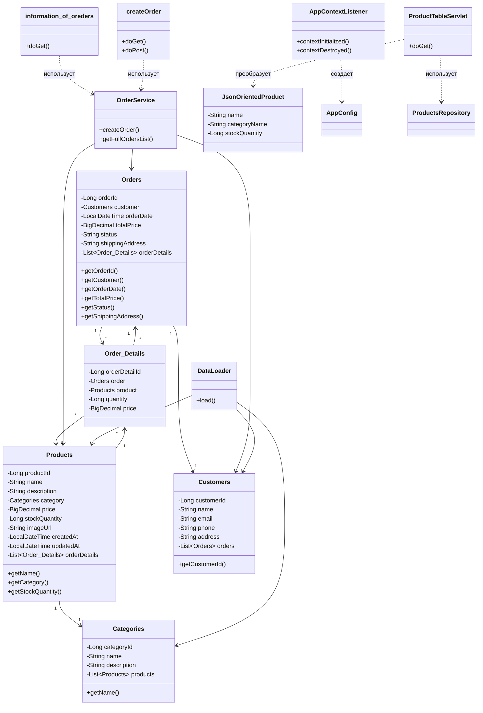
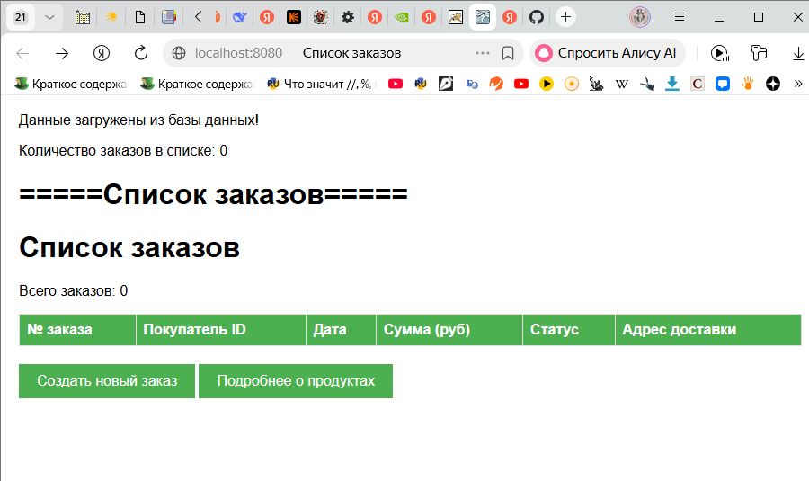
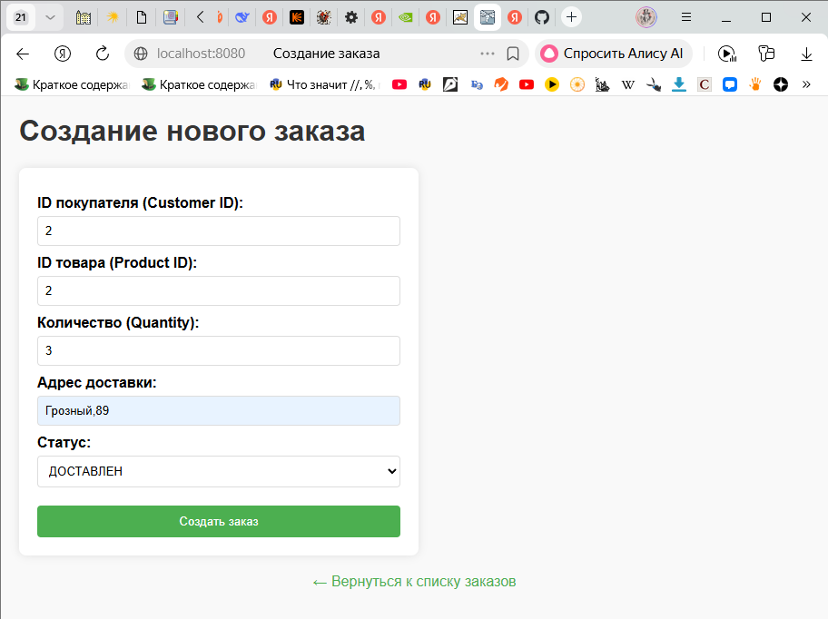
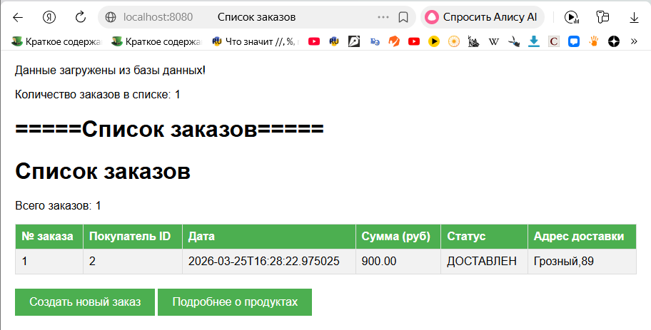
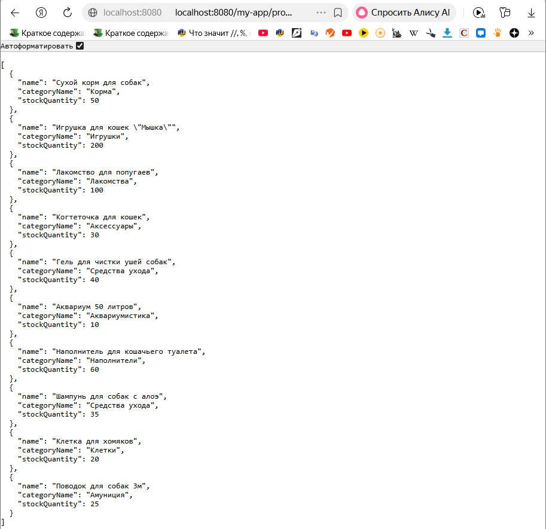

# Отчет по лабораторной работе №5
## Тема: Разработка и развертывание Web-приложений

### Цель лабораторной работы
Научить наше приложение взаимодействовать с пользователем через веб-интерфейс. Магазин зоотоваров получит первый веб-интерфейс на базе Java Servlets. Реализовать REST API для взаимодействия с другими системами.

---

### Выполнение работы

#### Задание 1: Подготовка проекта
Скопирован результат выполнения лабораторной работы №4 в директорию `/les10/lab/`. Проект содержит сущности (Categories, Products, Customers, Orders, Order_Details), репозитории Spring Data JPA, сервисы (DataLoader, OrderService) и конфигурацию Spring.

#### Задание 2: Установка и настройка Apache Tomcat 11
Скачана бинарная сборка Apache Tomcat 11.0.20 с официального сайта. Архив распакован в директорию:  
#### Задание 3: Добавление пользователя-администратора
В файле `conf/tomcat-users.xml` добавлена конфигурация администратора:

```xml
<role rolename="manager-gui"/>
<role rolename="admin-gui"/>
<user username="admin" password="admin123" roles="manager-gui,admin-gui"/>
  ```

#### Задание 4: Настройка WAR-сборки
В файл build.gradle.kts добавлен плагин war и зависимость для сервлетов:

kotlin
plugins {
    id("java")
    id("war")
}

dependencies {
    compileOnly("jakarta.servlet:jakarta.servlet-api:6.1.0")
    implementation("com.fasterxml.jackson.core:jackson-databind:2.15.0")
    // ... остальные зависимости из ЛР4
}

tasks.war {
    archiveFileName = "my-app.war"
}


#### Задание 5: Реализация единого Spring-контекста

Создан слушатель AppContextListener, который создает Spring-контекст при старте приложения и сохраняет его в ServletContext:

```Java
@WebListener
public class AppContextListener implements ServletContextListener {
@Override
public void contextInitialized(ServletContextEvent sce) {
AnnotationConfigApplicationContext context =
new AnnotationConfigApplicationContext(AppConfig.class);
sce.getServletContext().setAttribute("springContext", context);
}

    @Override
    public void contextDestroyed(ServletContextEvent sce) {
        AnnotationConfigApplicationContext context = 
            (AnnotationConfigApplicationContext) sce.getServletContext()
                .getAttribute("springContext");
        if (context != null) context.close();
    }
}
```

#### Задание 6: Реализация сервлета списка заказов

Создан сервлет information_of_oreders (URL: /orders), который:

Получает Spring-контекст из ServletContext

Вызывает OrderService.getFullOrdersList() для получения списка заказов

Формирует HTML-страницу с таблицей заказов

Содержит кнопки для перехода к созданию заказа и просмотру продуктов

```Java
@WebServlet("/orders")
public class information_of_oreders extends HttpServlet {
@Override
public void init() throws ServletException {
context = (AnnotationConfigApplicationContext)
getServletContext().getAttribute("springContext");
}

    @Override
    protected void doGet(HttpServletRequest req, HttpServletResponse resp) {
        OrderService orderService = context.getBean(OrderService.class);
        List<Orders> orders = orderService.getFullOrdersList();
        // формирование HTML-таблицы
        out.println("<table>...<table>");
        out.println("<a href='/create-order'>Создать заказ</a>");
        out.println("<a href='/productTable'>Продукты</a>");
    }
}
```


#### Задание 7: Реализация сервлета создания заказа

Создан сервлет createOrder (URL: /create-order), который:

doGet(): отображает HTML-форму с полями (ID покупателя, ID товара, количество, адрес, статус)

doPost(): принимает данные формы, вызывает OrderService.createOrder(), выполняет редирект на /orders

```Java
@WebServlet("/create-order")
public class createOrder extends HttpServlet {
    @Override
    protected void doGet(HttpServletRequest req, HttpServletResponse resp) {
        // HTML-форма
        out.println("<form method='post'>");
        out.println("<input type='number' name='customerId'>");
        out.println("<input type='number' name='productId'>");
        out.println("<input type='number' name='quantity'>");
        out.println("<input type='text' name='address'>");
        out.println("<select name='status'>");
        out.println("  <option value='НОВЫЙ'>НОВЫЙ</option>");
        out.println("</select>");
        out.println("<button type='submit'>Создать</button>");
        out.println("</form>");
    }
    
    @Override
    protected void doPost(HttpServletRequest req, HttpServletResponse resp) {
        Long customerId = Long.parseLong(req.getParameter("customerId"));
        Long productId = Long.parseLong(req.getParameter("productId"));
        Long quantity = Long.parseLong(req.getParameter("quantity"));
        String address = req.getParameter("address");
        String status = req.getParameter("status");
        
        OrderService orderService = context.getBean(OrderService.class);
        orderService.createOrder(customerId, LocalDateTime.now(), 
                                  status, address, productId, quantity);
        resp.sendRedirect(req.getContextPath() + "/orders");
    }
}
```


#### Задание 8: Реализация REST сервиса для продуктов

Создан сервлет ProductTableServlet (URL: /productTable), который:

Использует ProductsRepository для получения всех продуктов

Преобразует сущности в DTO (JsonOrientedProduct)

Возвращает JSON с полями: название продукта, название категории, количество на складе

```Java

@WebServlet("/productTable")
public class ProductTableServlet extends HttpServlet {
    @Override
    protected void doGet(HttpServletRequest req, HttpServletResponse resp) {
        resp.setContentType("application/json;charset=UTF-8");
        
        ProductsRepository pr = context.getBean(ProductsRepository.class);
        List<Products> allProducts = pr.findAll();
        List<JsonOrientedProduct> result = new ArrayList<>();
        
        for (Products product : allProducts) {
            result.add(new JsonOrientedProduct(
                product.getName(),
                product.getCategory().getName(),
                product.getStockQuantity()
            ));
        }
        
        String json = new ObjectMapper().writeValueAsString(result);
        resp.getWriter().print(json);
    }
}

```


#### Задание 9: DTO для JSON

```Java

public class JsonOrientedProduct {
    @JsonProperty("name")
    private String name;
    
    @JsonProperty("categoryName")
    private String categoryName;
    
    @JsonProperty("stockQuantity")
    private Long stockQuantity;
    
    // конструкторы, геттеры, сеттеры
}
```
#### Обновлённая UML-диаграмма классов проекта



#### Результаты работы проекта 









#### Вывод: 
В ходе выполнения лабораторной работы был реализован прототип Web-приложения для магазина зоо-товаров.
