## Лабораторная работа 6. Разработка Web-приложений с использованием технологии Spring MVC


#### Ход работы

#### Задание 1 
Реализуйте REST API работы с 
заказами (получение списка 
заказав, получение заказа 
по идентификатору, создание 
заказа, удаление заказа, 
изменение заказа). 
Используете RestController.

 ``` java
 package ru.bsuedu.cad.lab.controller;

import org.springframework.beans.factory.annotation.Autowired;
import org.springframework.http.ResponseEntity;
import org.springframework.web.bind.annotation.*;
import ru.bsuedu.cad.lab.entity.Orders;
import ru.bsuedu.cad.lab.repository.OrdersRepository;
import ru.bsuedu.cad.lab.service.CreateOrderRequest;
import ru.bsuedu.cad.lab.service.OrderService;
import ru.bsuedu.cad.lab.service.UpdateOrderRequest;

import java.util.List;

@RestController
@RequestMapping("/Oorders")
public class GetOrdersList {

    @Autowired
    OrderService orderService;

    @Autowired
    private OrdersRepository ordersRepository;

    @GetMapping
    public List<Orders> getOrdersList() {
        return orderService.getFullOrdersList();
    }

    @GetMapping("/{id}")
    public ResponseEntity<Orders> getOrder(@PathVariable("id") Long id) {  // <-- ЯВНО УКАЖИ ИМЯ
        return ordersRepository.findById(id)
                .map(ResponseEntity::ok)
                .orElse(ResponseEntity.notFound().build());
    }

    @PostMapping
    public Orders createOrder(@RequestBody CreateOrderRequest request) {
        return orderService.createOrder(request.getCustomerId(), request.getOrderDate(),
                request.getStatus(), request.getShippingAddress(),
                request.getProductId(), request.getQuantity());
    }

    @DeleteMapping("/{id}")
    public ResponseEntity<Object> deleteOrder(@PathVariable("id") Long id) {  // <-- ЯВНО УКАЖИ ИМЯ
        ordersRepository.deleteById(id);
        return ResponseEntity.noContent().build();
    }

    @PutMapping("/{id}")
    public Orders updateOrder(@PathVariable("id") Long id, @RequestBody UpdateOrderRequest request) {  // <-- ЯВНО УКАЖИ ИМЯ
        return orderService.updateOrder(id, request.getStatus(), request.getShippingAddress());
    }
}
   ```

              Рисунок 1 - Результат выполнения задания 1


### Задание 2 
#### Выполните деплой приложения на сервер Apache Tomcat 11. Протестируйте работу REST сервиса используя Postman https://www.postman.com/.Создайте коллекцию запросов для тестирования. 


          

             
  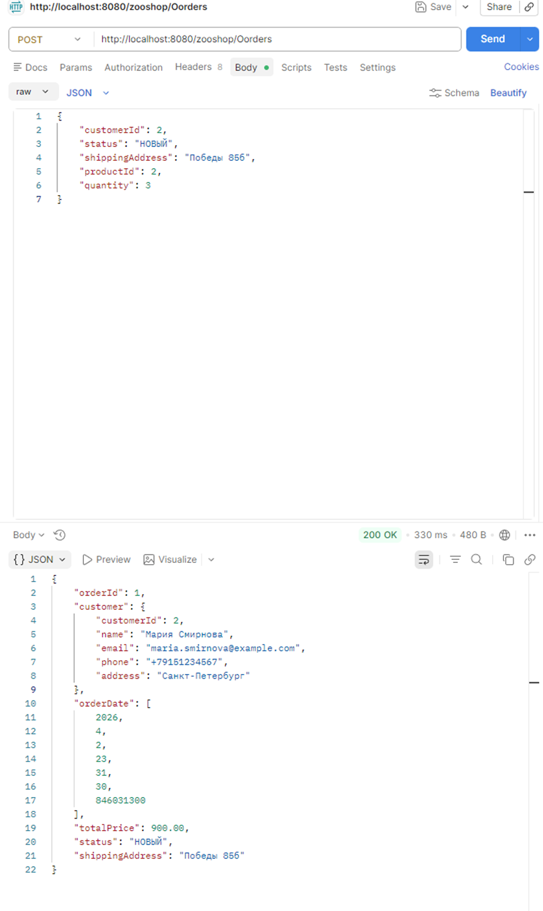
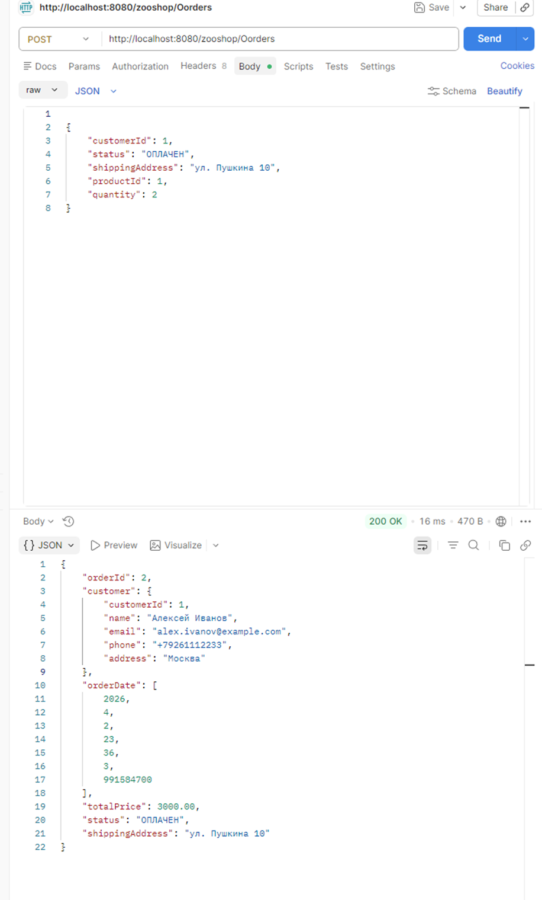

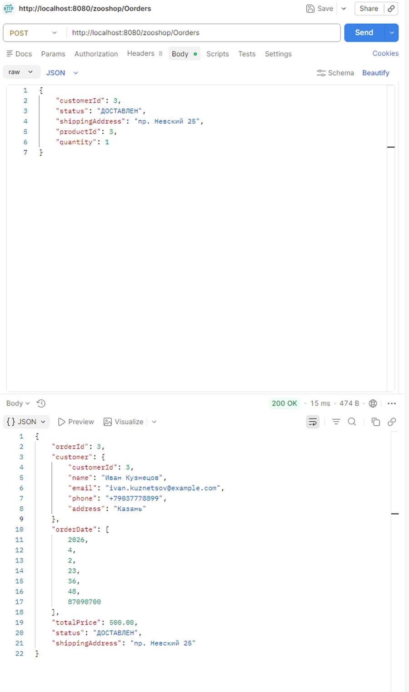
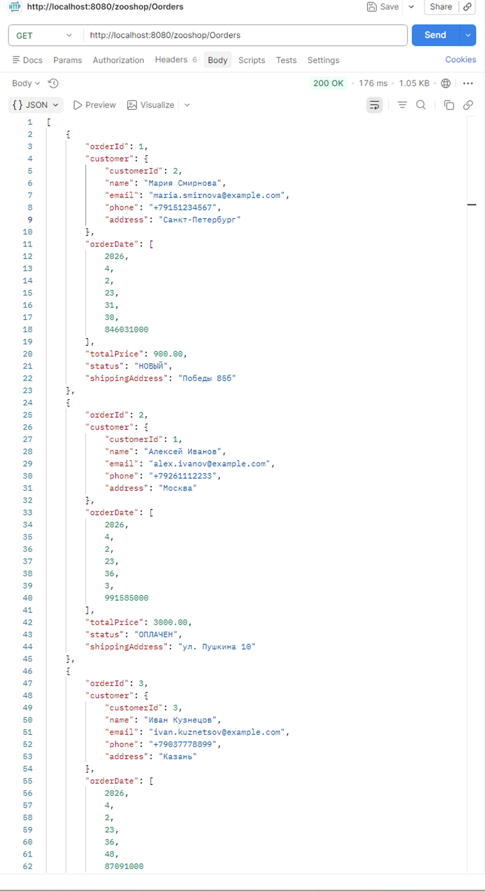
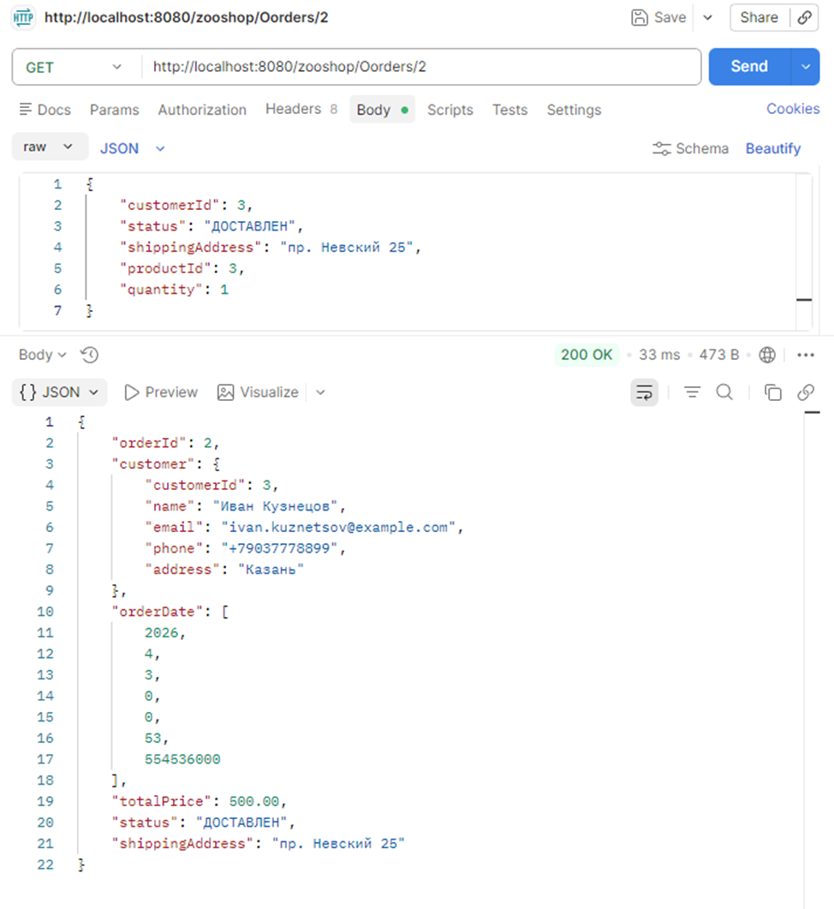

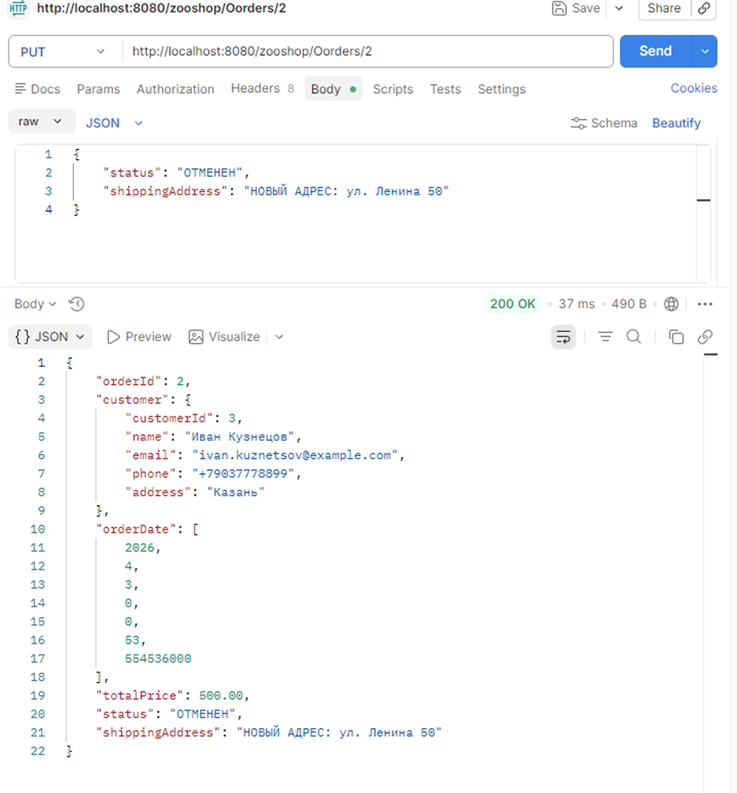


    Рисунок 2 - Результат выполнения задания 2   

### Задание 3
#### Подключите шаблонизатор Thymeleaf. Реализуйте Web интерфейс для работы с заказами Интерфейс должен позволять: получать список заказов, создавать новые заказы, удалять заказы и изменять заказы. Выполните деплой приложения на сервер Apache Tomcat 11. Протестируйте работу приложения.

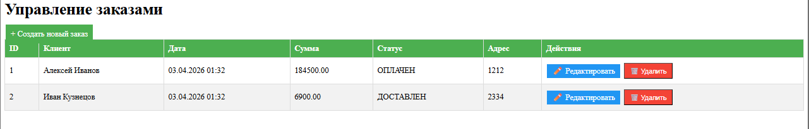
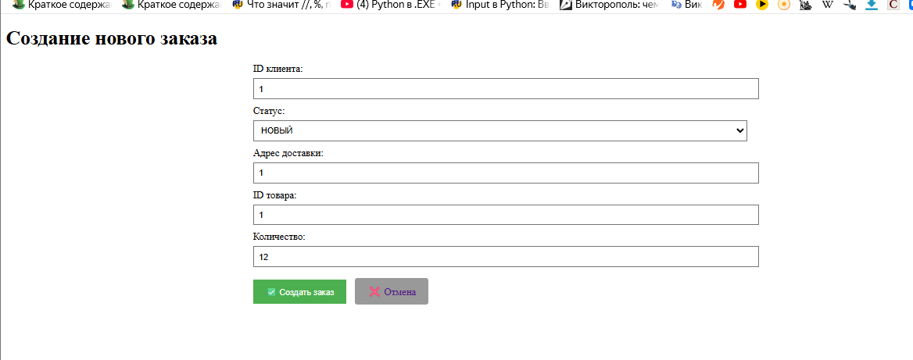
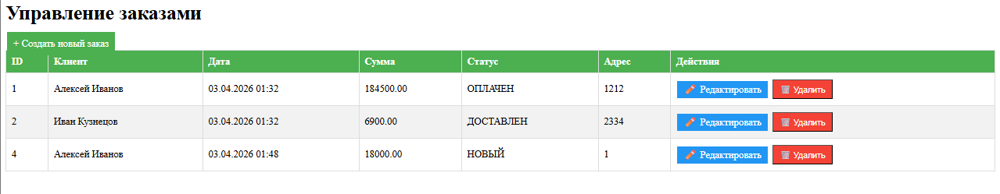
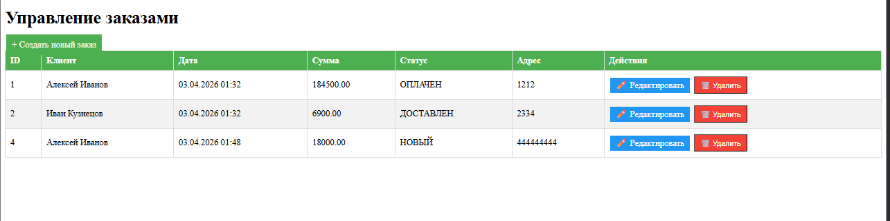
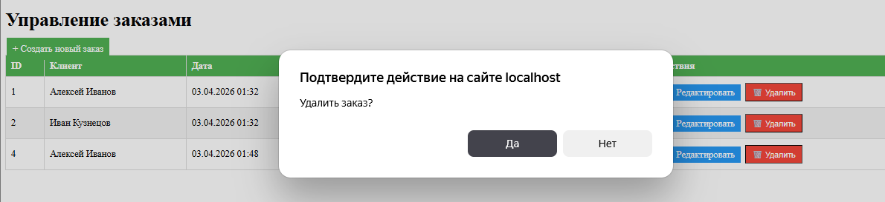
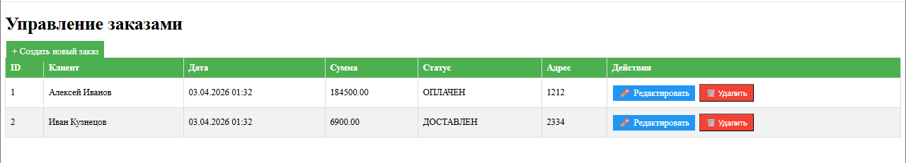

    Рисунок 3 - Результат выполнения задания 3


``` mermaid
 classDiagram
    direction TB
    
    class Orders {
        -Long orderId
        -LocalDateTime orderDate
        -BigDecimal totalPrice
        -String status
        -String shippingAddress
        +getOrderId()
        +setOrderId()
        +getCustomer()
        +setCustomer()
        +getOrderDate()
        +setOrderDate()
        +getTotalPrice()
        +setTotalPrice()
        +getStatus()
        +setStatus()
        +getShippingAddress()
        +setShippingAddress()
    }
    
    class Customers {
        -Long customerId
        -String name
        -String email
        -String phone
        -String address
        +getCustomerId()
        +setCustomerId()
        +getName()
        +setName()
        +getEmail()
        +setEmail()
        +getPhone()
        +setPhone()
        +getAddress()
        +setAddress()
    }
    
    class Products {
        -Long productId
        -String name
        -String description
        -BigDecimal price
        -Long stockQuantity
        +getProductId()
        +setProductId()
        +getName()
        +setName()
        +getPrice()
        +setPrice()
        +getStockQuantity()
        +setStockQuantity()
    }
    
    class Categories {
        -Long categoryId
        -String name
        -String description
        +getCategoryId()
        +setCategoryId()
        +getName()
        +setName()
        +getDescription()
        +setDescription()
    }
    
    class Order_Details {
        -Long orderDetailId
        -Long quantity
        -BigDecimal price
        +getOrderDetailId()
        +setOrderDetailId()
        +getOrder()
        +setOrder()
        +getProduct()
        +setProduct()
        +getQuantity()
        +setQuantity()
        +getPrice()
        +setPrice()
    }
    
    class OrderService {
        +createOrder()
        +getFullOrdersList()
        +updateOrder()
        +deleteOrder()
        +getOrderById()
    }
    
    class GetOrdersList {
        +getOrdersList()
        +getOrder()
        +createOrder()
        +updateOrder()
        +deleteOrder()
    }
    
    class WebController {
        +listOrders()
        +showCreateForm()
        +createOrder()
        +showEditForm()
        +updateOrder()
        +deleteOrder()
    }
    
    Customers "1" -- "0..*" Orders : имеет
    Orders "1" -- "0..*" Order_Details : содержит
    Products "1" -- "0..*" Order_Details : входит в
    Categories "1" -- "0..*" Products : содержит
    
    GetOrdersList --> OrderService : использует
    WebController --> OrderService : использует
    
    note for Orders "JSON: @JsonIgnore на orderDetails"
    note for Customers "JSON: @JsonIgnore на orders"
   ```

          Рисунок 4 - Обновлённая mermaid-диаграмма проекта