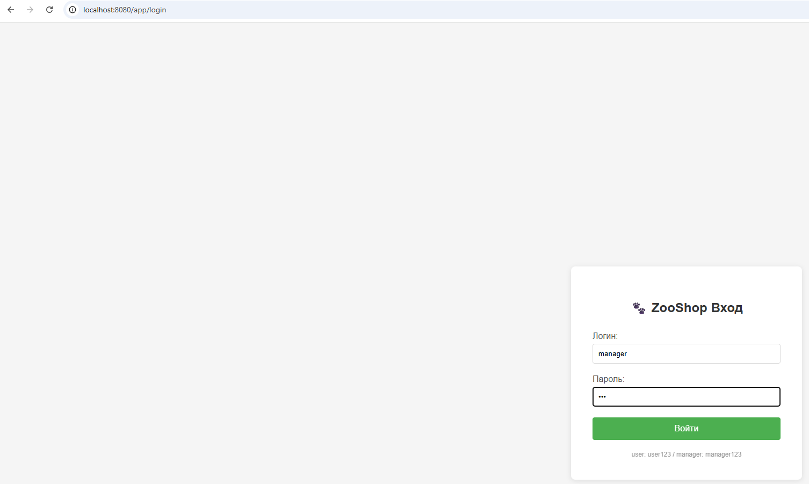
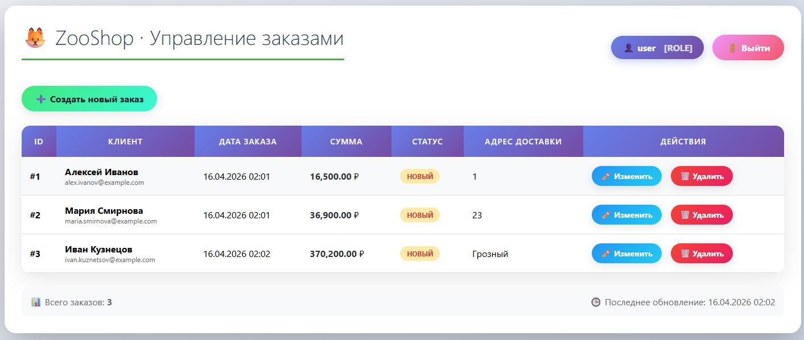
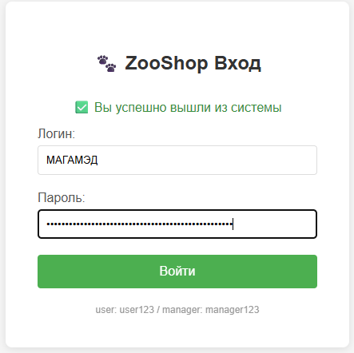
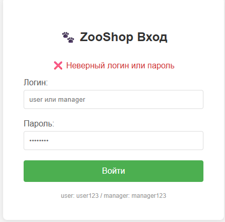
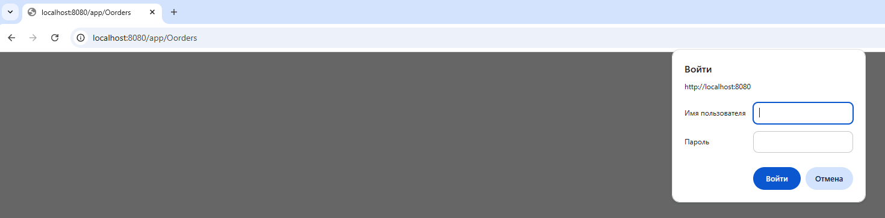
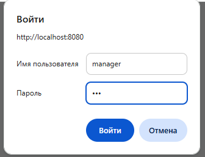
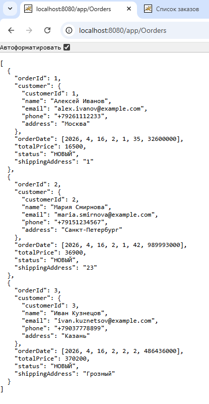

## Лабораторная работа 7. Spring security.Basic Authentication


#### Ход работы

#### Задание 1 
Настройте проект для работы со Spring Security

 ``` java
 plugins {
    war
    application
}

repositories {
    mavenCentral()
}

dependencies {
    // ========== SPRING CORE ==========
    implementation("org.springframework:spring-context:6.2.2")
    implementation("org.springframework:spring-webmvc:6.2.2")
    implementation("org.springframework:spring-orm:6.2.2")
    implementation("org.springframework.data:spring-data-jpa:3.3.2")

    // ========== SPRING SECURITY (лаба 7) ==========
    implementation("org.springframework.security:spring-security-web:6.2.2")
    implementation("org.springframework.security:spring-security-config:6.2.2")

    // ========== JPA / HIBERNATE ==========
    implementation("jakarta.persistence:jakarta.persistence-api:3.1.0")
    implementation("org.hibernate.orm:hibernate-core:6.5.2.Final")

    // ========== DATABASE (H2 + Connection Pool) ==========
    implementation("com.h2database:h2:2.2.224")
    implementation("com.zaxxer:HikariCP:5.1.0")

    // ========== THYMELEAF (шаблоны HTML) ==========
    implementation("org.thymeleaf:thymeleaf-spring6:3.1.2.RELEASE")
    implementation("org.thymeleaf.extras:thymeleaf-extras-springsecurity6:3.1.2.RELEASE")

    // ========== JSON (Jackson для REST) ==========
    implementation("com.fasterxml.jackson.core:jackson-databind:2.17.2")
    implementation("com.fasterxml.jackson.datatype:jackson-datatype-jsr310:2.17.2")

    // ========== SERVLET API (для Tomcat) ==========
    compileOnly("jakarta.servlet:jakarta.servlet-api:6.0.0")

    // ========== ЛОГГИРОВАНИЕ ==========
    implementation("org.slf4j:slf4j-api:2.0.13")
    implementation("ch.qos.logback:logback-classic:1.5.6")


}

java {
    toolchain {
        languageVersion = JavaLanguageVersion.of(17)
    }
}

application {
    mainClass = "ru.bsuedu.cad.lab.app.App"
}

tasks.withType<JavaCompile> {
    options.encoding = "UTF-8"
}


package ru.bsuedu.cad.lab.security;

import org.springframework.security.web.context.AbstractSecurityWebApplicationInitializer;

public class SecurityInitializer extends AbstractSecurityWebApplicationInitializer {
}

   ```

              Рисунок 1 - Результат выполнения задания 1


### Задание 2 
#### Добавьте двух пользователей: user и manager. Для пользователей user - доступен только просмотр заказов, для manager - все операции с заказами.


``` java
package ru.bsuedu.cad.lab.security;

import org.springframework.context.annotation.Bean;
import org.springframework.context.annotation.Configuration;
import org.springframework.core.annotation.Order;
import org.springframework.http.HttpMethod;
import org.springframework.security.config.Customizer;
import org.springframework.security.config.annotation.web.builders.HttpSecurity;
import org.springframework.security.config.annotation.web.configuration.EnableWebSecurity;
import org.springframework.security.core.userdetails.User;
import org.springframework.security.core.userdetails.UserDetailsService;
import org.springframework.security.provisioning.InMemoryUserDetailsManager;
import org.springframework.security.web.SecurityFilterChain;

@Configuration
@EnableWebSecurity
public class SecurityConfig {

    // 1. Пользователи в памяти (user / manager)
    @Bean
    public UserDetailsService userDetailsService() {
        return new InMemoryUserDetailsManager(
                User.withUsername("user")
                        .password("{noop}123")
                        .roles("USER")
                        .authorities("VIEW_PROFILE")
                        .build(),
                User.withUsername("manager")
                        .password("{noop}321")
                        .roles("MANAGER")
//                        .authorities("VIEW_PROFILE", "EDIT_PROFILE", "DELETE_USERS")
                        .build()
        );
    }

   ```

    Рисунок 2 - Результат выполнения задания 2   

### Задание 3
#### Реализуйте аутентификацию и авторизацию пользователя с помощью формы. При данной авторизации должна быть доступна только часть приложения имеющая пользовательский интерфейс.


``` java
@Bean
    @Order(2)
    public SecurityFilterChain filterChain(HttpSecurity http) throws Exception {
        http
                .authorizeHttpRequests(authz -> authz

                        .requestMatchers("/login", "/css/**").permitAll()

                        .requestMatchers("/web/orders").authenticated()

                        .requestMatchers("/web/create-test").hasRole("MANAGER")
                        .requestMatchers("/web/orders/edit/**").hasRole("MANAGER")
                        .requestMatchers("/web/orders/delete/**").hasRole("MANAGER")

                        .anyRequest().authenticated()
                )
                .formLogin(form -> form
                        .loginPage("/login")
                        .loginProcessingUrl("/login")
                        .defaultSuccessUrl("/web/orders", true)
                        .failureUrl("/login?error")
                        .permitAll()
                )
                .logout(logout -> logout
                        .logoutUrl("/logout")
                        .logoutSuccessUrl("/login?logout")
                        .permitAll()
                )
                .csrf(csrf -> csrf.disable());

        return http.build();
    }
    
   
   ```
``` html

<!DOCTYPE html>
<html xmlns:th="http://www.thymeleaf.org">
<head>
    <meta charset="UTF-8">
    <title>Вход в ZooShop</title>
    <style>
        body {
            font-family: Arial, sans-serif;
            background-color: #f5f5f5;
            display: flex;
            justify-content: center;
            align-items: center;
            height: 100vh;
            margin: 0;
        }
        .login-container {
            background: white;
            padding: 40px;
            border-radius: 8px;
            box-shadow: 0 2px 10px rgba(0,0,0,0.1);
            width: 350px;
        }
        h2 {
            text-align: center;
            color: #333;
            margin-bottom: 30px;
        }
        .form-group {
            margin-bottom: 20px;
        }
        label {
            display: block;
            margin-bottom: 5px;
            color: #555;
        }
        input {
            width: 100%;
            padding: 10px;
            border: 1px solid #ddd;
            border-radius: 4px;
            box-sizing: border-box;
        }
        button {
            width: 100%;
            padding: 12px;
            background-color: #4CAF50;
            color: white;
            border: none;
            border-radius: 4px;
            font-size: 16px;
            cursor: pointer;
        }
        button:hover {
            background-color: #45a049;
        }
        .error {
            color: #d32f2f;
            text-align: center;
            margin-bottom: 15px;
        }
        .logout {
            color: #388e3c;
            text-align: center;
            margin-bottom: 15px;
        }
    </style>
</head>
<body>
<div class="login-container">
    <h2>🐾 ZooShop Вход</h2>

    <div th:if="${param.error}" class="error">
        ❌ Неверный логин или пароль
    </div>

    <div th:if="${param.logout}" class="logout">
        ✅ Вы успешно вышли из системы
    </div>

    <form th:action="@{/login}" method="post">
        <div class="form-group">
            <label for="username">Логин:</label>
            <input type="text" id="username" name="username" placeholder="user или manager" required>
        </div>

        <div class="form-group">
            <label for="password">Пароль:</label>
            <input type="password" id="password" name="password" placeholder="••••••••" required>
        </div>

        <button type="submit">Войти</button>
    </form>

    <div style="margin-top: 20px; font-size: 12px; color: #999; text-align: center;">
        user: user123 / manager: manager123
    </div>
</div>
</body>
</html>
   ```

``` html
<!DOCTYPE html>
<html xmlns:th="http://www.thymeleaf.org"
      xmlns:sec="http://www.thymeleaf.org/extras/spring-security">
<head>
    <meta charset="UTF-8">
    <title>Список заказов</title>
    <style>
        * {
            font-family: 'Segoe UI', Arial, sans-serif;
        }
        body {
            max-width: 1400px;
            margin: 30px auto;
            padding: 0 20px;
            background: linear-gradient(135deg, #f5f7fa 0%, #c3cfe2 100%);
            min-height: 100vh;
        }
        .container {
            background: white;
            border-radius: 20px;
            padding: 30px;
            box-shadow: 0 20px 60px rgba(0,0,0,0.3);
        }
        h1 {
            color: #2c3e50;
            margin-top: 0;
            margin-bottom: 20px;
            font-weight: 300;
            font-size: 36px;
            border-bottom: 3px solid #4CAF50;
            padding-bottom: 15px;
        }
        .header-row {
            display: flex;
            justify-content: space-between;
            align-items: center;
            margin-bottom: 25px;
        }
        .user-badge {
            background: linear-gradient(135deg, #667eea 0%, #764ba2 100%);
            color: white;
            padding: 10px 20px;
            border-radius: 40px;
            font-weight: bold;
            box-shadow: 0 4px 15px rgba(102, 126, 234, 0.4);
        }
        .btn {
            border: none;
            padding: 12px 24px;
            border-radius: 40px;
            font-weight: bold;
            font-size: 16px;
            cursor: pointer;
            text-decoration: none;
            display: inline-block;
            transition: all 0.3s ease;
            box-shadow: 0 4px 15px rgba(0,0,0,0.1);
        }
        .btn-create {
            background: linear-gradient(135deg, #43e97b 0%, #38f9d7 100%);
            color: #1a1a2e;
        }
        .btn-create:hover {
            transform: translateY(-2px);
            box-shadow: 0 8px 25px rgba(67, 233, 123, 0.4);
        }
        .btn-logout {
            background: linear-gradient(135deg, #f093fb 0%, #f5576c 100%);
            color: white;
            margin-left: 15px;
        }
        .btn-logout:hover {
            transform: translateY(-2px);
            box-shadow: 0 8px 25px rgba(245, 87, 108, 0.4);
        }
        table {
            width: 100%;
            border-collapse: collapse;
            margin: 25px 0;
            border-radius: 15px;
            overflow: hidden;
            box-shadow: 0 10px 40px rgba(0,0,0,0.1);
        }
        th {
            background: linear-gradient(135deg, #667eea 0%, #764ba2 100%);
            color: white;
            padding: 18px 15px;
            font-weight: 600;
            text-transform: uppercase;
            letter-spacing: 1px;
            font-size: 14px;
        }
        td {
            padding: 15px;
            background: white;
            border-bottom: 1px solid #e0e0e0;
        }
        tr:hover td {
            background: #f8f9fa;
        }
        .btn-edit {
            background: linear-gradient(135deg, #2196F3 0%, #21cbf3 100%);
            color: white;
            padding: 8px 16px;
            font-size: 14px;
            margin-right: 8px;
        }
        .btn-edit:hover {
            transform: translateY(-2px);
            box-shadow: 0 6px 20px rgba(33, 150, 243, 0.4);
        }
        .btn-delete {
            background: linear-gradient(135deg, #f44336 0%, #e91e63 100%);
            color: white;
            padding: 8px 16px;
            font-size: 14px;
        }
        .btn-delete:hover {
            transform: translateY(-2px);
            box-shadow: 0 6px 20px rgba(244, 67, 54, 0.4);
        }
        .status-badge {
            padding: 5px 12px;
            border-radius: 20px;
            font-weight: bold;
            font-size: 12px;
            text-align: center;
            display: inline-block;
        }
        .status-НОВЫЙ { background: #ffeaa7; color: #d63031; }
        .status-ОПЛАЧЕН { background: #55efc4; color: #00b894; }
        .status-ОТПРАВЛЕН { background: #74b9ff; color: #0984e3; }
        .status-ДОСТАВЛЕН { background: #a29bfe; color: #6c5ce7; }
        .status-ОТМЕНЕН { background: #fab1a0; color: #d63031; }
        .price {
            font-weight: bold;
            color: #2d3436;
        }
        .action-buttons {
            display: flex;
            gap: 8px;
        }
    </style>
</head>
<body>

<div class="container">

    <!-- Заголовок и информация о пользователе -->
    <div class="header-row">
        <h1>🦊 ZooShop · Управление заказами</h1>
        <div style="display: flex; align-items: center;">
            <span class="user-badge">
                👤 <span sec:authentication="name">user</span>
                <span style="opacity: 0.8; margin-left: 10px;">
                    [<span sec:authentication="principal.authorities">ROLE</span>]
                </span>
            </span>
            <form th:action="@{/logout}" method="post" style="display: inline;">
                <button type="submit" class="btn btn-logout">🚪 Выйти</button>
            </form>
        </div>
    </div>

    <!-- Кнопка "Создать" только для MANAGER -->
    <div sec:authorize="hasRole('MANAGER')">
        <a th:href="@{/web/create-test}" class="btn btn-create">➕ Создать новый заказ</a>
    </div>

    <!-- Таблица заказов -->
    <table>
        <thead>
        <tr>
            <th>ID</th>
            <th>Клиент</th>
            <th>Дата заказа</th>
            <th>Сумма</th>
            <th>Статус</th>
            <th>Адрес доставки</th>
            <th sec:authorize="hasRole('MANAGER')">Действия</th>
        </tr>
        </thead>
        <tbody>
        <tr th:each="order : ${orders}">
            <td><strong>#<span th:text="${order.orderId}">1</span></strong></td>
            <td>
                <div style="font-weight: bold;" th:text="${order.customer.name}">Клиент</div>
                <div style="font-size: 12px; color: #666;" th:text="${order.customer.email}">email</div>
            </td>
            <td th:text="${#temporals.format(order.orderDate, 'dd.MM.yyyy HH:mm')}">Дата</td>
            <td>
                <span class="price" th:text="${#numbers.formatDecimal(order.totalPrice, 0, 'COMMA', 2, 'POINT')}">0</span> ₽
            </td>
            <td>
                <span class="status-badge" th:classappend="'status-' + ${order.status}" th:text="${order.status}">Статус</span>
            </td>
            <td th:text="${order.shippingAddress}">Адрес</td>

            <!-- Действия только для MANAGER -->
            <td sec:authorize="hasRole('MANAGER')">
                <div class="action-buttons">
                    <a th:href="@{/web/orders/edit/{id}(id=${order.orderId})}" class="btn btn-edit">✏️ Изменить</a>
                    <form method="post" th:action="@{/web/orders/delete/{id}(id=${order.orderId})}" style="display: inline;">
                        <button type="submit" class="btn btn-delete" onclick="return confirm('Вы уверены, что хотите удалить заказ #' + ${order.orderId} + '?')">🗑️ Удалить</button>
                    </form>
                </div>
            </td>
        </tr>
        </tbody>
    </table>

    <!-- Футер с статистикой -->
    <div style="margin-top: 20px; padding: 15px; background: #f8f9fa; border-radius: 10px; color: #666;">
        <div style="display: flex; justify-content: space-between;">
            <span>📊 Всего заказов: <strong th:text="${orders.size()}">0</strong></span>
            <span>🕒 Последнее обновление: <span th:text="${#temporals.format(#temporals.createNow(), 'dd.MM.yyyy HH:mm')}"></span></span>
        </div>
    </div>

</div>

</body>
</html>
   ```

                          Рисунок 3 - Результат выполнения задания 3


### Задание 4
#### Реализуйте аутентификацию и авторизацию пользователя с Basic Authorization. При данной авторизации должна быть доступна часть приложения содержащая REST сервис.

``` java
@Bean
    @Order(1)
    public SecurityFilterChain filterChain1(HttpSecurity http) throws Exception{

        http
                .securityMatcher("/Oorders/**")
                .authorizeHttpRequests(authz -> authz

                        .requestMatchers(HttpMethod.GET, "/Oorders/**").hasAnyRole("USER", "MANAGER")
                        .requestMatchers(HttpMethod.POST, "/Oorders/**").hasRole("MANAGER")
                        .requestMatchers(HttpMethod.PUT, "/Oorders/**").hasRole("MANAGER")
                        .requestMatchers(HttpMethod.DELETE, "/Oorders/**").hasRole("MANAGER")
                )
                .httpBasic(Customizer.withDefaults()) // включает basic auth
                .csrf(csrf -> csrf.disable());        // желательно отключить CSRF для REST API

        return http.build();
    }
   ```

                          Рисунок 4 - Результат выполнения задания 4

``` mermaid
 classDiagram
    class SecurityConfig {
        +UserDetailsService userDetailsService()
        +SecurityFilterChain restApiFilterChain(HttpSecurity)
        +SecurityFilterChain webUiFilterChain(HttpSecurity)
    }
    
    class SecurityInitializer {
    }
    
    class WebController {
        +listOrders()
        +showCreateForm()
        +createOrder()
        +showEditForm()
        +updateOrder()
        +deleteOrder()
    }
    
    class LoginController {
        +loginPage()
    }
    
    class OrderService {
        +createOrder()
        +getFullOrdersList()
        +updateOrder()
        +deleteOrder()
    }
    
    SecurityInitializer <|-- AbstractSecurityWebApplicationInitializer
    WebController --> OrderService
    LoginController ..> SecurityConfig
    WebController ..> SecurityConfig
   ```

          Рисунок 5 - Обновлённая mermaid-диаграмма проекта










          Рисунок 6 - Демонстрация работы проекта


### Вывод   

#### В ходе выполнения лабораторной работы были реализованы возможности аутентификации и авторизации в web-приложении