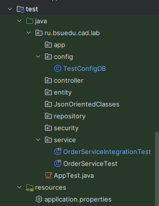
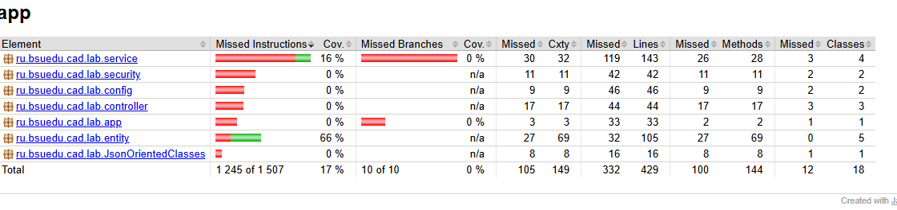
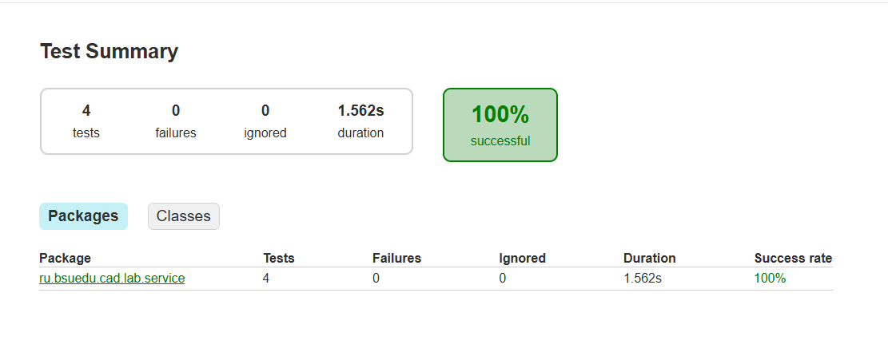

## Лабораторная работа 8. Основы тестирования

#### Ход работы

#### Задание 1 
Настройте проект для для написания и выполнения Unit-тест тестов
Настройте JaCoCo для генерации отчетов о покрытии кода тестами
Настройте проект для для написания и выполнения интеграционных тестов

 ``` java
 plugins {
    application
    war
    jacoco
}

repositories {
    mavenCentral()
}

dependencies {
    // ===== SPRING CORE (НЕ BOOT!) =====
    implementation("org.springframework:spring-context:6.2.2")
    implementation("org.springframework:spring-web:6.2.2")
    implementation("org.springframework:spring-webmvc:6.2.2")
    implementation("org.springframework:spring-orm:6.2.2")
    implementation("org.springframework:spring-tx:6.2.2")

    // ===== SPRING SECURITY =====
    implementation("org.springframework.security:spring-security-web:6.4.2")
    implementation("org.springframework.security:spring-security-config:6.4.2")

    // ===== SPRING DATA JPA =====
    implementation("org.springframework.data:spring-data-jpa:3.3.5")

    // ===== JAKARTA PERSISTENCE (JPA) =====
    implementation("jakarta.persistence:jakarta.persistence-api:3.1.0")
    implementation("jakarta.annotation:jakarta.annotation-api:2.1.1")

    // ===== HIBERNATE =====
    implementation("org.hibernate.orm:hibernate-core:6.6.4.Final")

    // ===== DATABASE =====
    implementation("com.h2database:h2:2.3.232")
    implementation("com.zaxxer:HikariCP:6.2.1")

    // ===== THYMELEAF =====
    implementation("org.thymeleaf:thymeleaf-spring6:3.1.2.RELEASE")
    implementation("org.thymeleaf.extras:thymeleaf-extras-springsecurity6:3.1.2.RELEASE")

    // ===== JSON (JACKSON) =====
    implementation("com.fasterxml.jackson.core:jackson-databind:2.18.2")
    implementation("com.fasterxml.jackson.datatype:jackson-datatype-jsr310:2.18.2")

    // ===== SERVLET API (для компиляции) =====
    compileOnly("jakarta.servlet:jakarta.servlet-api:6.1.0")

    // ===== ЛОГГИРОВАНИЕ =====
    implementation("org.slf4j:slf4j-api:2.0.16")
    implementation("ch.qos.logback:logback-classic:1.5.12")

    // ==========================================
    // ===== ТЕСТИРОВАНИЕ =====
    // ==========================================

    // JUnit 5
    testImplementation("org.junit.jupiter:junit-jupiter-api:5.11.4")
    testRuntimeOnly("org.junit.jupiter:junit-jupiter-engine:5.11.4")
    testImplementation("org.junit.jupiter:junit-jupiter-params:5.11.4")

    // Spring Test (для интеграционных тестов)
    testImplementation("org.springframework:spring-test:6.2.2")

    // Mockito
    testImplementation("org.mockito:mockito-core:5.14.2")
    testImplementation("org.mockito:mockito-junit-jupiter:5.14.2")

    // AssertJ (красивые ассерты)
    testImplementation("org.assertj:assertj-core:3.27.2")

    // H2 для интеграционных тестов (in-memory)
    testImplementation("com.h2database:h2:2.3.232")

    // Jakarta Servlet для тестов (если нужно)
    testCompileOnly("jakarta.servlet:jakarta.servlet-api:6.1.0")
}

// ===== НАСТРОЙКА ТЕСТОВ =====
tasks.test {
    useJUnitPlatform()
    finalizedBy(tasks.jacocoTestReport)  // после тестов генерим отчёт JaCoCo
}

// ===== НАСТРОЙКА JACOCO =====
tasks.jacocoTestReport {
    dependsOn(tasks.test)
    reports {
        xml.required.set(false)
        csv.required.set(false)
        html.required.set(true)
        html.outputLocation.set(layout.buildDirectory.dir("jacocoHtml"))
    }
}

tasks.jacocoTestCoverageVerification {
    violationRules {
        rule {
            limit {
                minimum = "0.01".toBigDecimal()  // 30% покрытия минимум (учебная цель)
            }
        }
    }
}

// ===== JAVA VERSION =====
java {
    toolchain {
        languageVersion.set(JavaLanguageVersion.of(17))
    }
}

// ===== WAR PLUGIN =====
tasks.war {
    archiveFileName.set("zooshop.war")
}

// ===== MAIN CLASS =====
application {
    mainClass.set("ru.bsuedu.cad.lab.app.App")
}

tasks.withType<JavaCompile> {
    options.encoding = "UTF-8"
}

package ru.bsuedu.cad.lab.config;

import jakarta.persistence.EntityManagerFactory;
import org.hibernate.cfg.Environment;
import org.springframework.beans.factory.annotation.Autowired;
import org.springframework.context.annotation.Bean;
import org.springframework.context.annotation.ComponentScan;
import org.springframework.context.annotation.Configuration;
import org.springframework.data.jpa.repository.config.EnableJpaRepositories;
import org.springframework.jdbc.datasource.DriverManagerDataSource;
import org.springframework.jdbc.datasource.embedded.EmbeddedDatabaseBuilder;
import org.springframework.jdbc.datasource.embedded.EmbeddedDatabaseType;
import org.springframework.orm.jpa.JpaTransactionManager;
import org.springframework.orm.jpa.LocalContainerEntityManagerFactoryBean;
import org.springframework.orm.jpa.vendor.HibernateJpaVendorAdapter;
import org.springframework.transaction.PlatformTransactionManager;
import org.springframework.transaction.annotation.EnableTransactionManagement;

import javax.sql.DataSource;
import java.sql.Connection;
import java.sql.SQLException;
import java.util.Properties;

@Configuration
@ComponentScan(basePackages = {
        "ru.bsuedu.cad.lab.entity",
        "ru.bsuedu.cad.lab.repository",
        "ru.bsuedu.cad.lab.service"
})
@EnableJpaRepositories(basePackages = "ru.bsuedu.cad.lab.repository")
@EnableTransactionManagement
public class TestConfigDB {

    @Bean
    public DataSource dataSource() {
        return new EmbeddedDatabaseBuilder()
                .setType(EmbeddedDatabaseType.H2)
                .build();
    }

    @Bean
    public LocalContainerEntityManagerFactoryBean entityManagerFactory() {
        LocalContainerEntityManagerFactoryBean em = new LocalContainerEntityManagerFactoryBean();
        em.setDataSource(dataSource());
        em.setPackagesToScan("ru.bsuedu.cad.lab.entity");

        HibernateJpaVendorAdapter vendorAdapter = new HibernateJpaVendorAdapter();
        vendorAdapter.setShowSql(true);
        vendorAdapter.setGenerateDdl(true);
        vendorAdapter.setDatabasePlatform("org.hibernate.dialect.H2Dialect");
        em.setJpaVendorAdapter(vendorAdapter);

        Properties properties = new Properties();
        properties.put(Environment.HBM2DDL_AUTO, "create-drop");
        properties.put(Environment.DIALECT, "org.hibernate.dialect.H2Dialect");
        properties.put(Environment.FORMAT_SQL, true);
        properties.put(Environment.SHOW_SQL, true);
        properties.put("hibernate.hbm2ddl.auto", "create-drop");
        properties.put("javax.persistence.schema-generation.database.action", "drop-and-create");
        em.setJpaProperties(properties);

        return em;
    }

    @Bean
    public PlatformTransactionManager transactionManager(EntityManagerFactory emf) {
        return new JpaTransactionManager(emf);
    }
}

   ```

              Рисунок 1 - Результат выполнения задания 1


### Задание 2 
#### Напишите Unit-тест для сервиса создания заказа. Протестируйте как удачное так и неудачное выполнение методов.


``` java
package ru.bsuedu.cad.lab.service;


import net.bytebuddy.build.ToStringPlugin;
import org.junit.jupiter.api.*;
import org.mockito.InjectMocks;
import org.mockito.Mock;
import org.mockito.Mockito;
import org.mockito.MockitoAnnotations;
import ru.bsuedu.cad.lab.entity.Customers;
import ru.bsuedu.cad.lab.entity.Order_Details;
import ru.bsuedu.cad.lab.entity.Orders;
import ru.bsuedu.cad.lab.entity.Products;
import ru.bsuedu.cad.lab.repository.CustomersRepository;
import ru.bsuedu.cad.lab.repository.OrderDetailsRepository;
import ru.bsuedu.cad.lab.repository.OrdersRepository;
import ru.bsuedu.cad.lab.repository.ProductsRepository;

import java.math.BigDecimal;
import java.time.LocalDateTime;
import java.util.Optional;

import static org.junit.jupiter.api.Assertions.assertEquals;
import static org.junit.jupiter.api.Assertions.assertThrows;
import static org.mockito.ArgumentMatchers.any;
import static org.mockito.Mockito.mock;
import static org.mockito.Mockito.when;

public class OrderServiceTest {

    @Mock
    private  CustomersRepository customersRepository;
    @Mock
    private  ProductsRepository productsRepository;
    @Mock
    private  OrdersRepository ordersRepository;
    @Mock
    private  OrderDetailsRepository orderDetailsRepository;

    @InjectMocks
    private OrderService orderService;


    @BeforeAll
    static void startAllTest(){
        System.out.println("Start ALL test");
    }


    @BeforeEach
    void setUp(){
        MockitoAnnotations.openMocks(this);
//        orderService = new OrderService(customersRepository,
//                                        productsRepository,
//                                        ordersRepository,
//                                        orderDetailsRepository);
    }

    @Test
    void createdOrderCorrected(){


        Long customerId =1L;
        LocalDateTime orderDate= LocalDateTime.now();
        String status = "norm";
        String shippingAddress = "BESTGRAD";
        Long productId =1L;
        Long quantity = 10L;
        BigDecimal productPrice = BigDecimal.valueOf(10);
        BigDecimal totalPrice = BigDecimal.valueOf(100);
        Long orderID = 900L;


        Products product = mock(Products.class);
        when(productsRepository.findById(productId)).thenReturn(Optional.of(product));
        when(product.getPrice()).thenReturn(productPrice);

        Customers customer = mock(Customers.class);
        when(customersRepository.findById(customerId)).thenReturn(Optional.of(customer));
        when(customer.getCustomerId()).thenReturn(customerId);


        when(ordersRepository.save(any(Orders.class))).thenAnswer(invocation ->{
                    Orders newOrder = invocation.getArgument(0);
                    newOrder.setOrderId(orderID);
                    return newOrder;
        });


        when(orderDetailsRepository.save(any(Order_Details.class))).thenAnswer(invocation ->{
            return invocation.getArgument(0);
        });


        Orders saveOrder = orderService.createOrder(customerId, orderDate,
                 status,  shippingAddress,
                 productId,  quantity);


        assertEquals(customerId, saveOrder.getCustomer().getCustomerId() );
        assertEquals(orderDate, saveOrder.getOrderDate());
        assertEquals(status, saveOrder.getStatus());
        assertEquals(shippingAddress, saveOrder.getShippingAddress());
        assertEquals(totalPrice,saveOrder.getTotalPrice());
        assertEquals(orderID, saveOrder.getOrderId());


        Mockito.verify(customersRepository, Mockito.times(1)).findById(customerId);
        Mockito.verify(productsRepository, Mockito.times(1)).findById(productId);
        Mockito.verify(ordersRepository, Mockito.times(1)).save(any(Orders.class));
        Mockito.verify(orderDetailsRepository, Mockito.times(1)).save(any(Order_Details.class));


    }


    @Test
    void shouldThrowExceptionWhenProductNotFound() {

        Long customerId = 1L;
        Long nonExistentProductId = 999L;


        Customers customer = mock(Customers.class);
        when(customersRepository.findById(customerId)).thenReturn(Optional.of(customer));


        when(productsRepository.findById(nonExistentProductId)).thenReturn(Optional.empty());


        assertThrows(RuntimeException.class, () -> {
            orderService.createOrder(
                    customerId,
                    LocalDateTime.now(),
                    "norm",
                    "BESTGRAD",
                    nonExistentProductId,
                    10L
            );
        });


        Mockito.verify(ordersRepository, Mockito.never()).save(any(Orders.class));
        Mockito.verify(orderDetailsRepository, Mockito.never()).save(any(Order_Details.class));
    }


    @AfterEach
    void endEachTest(){
        System.out.println("END test");
    }


    @AfterAll
    static void endAllTest(){
        System.out.println("END ALL tests");
    }


}

   ```

    Рисунок 2 - Результат выполнения задания 2   

### Задание 3
#### Напишите интеграционные тесты для тестирования взаимодействия сервиса создания заказа со слоем репозиториев. Протестируйте как удачное так и неудачное взаимодействие слоев.


``` java
package ru.bsuedu.cad.lab.service;


import com.fasterxml.jackson.annotation.JsonIgnore;
import jakarta.persistence.*;
import org.junit.jupiter.api.BeforeEach;
import org.junit.jupiter.api.Test;
import org.junit.jupiter.api.extension.ExtendWith;
import org.springframework.beans.factory.annotation.Autowired;
import org.springframework.test.annotation.Rollback;
import org.springframework.test.context.ContextConfiguration;
import org.springframework.test.context.junit.jupiter.SpringExtension;
import org.springframework.transaction.annotation.Propagation;
import org.springframework.transaction.annotation.Transactional;
import ru.bsuedu.cad.lab.config.TestConfigDB;
import ru.bsuedu.cad.lab.entity.*;
import ru.bsuedu.cad.lab.repository.CategoriesRepository;
import ru.bsuedu.cad.lab.repository.CustomersRepository;
import ru.bsuedu.cad.lab.repository.OrdersRepository;
import ru.bsuedu.cad.lab.repository.ProductsRepository;

import java.math.BigDecimal;
import java.time.LocalDateTime;
import java.util.ArrayList;
import java.util.List;
import java.util.Optional;

import static org.junit.jupiter.api.Assertions.assertEquals;
import static org.junit.jupiter.api.Assertions.assertThrows;

@ExtendWith(SpringExtension.class)
@ContextConfiguration(classes = TestConfigDB.class)
@Transactional
@Rollback
public class OrderServiceIntegrationTest {

    @Autowired
    private OrderService orderService;

    @Autowired
    private OrdersRepository ordersRepository;

    @Autowired
    private CustomersRepository customersRepository;

    @Autowired
    private ProductsRepository productsRepository;

    @Autowired
    private CategoriesRepository categoriesRepository;

    @Autowired
    private EntityManager entityManager;

    @BeforeEach
    void setup() {


        System.out.println("=== Сохраняем клиента ===");
        Customers testCustomer = new Customers();
        String customerName = "probnik";
        String customerEmail = "ppp@probnik.ru";
        String customerPhone = "12345678999";
        String customerAddress = "1q345";
        List<Orders> customerOrders = new ArrayList<>();
        testCustomer.setOrders(customerOrders);
        testCustomer.setAddress(customerAddress);
        testCustomer.setName(customerName);
        testCustomer.setPhone(customerPhone);
        testCustomer.setEmail(customerEmail);
        Customers savedCustomer = customersRepository.save(testCustomer);
        System.out.println("Клиент сохранён, ID: " + savedCustomer.getCustomerId());

        System.out.println("=== Сохраняем категорию ===");
        Categories testCategories = new Categories();
        String categoryName = "probCategory";
        String categoryDescription = "probCategoryDescription";
        List<Products> categoryProducts = new ArrayList<>();
        testCategories.setProducts(categoryProducts);
        testCategories.setName(categoryName);
        testCategories.setDescription(categoryDescription);
        Categories savedCategory = categoriesRepository.save(testCategories);
        System.out.println("Категория сохранена, ID: " + savedCategory.getCategoryId());

        System.out.println("=== Сохраняем продукт ===");
        Products testProduct = new Products();
        String productName = "probnikProduct";
        String productDescription = "Probnik";
        Categories productCategory = savedCategory;
        BigDecimal productPrice = BigDecimal.valueOf(1000);
        Long productStockQuantity = 10L;
        String productImageUrl = "probURL";
        LocalDateTime productCreatedAt = LocalDateTime.now();
        LocalDateTime productUpdatedAt = LocalDateTime.now();
        List<Order_Details> productOrderDetails = new ArrayList<>();
        testProduct.setOrderDetails(productOrderDetails);
        testProduct.setUpdatedAt(productUpdatedAt);
        testProduct.setCreatedAt(productCreatedAt);
        testProduct.setPrice(productPrice);
        testProduct.setImageUrl(productImageUrl);
        testProduct.setName(productName);
        testProduct.setCategory(productCategory);
        testProduct.setDescription(productDescription);
        testProduct.setStockQuantity(productStockQuantity);
        productsRepository.save(testProduct);
        System.out.println("Продукт сохранён");
    }

    @Test
    void testCreateOrderAndFindByIdOK(){

        Customers customer = customersRepository.findAll().get(0);

        Products product = productsRepository.findAll().get(0);

        orderService.createOrder(customer.getCustomerId(),
                                           LocalDateTime.now(),
                                    "now",
                            "bestgrad",
                                           product.getProductId(),
                                   10L);


        List<Orders> allOrders = ordersRepository.findAll();
        assertEquals(1, allOrders.size());

        Orders currentOrder = allOrders.get(0);
        assertEquals(customer.getCustomerId(), currentOrder.getCustomer().getCustomerId());
        assertEquals("now", currentOrder.getStatus());
        assertEquals("bestgrad", currentOrder.getShippingAddress());

        Optional<Orders> orderFound = ordersRepository.findById(currentOrder.getOrderId());
        assertEquals(currentOrder.getTotalPrice(), orderFound.get().getTotalPrice());
    }

    @Test
    void shouldThrowExceptionWhenCustomerNotFound() {

        assertThrows(Exception.class, () -> {
            orderService.createOrder(
                    999999L,
                    LocalDateTime.now(),
                    "now",
                    "bestgrad",
                    1L,
                    10L
            );
        });
    }
}

   ```
`

                          Рисунок 3 - Результат выполнения задания 3


### Задание 4
#### Произведите тестирование.



                          Рисунок 4 - Результат выполнения задания 4

``` mermaid
classDiagram
    class OrderService {
        -CustomersRepository customersRepository
        -ProductsRepository productsRepository
        -OrdersRepository ordersRepository
        -OrderDetailsRepository orderDetailsRepository
        +createOrder(...) Orders
        +getFullOrdersList() List~Orders~
        +updateOrder(...) Orders
        +deleteOrder(id) void
    }
    
    OrderService --> CustomersRepository
    OrderService --> ProductsRepository
    OrderService --> OrdersRepository
    OrderService --> OrderDetailsRepository
    OrderService ..> Orders : creates
    OrderService ..> Order_Details : creates
   ```

          Рисунок 5 - Обновлённая mermaid-диаграмма проекта


### Вывод   

#### В ходе выполнения лабораторной работы были проведены Unit и интеграционные тесты.